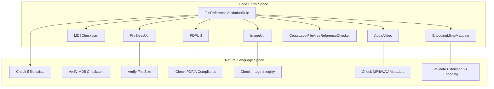
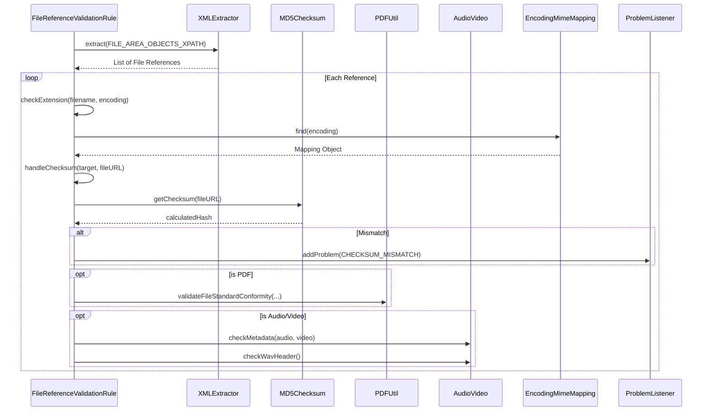

# Page: File Reference and Checksum Validation

# File Reference and Checksum Validation

Relevant source files

The following files were used as context for generating this wiki page:

- [src/main/java/gov/nasa/pds/tools/util/DocumentsChecker.java](src/main/java/gov/nasa/pds/tools/util/DocumentsChecker.java)
- [src/main/java/gov/nasa/pds/tools/util/EncodingMimeMapping.java](src/main/java/gov/nasa/pds/tools/util/EncodingMimeMapping.java)
- [src/main/java/gov/nasa/pds/tools/util/FileReferencedMapList.java](src/main/java/gov/nasa/pds/tools/util/FileReferencedMapList.java)
- [src/main/java/gov/nasa/pds/tools/util/FileSizesUtil.java](src/main/java/gov/nasa/pds/tools/util/FileSizesUtil.java)
- [src/main/java/gov/nasa/pds/tools/util/ImageUtil.java](src/main/java/gov/nasa/pds/tools/util/ImageUtil.java)
- [src/main/java/gov/nasa/pds/tools/util/MD5Checksum.java](src/main/java/gov/nasa/pds/tools/util/MD5Checksum.java)
- [src/main/java/gov/nasa/pds/tools/util/MimeTable.java](src/main/java/gov/nasa/pds/tools/util/MimeTable.java)
- [src/main/java/gov/nasa/pds/tools/util/VersionInfo.java](src/main/java/gov/nasa/pds/tools/util/VersionInfo.java)
- [src/main/java/gov/nasa/pds/tools/validate/AggregateManager.java](src/main/java/gov/nasa/pds/tools/validate/AggregateManager.java)
- [src/main/java/gov/nasa/pds/tools/validate/CrossLabelFileAreaReferenceChecker.java](src/main/java/gov/nasa/pds/tools/validate/CrossLabelFileAreaReferenceChecker.java)
- [src/main/java/gov/nasa/pds/tools/validate/ProblemType.java](src/main/java/gov/nasa/pds/tools/validate/ProblemType.java)
- [src/main/java/gov/nasa/pds/tools/validate/content/AudioVideo.java](src/main/java/gov/nasa/pds/tools/validate/content/AudioVideo.java)
- [src/main/java/gov/nasa/pds/tools/validate/rule/pds4/FileReferenceValidationRule.java](src/main/java/gov/nasa/pds/tools/validate/rule/pds4/FileReferenceValidationRule.java)
- [src/main/resources/validate_default_mime_types.txt](src/main/resources/validate_default_mime_types.txt)
- [src/test/java/gov/nasa/pds/validate/EncodingMimeMappingTest.java](src/test/java/gov/nasa/pds/validate/EncodingMimeMappingTest.java)
- [src/test/resources/github325/crs009x.tab](src/test/resources/github325/crs009x.tab)
- [src/test/resources/github325/crs009x.xml](src/test/resources/github325/crs009x.xml)
- [src/test/resources/github335/minimal_test_product.csv](src/test/resources/github335/minimal_test_product.csv)
- [src/test/resources/github335/minimal_test_product.tab](src/test/resources/github335/minimal_test_product.tab)
- [src/test/resources/github335/minimal_test_product.xml](src/test/resources/github335/minimal_test_product.xml)
- [src/test/resources/github367/document/pccref.xml](src/test/resources/github367/document/pccref.xml)
- [src/test/resources/github381/a test/minmax-error.csv](src/test/resources/github381/a test/minmax-error.csv)
- [src/test/resources/github381/a test/minmax-error.xml](src/test/resources/github381/a test/minmax-error.xml)
- [src/test/resources/github429/EPPS_EDR_SIS.DOC](src/test/resources/github429/EPPS_EDR_SIS.DOC)
- [src/test/resources/github435/flat_w.fit](src/test/resources/github435/flat_w.fit)
- [src/test/resources/github435/flat_w.txt](src/test/resources/github435/flat_w.txt)
- [src/test/resources/github435/flat_w.xml](src/test/resources/github435/flat_w.xml)
- [src/test/resources/github447/document/mission_phase_plans/Preliminary_Survey_Phase_Plan_Narrative.pdf](src/test/resources/github447/document/mission_phase_plans/Preliminary_Survey_Phase_Plan_Narrative.pdf)
- [src/test/resources/github447/document/mission_phase_plans/Preliminary_Survey_Phase_Plan_Narrative.xml](src/test/resources/github447/document/mission_phase_plans/Preliminary_Survey_Phase_Plan_Narrative.xml)
- [src/test/resources/github447/document/orex_ldd_description_doc.pdf](src/test/resources/github447/document/orex_ldd_description_doc.pdf)
- [src/test/resources/github617/uvis_euv_2005_159_solar_time_series_ingress.xml](src/test/resources/github617/uvis_euv_2005_159_solar_time_series_ingress.xml)
- [src/test/resources/github905/dsn_0159-science.2008-02-29.txt](src/test/resources/github905/dsn_0159-science.2008-02-29.txt)
- [src/test/resources/github905/dsn_0159-science.2008-02-29.xml](src/test/resources/github905/dsn_0159-science.2008-02-29.xml)
- [src/test/resources/github905/dsn_0159-science.2009-05-18.txt](src/test/resources/github905/dsn_0159-science.2009-05-18.txt)
- [src/test/resources/github905/dsn_0159-science.2009-05-18.xml](src/test/resources/github905/dsn_0159-science.2009-05-18.xml)
- [src/test/resources/github905/dsn_0159-science2_1.jpg](src/test/resources/github905/dsn_0159-science2_1.jpg)
- [src/test/resources/github905/dsn_0159-science2_2.jpg](src/test/resources/github905/dsn_0159-science2_2.jpg)
- [src/test/resources/github905/dsn_0159-science2_3.jpg](src/test/resources/github905/dsn_0159-science2_3.jpg)
- [src/test/resources/github905/dsn_0159-science2_4.jpg](src/test/resources/github905/dsn_0159-science2_4.jpg)

This page details the validation of external file references within PDS4 labels, including integrity checks for checksums, file sizes, and format-specific compliance (PDF/A, Audio/Video, and Images).

## Overview

The validation of file references ensures that every file mentioned in a PDS4 label (within `File_Area` or `Document_File` segments) exists, is reachable, and matches the metadata described in the label. This process involves verifying MD5 checksums, comparing actual file sizes against declared values, and ensuring that specific file types (like PDF, MP4, or JPEG) adhere to PDS standards.

## Implementation Details

The primary entry point for this subsystem is the `FileReferenceValidationRule` [[src/main/java/gov/nasa/pds/tools/validate/rule/pds4/FileReferenceValidationRule.java:67-67]](). This rule is triggered for PDS4 labels and performs a deep inspection of all referenced data objects.

### Data Flow and Core Classes

The validation follows a structured flow from reference extraction to integrity verification:

1.  **Reference Extraction**: Uses XPath `//*[starts-with(name(), 'File_Area')] | //Document_File` to find all file-related nodes [[src/main/java/gov/nasa/pds/tools/validate/rule/pds4/FileReferenceValidationRule.java:74-75]]().
2.  **Existence Check**: Verifies that the referenced file exists on the file system relative to the label.
3.  **Integrity Checks**:
    *   **Checksum**: Calculates the MD5 of the physical file and compares it to the value in the label [[src/main/java/gov/nasa/pds/tools/validate/rule/pds4/FileReferenceValidationRule.java:166-166]]().
    *   **File Size**: Compares the physical byte count against the `file_size` element using `FileSizesUtil` [[src/main/java/gov/nasa/pds/tools/util/FileSizesUtil.java:16-16]]().
4.  **Format Validation**: Invokes specialized utilities for PDF, Image, and Audio/Video formats.
5.  **MIME/Extension Mapping**: Validates that the file extension is appropriate for the declared `encoding_standard_id` using `EncodingMimeMapping` [[src/main/java/gov/nasa/pds/tools/validate/rule/pds4/FileReferenceValidationRule.java:134-148]]().

### File Validation Logic

The following diagram maps the natural language requirements for file validation to the specific code entities responsible for execution.

**File Reference Validation Architecture**

Sources: [[src/main/java/gov/nasa/pds/tools/validate/rule/pds4/FileReferenceValidationRule.java:67-88]](), [[src/main/java/gov/nasa/pds/tools/util/FileSizesUtil.java:16-16]](), [[src/main/java/gov/nasa/pds/tools/validate/content/AudioVideo.java:21-21]](), [[src/main/java/gov/nasa/pds/tools/util/EncodingMimeMapping.java:6-6]]().

## Specialized Format Validation

### PDF/A Compliance
Validation of PDF documents is handled by `PDFUtil`, which utilizes the **VeraPDF** library.
- **Requirement**: PDF files must conform to PDF/A-1a or PDF/A-1b standards.
- **Error Reporting**: If a file is non-compliant, `PDFUtil` generates an external `.error.csv` file containing detailed rule violations.

### Image Integrity
`ImageUtil` performs "magic number" and structural checks for JPEG and PNG files [[src/main/java/gov/nasa/pds/tools/util/ImageUtil.java:16-16]]():
- **JPEG**: Inspects the first 2 bytes for `0xffd8` and the last 2 bytes for `0xffd9` [[src/main/java/gov/nasa/pds/tools/util/ImageUtil.java:19-20]](). It also attempts to load the image via `ImageIO.read()` as a fallback [[src/main/java/gov/nasa/pds/tools/util/ImageUtil.java:100-100]]().
- **PNG**: Inspects the signature for `0x89504e47` and `0x0d0a1a0a` [[src/main/java/gov/nasa/pds/tools/util/ImageUtil.java:22-23]]().

### Audio/Video Checks
The `AudioVideo` class provides validation for multimedia formats referenced in labels [[src/main/java/gov/nasa/pds/tools/validate/content/AudioVideo.java:21-21]]().
- **MP4/M4A**: Uses `IsoFile` and `MovieBox` to ensure the presence of expected tracks (e.g., `soun` for audio, `vide` for video) [[src/main/java/gov/nasa/pds/tools/validate/content/AudioVideo.java:33-44]]().
- **WAV**: Performs header validation by checking for the `RIFF` chunk ID, the `WAVE` format, and the `fmt ` sub-chunk [[src/main/java/gov/nasa/pds/tools/validate/content/AudioVideo.java:74-111]](). It also verifies that the reported file size in the RIFF header matches the actual file length [[src/main/java/gov/nasa/pds/tools/validate/content/AudioVideo.java:85-86]]().

### Encoding and MIME Mapping
The `EncodingMimeMapping` enum maps PDS4 `encoding_standard_id` values (e.g., "TIFF", "WAV", "MP4/H.264") to allowed file extensions [[src/main/java/gov/nasa/pds/tools/util/EncodingMimeMapping.java:6-19]](). The `FileReferenceValidationRule` calls `EncodingMimeMapping.find(encoding)` [[src/main/java/gov/nasa/pds/tools/util/EncodingMimeMapping.java:30-30]]() and verifies the actual file extension against the `allowed()` list [[src/main/java/gov/nasa/pds/tools/validate/rule/pds4/FileReferenceValidationRule.java:138-141]]().

## Referential Integrity Across Labels

The `CrossLabelFileAreaReferenceChecker` is used to detect duplicate file references across different labels within the same validation context (e.g., a bundle or collection) [[src/main/java/gov/nasa/pds/tools/validate/CrossLabelFileAreaReferenceChecker.java:16-16]]().
- **Logic**: It maintains a map of `knownRefs` associating resolved file paths with logical identifiers (LIDs) [[src/main/java/gov/nasa/pds/tools/validate/CrossLabelFileAreaReferenceChecker.java:18-18]]().
- **Conflict Detection**: If a file is referenced by multiple LIDs and it is marked as observational, the tool flags a potential duplicate reference error [[src/main/java/gov/nasa/pds/tools/validate/CrossLabelFileAreaReferenceChecker.java:44-57]]().

**Sequence: Checksum and Reference Validation**

Sources: [[src/main/java/gov/nasa/pds/tools/validate/rule/pds4/FileReferenceValidationRule.java:104-132]](), [[src/main/java/gov/nasa/pds/tools/validate/content/AudioVideo.java:30-68]](), [[src/main/java/gov/nasa/pds/tools/validate/ProblemType.java:53-53]](), [[src/main/java/gov/nasa/pds/tools/validate/rule/pds4/FileReferenceValidationRule.java:134-159]]().

## Problem Types and Reporting

The system reports several specific problem types related to file references defined in `ProblemType.java`:

| Problem Type | Description |
| :--- | :--- |
| `MISSING_REFERENCED_FILE` | The file mentioned in the label cannot be found on disk [[src/main/java/gov/nasa/pds/tools/validate/ProblemType.java:25-25]](). |
| `CHECKSUM_MISMATCH` | The calculated MD5 does not match the MD5 provided in the label [[src/main/java/gov/nasa/pds/tools/validate/ProblemType.java:53-53]](). |
| `FILESIZE_MISMATCH` | The actual file size differs from the `file_size` attribute [[src/main/java/gov/nasa/pds/tools/validate/ProblemType.java:57-57]](). |
| `NON_PDFA_FILE` | A PDF file failed the VeraPDF compliance check [[src/main/java/gov/nasa/pds/tools/validate/ProblemType.java:175-175]](). |
| `DUPLICATED_FILE_AREA_REFERENCE` | The same file is referenced in multiple conflicting areas [[src/main/java/gov/nasa/pds/tools/validate/ProblemType.java:27-27]](). |
| `FILE_NAMING_PROBLEM` | The file extension does not match the allowed list for the encoding type [[src/main/java/gov/nasa/pds/tools/validate/rule/pds4/FileReferenceValidationRule.java:145-146]](). |
| `NOT_MP4_FILE` | The file does not contain valid MP4 boxes or tracks [[src/main/java/gov/nasa/pds/tools/validate/content/AudioVideo.java:37-38]](). |
| `NOT_WAV_FILE` | The file lacks the required RIFF/WAVE/fmt headers [[src/main/java/gov/nasa/pds/tools/validate/content/AudioVideo.java:76-77]](). |

Sources: [[src/main/java/gov/nasa/pds/tools/validate/ProblemType.java:19-201]](), [[src/main/java/gov/nasa/pds/tools/validate/content/AudioVideo.java:37-114]](), [[src/main/java/gov/nasa/pds/tools/validate/rule/pds4/FileReferenceValidationRule.java:134-159]]().
