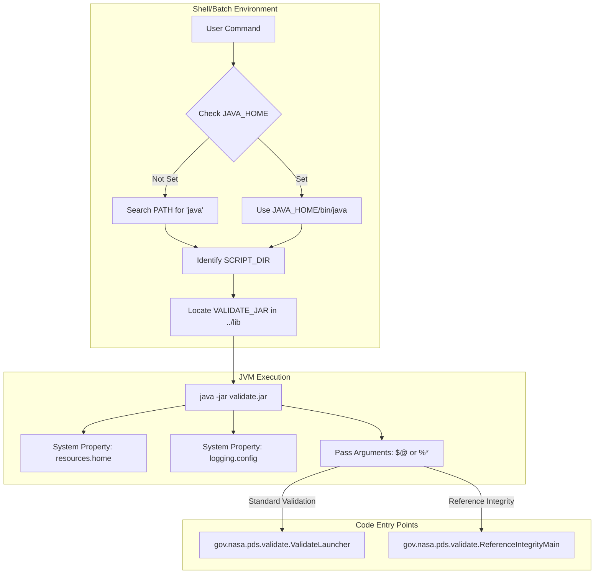

# Page: Getting Started

# Getting Started

<details>
<summary>Relevant source files</summary>

The following files were used as context for generating this wiki page:

- [CHANGELOG.md](CHANGELOG.md)
- [pom.xml](pom.xml)
- [src/changes/changes.xml](src/changes/changes.xml)
- [src/main/assembly/tar-assembly.xml](src/main/assembly/tar-assembly.xml)
- [src/main/assembly/zip-assembly.xml](src/main/assembly/zip-assembly.xml)
- [src/main/java/gov/nasa/pds/tools/validate/rule/pds4/SchemaValidator.java](src/main/java/gov/nasa/pds/tools/validate/rule/pds4/SchemaValidator.java)
- [src/main/java/gov/nasa/pds/validate/ValidateLauncher.java](src/main/java/gov/nasa/pds/validate/ValidateLauncher.java)
- [src/main/java/gov/nasa/pds/validate/Validator.java](src/main/java/gov/nasa/pds/validate/Validator.java)
- [src/main/java/gov/nasa/pds/validate/ValidatorFactory.java](src/main/java/gov/nasa/pds/validate/ValidatorFactory.java)
- [src/main/java/gov/nasa/pds/validate/commandline/options/ConfigKey.java](src/main/java/gov/nasa/pds/validate/commandline/options/ConfigKey.java)
- [src/main/java/gov/nasa/pds/validate/commandline/options/Flag.java](src/main/java/gov/nasa/pds/validate/commandline/options/Flag.java)
- [src/main/java/gov/nasa/pds/validate/commandline/options/FlagOptions.java](src/main/java/gov/nasa/pds/validate/commandline/options/FlagOptions.java)
- [src/main/java/gov/nasa/pds/validate/util/Utility.java](src/main/java/gov/nasa/pds/validate/util/Utility.java)
- [src/main/resources/bin/logging.properties](src/main/resources/bin/logging.properties)
- [src/main/resources/bin/validate](src/main/resources/bin/validate)
- [src/main/resources/bin/validate-bundle](src/main/resources/bin/validate-bundle)
- [src/main/resources/bin/validate-refs](src/main/resources/bin/validate-refs)
- [src/main/resources/bin/validate-refs.bat](src/main/resources/bin/validate-refs.bat)
- [src/main/resources/bin/validate.bat](src/main/resources/bin/validate.bat)
- [src/site/markdown/index.md](src/site/markdown/index.md)
- [src/site/markdown/install/index-win.md.vm](src/site/markdown/install/index-win.md.vm)
- [src/site/markdown/install/index.md.vm](src/site/markdown/install/index.md.vm)
- [src/site/markdown/operate/errors.md](src/site/markdown/operate/errors.md)
- [src/site/markdown/operate/index.md](src/site/markdown/operate/index.md)
- [src/site/markdown/operate/reports/index-full.md](src/site/markdown/operate/reports/index-full.md)
- [src/site/markdown/operate/reports/index-json.md](src/site/markdown/operate/reports/index-json.md)
- [src/site/markdown/operate/reports/index-xml.md](src/site/markdown/operate/reports/index-xml.md)

</details>


This page provides technical instructions for installing, configuring, and executing the NASA PDS Validate tool. It covers the prerequisites, directory structure, and the execution scripts for both Unix and Windows environments, including the parallelized `validate-bundle` utility.

## Prerequisites

The Validate tool is a Java-based application and requires a Java Runtime Environment (JRE).

*   **Java Runtime:** Java 17 or higher is required as of version 4.0.8 [CHANGELOG.md:37](), [pom.xml:184-189]().
*   **Environment Variable:** The `JAVA_HOME` environment variable must be set to the root directory of your Java installation [src/main/resources/bin/validate:40-48](), [src/main/resources/bin/validate.bat:40-43]().
*   **Memory Requirements:** The execution scripts are pre-configured to allocate a minimum of 2GB (`-Xms2048m`) and a maximum of 4GB (`-Xmx4096m`) of heap memory [src/main/resources/bin/validate:66](), [src/main/resources/bin/validate.bat:61]().
*   **Parallel Processing (Optional):** The `validate-bundle` script requires **GNU Parallel** to be installed and available on the system `PATH` [src/main/resources/bin/validate-bundle:31-33]().

**Sources:** [pom.xml:184-189](), [CHANGELOG.md:31-37](), [src/main/resources/bin/validate:40-66](), [src/main/resources/bin/validate-bundle:139-151]()

## Installation and Distribution

The tool is distributed as a compressed archive (`.tar.gz` or `.zip`). When extracted, the tool follows a standard directory layout defined by the Maven assembly descriptors [src/main/assembly/tar-assembly.xml:45-95]().

### Directory Structure

| Directory | Content Description |
| :--- | :--- |
| `bin/` | Execution scripts (`validate`, `validate.bat`, `validate-bundle`, `validate-refs`) and `logging.properties` [src/main/assembly/tar-assembly.xml:59-79](). |
| `lib/` | Application JAR (`validate-@project.version@.jar`) and all runtime dependencies [src/main/assembly/tar-assembly.xml:46-57](). |
| `resources/` | Static configuration data, including `registered_context_products.json` [src/main/assembly/tar-assembly.xml:81-88](). |
| `doc/` | Offline documentation and site reports [src/main/assembly/tar-assembly.xml:90-94](). |

**Sources:** [src/main/assembly/tar-assembly.xml:39-126](), [src/main/assembly/zip-assembly.xml:39-126]()

## Configuration Files

The tool utilizes several configuration files to manage its behavior and metadata.

### 1. validate.properties
This file contains build metadata and configuration for the tool. It is filtered during the Maven build process to include the project version and model version [pom.xml:51-58](). It is typically accessed via the `ToolInfo` utility class [src/main/java/gov/nasa/pds/validate/ValidateLauncher.java:124]().

### 2. logging.properties
Located in the `bin/` directory, this file configures the Java Util Logging (JUL) behavior. The execution scripts explicitly pass this file to the JVM using `-Djava.util.logging.config.file=logging.properties` [src/main/resources/bin/validate:66]().

### 3. registered_context_products.json
Stored in the `resources/` directory, this file acts as a local cache of valid PDS context products (Investigations, Instruments, etc.) used for reference validation [src/main/assembly/tar-assembly.xml:84]().

**Sources:** [pom.xml:51-67](), [src/main/resources/bin/validate:66](), [src/main/assembly/tar-assembly.xml:81-88](), [src/main/java/gov/nasa/pds/validate/ValidateLauncher.java:124]()

## Execution Scripts

The tool provides wrapper scripts to simplify execution by handling the classpath and system properties automatically.

### Script Launch Sequence
The following diagram illustrates how the shell/batch scripts initialize the environment and launch the Java application.

**Script Launch Sequence**

**Sources:** [src/main/resources/bin/validate:33-66](), [src/main/resources/bin/validate.bat:31-61](), [pom.xml:105]()

### Command Summary

| Platform | Script | Primary Entry Point |
| :--- | :--- | :--- |
| Unix | `bin/validate` | `ValidateLauncher` (via Executable JAR) [src/main/resources/bin/validate:66](), [pom.xml:105]() |
| Windows | `bin/validate.bat` | `ValidateLauncher` (via Executable JAR) [src/main/resources/bin/validate.bat:61]() |
| Unix | `bin/validate-refs` | `gov.nasa.pds.validate.ReferenceIntegrityMain` [src/main/assembly/tar-assembly.xml:65]() |
| Unix | `bin/validate-bundle` | Parallelized wrapper for `validate` [src/main/assembly/tar-assembly.xml:64]() |

**Sources:** [src/main/resources/bin/validate:1-67](), [src/main/resources/bin/validate.bat:1-64](), [src/main/assembly/tar-assembly.xml:59-70]()

## First-Run Instructions

1.  **Extract the distribution:**
    `tar -xvf validate-<version>-bin.tar.gz`
2.  **Verify Java:**
    Ensure `java -version` returns 17 or higher [CHANGELOG.md:37]().
3.  **Run a basic help command:**
    *   **Unix:** `./bin/validate --help`
    *   **Windows:** `.\bin\validate.bat --help`

### OS-Specific Path Handling
The tool handles directory path validation differently across operating systems. For instance, absolute directory path naming checks (e.g., `error.directory.unallowed_name`) were improved for Windows environments to ensure consistency [CHANGELOG.md:19]().

**Sources:** [CHANGELOG.md:19-37](), [src/main/resources/bin/validate:1-67]()

## Technical Components Mapping

The following diagram maps high-level "Getting Started" concepts to their specific implementation classes and configuration keys.

**Component Mapping**
```mermaid
classDiagram
    class "Execution Scripts" {
        "bin/validate"
        "bin/validate.bat"
        "bin/validate-refs"
        "bin/validate-bundle"
    }
    class "Metadata Management" {
        "pom.xml"
        "validate.properties"
    }
    class "Code Entry Points" {
        "ValidateLauncher"
        "ReferenceIntegrityMain"
    }
    class "Packaging" {
        "tar-assembly.xml"
        "zip-assembly.xml"
    }
    class "Configuration" {
        "ConfigKey"
        "Flag"
    }

    "Execution Scripts" --|> "Code Entry Points" : Launches via java -jar
    "Packaging" --> "Execution Scripts" : Includes in /bin
    "Packaging" --> "Metadata Management" : Filters resources
    "Code Entry Points" ..> "Metadata Management" : Reads version/config
    "Code Entry Points" ..> "Configuration" : Uses ConfigKey and Flag for CLI parsing
```
**Sources:** [pom.xml:100-111](), [src/main/assembly/tar-assembly.xml:59-70](), [src/main/java/gov/nasa/pds/validate/commandline/options/ConfigKey.java:44](), [src/main/java/gov/nasa/pds/validate/commandline/options/Flag.java:39]()
