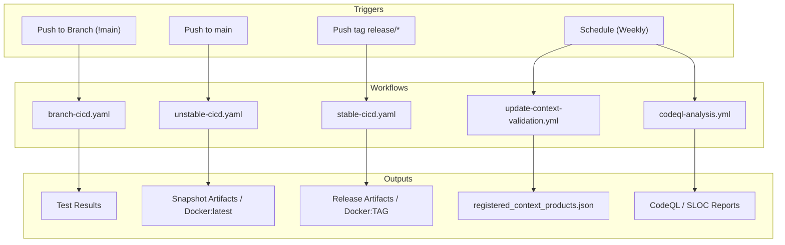
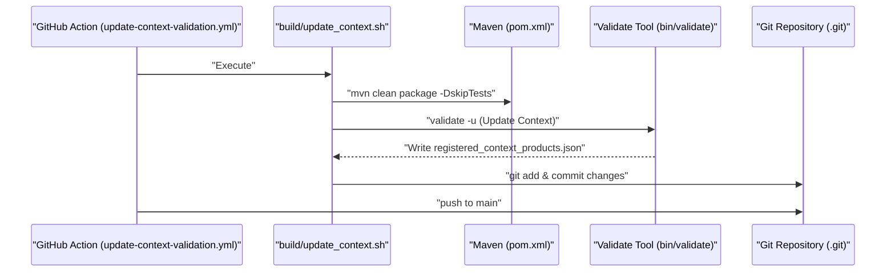

# Page: GitHub Actions Workflows

# GitHub Actions Workflows

Relevant source files

The following files were used as context for generating this wiki page:

- [.github/dependabot.yml](.github/dependabot.yml)
- [.github/workflows/branch-cicd.yaml](.github/workflows/branch-cicd.yaml)
- [.github/workflows/codeql-analysis.yml](.github/workflows/codeql-analysis.yml)
- [.github/workflows/issue-project-automation.yml](.github/workflows/issue-project-automation.yml)
- [.github/workflows/secrets-detection.yaml](.github/workflows/secrets-detection.yaml)
- [.github/workflows/stable-cicd.yaml](.github/workflows/stable-cicd.yaml)
- [.github/workflows/unstable-cicd.yaml](.github/workflows/unstable-cicd.yaml)
- [.github/workflows/update-context-validation.yml](.github/workflows/update-context-validation.yml)
- [.pre-commit-config.yaml](.pre-commit-config.yaml)
- [.secrets.baseline](.secrets.baseline)
- [build/update_context.sh](build/update_context.sh)

This page details the automated CI/CD infrastructure for the PDS Validate tool. The project utilizes GitHub Actions to manage software lifecycles, including unit and integration testing, security analysis, context metadata updates, and containerized distribution.

## Workflow Architecture Overview

The validation tool's automation is divided into distinct workflows based on the stability of the target branch or tag. Most workflows leverage the `NASA-PDS/roundup-action` to standardize Maven execution phases across different environments.

### System Flow Diagram
The following diagram illustrates how different GitHub events trigger specific workflows and their resulting artifacts.

**Workflow Trigger and Artifact Flow**

**Sources:** [.github/workflows/branch-cicd.yaml:15-19](), [.github/workflows/unstable-cicd.yaml:32-38](), [.github/workflows/stable-cicd.yaml:34-37](), [.github/workflows/update-context-validation.yml:6-9](), [.github/workflows/codeql-analysis.yml:3-7]()

---

## CI/CD Workflows

### Stable and Unstable Delivery
The `stable-cicd.yaml` and `unstable-cicd.yaml` workflows manage the assembly and publication of the tool. They share a similar structure but differ in triggers and deployment targets.

*   **Unstable (`unstable-cicd.yaml`)**: Triggered by pushes to the `main` branch [.github/workflows/unstable-cicd.yaml:32-35](). It performs a `mvn install` and `deploy` of snapshot versions to the Central Repository [.github/workflows/unstable-cicd.yaml:79-81]().
*   **Stable (`stable-cicd.yaml`)**: Triggered by tags matching `release/*` [.github/workflows/stable-cicd.yaml:34-37](). It executes full release phases and stages documentation to `target/staging/validate` [.github/workflows/stable-cicd.yaml:78-79]().

Both workflows utilize the `roundup-action` to handle:
1.  **Maven Build Phases**: `install`, `site`, `site:stage`, and `deploy` [.github/workflows/unstable-cicd.yaml:79-81]().
2.  **Environment Secrets**: Requires `ADMIN_GITHUB_TOKEN`, `CODE_SIGNING_KEY`, and `OSSRH` (Central Repository) credentials [.github/workflows/stable-cicd.yaml:80-84]().

**Sources:** [.github/workflows/unstable-cicd.yaml:48-87](), [.github/workflows/stable-cicd.yaml:46-85]()

### Branch Testing
The `branch-cicd.yaml` workflow ensures code quality for feature branches. It runs on every push to branches other than `main` [.github/workflows/branch-cicd.yaml:15-19]().
*   **Matrix Testing**: Executes tests against Java 17 and Java 21 [.github/workflows/branch-cicd.yaml:34-36]().
*   **Execution**: Runs `mvn test` to validate the core logic and rule engine [.github/workflows/branch-cicd.yaml:66]().

**Sources:** [.github/workflows/branch-cicd.yaml:28-67]()

---

## Docker Packaging
The CI/CD workflows automatically build and push Docker images to Docker Hub.

1.  **Tar Determination**: The workflows use a regex-based `find` command to locate the compiled binary tarball in the `target/` directory [.github/workflows/unstable-cicd.yaml:89-91]().
2.  **Multi-Platform Build**: Uses `docker/setup-qemu-action` and `docker/setup-buildx-action` to support `linux/amd64` and `linux/arm64` [.github/workflows/unstable-cicd.yaml:99-111]().
3.  **Image Tagging**: Unstable builds are tagged as `latest` [.github/workflows/unstable-cicd.yaml:113](), while stable builds use the git tag name [.github/workflows/stable-cicd.yaml:91, 113]().

**Sources:** [.github/workflows/unstable-cicd.yaml:89-114](), [.github/workflows/stable-cicd.yaml:87-113]()

---

## Security and Analysis

### CodeQL and SLOC Counting
The `codeql-analysis.yml` workflow runs weekly to identify security vulnerabilities and track project size.
*   **Queries**: Uses `security-and-quality` and `security-extended` query suites [.github/workflows/codeql-analysis.yml:37]().
*   **NASA Scrub**: Post-processes SARIF results using the `nasa-scrub` tool to translate results into `.scrub` format [.github/workflows/codeql-analysis.yml:57-70]().
*   **SLOC Count**: Uses `djdefi/cloc-action` to generate a `cloc.md` report of Source Lines of Code [.github/workflows/codeql-analysis.yml:96-99]().

**Sources:** [.github/workflows/codeql-analysis.yml:33-107]()

### Secret Detection
The `secrets-detection.yaml` workflow prevents sensitive information from being committed by scanning the repository against a baseline.
*   **Tooling**: Uses `slim-detect-secrets` with a baseline file `.secrets.baseline` [.github/workflows/secrets-detection.yaml:21, 61]().
*   **Comparison Logic**: The `compare_secrets()` function uses `jq` to extract and sort hashed secrets from the baseline and the new scan, failing the build if a mismatch is found [.github/workflows/secrets-detection.yaml:65-80]().
*   **Exclusions**: Ignores `target/`, `src/test/resources`, and various Terraform/Git files [.github/workflows/secrets-detection.yaml:50-60]().
*   **Baseline Management**: The `.secrets.baseline` file contains a versioned list of known (false positive or non-sensitive) secrets categorized by detector type, such as `EmailAddressDetector` or `PrivateKeyDetector` [.secrets.baseline:1-85]().

**Sources:** [.github/workflows/secrets-detection.yaml:11-81](), [.secrets.baseline:1-85](), [.pre-commit-config.yaml:8-20]()

---

## Context Metadata Update
The `update-context-validation.yml` workflow automates the synchronization of PDS context products (Missions, Instruments, etc.) from the PDS Registry.

**Context Update Process**

*   **Trigger**: Scheduled to run every Sunday at midnight [.github/workflows/update-context-validation.yml:7-8]().
*   **Mechanism**: Executes `build/update_context.sh`, which runs `mvn clean package` [.build/update_context.sh:9](), then runs the compiled `validate` binary with the `-u` flag to fetch the latest product metadata [.build/update_context.sh:11]().
*   **Persistence**: Copies the resulting `registered_context_products.json` into `src/main/resources/util/` [.build/update_context.sh:12]() and commits it using the `PDSEN CI Bot` identity [.github/workflows/update-context-validation.yml:33-38]().

**Sources:** [.github/workflows/update-context-validation.yml:12-46](), [.build/update_context.sh:1-15]()
