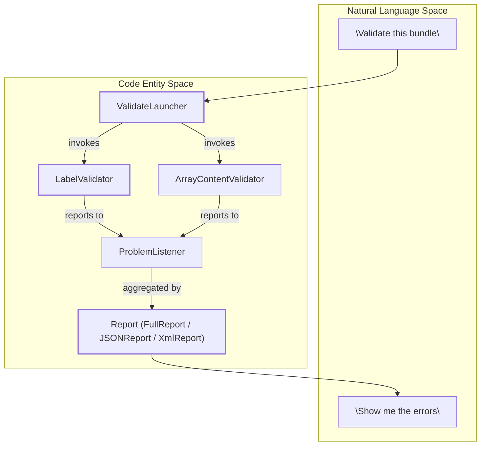
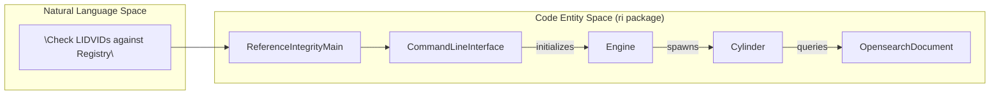

# Page: Glossary

# Glossary

Relevant source files

The following files were used as context for generating this wiki page:

- [.github/CODEOWNERS](.github/CODEOWNERS)
- [.gitignore](.gitignore)
- [CHANGELOG.md](CHANGELOG.md)
- [LICENSE.md](LICENSE.md)
- [NOTICE.txt](NOTICE.txt)
- [README.md](README.md)
- [SECURITY.md](SECURITY.md)
- [build/pre-build.sh](build/pre-build.sh)
- [pom.xml](pom.xml)
- [src/changes/changes.xml](src/changes/changes.xml)
- [src/main/java/gov/nasa/pds/tools/util/ContextProductReference.java](src/main/java/gov/nasa/pds/tools/util/ContextProductReference.java)
- [src/main/java/gov/nasa/pds/tools/validate/SpecialConstantChecker.java](src/main/java/gov/nasa/pds/tools/validate/SpecialConstantChecker.java)
- [src/main/java/gov/nasa/pds/tools/validate/content/ProblemReporter.java](src/main/java/gov/nasa/pds/tools/validate/content/ProblemReporter.java)
- [src/main/java/gov/nasa/pds/tools/validate/content/SpecialConstantBitPatternTransforms.java](src/main/java/gov/nasa/pds/tools/validate/content/SpecialConstantBitPatternTransforms.java)
- [src/main/java/gov/nasa/pds/tools/validate/content/array/ArrayContentValidator.java](src/main/java/gov/nasa/pds/tools/validate/content/array/ArrayContentValidator.java)
- [src/main/java/gov/nasa/pds/tools/validate/content/array/ArrayProblemReporter.java](src/main/java/gov/nasa/pds/tools/validate/content/array/ArrayProblemReporter.java)
- [src/main/java/gov/nasa/pds/tools/validate/content/table/FieldProblemReporter.java](src/main/java/gov/nasa/pds/tools/validate/content/table/FieldProblemReporter.java)
- [src/main/java/gov/nasa/pds/tools/validate/content/table/FieldValueValidator.java](src/main/java/gov/nasa/pds/tools/validate/content/table/FieldValueValidator.java)
- [src/main/java/gov/nasa/pds/tools/validate/content/table/TableContentProblem.java](src/main/java/gov/nasa/pds/tools/validate/content/table/TableContentProblem.java)
- [src/main/java/gov/nasa/pds/tools/validate/rule/pds4/DateTimeValidator.java](src/main/java/gov/nasa/pds/tools/validate/rule/pds4/DateTimeValidator.java)
- [src/main/java/gov/nasa/pds/tools/validate/rule/pds4/FindUnreferencedFiles.java](src/main/java/gov/nasa/pds/tools/validate/rule/pds4/FindUnreferencedFiles.java)
- [src/main/java/gov/nasa/pds/tools/validate/rule/pds4/SchemaValidator.java](src/main/java/gov/nasa/pds/tools/validate/rule/pds4/SchemaValidator.java)
- [src/main/java/gov/nasa/pds/tools/validate/rule/pds4/TableFieldDefinitionRule.java](src/main/java/gov/nasa/pds/tools/validate/rule/pds4/TableFieldDefinitionRule.java)
- [src/main/java/gov/nasa/pds/validate/ReferenceIntegrityMain.java](src/main/java/gov/nasa/pds/validate/ReferenceIntegrityMain.java)
- [src/main/java/gov/nasa/pds/validate/ValidateLauncher.java](src/main/java/gov/nasa/pds/validate/ValidateLauncher.java)
- [src/main/java/gov/nasa/pds/validate/Validator.java](src/main/java/gov/nasa/pds/validate/Validator.java)
- [src/main/java/gov/nasa/pds/validate/ValidatorFactory.java](src/main/java/gov/nasa/pds/validate/ValidatorFactory.java)
- [src/main/java/gov/nasa/pds/validate/commandline/options/ConfigKey.java](src/main/java/gov/nasa/pds/validate/commandline/options/ConfigKey.java)
- [src/main/java/gov/nasa/pds/validate/commandline/options/Flag.java](src/main/java/gov/nasa/pds/validate/commandline/options/Flag.java)
- [src/main/java/gov/nasa/pds/validate/commandline/options/FlagOptions.java](src/main/java/gov/nasa/pds/validate/commandline/options/FlagOptions.java)
- [src/main/java/gov/nasa/pds/validate/commandline/options/InvalidOptionException.java](src/main/java/gov/nasa/pds/validate/commandline/options/InvalidOptionException.java)
- [src/main/java/gov/nasa/pds/validate/commandline/options/ToolsOption.java](src/main/java/gov/nasa/pds/validate/commandline/options/ToolsOption.java)
- [src/main/java/gov/nasa/pds/validate/crawler/WildcardOSFilter.java](src/main/java/gov/nasa/pds/validate/crawler/WildcardOSFilter.java)
- [src/main/java/gov/nasa/pds/validate/report/FullReport.java](src/main/java/gov/nasa/pds/validate/report/FullReport.java)
- [src/main/java/gov/nasa/pds/validate/report/JSONReport.java](src/main/java/gov/nasa/pds/validate/report/JSONReport.java)
- [src/main/java/gov/nasa/pds/validate/report/Report.java](src/main/java/gov/nasa/pds/validate/report/Report.java)
- [src/main/java/gov/nasa/pds/validate/report/XmlReport.java](src/main/java/gov/nasa/pds/validate/report/XmlReport.java)
- [src/main/java/gov/nasa/pds/validate/ri/AuthInformation.java](src/main/java/gov/nasa/pds/validate/ri/AuthInformation.java)
- [src/main/java/gov/nasa/pds/validate/ri/CamShaft.java](src/main/java/gov/nasa/pds/validate/ri/CamShaft.java)
- [src/main/java/gov/nasa/pds/validate/ri/CommandLineInterface.java](src/main/java/gov/nasa/pds/validate/ri/CommandLineInterface.java)
- [src/main/java/gov/nasa/pds/validate/ri/CountingAppender.java](src/main/java/gov/nasa/pds/validate/ri/CountingAppender.java)
- [src/main/java/gov/nasa/pds/validate/ri/Cylinder.java](src/main/java/gov/nasa/pds/validate/ri/Cylinder.java)
- [src/main/java/gov/nasa/pds/validate/ri/DocumentInfo.java](src/main/java/gov/nasa/pds/validate/ri/DocumentInfo.java)
- [src/main/java/gov/nasa/pds/validate/ri/DuplicateFileAreaFilenames.java](src/main/java/gov/nasa/pds/validate/ri/DuplicateFileAreaFilenames.java)
- [src/main/java/gov/nasa/pds/validate/ri/Engine.java](src/main/java/gov/nasa/pds/validate/ri/Engine.java)
- [src/main/java/gov/nasa/pds/validate/ri/LidvidComparator.java](src/main/java/gov/nasa/pds/validate/ri/LidvidComparator.java)
- [src/main/java/gov/nasa/pds/validate/ri/OpensearchDocument.java](src/main/java/gov/nasa/pds/validate/ri/OpensearchDocument.java)
- [src/main/java/gov/nasa/pds/validate/util/Namespace.java](src/main/java/gov/nasa/pds/validate/util/Namespace.java)
- [src/main/java/gov/nasa/pds/validate/util/ToolInfo.java](src/main/java/gov/nasa/pds/validate/util/ToolInfo.java)
- [src/main/java/gov/nasa/pds/validate/util/Utility.java](src/main/java/gov/nasa/pds/validate/util/Utility.java)
- [src/main/resources/bin/logging.properties](src/main/resources/bin/logging.properties)
- [src/main/resources/bin/validate-bundle](src/main/resources/bin/validate-bundle)
- [src/main/resources/util/registered_context_products.json](src/main/resources/util/registered_context_products.json)
- [src/main/resources/validate.properties](src/main/resources/validate.properties)
- [src/main/resources/validation-commands.xml](src/main/resources/validation-commands.xml)
- [src/site/site.xml](src/site/site.xml)
- [src/test/java/gov/nasa/pds/validate/DateTimeEfficiency.java](src/test/java/gov/nasa/pds/validate/DateTimeEfficiency.java)
- [src/test/java/gov/nasa/pds/validate/report/JSONReportTest.java](src/test/java/gov/nasa/pds/validate/report/JSONReportTest.java)
- [src/test/java/gov/nasa/pds/validate/ri/CliExecutioner.java](src/test/java/gov/nasa/pds/validate/ri/CliExecutioner.java)
- [src/test/resources/github28/new_context.json](src/test/resources/github28/new_context.json)
- [src/test/resources/github837/times_table.txt](src/test/resources/github837/times_table.txt)
- [src/test/resources/github837/times_table.xml](src/test/resources/github837/times_table.xml)
- [src/test/resources/github956/fsb_01500_rhk_xib_85s238_v1.csv](src/test/resources/github956/fsb_01500_rhk_xib_85s238_v1.csv)
- [src/test/resources/github956/fsb_01500_rhk_xib_85s238_v1.lbl](src/test/resources/github956/fsb_01500_rhk_xib_85s238_v1.lbl)
- [src/test/resources/github956/fsb_01500_rhk_xib_85s238_v1.xml](src/test/resources/github956/fsb_01500_rhk_xib_85s238_v1.xml)

This glossary defines technical terms, PDS4 domain concepts, and codebase-specific identifiers used within the `validate` tool. It serves as a bridge between planetary science standards and the Java implementation.

---

## PDS4 Domain Concepts

### LID and LIDVID
A **Logical Identifier (LID)** is a globally unique identifier for a PDS product or its components, expressed as a URN. The **LIDVID** extends the LID by appending a version identifier, enabling versioned references to products (e.g., `urn:nasa:pds:bundle:collection:product::1.0`).

- **Implementation:**  
  - Format validation and pattern matching for LIDs and LIDVIDs are implemented via regular expressions in the `FieldValueValidator` class, which checks field values according to the expected lexical form [src/main/java/gov/nasa/pds/tools/validate/content/table/FieldValueValidator.java:91-97]().
  - The `ri` (Referential Integrity) subsystem uses `LidvidComparator` to manage and compare these identifiers during registry-based validation.
  
- **Validation Flow:**  
  1. Labels are parsed and fields containing LIDs/LIDVIDs are extracted.  
  2. The LID/LIDVID syntax is validated against regex patterns ([src/main/java/gov/nasa/pds/tools/validate/content/table/FieldValueValidator.java:91-97]()).  
  3. The `ri.Engine` processes queues of LIDVIDs to verify existence in the PDS Registry [src/main/java/gov/nasa/pds/validate/ri/Engine.java:110-114]().

### Context Product
A **Context Product** describes entities such as targets, instruments, spacecraft, or other physical/conceptual objects referenced by observational datasets.

- **Registry:**  
  A built-in registry of known context products is maintained in JSON format in `registered_context_products.json`. This file contains an array of context product entries with their associated names, types, and LIDVIDs [src/main/resources/util/registered_context_products.json:1-71]().  

- **Rule Enforcement:**  
  - The tool uses `ContextProductReference` data models to represent these relationships [src/main/java/gov/nasa/pds/tools/util/ContextProductReference.java:1-30]().
  - Users can update this registry via the `--update-context-products` flag (`Flag.LATEST_JSON_FILE`), which triggers a download of the latest definitions [src/main/java/gov/nasa/pds/validate/commandline/options/Flag.java:154-155]().

---

## Codebase Entities and Jargon

### Validation Engine (Automotive Metaphor)
The `ri` (Referential Integrity) subsystem uses an automotive metaphor for its multi-threaded architecture to process LIDVID references against a registry.

- **Engine:** The main controller that manages the validation of LIDVIDs [src/main/java/gov/nasa/pds/validate/ri/Engine.java:110]().
- **Cylinder:** A worker thread that performs the actual registry lookups [src/main/java/gov/nasa/pds/validate/ri/Cylinder.java:1-50]().
- **CamShaft:** Manages the distribution of work (LIDVIDs) to the Cylinders.

### Problem Reporting System
Validation problems are captured and managed by a structured hierarchy enabling detailed diagnostics and filtering.

- **ValidationProblem:**  
  Represents a single validation issue, combining a problem type, severity, and message [src/main/java/gov/nasa/pds/tools/validate/ValidationProblem.java:21]().

- **ProblemType enum:**  
  Defines standardized error and warning codes. Examples include `ARRAY_DATA_FILE_READ_ERROR` [src/main/java/gov/nasa/pds/tools/validate/content/array/ArrayContentValidator.java:128]() and `MISSING_ID` [src/main/java/gov/nasa/pds/tools/validate/ProblemType.java:108]().

- **ProblemListener:**  
  Interface for capturing messages during validation runs [src/main/java/gov/nasa/pds/tools/validate/ProblemListener.java:39]().

### Data Content Validation
Validation involves inspecting file content against label metadata, especially Tables and Arrays.

- **ArrayContentValidator:**  
  Performs bit-level validation of array data, checking against declared `NumericDataType` and `ObjectStatistics` (min/max) [src/main/java/gov/nasa/pds/tools/validate/content/array/ArrayContentValidator.java:45-113](). It supports "spot-checking" to sample large datasets [src/main/java/gov/nasa/pds/validate/commandline/options/Flag.java:147-148]().

- **FieldValueValidator:**  
  Validates individual field values for tables, supporting PDS4 types like `ASCII_Real`, `ASCII_LIDVID`, and `ASCII_DateTime` [src/main/java/gov/nasa/pds/tools/validate/content/table/FieldValueValidator.java:82-97]().

---

## Mapping: Natural Language to Code Entities

### Validation Lifecycle Mapping

This diagram shows how user commands translate into code-level processing steps.

**Sources:** [src/main/java/gov/nasa/pds/validate/ValidateLauncher.java:134-176](), [src/main/java/gov/nasa/pds/tools/validate/content/array/ArrayContentValidator.java:45-105]()

### Registry Validation Architecture (Automotive Metaphor)

This diagram maps the high-level registry check concept to the `ri` package implementation.

**Sources:** [src/main/java/gov/nasa/pds/validate/ri/CommandLineInterface.java:110-114](), [src/main/java/gov/nasa/pds/validate/ri/Engine.java:110](), [src/main/java/gov/nasa/pds/validate/ri/Cylinder.java:1-50]()

---

## Summary of Key Terms

| Term | Code Pointer | Definition |
| :--- | :--- | :--- |
| **Catalog** | `Flag.CATALOG` [Flag.java:47-48]() | XML Catalog files used to locally resolve XML Schema and Schematron references. |
| **Every N** | `Flag.EVERY_N` [Flag.java:71]() | A sampling parameter used by `EveryNCounter` to skip records/files for performance [src/main/java/gov/nasa/pds/tools/util/EveryNCounter.java:99](). |
| **Special Constants** | `SpecialConstantChecker` [SpecialConstantChecker.java:41]() | Values like `NaN` or `Inf` defined in a label that should be excluded from min/max statistics [src/main/java/gov/nasa/pds/tools/validate/content/array/ArrayContentValidator.java:35](). |
| **Spot Check** | `Flag.SPOT_CHECK_DATA` [Flag.java:147-148]() | Property to skip a specific number of array elements/table records during content validation [src/main/java/gov/nasa/pds/tools/validate/content/array/ArrayContentValidator.java:60](). |
| **Manifest** | `Flag.TARGET_MANIFEST` [Flag.java:152-153]() | A text file containing a list of files or directories to be validated. |
| **LIDVID** | `LidvidComparator` | A unique identifier containing both the Logical Identifier and a Version ID. |

---

**Sources:**  
[src/main/java/gov/nasa/pds/tools/validate/content/table/FieldValueValidator.java:51-120]()  
[src/main/java/gov/nasa/pds/validate/ri/CommandLineInterface.java:21-140]()  
[src/main/resources/util/registered_context_products.json:1-71]()  
[src/main/java/gov/nasa/pds/validate/ValidateLauncher.java:134-176]()  
[src/main/java/gov/nasa/pds/tools/validate/ProblemType.java:108]()  
[src/main/java/gov/nasa/pds/validate/commandline/options/Flag.java:39-160]()  
[src/main/java/gov/nasa/pds/tools/validate/content/array/ArrayContentValidator.java:45-166]()
[src/main/java/gov/nasa/pds/validate/ri/Engine.java:110]()
[src/main/java/gov/nasa/pds/validate/ri/Cylinder.java:1-50]()