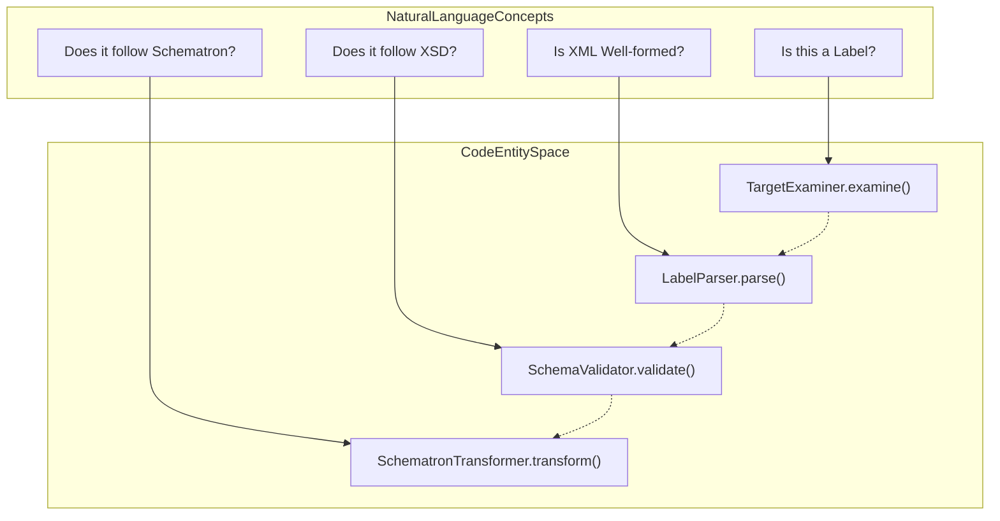
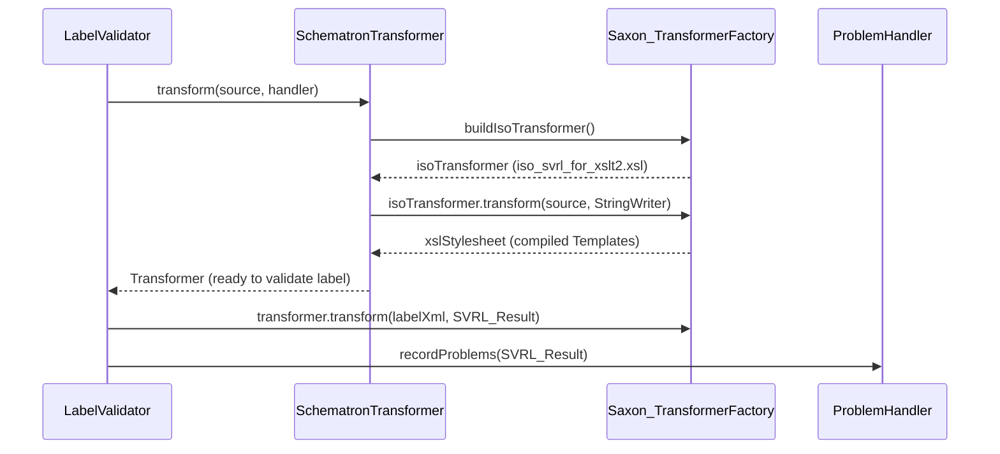

# Page: Label Validation (XML, Schema, Schematron)

# Label Validation (XML, Schema, Schematron)

Relevant source files

The following files were used as context for generating this wiki page:

- [src/main/java/gov/nasa/pds/tools/label/LabelValidator.java](src/main/java/gov/nasa/pds/tools/label/LabelValidator.java)
- [src/main/java/gov/nasa/pds/tools/label/LocationValidator.java](src/main/java/gov/nasa/pds/tools/label/LocationValidator.java)
- [src/main/java/gov/nasa/pds/tools/label/SchematronTransformer.java](src/main/java/gov/nasa/pds/tools/label/SchematronTransformer.java)
- [src/main/java/gov/nasa/pds/tools/label/TransformerErrorListener.java](src/main/java/gov/nasa/pds/tools/label/TransformerErrorListener.java)
- [src/main/java/gov/nasa/pds/tools/label/XMLCatalogResolver.java](src/main/java/gov/nasa/pds/tools/label/XMLCatalogResolver.java)
- [src/main/java/gov/nasa/pds/tools/label/validate/DefaultDocumentValidator.java](src/main/java/gov/nasa/pds/tools/label/validate/DefaultDocumentValidator.java)
- [src/main/java/gov/nasa/pds/tools/label/validate/DocumentValidator.java](src/main/java/gov/nasa/pds/tools/label/validate/DocumentValidator.java)
- [src/main/java/gov/nasa/pds/tools/util/LabelParser.java](src/main/java/gov/nasa/pds/tools/util/LabelParser.java)
- [src/main/java/gov/nasa/pds/tools/util/XMLErrorListener.java](src/main/java/gov/nasa/pds/tools/util/XMLErrorListener.java)
- [src/main/java/gov/nasa/pds/tools/util/XMLExtractor.java](src/main/java/gov/nasa/pds/tools/util/XMLExtractor.java)
- [src/main/java/gov/nasa/pds/tools/util/XslURIResolver.java](src/main/java/gov/nasa/pds/tools/util/XslURIResolver.java)
- [src/main/java/gov/nasa/pds/tools/validate/ContentProblem.java](src/main/java/gov/nasa/pds/tools/validate/ContentProblem.java)
- [src/main/java/gov/nasa/pds/tools/validate/TargetExaminer.java](src/main/java/gov/nasa/pds/tools/validate/TargetExaminer.java)
- [src/main/java/gov/nasa/pds/tools/validate/rule/RuleContext.java](src/main/java/gov/nasa/pds/tools/validate/rule/RuleContext.java)
- [src/main/java/gov/nasa/pds/tools/validate/rule/pds4/LabelInFolderRule.java](src/main/java/gov/nasa/pds/tools/validate/rule/pds4/LabelInFolderRule.java)
- [src/main/java/gov/nasa/pds/tools/validate/rule/pds4/LabelValidationRule.java](src/main/java/gov/nasa/pds/tools/validate/rule/pds4/LabelValidationRule.java)
- [src/main/java/gov/nasa/pds/validate/constants/Constants.java](src/main/java/gov/nasa/pds/validate/constants/Constants.java)
- [src/main/java/gov/nasa/pds/validate/ri/UserInput.java](src/main/java/gov/nasa/pds/validate/ri/UserInput.java)
- [src/test/java/gov/nasa/pds/tools/label/SchematronTransformerTest.java](src/test/java/gov/nasa/pds/tools/label/SchematronTransformerTest.java)
- [src/test/resources/github87/2t126632959btr0200p3002n0a1.xml](src/test/resources/github87/2t126632959btr0200p3002n0a1.xml)
- [src/test/resources/github87/2t126646972btr0200p3001n0a1.xml](src/test/resources/github87/2t126646972btr0200p3001n0a1.xml)
- [src/test/resources/github87/geom/v1/PDS4_GEOM_1B10_1710.sch](src/test/resources/github87/geom/v1/PDS4_GEOM_1B10_1710.sch)
- [src/test/resources/github87/geom/v1/PDS4_GEOM_1B10_1710.xml](src/test/resources/github87/geom/v1/PDS4_GEOM_1B10_1710.xml)
- [src/test/resources/github87/geom/v1/PDS4_GEOM_1B10_1710.xsd](src/test/resources/github87/geom/v1/PDS4_GEOM_1B10_1710.xsd)
- [src/test/resources/github87/mission/mer/v1/PDS4_MER_1B00_1000.JSON](src/test/resources/github87/mission/mer/v1/PDS4_MER_1B00_1000.JSON)
- [src/test/resources/github87/mission/mer/v1/PDS4_MER_1B00_1000.sch](src/test/resources/github87/mission/mer/v1/PDS4_MER_1B00_1000.sch)

Label validation is the core functional requirement of the PDS Validate tool. It ensures that PDS4 XML labels are well-formed, valid against their referenced XML Schema (XSD 1.1) files, and compliant with business rules defined in Schematron (SCH) files. This process is managed primarily by the `LabelValidator` and orchestrated at a higher level by the `LocationValidator`.

## Core Validation Components

The validation architecture relies on several key classes to handle the complexity of PDS4 labels, which often reference multiple remote or local schemas and schematrons.

### LabelValidator
The `LabelValidator` is the primary engine for XML validation. It manages the lifecycle of parsing, schema validation, and schematron execution for a single label [src/main/java/gov/nasa/pds/tools/label/LabelValidator.java:94-121](). It maintains caches for `XMLReader`, `ValidatorHandler`, and transformed schematrons to optimize performance across multiple files [src/main/java/gov/nasa/pds/tools/label/LabelValidator.java:100-107]().

### LocationValidator
The `LocationValidator` acts as a facade that connects the validation rules to the file system or URL targets [src/main/java/gov/nasa/pds/tools/label/LocationValidator.java:64-76](). It initializes the `ValidationRuleManager` using `validation-commands.xml` (resolved via `ClassLoader` or `FileFinder`) and triggers the execution of rules defined in the rule engine [src/main/java/gov/nasa/pds/tools/label/LocationValidator.java:120-142]().

### Target Mapping: Natural Language to Code
The following diagram illustrates how conceptual validation steps map to specific implementation classes and methods.

**Validation Logic Mapping**

Sources: [src/main/java/gov/nasa/pds/tools/label/LabelValidator.java:94-121](), [src/main/java/gov/nasa/pds/tools/label/SchematronTransformer.java:51-65](), [src/main/java/gov/nasa/pds/tools/validate/rule/pds4/LabelValidationRule.java:81-87](), [src/main/java/gov/nasa/pds/tools/validate/TargetExaminer.java:76-89]()

## XML Schema (XSD) Validation

Validation against XSD 1.1 is performed using JAXP. The system resolves schema locations using an `XMLCatalogResolver` to allow local overrides of remote URLs.

### Implementation Details
- **Parser**: Uses SAX-based parsing via `SAXParserFactory` for memory efficiency [src/main/java/gov/nasa/pds/tools/label/LabelValidator.java:116]().
- **Resolver**: `XMLCatalogResolver` (extending `CachedLSResourceResolver`) handles the redirection of schema URLs to local files based on user-provided catalogs [src/main/java/gov/nasa/pds/tools/label/XMLCatalogResolver.java:64-91](). It supports OASIS XML Catalog 1.1 [src/main/java/gov/nasa/pds/tools/label/XMLCatalogResolver.java:43-55]().
- **Default Validation**: `DefaultDocumentValidator` performs semantic checks, such as verifying the presence of schematron specifications in the label processing instructions [src/main/java/gov/nasa/pds/tools/label/validate/DefaultDocumentValidator.java:45-64]().

Sources: [src/main/java/gov/nasa/pds/tools/label/LabelValidator.java:116-118](), [src/main/java/gov/nasa/pds/tools/label/XMLCatalogResolver.java:64-91](), [src/main/java/gov/nasa/pds/tools/label/validate/DefaultDocumentValidator.java:40-64]()

## Schematron Transformation and Execution

Schematron validation in PDS4 is a two-step process: transforming the `.sch` file into an XSLT stylesheet and then applying that stylesheet to the label.

### SchematronTransformer
This class uses the ISO Schematron reference implementation (via `iso_svrl_for_xslt2.xsl`) to generate a validator stylesheet [src/main/java/gov/nasa/pds/tools/label/SchematronTransformer.java:80-82](). It forces the use of the Saxon `TransformerFactoryImpl` to support XSLT 2.0 features required by PDS4 schematrons [src/main/java/gov/nasa/pds/tools/label/SchematronTransformer.java:62-63]().

### Data Flow
1. **Fetch**: The tool retrieves the Schematron file (local or URL).
2. **Transform**: The `.sch` is converted to XSLT using the ISO stylesheet [src/main/java/gov/nasa/pds/tools/label/SchematronTransformer.java:115-120]().
3. **Apply**: The generated XSLT is applied to the label XML to produce Schematron Validation Report Language (SVRL) output.
4. **Report**: SVRL results are processed, and errors are captured via `TransformerErrorListener` [src/main/java/gov/nasa/pds/tools/label/TransformerErrorListener.java:34-35]().

**Schematron Processing Pipeline**

Sources: [src/main/java/gov/nasa/pds/tools/label/SchematronTransformer.java:67-83](), [src/main/java/gov/nasa/pds/tools/label/SchematronTransformer.java:114-123](), [src/main/java/gov/nasa/pds/tools/label/TransformerErrorListener.java:34-35]()

## Caching Strategies

To handle large bundles containing thousands of labels sharing the same schemas, `LabelValidator` and `SchematronTransformer` implement several caching layers:

| Cache Component | Class / Variable | Purpose |
| :--- | :--- | :--- |
| **Schematron XSLT** | `SchematronTransformer.cachedTemplates` | Stores compiled Schematron XSLT `Templates` keyed by SHA-256 hash of source [src/main/java/gov/nasa/pds/tools/label/SchematronTransformer.java:53, 129](). |
| **Label Schematrons** | `LabelValidator.cachedLabelSchematrons` | Stores transformed Schematron XSLT strings keyed by source URL [src/main/java/gov/nasa/pds/tools/label/LabelValidator.java:107](). |
| **Entity Resolver** | `LabelValidator.cachedEntityResolver` | Caches DTDs and external entities to prevent redundant network hits [src/main/java/gov/nasa/pds/tools/label/LabelValidator.java:114](). |
| **Resource Resolver** | `LabelValidator.cachedLSResolver` | Caches XSD schema components for the JAXP Validator [src/main/java/gov/nasa/pds/tools/label/LabelValidator.java:115](). |
| **Target Examination** | `TargetExaminer.examined` | Soft-reference cache for product type detection (Bundle vs Collection) [src/main/java/gov/nasa/pds/tools/validate/TargetExaminer.java:44](). |

### Performance Optimization
The `SchematronTransformer` uses a `ConcurrentHashMap` for `cachedTemplates` to allow thread-safe access during parallel validation [src/main/java/gov/nasa/pds/tools/label/SchematronTransformer.java:53](). Cache hits are identified by SHA-256 hashing the Schematron source string via a `ThreadLocal<MessageDigest>` [src/main/java/gov/nasa/pds/tools/label/SchematronTransformer.java:129-164]().

Sources: [src/main/java/gov/nasa/pds/tools/label/SchematronTransformer.java:128-164](), [src/main/java/gov/nasa/pds/tools/label/LabelValidator.java:100-115](), [src/main/java/gov/nasa/pds/tools/validate/TargetExaminer.java:44-79]()

## Validation Lifecycle in Rule Engine

While `LabelValidator` performs the low-level XML work, the high-level logic is driven by the Rule Engine:

1. **Applicability**: Rules like `LabelValidationRule` check if the target is a file and matches the expected label extension (e.g., `.xml`, `.lblx`) [src/main/java/gov/nasa/pds/tools/validate/rule/pds4/LabelValidationRule.java:90-122]().
2. **Discovery**: `LabelInFolderRule` crawls directories recursively or non-recursively and uses `TargetExaminer.removeNonLabels` to filter the validation queue [src/main/java/gov/nasa/pds/tools/validate/rule/pds4/LabelInFolderRule.java:131-136]().
3. **Extraction**: `XMLExtractor` is used extensively to pull `logical_identifier` and other metadata from the parsed `TreeInfo` (Saxon TinyTree) [src/main/java/gov/nasa/pds/tools/util/XMLExtractor.java:120-170]().
4. **Multi-threaded Execution**: `LabelInFolderRule` uses a `FixedThreadPool` to execute label validation in parallel, submitting `labelRule.execute()` tasks for each discovered target [src/main/java/gov/nasa/pds/tools/validate/rule/pds4/LabelInFolderRule.java:113-156]().

Sources: [src/main/java/gov/nasa/pds/tools/validate/rule/pds4/LabelValidationRule.java:90-122](), [src/main/java/gov/nasa/pds/tools/validate/rule/pds4/LabelInFolderRule.java:108-159](), [src/main/java/gov/nasa/pds/tools/util/XMLExtractor.java:120-170]()
