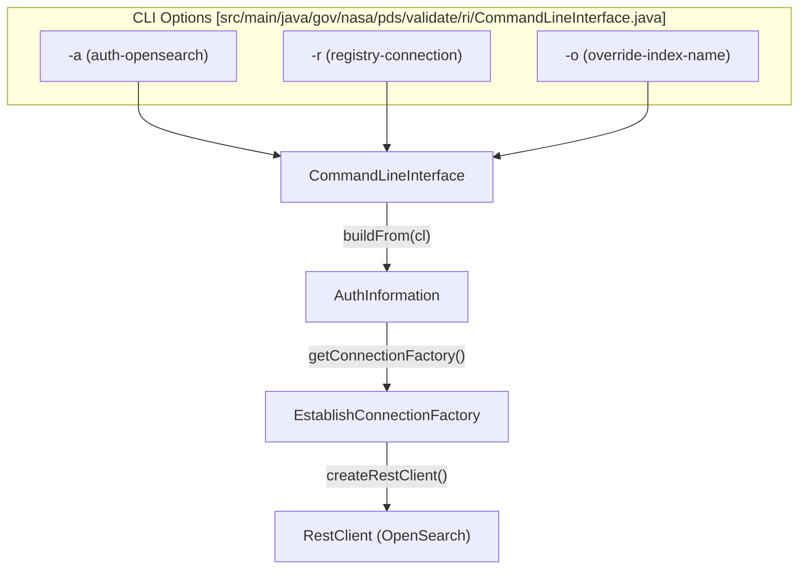
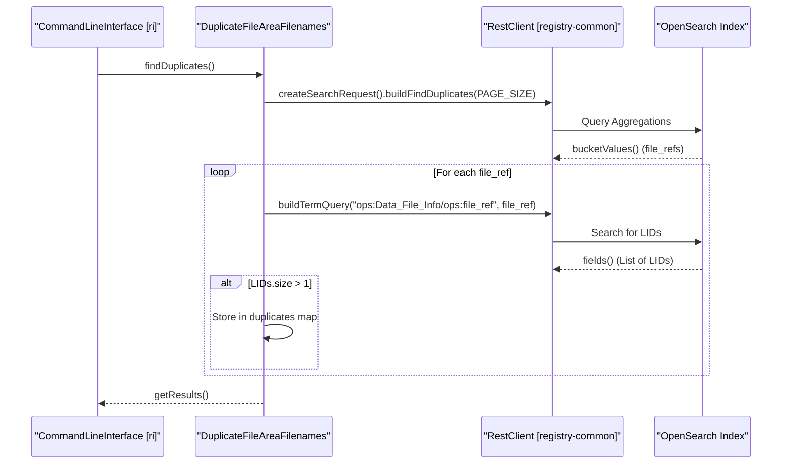

# Page: OpenSearch Registry Connectivity

# OpenSearch Registry Connectivity

Relevant source files

The following files were used as context for generating this wiki page:

- [src/main/java/gov/nasa/pds/tools/label/validate/DefaultDocumentValidator.java](src/main/java/gov/nasa/pds/tools/label/validate/DefaultDocumentValidator.java)
- [src/main/java/gov/nasa/pds/tools/label/validate/DocumentValidator.java](src/main/java/gov/nasa/pds/tools/label/validate/DocumentValidator.java)
- [src/main/java/gov/nasa/pds/tools/util/LabelParser.java](src/main/java/gov/nasa/pds/tools/util/LabelParser.java)
- [src/main/java/gov/nasa/pds/tools/util/XMLErrorListener.java](src/main/java/gov/nasa/pds/tools/util/XMLErrorListener.java)
- [src/main/java/gov/nasa/pds/tools/util/XMLExtractor.java](src/main/java/gov/nasa/pds/tools/util/XMLExtractor.java)
- [src/main/java/gov/nasa/pds/tools/util/XslURIResolver.java](src/main/java/gov/nasa/pds/tools/util/XslURIResolver.java)
- [src/main/java/gov/nasa/pds/tools/validate/ContentProblem.java](src/main/java/gov/nasa/pds/tools/validate/ContentProblem.java)
- [src/main/java/gov/nasa/pds/tools/validate/rule/pds4/FindUnreferencedFiles.java](src/main/java/gov/nasa/pds/tools/validate/rule/pds4/FindUnreferencedFiles.java)
- [src/main/java/gov/nasa/pds/validate/ReferenceIntegrityMain.java](src/main/java/gov/nasa/pds/validate/ReferenceIntegrityMain.java)
- [src/main/java/gov/nasa/pds/validate/constants/Constants.java](src/main/java/gov/nasa/pds/validate/constants/Constants.java)
- [src/main/java/gov/nasa/pds/validate/ri/AuthInformation.java](src/main/java/gov/nasa/pds/validate/ri/AuthInformation.java)
- [src/main/java/gov/nasa/pds/validate/ri/CamShaft.java](src/main/java/gov/nasa/pds/validate/ri/CamShaft.java)
- [src/main/java/gov/nasa/pds/validate/ri/CommandLineInterface.java](src/main/java/gov/nasa/pds/validate/ri/CommandLineInterface.java)
- [src/main/java/gov/nasa/pds/validate/ri/CountingAppender.java](src/main/java/gov/nasa/pds/validate/ri/CountingAppender.java)
- [src/main/java/gov/nasa/pds/validate/ri/Cylinder.java](src/main/java/gov/nasa/pds/validate/ri/Cylinder.java)
- [src/main/java/gov/nasa/pds/validate/ri/DocumentInfo.java](src/main/java/gov/nasa/pds/validate/ri/DocumentInfo.java)
- [src/main/java/gov/nasa/pds/validate/ri/DuplicateFileAreaFilenames.java](src/main/java/gov/nasa/pds/validate/ri/DuplicateFileAreaFilenames.java)
- [src/main/java/gov/nasa/pds/validate/ri/Engine.java](src/main/java/gov/nasa/pds/validate/ri/Engine.java)
- [src/main/java/gov/nasa/pds/validate/ri/LidvidComparator.java](src/main/java/gov/nasa/pds/validate/ri/LidvidComparator.java)
- [src/main/java/gov/nasa/pds/validate/ri/OpensearchDocument.java](src/main/java/gov/nasa/pds/validate/ri/OpensearchDocument.java)
- [src/main/java/gov/nasa/pds/validate/ri/UserInput.java](src/main/java/gov/nasa/pds/validate/ri/UserInput.java)
- [src/test/java/gov/nasa/pds/validate/ri/CliExecutioner.java](src/test/java/gov/nasa/pds/validate/ri/CliExecutioner.java)

The `ri` (Referential Integrity) subsystem provides the capability to validate PDS4 product references against a live NASA PDS Registry backed by OpenSearch. This connectivity allows the tool to verify that Logical Identifiers (LIDs) and Versioned Logical Identifiers (LIDVIDs) cited in labels actually exist in the global registry and correctly resolve to the expected product types.

## Registry Authentication and Configuration

Connectivity to the OpenSearch cluster is managed via the `AuthInformation` class. It encapsulates the credentials and connection parameters required to establish a secure session with the Registry Search API or the OpenSearch database directly.

### Key Class: AuthInformation
The `AuthInformation` class is responsible for:
*   **Credential Management**: Storing user and password information for the registry [src/main/java/gov/nasa/pds/validate/ri/AuthInformation.java:9-10]().
*   **Connection Factory**: Initializing an `EstablishConnectionFactory` to create `RestClient` instances [src/main/java/gov/nasa/pds/validate/ri/AuthInformation.java:33-34]().
*   **Index Overriding**: Allowing the CLI to override the default OpenSearch index (typically `registry`) [src/main/java/gov/nasa/pds/validate/ri/AuthInformation.java:38]().

### Data Flow: CLI to Registry Connection
The following diagram illustrates how command-line arguments are transformed into an active registry connection.

**Registry Connection Initialization**

Sources: [src/main/java/gov/nasa/pds/validate/ri/CommandLineInterface.java:34-43](), [src/main/java/gov/nasa/pds/validate/ri/AuthInformation.java:20-41]()

## OpenSearch Query Engine

The `OpensearchDocument` class implements the `DocumentInfo` interface to perform high-level queries against the registry. It abstracts the underlying OpenSearch JSON DSL into simple methods for existence checks and reference retrieval.

### Document Resolution and LIDVID Handling
When querying for a LIDVID, the engine must handle cases where a version is not specified (LID-only).
*   **LID Query**: If a LID is provided (detected by lack of `::`), the engine retrieves all documents matching that LID and uses the `LidvidComparator` to select the latest version [src/main/java/gov/nasa/pds/validate/ri/OpensearchDocument.java:29-45]().
*   **LIDVID Query**: Performs a direct term query on the `lidvid` field if the input string contains the `::` separator [src/main/java/gov/nasa/pds/validate/ri/OpensearchDocument.java:29]().

### Reference Extraction
`OpensearchDocument` handles two types of reference retrieval:
1.  **Standard Products**: Iterates through fields starting with `ref_lid_` to find associated identifiers [src/main/java/gov/nasa/pds/validate/ri/OpensearchDocument.java:104-112]().
2.  **Collections**: Queries a specific index suffix (`-refs`) using the `collection_lidvid` or `collection_lid` to find all members of a collection [src/main/java/gov/nasa/pds/validate/ri/OpensearchDocument.java:62-63]().

| Method | Purpose | Implementation Detail |
| :--- | :--- | :--- |
| `exists(lidvid)` | Verifies presence in index | Calls `load(lidvid)` and checks internal `documents` map [src/main/java/gov/nasa/pds/validate/ri/OpensearchDocument.java:80-83](). |
| `getProductTypeOf(lidvid)` | Identifies PDS4 class | Retrieves `product_class` field from the cached OpenSearch document [src/main/java/gov/nasa/pds/validate/ri/OpensearchDocument.java:86-93](). |
| `getReferencesOf(lidvid)` | Finds child references | Switches logic based on `Product_Collection` (uses `load_refs`) vs other types (uses `ref_lid_` keys) [src/main/java/gov/nasa/pds/validate/ri/OpensearchDocument.java:97-116](). |

Sources: [src/main/java/gov/nasa/pds/validate/ri/OpensearchDocument.java:21-117](), [src/main/java/gov/nasa/pds/validate/ri/LidvidComparator.java:1-15]()

## Duplicate File Detection

The `DuplicateFileAreaFilenames` class extends `OpensearchDocument` to detect if multiple distinct LIDs refer to the same physical file reference within the registry.

### Detection Logic
The scanner utilizes OpenSearch aggregations to find duplicates:
1.  **Find Duplicates**: Executes a search request using `buildFindDuplicates` to identify `file_ref` values appearing in more than one document [src/main/java/gov/nasa/pds/validate/ri/DuplicateFileAreaFilenames.java:45-47]().
2.  **LID Resolution**: For each duplicate `file_ref`, it queries the registry to find all `lid` values associated with that file reference [src/main/java/gov/nasa/pds/validate/ri/DuplicateFileAreaFilenames.java:49-51]().
3.  **Reporting**: If more than one unique LID is found for a single file reference, an error is logged [src/main/java/gov/nasa/pds/validate/ri/DuplicateFileAreaFilenames.java:52-55]().

**Duplicate Detection Process**

Sources: [src/main/java/gov/nasa/pds/validate/ri/DuplicateFileAreaFilenames.java:42-60](), [src/main/java/gov/nasa/pds/validate/ri/CommandLineInterface.java:109-117]()

## Thread-Safe Registry Access

Since the `ri` engine uses a multi-threaded architecture (managed by `Engine` and `Cylinder`), registry connectivity must be handled carefully:
*   **Client Reuse**: The `RestClient` is lazily initialized and shared within an `OpensearchDocument` instance using `synchronized` blocks [src/main/java/gov/nasa/pds/validate/ri/OpensearchDocument.java:24-26]().
*   **Independent Workers**: Each `Cylinder` thread creates its own `OpensearchDocument` instance to perform validation, ensuring that document caches are isolated per-thread while sharing the same `AuthInformation` connection context [src/main/java/gov/nasa/pds/validate/ri/Cylinder.java:38]().
*   **Queue Management**: The `Engine` manages the queue of LIDVIDs to be processed, notifying waiting threads when new references are added via `addAll()` [src/main/java/gov/nasa/pds/validate/ri/Engine.java:26-33]().

Sources: [src/main/java/gov/nasa/pds/validate/ri/OpensearchDocument.java:24-26](), [src/main/java/gov/nasa/pds/validate/ri/Cylinder.java:35-60](), [src/main/java/gov/nasa/pds/validate/ri/Engine.java:26-33]()
