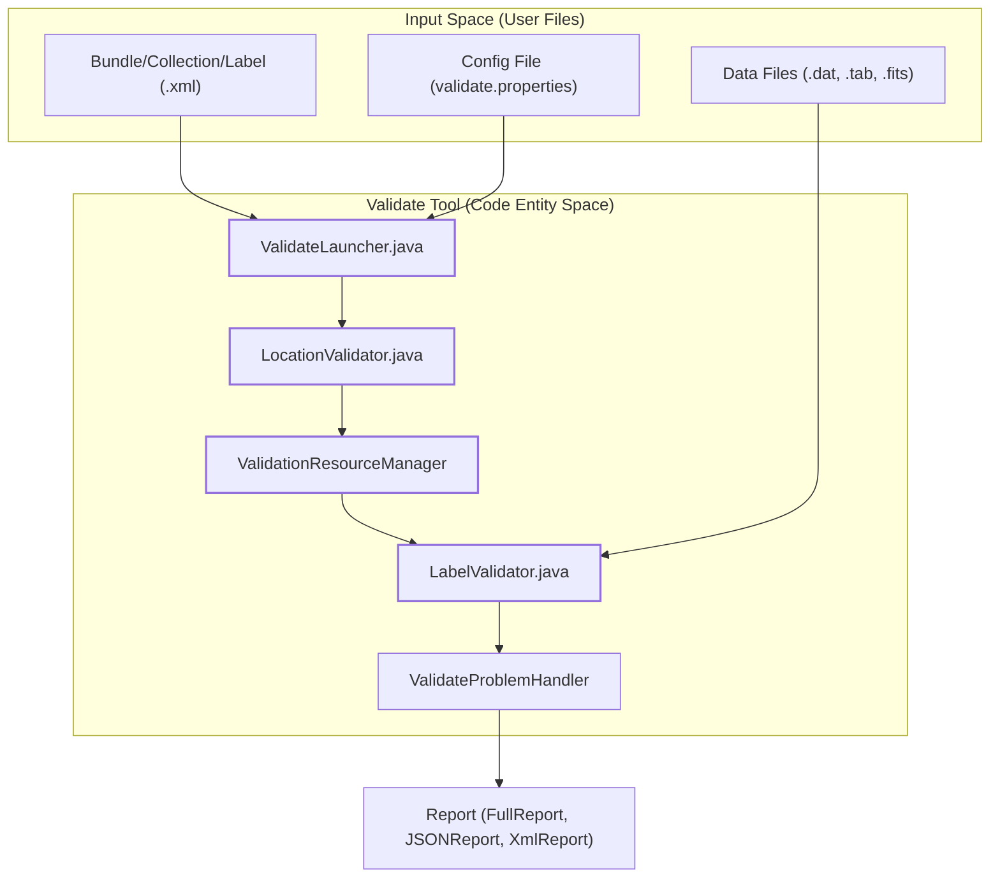
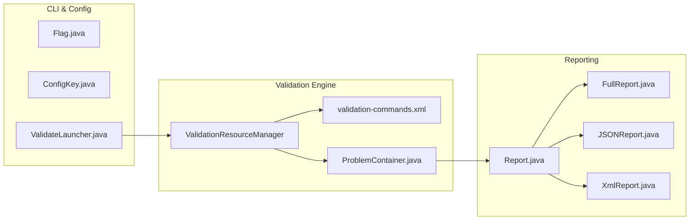

# Page: Overview

# Overview

Relevant source files

The following files were used as context for generating this wiki page:

- [.github/CODEOWNERS](.github/CODEOWNERS)
- [.gitignore](.gitignore)
- [CHANGELOG.md](CHANGELOG.md)
- [LICENSE.md](LICENSE.md)
- [NOTICE.txt](NOTICE.txt)
- [README.md](README.md)
- [SECURITY.md](SECURITY.md)
- [build/pre-build.sh](build/pre-build.sh)
- [pom.xml](pom.xml)
- [src/changes/changes.xml](src/changes/changes.xml)
- [src/main/java/gov/nasa/pds/tools/util/ContextProductReference.java](src/main/java/gov/nasa/pds/tools/util/ContextProductReference.java)
- [src/main/java/gov/nasa/pds/tools/validate/content/table/TableContentProblem.java](src/main/java/gov/nasa/pds/tools/validate/content/table/TableContentProblem.java)
- [src/main/java/gov/nasa/pds/tools/validate/rule/pds4/SchemaValidator.java](src/main/java/gov/nasa/pds/tools/validate/rule/pds4/SchemaValidator.java)
- [src/main/java/gov/nasa/pds/tools/validate/rule/pds4/TableFieldDefinitionRule.java](src/main/java/gov/nasa/pds/tools/validate/rule/pds4/TableFieldDefinitionRule.java)
- [src/main/java/gov/nasa/pds/validate/ValidateLauncher.java](src/main/java/gov/nasa/pds/validate/ValidateLauncher.java)
- [src/main/java/gov/nasa/pds/validate/Validator.java](src/main/java/gov/nasa/pds/validate/Validator.java)
- [src/main/java/gov/nasa/pds/validate/ValidatorFactory.java](src/main/java/gov/nasa/pds/validate/ValidatorFactory.java)
- [src/main/java/gov/nasa/pds/validate/commandline/options/ConfigKey.java](src/main/java/gov/nasa/pds/validate/commandline/options/ConfigKey.java)
- [src/main/java/gov/nasa/pds/validate/commandline/options/Flag.java](src/main/java/gov/nasa/pds/validate/commandline/options/Flag.java)
- [src/main/java/gov/nasa/pds/validate/commandline/options/FlagOptions.java](src/main/java/gov/nasa/pds/validate/commandline/options/FlagOptions.java)
- [src/main/java/gov/nasa/pds/validate/commandline/options/InvalidOptionException.java](src/main/java/gov/nasa/pds/validate/commandline/options/InvalidOptionException.java)
- [src/main/java/gov/nasa/pds/validate/commandline/options/ToolsOption.java](src/main/java/gov/nasa/pds/validate/commandline/options/ToolsOption.java)
- [src/main/java/gov/nasa/pds/validate/crawler/WildcardOSFilter.java](src/main/java/gov/nasa/pds/validate/crawler/WildcardOSFilter.java)
- [src/main/java/gov/nasa/pds/validate/util/Namespace.java](src/main/java/gov/nasa/pds/validate/util/Namespace.java)
- [src/main/java/gov/nasa/pds/validate/util/ToolInfo.java](src/main/java/gov/nasa/pds/validate/util/ToolInfo.java)
- [src/main/java/gov/nasa/pds/validate/util/Utility.java](src/main/java/gov/nasa/pds/validate/util/Utility.java)
- [src/main/resources/bin/logging.properties](src/main/resources/bin/logging.properties)
- [src/main/resources/bin/validate-bundle](src/main/resources/bin/validate-bundle)
- [src/main/resources/util/registered_context_products.json](src/main/resources/util/registered_context_products.json)
- [src/main/resources/validate.properties](src/main/resources/validate.properties)
- [src/main/resources/validation-commands.xml](src/main/resources/validation-commands.xml)
- [src/site/site.xml](src/site/site.xml)
- [src/test/resources/github28/new_context.json](src/test/resources/github28/new_context.json)

The **NASA PDS Validate Tool** is a comprehensive software solution designed to ensure that planetary science data products adhere to the PDS4 (Planetary Data System version 4) and PDS3 standards. It provides automated validation of product labels (XML), data content (tables, arrays), and referential integrity across complex archival structures like bundles and collections [pom.xml:17-19]().

The tool is distributed as a Java-based command-line application, packaged in a JAR file with wrapper scripts for various operating systems [README.md:5-6](). It is built using Apache Maven and requires Java 17 [pom.xml:184-189](), [CHANGELOG.md:37-37]().

## Key Capabilities

*   **Label Validation**: Syntactic and semantic checks of PDS4 XML labels against standard and user-specified schemas (XSD) and Schematrons (SCH) via `LabelValidator` [src/main/java/gov/nasa/pds/validate/ValidateLauncher.java:93-96]().
*   **Data Content Validation**: Deep inspection of data files (e.g., ASCII/Binary tables, Arrays) to ensure the byte-level content matches the descriptions in the labels. This can be toggled via the `SKIP_CONTENT_VALIDATION` flag [src/main/java/gov/nasa/pds/validate/commandline/options/Flag.java:116-118]().
*   **Referential Integrity**: Verification of internal and external references, including LID/LIDVID (Logical Identifier/Version ID) links between bundles, collections, and products [src/main/java/gov/nasa/pds/validate/commandline/options/Flag.java:40-41]().
*   **Context Product Validation**: Automated checks against a registry of known context products (spacecraft, instruments, targets) stored in `registered_context_products.json`, which can be updated dynamically via the `LATEST_JSON_FILE` flag [src/main/resources/util/registered_context_products.json:1-71](), [src/main/java/gov/nasa/pds/validate/commandline/options/ConfigKey.java:154-154]().
*   **Parallel Execution**: The `validate-bundle` script enables high-performance validation by parallelizing tasks across multiple CPU cores using GNU Parallel [src/main/resources/bin/validate-bundle:14-19]().

## System Context

The following diagram illustrates how the Validate tool bridges user-provided data (Natural Language/Data Space) with the internal Java components (Code Entity Space).

**Validate Execution Flow**

Sources: [src/main/java/gov/nasa/pds/validate/ValidateLauncher.java:134-138](), [src/main/java/gov/nasa/pds/validate/ValidateLauncher.java:94-94](), [src/main/java/gov/nasa/pds/validate/ValidateLauncher.java:112-112]()

## Architecture Summary

The tool utilizes a "Chain of Responsibility" rule engine. Validation logic is encapsulated into discrete rules defined in `validation-commands.xml` [src/main/resources/validation-commands.xml](). The `ValidateLauncher` parses command-line flags (defined in the `Flag` enum) and initializes the `Report` system based on the requested style [src/main/java/gov/nasa/pds/validate/ValidateLauncher.java:172-180]().

**Core Subsystems**

Sources: [src/main/java/gov/nasa/pds/validate/commandline/options/Flag.java:39-41](), [src/main/java/gov/nasa/pds/validate/commandline/options/ConfigKey.java:44-55](), [src/main/java/gov/nasa/pds/validate/ValidateLauncher.java:134-138](), [src/main/resources/validation-commands.xml]()

## Major Subsystem Pages

For detailed technical information, refer to the following child pages:

*   **[Getting Started](#1.1)**: Installation instructions for Unix and Windows, prerequisites (Java 17+), and initial configuration via `mvn package` [README.md:10-22]().
*   **[Command-Line Interface](#1.2)**: Comprehensive reference for all flags (e.g., `--target`, `--rule`, `--skip-content-validation`) and property keys used in `validate.properties` [src/main/java/gov/nasa/pds/validate/commandline/options/Flag.java:39-155](), [src/main/java/gov/nasa/pds/validate/commandline/options/ConfigKey.java:44-169]().
*   **[Release History and Requirements](#1.3)**: Details on the tool's evolution, including recent updates for Java 17 and support for new PDS4 encoding types like NetCDF [CHANGELOG.md:1-64](), [src/changes/changes.xml:42-124]().

---
**Sources:**
* [pom.xml:1-190]()
* [README.md:1-135]()
* [CHANGELOG.md:1-70]()
* [src/main/java/gov/nasa/pds/validate/ValidateLauncher.java:93-180]()
* [src/main/java/gov/nasa/pds/validate/commandline/options/Flag.java:39-155]()
* [src/main/java/gov/nasa/pds/validate/commandline/options/ConfigKey.java:44-169]()
* [src/main/resources/validation-commands.xml]()
* [src/main/resources/bin/validate-bundle:1-183]()
