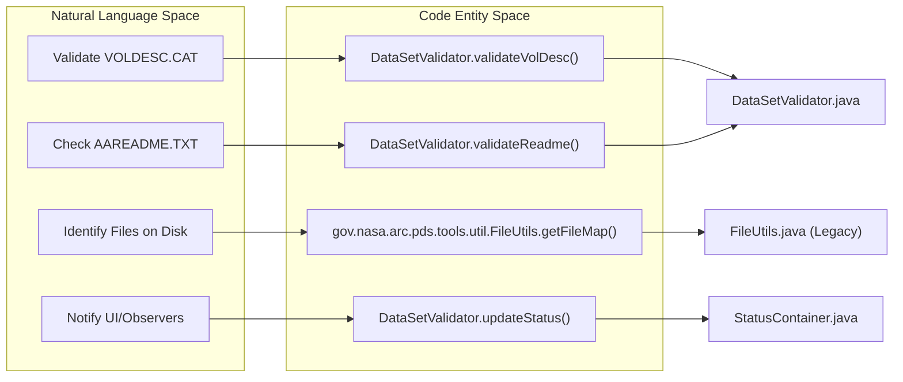

# Page: PDS3 Volume Validation

# PDS3 Volume Validation

<details>
<summary>Relevant source files</summary>

The following files were used as context for generating this wiki page:

- [.github/CODEOWNERS](.github/CODEOWNERS)
- [.gitignore](.gitignore)
- [LICENSE.md](LICENSE.md)
- [NOTICE.txt](NOTICE.txt)
- [README.md](README.md)
- [SECURITY.md](SECURITY.md)
- [src/main/java/gov/nasa/pds/tools/util/DocumentUtil.java](src/main/java/gov/nasa/pds/tools/util/DocumentUtil.java)
- [src/main/java/gov/nasa/pds/tools/util/PDFUtil.java](src/main/java/gov/nasa/pds/tools/util/PDFUtil.java)
- [src/main/java/gov/nasa/pds/tools/validate/content/table/TableContentProblem.java](src/main/java/gov/nasa/pds/tools/validate/content/table/TableContentProblem.java)
- [src/main/java/gov/nasa/pds/tools/validate/rule/pds4/TableFieldDefinitionRule.java](src/main/java/gov/nasa/pds/tools/validate/rule/pds4/TableFieldDefinitionRule.java)
- [src/main/java/gov/nasa/pds/web/ui/utils/DataSetValidator.java](src/main/java/gov/nasa/pds/web/ui/utils/DataSetValidator.java)
- [src/main/resources/validation-commands.xml](src/main/resources/validation-commands.xml)
- [src/site/site.xml](src/site/site.xml)
- [src/test/java/cucumber/CucumberTest.java](src/test/java/cucumber/CucumberTest.java)
- [src/test/java/cucumber/StepDefs.java](src/test/java/cucumber/StepDefs.java)
- [src/test/resources/features/3.6.x.feature](src/test/resources/features/3.6.x.feature)
- [src/test/resources/features/pre.3.6.x.feature](src/test/resources/features/pre.3.6.x.feature)
- [src/test/resources/github992/ff_char.xml](src/test/resources/github992/ff_char.xml)
- [src/test/resources/github992/ff_del.xml](src/test/resources/github992/ff_del.xml)
- [src/test/resources/github992/ff_test.csv](src/test/resources/github992/ff_test.csv)

</details>


PDS3 volume validation in the `validate` tool ensures that legacy PDS3 data sets conform to the structural and file-level requirements defined by the PDS3 Standards Reference. This process covers the validation of the volume hierarchy, required control files (like `VOLDESC.CAT` and `AAREADME.TXT`), and the detection of undocumented products within the volume.

## VolumeValidationRule

The `VolumeValidationRule` is the primary entry point for PDS3 volume validation. It is registered in the validation command configuration and is triggered when the tool detects a PDS3 volume structure or when explicitly invoked via the command line.

*   **Implementation**: The rule utilizes the `DataSetValidator` to perform the bulk of the legacy validation logic. [src/main/resources/validation-commands.xml:49]()
*   **Targeting**: It targets directories that contain a `VOLDESC.CAT` file at the root. [src/main/java/gov/nasa/pds/web/ui/utils/DataSetValidator.java:171-172]()
*   **Legacy Context**: Unlike PDS4 rules that use the newer `ProblemListener` architecture, PDS3 validation often bridges to the legacy `gov.nasa.pds.tools` library components. [src/main/java/gov/nasa/pds/web/ui/utils/DataSetValidator.java:21-25]()

Sources: [src/main/java/gov/nasa/pds/web/ui/utils/DataSetValidator.java:131-140](), [src/main/java/gov/nasa/pds/web/ui/utils/DataSetValidator.java:171-172](), [src/main/resources/validation-commands.xml:49]()

## DataSetValidator (Legacy Observer-Pattern Validator)

The `DataSetValidator` is a legacy component that implements the core PDS3 validation logic. It extends `java.util.Observable` to report progress and status updates to a `StatusContainer`. [src/main/java/gov/nasa/pds/web/ui/utils/DataSetValidator.java:47-47]()

### Key Responsibilities
1.  **Volume Initialization**: Sets the volume context and generates a file listing of the entire base directory using `FileUtils.getFileMap()`. [src/main/java/gov/nasa/pds/web/ui/utils/DataSetValidator.java:143-144]()
2.  **Dictionary Initialization**: Loads local data dictionaries if present to support attribute validation. [src/main/java/gov/nasa/pds/web/ui/utils/DataSetValidator.java:169-170]()
3.  **Required File Checks**: Verifies the presence and basic validity of `VOLDESC.CAT`, `AAREADME.TXT`, and `ERRATA.TXT`. [src/main/java/gov/nasa/pds/web/ui/utils/DataSetValidator.java:181-191]()
4.  **Directory Validation**: Iterates through standard PDS3 directories (e.g., `CATALOG`, `INDEX`, `DOCUMENT`, `LABEL`). [src/main/java/gov/nasa/pds/web/ui/utils/DataSetValidator.java:184-187]()

### Implementation Details
*   **File Mapping**: Maintains several maps to track the status of files within the volume, including `knownFiles` (files pointed to by labels/indices) and `labelFiles`. [src/main/java/gov/nasa/pds/web/ui/utils/DataSetValidator.java:70-77]()
*   **Folder Categorization**: Identifies folders that should not be indexed or are illegal to index (e.g., `EXTRAS`, `LABEL`) based on `DataSetConstants`. [src/main/java/gov/nasa/pds/web/ui/utils/DataSetValidator.java:148-164]()

Sources: [src/main/java/gov/nasa/pds/web/ui/utils/DataSetValidator.java:47-93](), [src/main/java/gov/nasa/pds/web/ui/utils/DataSetValidator.java:131-192]()

## Validation of Core PDS3 Files

The tool performs specific checks on the mandatory files located in the root of a PDS3 volume.

| File | Validation Logic |
| :--- | :--- |
| `VOLDESC.CAT` | Validated first as it defines the metadata for the entire volume; used to set volume name and ID. [src/main/java/gov/nasa/pds/web/ui/utils/DataSetValidator.java:181-182]() |
| `AAREADME.TXT` | Checked for existence and standard formatting. [src/main/java/gov/nasa/pds/web/ui/utils/DataSetValidator.java:188-189]() |
| `ERRATA.TXT` | Checked if present; used to document known issues in the volume. [src/main/java/gov/nasa/pds/web/ui/utils/DataSetValidator.java:190-191]() |
| `INDEX/INDEX.LBL` | Validated within the `INDEX` directory to ensure all data products are correctly inventoried. [src/main/java/gov/nasa/pds/web/ui/utils/DataSetValidator.java:186-187]() |

Sources: [src/main/java/gov/nasa/pds/web/ui/utils/DataSetValidator.java:171-192]()

## Index and Directory Validation

PDS3 volumes rely on index files to list all products. The `DataSetValidator` performs the following:

1.  **Catalog Directory**: Validates files in the `/CATALOG` directory to ensure all necessary `.CAT` files (MISSION.CAT, INST.CAT, etc.) are present and valid against the data dictionary. [src/main/java/gov/nasa/pds/web/ui/utils/DataSetValidator.java:184-185]()
2.  **Undocumented Product Detection**: By comparing the physical file system (via the `files` map) against the files listed in the volume indices (`indexedFiles`), the tool identifies "undocumented" files that exist on disk but are not described by any label or index. [src/main/java/gov/nasa/pds/web/ui/utils/DataSetValidator.java:72-85]()
3.  **Naming Conventions**: Enforces PDS3-specific naming conventions for files and directories. [src/main/java/gov/nasa/pds/web/ui/utils/DataSetValidator.java:193-194]()

Sources: [src/main/java/gov/nasa/pds/web/ui/utils/DataSetValidator.java:72-85](), [src/main/java/gov/nasa/pds/web/ui/utils/DataSetValidator.java:143-164]()

## Data Flow Diagram: PDS3 Validation Lifecycle

This diagram shows how the `DataSetValidator` processes a PDS3 volume from the root directory, managing state through its internal maps.

Title: PDS3 Volume Validation Lifecycle
```mermaid
graph TD
    "TargetDir"["Target Directory"] --> "Validate"["DataSetValidator.validate()"]
    "Validate" --> "InitVol"["setVolume(baseDirectory)"]
    "InitVol" --> "FileMap"["FileUtils.getFileMap()"]
    "FileMap" --> "PopulateMaps"["Populate files/knownFiles Maps"]
    "Validate" --> "CheckVolDesc"["validateVolDesc()"]
    "CheckVolDesc" --> "CheckCatalog"["validateCatalogDirectory()"]
    "CheckCatalog" --> "CheckReadme"["validateReadme()"]
    "CheckReadme" --> "CheckIndex"["validateIndexDirectory()"]
    "CheckIndex" --> "DetectUndoc"["Identify Undocumented (files - indexedFiles)"]
    "DetectUndoc" --> "FinalResults"["ValidationResults / StatusContainer Updates"]
```
Sources: [src/main/java/gov/nasa/pds/web/ui/utils/DataSetValidator.java:131-194]()

## Code Entity Mapping: PDS3 Validation Components

This diagram maps the natural language requirements for PDS3 validation to the specific Java classes and methods responsible for them.

Title: PDS3 Validation Code Entity Map

Sources: [src/main/java/gov/nasa/pds/web/ui/utils/DataSetValidator.java:110-125](), [src/main/java/gov/nasa/pds/web/ui/utils/DataSetValidator.java:131-192]()
