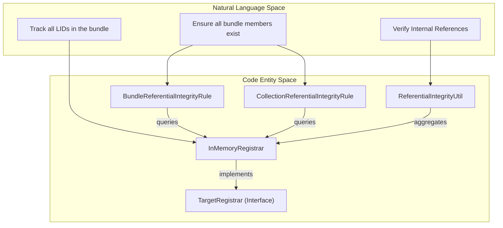
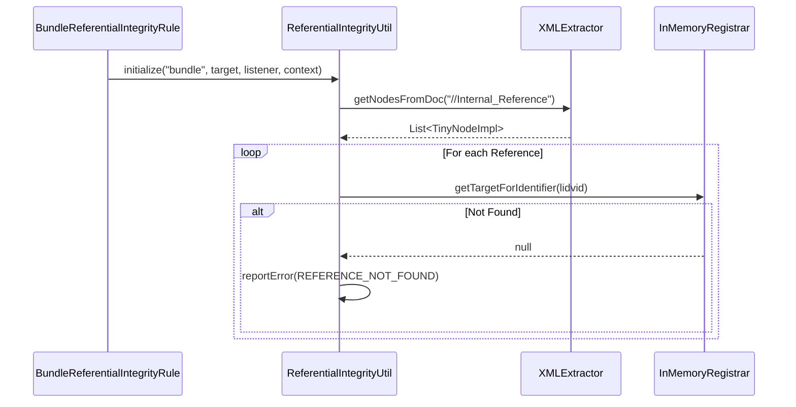

# Page: PDS4 Bundle and Collection Rules

# PDS4 Bundle and Collection Rules

Relevant source files

The following files were used as context for generating this wiki page:

- [src/main/java/gov/nasa/pds/tools/util/LabelUtil.java](src/main/java/gov/nasa/pds/tools/util/LabelUtil.java)
- [src/main/java/gov/nasa/pds/tools/util/ReferentialIntegrityUtil.java](src/main/java/gov/nasa/pds/tools/util/ReferentialIntegrityUtil.java)
- [src/main/java/gov/nasa/pds/tools/validate/AdditionalTarget.java](src/main/java/gov/nasa/pds/tools/validate/AdditionalTarget.java)
- [src/main/java/gov/nasa/pds/tools/validate/InMemoryRegistrar.java](src/main/java/gov/nasa/pds/tools/validate/InMemoryRegistrar.java)
- [src/main/java/gov/nasa/pds/tools/validate/TargetRegistrar.java](src/main/java/gov/nasa/pds/tools/validate/TargetRegistrar.java)
- [src/main/java/gov/nasa/pds/tools/validate/rule/AbstractValidationRule.java](src/main/java/gov/nasa/pds/tools/validate/rule/AbstractValidationRule.java)
- [src/main/java/gov/nasa/pds/tools/validate/rule/pds4/BundleReferentialIntegrityRule.java](src/main/java/gov/nasa/pds/tools/validate/rule/pds4/BundleReferentialIntegrityRule.java)
- [src/main/java/gov/nasa/pds/tools/validate/rule/pds4/CollectionInBundleRule.java](src/main/java/gov/nasa/pds/tools/validate/rule/pds4/CollectionInBundleRule.java)
- [src/main/java/gov/nasa/pds/tools/validate/rule/pds4/CollectionReferentialIntegrityRule.java](src/main/java/gov/nasa/pds/tools/validate/rule/pds4/CollectionReferentialIntegrityRule.java)
- [src/main/java/gov/nasa/pds/tools/validate/rule/pds4/DirectoryValidationRule.java](src/main/java/gov/nasa/pds/tools/validate/rule/pds4/DirectoryValidationRule.java)
- [src/main/java/gov/nasa/pds/tools/validate/rule/pds4/LabelValidationChain.java](src/main/java/gov/nasa/pds/tools/validate/rule/pds4/LabelValidationChain.java)
- [src/main/java/gov/nasa/pds/tools/validate/rule/pds4/RegisterLabelIdentifiers.java](src/main/java/gov/nasa/pds/tools/validate/rule/pds4/RegisterLabelIdentifiers.java)
- [src/main/java/gov/nasa/pds/tools/validate/rule/pds4/SubDirectoryRule.java](src/main/java/gov/nasa/pds/tools/validate/rule/pds4/SubDirectoryRule.java)
- [src/test/resources/features/4.1.x.feature](src/test/resources/features/4.1.x.feature)
- [src/test/resources/github1481/bundle_test.xml](src/test/resources/github1481/bundle_test.xml)
- [src/test/resources/github1481/data/collection_data.csv](src/test/resources/github1481/data/collection_data.csv)
- [src/test/resources/github1481/data/collection_data.xml](src/test/resources/github1481/data/collection_data.xml)
- [src/test/resources/github1481/data/product_a.xml](src/test/resources/github1481/data/product_a.xml)
- [src/test/resources/github1548/.gitkeep](src/test/resources/github1548/.gitkeep)
- [src/test/resources/github51/valid/bundle_kaguya_derived.xml](src/test/resources/github51/valid/bundle_kaguya_derived.xml)

This page details the validation logic governing PDS4 Bundles and Collections, specifically focusing on structural integrity, member registration, and referential integrity across product boundaries within the NASA PDS Validate tool.

## Overview

Validation of PDS4 bundles and collections involves more than single-label XML validation. The tool must ensure that:
1.  **Structural Integrity**: All members defined in a Bundle or Collection exist within the provided search paths.
2.  **Referential Integrity**: All `Internal_Reference` tags (LID/LIDVID) point to products that are either present in the local validation set or registered in a known context.
3.  **Registration**: Identifiers (LIDs and LIDVIDs) are extracted and stored in a `TargetRegistrar` to allow cross-product lookups.

---

## Key Components and Data Flow

The validation process utilizes a central `InMemoryRegistrar` to track state across multiple files during a validation task.

### Component Relationship Diagram
This diagram bridges the natural language requirements (e.g., "Check if a LID exists") to the specific classes and methods in the codebase.

**Sources:** [src/main/java/gov/nasa/pds/tools/validate/rule/pds4/BundleReferentialIntegrityRule.java:46-50](), [src/main/java/gov/nasa/pds/tools/validate/InMemoryRegistrar.java:27-39](), [src/main/java/gov/nasa/pds/tools/util/ReferentialIntegrityUtil.java:48-55]()

---

## InMemoryRegistrar

The `InMemoryRegistrar` is the primary state container for a validation run. It stores mappings between logical identifiers and their physical file locations, as well as tracking references to detect orphans or dangling links.

### Key Data Structures
*   `targets`: Map of all discovered locations to `ValidationTarget` objects [src/main/java/gov/nasa/pds/tools/validate/InMemoryRegistrar.java:31]().
*   `identifierDefinitions`: Maps an `Identifier` (LID/LIDVID) to its file location [src/main/java/gov/nasa/pds/tools/validate/InMemoryRegistrar.java:35]().
*   `identifierDefinitionsByLid`: Groups all versions (LIDVIDs) of a single LID for easier "near neighbor" resolution [src/main/java/gov/nasa/pds/tools/validate/InMemoryRegistrar.java:36]().
*   `identifierReferenceLocations`: Tracks where an identifier was referenced, enabling "dangling reference" detection [src/main/java/gov/nasa/pds/tools/validate/InMemoryRegistrar.java:37]().

### Core Functions
| Function | Description |
| :--- | :--- |
| `addTarget()` | Adds a new target (File/URL) to the registrar [src/main/java/gov/nasa/pds/tools/validate/InMemoryRegistrar.java:46-66](). |
| `setTargetIdentifier()` | Associates a LID/LIDVID with a specific file location [src/main/java/gov/nasa/pds/tools/validate/InMemoryRegistrar.java:124-130](). |
| `getUnreferencedTargets()` | Returns files that were found but never referenced by any label [src/main/java/gov/nasa/pds/tools/validate/InMemoryRegistrar.java:190-200](). |
| `getTargetForIdentifier()` | Gets the location where an identifier was defined, supporting near-neighbor lookups [src/main/java/gov/nasa/pds/tools/validate/InMemoryRegistrar.java:164-176](). |
| `isIdentifierReferenced()` | Checks if a LID/LIDVID has been cited by another product [src/main/java/gov/nasa/pds/tools/validate/InMemoryRegistrar.java:152-161](). |

**Sources:** [src/main/java/gov/nasa/pds/tools/validate/InMemoryRegistrar.java:27-200](), [src/main/java/gov/nasa/pds/tools/validate/TargetRegistrar.java:31-192]()

---

## Bundle and Collection Validation Logic

### BundleReferentialIntegrityRule
This rule processes `Product_Bundle` labels. It uses XPath to locate `Bundle_Member_Entry` elements and verifies that the referenced LID/LIDVIDs are defined within the registrar.

1.  **Discovery**: It crawls the target directory to find the `Product_Bundle` label [src/main/java/gov/nasa/pds/tools/validate/rule/pds4/BundleReferentialIntegrityRule.java:93-98]().
2.  **Member Extraction**: It extracts `lid_reference` or `lidvid_reference` from `Bundle_Member_Entry` nodes using the XPath `//Bundle_Member_Entry` [src/main/java/gov/nasa/pds/tools/validate/rule/pds4/BundleReferentialIntegrityRule.java:53-60]().
3.  **Cross-Check**: It queries the `TargetRegistrar` via `getIdentifierDefinitionsForLid()` to ensure every member is accounted for [src/main/java/gov/nasa/pds/tools/validate/rule/pds4/BundleReferentialIntegrityRule.java:161-165]().

### CollectionReferentialIntegrityRule
This rule processes `Product_Collection` labels and their associated inventory files.

1.  **Inventory Parsing**: Uses `InventoryTableReader` to read the member LIDs/LIDVIDs from the collection's inventory table [src/main/java/gov/nasa/pds/tools/validate/rule/pds4/CollectionReferentialIntegrityRule.java:116-123]().
2.  **Member Validation**: For each entry in the inventory, it indexes identifiers in the registrar to check if the product is present [src/main/java/gov/nasa/pds/tools/validate/rule/pds4/CollectionReferentialIntegrityRule.java:118-121]().
3.  **Count Verification**: Compares the number of records read against the expected count defined in the label; if they mismatch, a `RECORDS_MISMATCH` problem is reported [src/main/java/gov/nasa/pds/tools/validate/rule/pds4/CollectionReferentialIntegrityRule.java:141-148]().

**Sources:** [src/main/java/gov/nasa/pds/tools/validate/rule/pds4/BundleReferentialIntegrityRule.java:46-165](), [src/main/java/gov/nasa/pds/tools/validate/rule/pds4/CollectionReferentialIntegrityRule.java:50-159]()

---

## Referential Integrity Utility (ReferentialIntegrityUtil)

The `ReferentialIntegrityUtil` provides generalized methods for checking references in non-standard areas, such as `Discipline_Area` or `Context_Area`.

### Reference Extraction Process
The utility uses broad XPaths and `XMLExtractor` to find `Internal_Reference` nodes across the entire document, ensuring that even custom LDD (Local Data Dictionary) references are validated.

### Key Logic: Discipline and Context Area References
*   **Discipline Area**: As per Issue #1481, the tool enforces referential integrity for `Internal_Reference` tags located within `Discipline_Area` [src/test/resources/features/4.1.x.feature:11](). The `ReferentialIntegrityUtil` handles this by searching for all occurrences of the `Internal_Reference` pattern regardless of parent element [src/main/java/gov/nasa/pds/tools/util/ReferentialIntegrityUtil.java:48-55]().
*   **Context Area**: Validates that all context objects (Targets, Observing Systems, Investigations) specified in observational products are also referenced in the parent bundle/collection `Reference_List` [src/main/java/gov/nasa/pds/tools/validate/rule/pds4/CollectionReferentialIntegrityRule.java:96-103](). `LabelUtil` defines specific XPaths for these areas, such as `CONTEXT_AREA_TARGET_IDENTIFICATION_REFERENCE` [src/main/java/gov/nasa/pds/tools/util/LabelUtil.java:63-70]().

**Sources:** [src/main/java/gov/nasa/pds/tools/util/ReferentialIntegrityUtil.java:48-103](), [src/main/java/gov/nasa/pds/tools/util/LabelUtil.java:56-70](), [src/main/java/gov/nasa/pds/tools/validate/rule/pds4/CollectionReferentialIntegrityRule.java:95-108]()

---

## LID and LIDVID Enforcement

The tool enforces strict rules on identifier formatting and relationships:
*   **LID Prefix Enforcement**: In a bundle validation context, the tool verifies that all member collections and products share the same LID prefix as the parent bundle.
*   **Version Consistency**: If a LIDVID is used, the specific version must exist. If only a LID is used, the tool checks for the existence of any version of that LID in the registrar using "near neighbor" logic [src/main/java/gov/nasa/pds/tools/validate/InMemoryRegistrar.java:164-175]().
*   **Target Examination**: The `TargetExaminer` is used to determine if a target file is actually a `Product_Bundle` or `Product_Collection` by parsing the XML root node and looking for specific tags like `Product_Bundle` [src/main/java/gov/nasa/pds/tools/validate/rule/pds4/BundleReferentialIntegrityRule.java:95-98]().
*   **IM Version Tracking**: `LabelUtil` tracks Information Model (IM) versions across the bundle to ensure consistency and can report warnings if multiple versions are found [src/main/java/gov/nasa/pds/tools/util/LabelUtil.java:37-48]().

**Sources:** [src/main/java/gov/nasa/pds/tools/validate/InMemoryRegistrar.java:152-161](), [src/main/java/gov/nasa/pds/tools/validate/rule/pds4/BundleReferentialIntegrityRule.java:153-165](), [src/main/java/gov/nasa/pds/tools/validate/TargetExaminer.java:33-37](), [src/main/java/gov/nasa/pds/tools/util/LabelUtil.java:164-178]()
