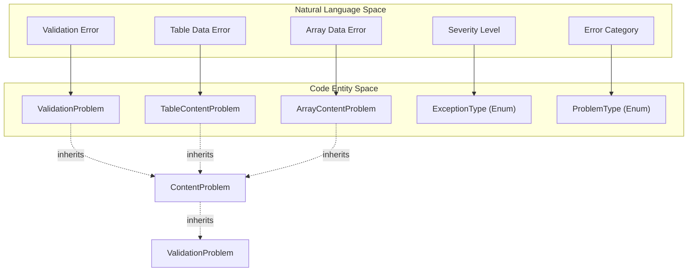
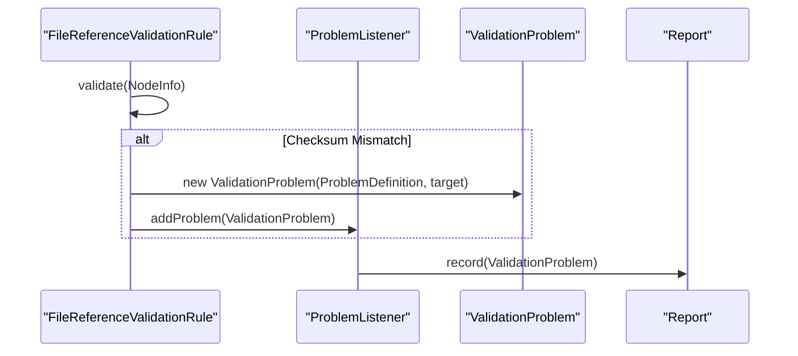

# Page: Problem Reporting System

# Problem Reporting System

Relevant source files

The following files were used as context for generating this wiki page:

- [src/main/java/gov/nasa/pds/tools/util/EncodingMimeMapping.java](src/main/java/gov/nasa/pds/tools/util/EncodingMimeMapping.java)
- [src/main/java/gov/nasa/pds/tools/util/Utility.java](src/main/java/gov/nasa/pds/tools/util/Utility.java)
- [src/main/java/gov/nasa/pds/tools/util/VersionInfo.java](src/main/java/gov/nasa/pds/tools/util/VersionInfo.java)
- [src/main/java/gov/nasa/pds/tools/validate/AggregateManager.java](src/main/java/gov/nasa/pds/tools/validate/AggregateManager.java)
- [src/main/java/gov/nasa/pds/tools/validate/Identifier.java](src/main/java/gov/nasa/pds/tools/validate/Identifier.java)
- [src/main/java/gov/nasa/pds/tools/validate/ProblemType.java](src/main/java/gov/nasa/pds/tools/validate/ProblemType.java)
- [src/main/java/gov/nasa/pds/tools/validate/ValidationProblem.java](src/main/java/gov/nasa/pds/tools/validate/ValidationProblem.java)
- [src/main/java/gov/nasa/pds/tools/validate/ValidationTarget.java](src/main/java/gov/nasa/pds/tools/validate/ValidationTarget.java)
- [src/main/java/gov/nasa/pds/tools/validate/content/AudioVideo.java](src/main/java/gov/nasa/pds/tools/validate/content/AudioVideo.java)
- [src/main/java/gov/nasa/pds/tools/validate/content/array/ArrayContentProblem.java](src/main/java/gov/nasa/pds/tools/validate/content/array/ArrayContentProblem.java)
- [src/main/java/gov/nasa/pds/tools/validate/content/array/ArrayLocation.java](src/main/java/gov/nasa/pds/tools/validate/content/array/ArrayLocation.java)
- [src/main/java/gov/nasa/pds/tools/validate/content/table/InventoryTableValidator.java](src/main/java/gov/nasa/pds/tools/validate/content/table/InventoryTableValidator.java)
- [src/main/java/gov/nasa/pds/tools/validate/rule/pds4/FileReferenceValidationRule.java](src/main/java/gov/nasa/pds/tools/validate/rule/pds4/FileReferenceValidationRule.java)
- [src/test/java/gov/nasa/pds/validate/EncodingMimeMappingTest.java](src/test/java/gov/nasa/pds/validate/EncodingMimeMappingTest.java)
- [src/test/resources/github476/bundle_mars2020_spice_v003.xml](src/test/resources/github476/bundle_mars2020_spice_v003.xml)
- [src/test/resources/github476/readme.txt](src/test/resources/github476/readme.txt)
- [src/test/resources/github617/uvis_euv_2005_159_solar_time_series_ingress.xml](src/test/resources/github617/uvis_euv_2005_159_solar_time_series_ingress.xml)
- [src/test/timing_metrics.sh](src/test/timing_metrics.sh)

The Problem Reporting System is a decoupled messaging and aggregation framework used to capture, categorize, and report issues found during the validation lifecycle. It utilizes a listener-based architecture to decouple the rule execution logic from the final report generation.

## Core Abstractions

The system is built on a hierarchy of listeners and specialized problem objects that capture the context of a validation failure, ranging from simple XML syntax errors to complex data content mismatches in binary arrays.

### ProblemListener and ProblemHandler
The `ProblemListener` interface is the primary entry point for reporting issues. It defines the `addProblem()` method used by validation rules and content validators to submit findings [src/main/java/gov/nasa/pds/tools/validate/content/table/InventoryTableValidator.java:23-33](). Implementations of this listener aggregate problems before they are passed to the reporting subsystem [src/main/java/gov/nasa/pds/tools/validate/content/table/InventoryTableValidator.java:15-15]().

### ProblemType and ProblemDefinition
Errors are categorized using the `ProblemType` enum, which contains hundreds of specific error codes covering every aspect of PDS validation, from `CHECKSUM_MISMATCH` to `ARRAY_VALUE_OUT_OF_DATA_TYPE_RANGE` [src/main/java/gov/nasa/pds/tools/validate/ProblemType.java:19-201](). A `ProblemDefinition` pairs a `ProblemType` with a severity level (`ExceptionType`) and a default message [src/main/java/gov/nasa/pds/tools/validate/rule/pds4/FileReferenceValidationRule.java:122-124]().

### Validation Entity Mapping
The following diagram illustrates how natural language validation concepts map to the internal reporting classes and enums used in the codebase.

**Concept to Code Entity Map**

Sources: [src/main/java/gov/nasa/pds/tools/validate/ValidationProblem.java:20-28](), [src/main/java/gov/nasa/pds/tools/validate/ProblemType.java:19-19](), [src/main/java/gov/nasa/pds/tools/validate/content/table/InventoryTableValidator.java:48-53]().

---

## Problem Hierarchy

The reporting system uses a specialized class hierarchy to capture the specific coordinates of an error, ensuring that the report can point to the exact file, line, or data offset.

| Class | Purpose | Key Metadata |
| :--- | :--- | :--- |
| `ValidationProblem` | Base class for all issues. | Line/column number, `ValidationTarget` URL [src/main/java/gov/nasa/pds/tools/validate/ValidationProblem.java:30-48](). |
| `ContentProblem` | Base class for data object errors. | Source (data file) vs Label URL. |
| `TableContentProblem` | Reports issues in delimited or fixed-width tables. | Data file URL, Label URL, record number [src/main/java/gov/nasa/pds/tools/validate/content/table/InventoryTableValidator.java:48-53](). |
| `ArrayContentProblem` | Reports issues in binary arrays. | Array ID, Multi-dimensional coordinates [src/main/java/gov/nasa/pds/tools/validate/content/array/ArrayContentProblem.java:15-25](). |

### Specialized Reporting Context
When validating content, the system must track exactly where in a data file a problem occurred. 
*   **TableContentProblem**: Used by validators like `InventoryTableValidator` to report `RECORDS_MISMATCH` when the actual record count differs from the label definition [src/main/java/gov/nasa/pds/tools/validate/content/table/InventoryTableValidator.java:47-54]().
*   **ArrayContentProblem**: Utilizes `ArrayLocation` to specify indices in N-dimensional space for array data errors [src/main/java/gov/nasa/pds/tools/validate/content/array/ArrayContentProblem.java:15-25]().
*   **ValidationTarget**: Encapsulates the location of the file being validated. It can be built from a URL or a file path [src/main/java/gov/nasa/pds/tools/validate/ValidationTarget.java:23-39]().

Sources: [src/main/java/gov/nasa/pds/tools/validate/ValidationProblem.java:20-48](), [src/main/java/gov/nasa/pds/tools/validate/content/table/InventoryTableValidator.java:48-53](), [src/main/java/gov/nasa/pds/tools/validate/content/array/ArrayContentProblem.java:15-25]().

---

## Data Flow: Problem Aggregation

The validation engine flows problems from deep content inspectors or rule executors back up to the reporting subsystem.

**Problem Reporting Pipeline**

### Key Functions in the Flow
1.  **Detection**: Rules perform checks against the PDS standards. For example, `FileReferenceValidationRule` checks if file extensions match their declared encoding using `EncodingMimeMapping` [src/main/java/gov/nasa/pds/tools/validate/rule/pds4/FileReferenceValidationRule.java:134-159]().
2.  **Creation**: When a failure is detected, a `ValidationProblem` is instantiated. If a `TransformerException` occurs during parsing, the rule captures line and column numbers from the locator [src/main/java/gov/nasa/pds/tools/validate/rule/pds4/FileReferenceValidationRule.java:121-130]().
3.  **Dispatch**: The problem is passed to the `ProblemListener` obtained via `getListener()` [src/main/java/gov/nasa/pds/tools/validate/rule/pds4/FileReferenceValidationRule.java:125-128]().
4.  **MIME Mapping**: The `EncodingMimeMapping` utility is used to verify that file extensions (e.g., `.jpg`, `.pdf`) are valid for the specified encoding (e.g., "JPEG", "PDF") [src/main/java/gov/nasa/pds/tools/util/EncodingMimeMapping.java:30-54]().

Sources: [src/main/java/gov/nasa/pds/tools/validate/rule/pds4/FileReferenceValidationRule.java:121-159](), [src/main/java/gov/nasa/pds/tools/util/EncodingMimeMapping.java:6-55]().

---

## Specialized Validation Checks

The reporting system supports several specialized content checks that generate unique problem types:

### 1. File Reference and Naming
The `FileReferenceValidationRule` ensures that files referenced in labels exist and have correct naming conventions. It reports `FILE_NAMING_PROBLEM` if an extension does not match the allowed list for a given encoding [src/main/java/gov/nasa/pds/tools/validate/rule/pds4/FileReferenceValidationRule.java:141-148]().

### 2. Audio/Video Metadata
The `AudioVideo` class validates MP4/M4A and WAV files. It uses the `IsoFile` parser to inspect tracks and reports `NOT_MP4_FILE` if expected audio or video tracks are missing [src/main/java/gov/nasa/pds/tools/validate/content/AudioVideo.java:30-58](). For WAV files, it validates the "RIFF" and "WAVE" headers and checks if the file length matches the header-specified size, reporting `NON_WAV_FILE` on mismatch [src/main/java/gov/nasa/pds/tools/validate/content/AudioVideo.java:68-91]().

### 3. Inventory and Aggregate Uniqueness
*   **Bundle/Collection Uniqueness**: `InventoryTableValidator` ensures that LID/LIDVID references within a bundle or collection are unique. It aggregates identifiers and reports `INVENTORY_DUPLICATE_LIDVID` for any duplicates found [src/main/java/gov/nasa/pds/tools/validate/content/table/InventoryTableValidator.java:60-76]().
*   **Aggregate Management**: The `AggregateManager` helps find the latest versions of bundles and collections during crawling to ensure validation occurs against the most recent products [src/main/java/gov/nasa/pds/tools/validate/AggregateManager.java:97-129]().

Sources: [src/main/java/gov/nasa/pds/tools/validate/rule/pds4/FileReferenceValidationRule.java:134-159](), [src/main/java/gov/nasa/pds/tools/validate/content/AudioVideo.java:21-121](), [src/main/java/gov/nasa/pds/tools/validate/content/table/InventoryTableValidator.java:22-77](), [src/main/java/gov/nasa/pds/tools/validate/AggregateManager.java:39-175]().
