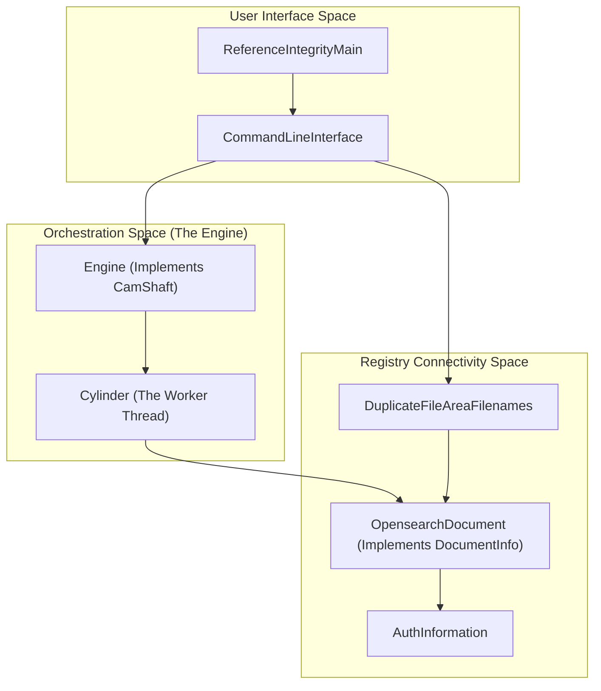
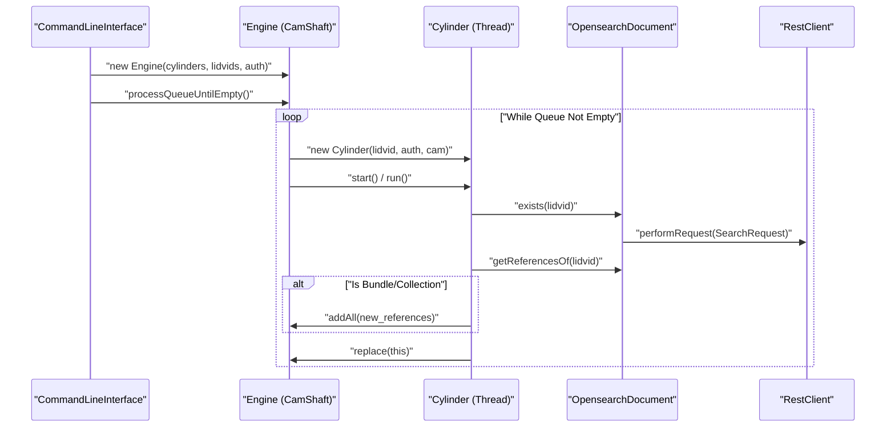

# Page: Registry-Based Referential Integrity (ri subsystem)

# Registry-Based Referential Integrity (ri subsystem)

Relevant source files

The following files were used as context for generating this wiki page:

- [src/main/java/gov/nasa/pds/tools/validate/rule/pds4/FindUnreferencedFiles.java](src/main/java/gov/nasa/pds/tools/validate/rule/pds4/FindUnreferencedFiles.java)
- [src/main/java/gov/nasa/pds/validate/ReferenceIntegrityMain.java](src/main/java/gov/nasa/pds/validate/ReferenceIntegrityMain.java)
- [src/main/java/gov/nasa/pds/validate/ri/AuthInformation.java](src/main/java/gov/nasa/pds/validate/ri/AuthInformation.java)
- [src/main/java/gov/nasa/pds/validate/ri/CamShaft.java](src/main/java/gov/nasa/pds/validate/ri/CamShaft.java)
- [src/main/java/gov/nasa/pds/validate/ri/CommandLineInterface.java](src/main/java/gov/nasa/pds/validate/ri/CommandLineInterface.java)
- [src/main/java/gov/nasa/pds/validate/ri/CountingAppender.java](src/main/java/gov/nasa/pds/validate/ri/CountingAppender.java)
- [src/main/java/gov/nasa/pds/validate/ri/Cylinder.java](src/main/java/gov/nasa/pds/validate/ri/Cylinder.java)
- [src/main/java/gov/nasa/pds/validate/ri/DocumentInfo.java](src/main/java/gov/nasa/pds/validate/ri/DocumentInfo.java)
- [src/main/java/gov/nasa/pds/validate/ri/DuplicateFileAreaFilenames.java](src/main/java/gov/nasa/pds/validate/ri/DuplicateFileAreaFilenames.java)
- [src/main/java/gov/nasa/pds/validate/ri/Engine.java](src/main/java/gov/nasa/pds/validate/ri/Engine.java)
- [src/main/java/gov/nasa/pds/validate/ri/LidvidComparator.java](src/main/java/gov/nasa/pds/validate/ri/LidvidComparator.java)
- [src/main/java/gov/nasa/pds/validate/ri/OpensearchDocument.java](src/main/java/gov/nasa/pds/validate/ri/OpensearchDocument.java)
- [src/test/java/gov/nasa/pds/validate/ri/CliExecutioner.java](src/test/java/gov/nasa/pds/validate/ri/CliExecutioner.java)

The `ri` (Referential Integrity) subsystem is a specialized component of the PDS Validate tool, often invoked via the `validate-refs` entry point [src/main/java/gov/nasa/pds/validate/ReferenceIntegrityMain.java:11-23](). Its primary purpose is to verify that Logical Identifier Versions (LIDVIDs) and Logical Identifiers (LIDs) referenced within PDS4 products actually exist in a live NASA PDS Registry [src/main/java/gov/nasa/pds/validate/ri/CommandLineInterface.java:52-59]().

Unlike the core validation engine which focuses on local file system integrity, the `ri` subsystem performs network-based validation against an OpenSearch-backed Registry to ensure that aggregate products (Bundles and Collections) correctly link to their constituent members and that cross-product references are resolvable [src/main/java/gov/nasa/pds/validate/ri/OpensearchDocument.java:21-45]().

### System Overview and Code Mapping

The following diagram maps the high-level functional concepts to the specific classes within the `gov.nasa.pds.validate.ri` package.

**Subsystem Component Mapping**

Sources: [src/main/java/gov/nasa/pds/validate/ReferenceIntegrityMain.java:10-24](), [src/main/java/gov/nasa/pds/validate/ri/CommandLineInterface.java:21-49](), [src/main/java/gov/nasa/pds/validate/ri/Engine.java:10-23](), [src/main/java/gov/nasa/pds/validate/ri/OpensearchDocument.java:12-20]().

### Functional Flow and Interaction

The diagram below illustrates how a LIDVID provided via the CLI is processed through the multi-threaded engine and resolved against the OpenSearch backend.

**Reference Validation Flow**

Sources: [src/main/java/gov/nasa/pds/validate/ri/Engine.java:52-98](), [src/main/java/gov/nasa/pds/validate/ri/Cylinder.java:35-60](), [src/main/java/gov/nasa/pds/validate/ri/OpensearchDocument.java:80-116]().

---

### Key Capabilities

The subsystem provides three core functions for ensuring the integrity of the PDS Registry:

1.  **Reference Resolution**: Verifies that a given LIDVID exists in the Registry and retrieves all its internal references [src/main/java/gov/nasa/pds/validate/ri/OpensearchDocument.java:79-116]().
2.  **Recursive Crawling**: If a validated product is a `Product_Bundle` or `Product_Collection`, the engine automatically extracts its members and adds them to the processing queue [src/main/java/gov/nasa/pds/validate/ri/Cylinder.java:21-29](), [src/main/java/gov/nasa/pds/validate/ri/Cylinder.java:55-56]().
3.  **Duplicate Detection**: Scans the Registry for duplicate file references where different LIDs might be pointing to the same physical file area [src/main/java/gov/nasa/pds/validate/ri/DuplicateFileAreaFilenames.java:42-60]().

---

### Engine and Multi-threaded Processing

The `ri` subsystem uses an automotive-inspired multi-threading architecture to handle large volumes of Registry queries. The `Engine` class manages a queue of LIDVIDs and coordinates `Cylinder` workers.

*   **Engine**: Acts as the central controller (implementing `CamShaft`), maintaining the global queue and tracking the total number of "broken" (missing) references [src/main/java/gov/nasa/pds/validate/ri/Engine.java:10-16]().
*   **Cylinder**: A `Runnable` worker that processes a single LIDVID, queries the registry, and reports missing references to a dedicated `Reference Integrity` logger [src/main/java/gov/nasa/pds/validate/ri/Cylinder.java:7-13](), [src/main/java/gov/nasa/pds/validate/ri/Cylinder.java:35-60]().

For a deep dive into the threading model and queue management, see **[Engine and Multi-threaded Processing](#4.1)**.

Sources: [src/main/java/gov/nasa/pds/validate/ri/Engine.java:10-50](), [src/main/java/gov/nasa/pds/validate/ri/Cylinder.java:7-61]().

---

### OpenSearch Registry Connectivity

Connectivity is handled through the `registry-common` library, wrapped by `AuthInformation` and `OpensearchDocument`.

*   **Registry Connection**: The system supports direct OpenSearch DB access via credential files and URL-based registry connection definitions [src/main/java/gov/nasa/pds/validate/ri/CommandLineInterface.java:34-43]().
*   **Document Resolution**: `OpensearchDocument` performs term queries against the `lid` or `lidvid` fields. If multiple versions exist for a LID, it uses the `LidvidComparator` to identify the latest version [src/main/java/gov/nasa/pds/validate/ri/OpensearchDocument.java:21-45]().
*   **Reference Extraction**: It dynamically identifies references based on product type, querying the `-refs` index for collections or parsing `ref_lid_` fields for other products [src/main/java/gov/nasa/pds/validate/ri/OpensearchDocument.java:95-116]().

For details on query construction and authentication, see **[OpenSearch Registry Connectivity](#4.2)**.

Sources: [src/main/java/gov/nasa/pds/validate/ri/AuthInformation.java:8-45](), [src/main/java/gov/nasa/pds/validate/ri/OpensearchDocument.java:12-117](), [src/main/java/gov/nasa/pds/validate/ri/LidvidComparator.java:7-20]().

---

### Usage Summary

The subsystem is executed via the `CommandLineInterface`. It accepts LIDVIDs, local label file paths, or manifest files as starting points for the validation crawl [src/main/java/gov/nasa/pds/validate/ri/CommandLineInterface.java:51-67]().

| Argument | Description |
| :--- | :--- |
| `-r`, `--registry-connection` | URL to the registry connection information (e.g., `app://connection/direct/localhost.xml`) [src/main/java/gov/nasa/pds/validate/ri/CommandLineInterface.java:41-43]() |
| `-a`, `--auth-opensearch` | File containing `user` and `password` for OpenSearch access [src/main/java/gov/nasa/pds/validate/ri/CommandLineInterface.java:34-36]() |
| `-t`, `--threads` | Maximum number of parallel worker threads (`Cylinders`) [src/main/java/gov/nasa/pds/validate/ri/CommandLineInterface.java:44-46]() |
| `-o`, `--override-index-name` | Override the default `registry` index name [src/main/java/gov/nasa/pds/validate/ri/CommandLineInterface.java:39-40]() |

Sources: [src/main/java/gov/nasa/pds/validate/ri/CommandLineInterface.java:27-49]().
