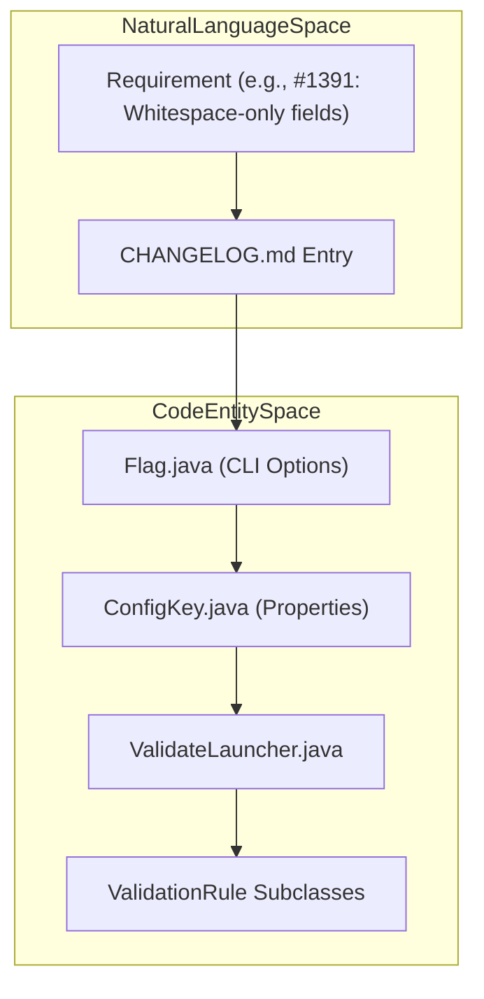
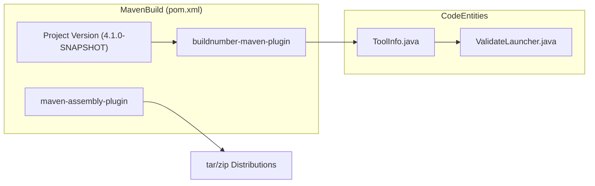

# Page: Release History and Requirements

# Release History and Requirements

Relevant source files

The following files were used as context for generating this wiki page:

- [.github/CODEOWNERS](.github/CODEOWNERS)
- [.gitignore](.gitignore)
- [CHANGELOG.md](CHANGELOG.md)
- [LICENSE.md](LICENSE.md)
- [NOTICE.txt](NOTICE.txt)
- [README.md](README.md)
- [SECURITY.md](SECURITY.md)
- [pom.xml](pom.xml)
- [src/changes/changes.xml](src/changes/changes.xml)
- [src/main/java/gov/nasa/pds/tools/validate/content/table/TableContentProblem.java](src/main/java/gov/nasa/pds/tools/validate/content/table/TableContentProblem.java)
- [src/main/java/gov/nasa/pds/tools/validate/rule/pds4/SchemaValidator.java](src/main/java/gov/nasa/pds/tools/validate/rule/pds4/SchemaValidator.java)
- [src/main/java/gov/nasa/pds/tools/validate/rule/pds4/TableFieldDefinitionRule.java](src/main/java/gov/nasa/pds/tools/validate/rule/pds4/TableFieldDefinitionRule.java)
- [src/main/java/gov/nasa/pds/validate/ValidateLauncher.java](src/main/java/gov/nasa/pds/validate/ValidateLauncher.java)
- [src/main/java/gov/nasa/pds/validate/Validator.java](src/main/java/gov/nasa/pds/validate/Validator.java)
- [src/main/java/gov/nasa/pds/validate/ValidatorFactory.java](src/main/java/gov/nasa/pds/validate/ValidatorFactory.java)
- [src/main/java/gov/nasa/pds/validate/commandline/options/ConfigKey.java](src/main/java/gov/nasa/pds/validate/commandline/options/ConfigKey.java)
- [src/main/java/gov/nasa/pds/validate/commandline/options/Flag.java](src/main/java/gov/nasa/pds/validate/commandline/options/Flag.java)
- [src/main/java/gov/nasa/pds/validate/commandline/options/FlagOptions.java](src/main/java/gov/nasa/pds/validate/commandline/options/FlagOptions.java)
- [src/main/java/gov/nasa/pds/validate/util/Utility.java](src/main/java/gov/nasa/pds/validate/util/Utility.java)
- [src/main/resources/bin/logging.properties](src/main/resources/bin/logging.properties)
- [src/main/resources/bin/validate-bundle](src/main/resources/bin/validate-bundle)
- [src/main/resources/validation-commands.xml](src/main/resources/validation-commands.xml)
- [src/site/site.xml](src/site/site.xml)

This page details the evolution of the NASA PDS Validate tool, tracing its development from the v2.x series through the current v4.x architecture. It provides a technical overview of how requirements are versioned and managed within the codebase, as well as the significant milestones recorded in the system's release history.

## Requirements Management

The Validate tool's requirements are maintained as versioned documents that drive the development of validation rules and engine capabilities. These requirements are reflected in the codebase through specific validation rules and CLI flags that implement PDS4 standards compliance.

### Implementation of Requirements in Code
Requirements often translate directly into `ValidationRule` implementations or configuration keys defined in the `ConfigKey` class [src/main/java/gov/nasa/pds/validate/commandline/options/ConfigKey.java:44-170](). For example, requirements for referential integrity led to the implementation of the `ri` subsystem and specific bundle/collection rules. Recent requirements include support for whitespace-only numeric fields in delimited tables (CCB-28) [CHANGELOG.md:53-53](), reporting empty (blank) PDS4 labels [CHANGELOG.md:56-56](), and adding new encoding types for Product Native [CHANGELOG.md:10-11]().

### Data Flow: Requirements to Enforcement
The following diagram illustrates how natural language requirements (as seen in the `CHANGELOG.md`) are bridged into the technical execution space of the tool.

**Requirement Implementation Lifecycle**

Sources: [CHANGELOG.md:51-56](), [src/main/java/gov/nasa/pds/validate/commandline/options/Flag.java:39-145](), [src/main/java/gov/nasa/pds/validate/commandline/options/ConfigKey.java:44-170](), [src/main/java/gov/nasa/pds/validate/ValidateLauncher.java:134-200]()

---

## Release History

The release history is tracked primarily through `CHANGELOG.md` and the legacy `src/changes/changes.xml`. The tool has transitioned through several major versions, each introducing core architectural shifts.

### Version Evolution Summary

| Version | Focus | Key Features |
| :--- | :--- | :--- |
| **v2.x** | Core Engine | Establishment of the `ValidationRuleManager` and basic PDS4 label validation. |
| **v3.x** | Performance | Introduction of `validate-bundle` for parallel processing [src/main/resources/bin/validate-bundle:1-30]() and enhanced content validation. |
| **v4.x** | Modernization | Migration to **Java 17** [pom.xml:184-189](), integration of OpenSearch-based referential integrity, and improved reporting [CHANGELOG.md:31-37](). |

### Versioning and Build Configuration
The system versioning is managed via Maven in the `pom.xml` [pom.xml:12-13](). The build process utilizes the `buildnumber-maven-plugin` to generate timestamps for every release [pom.xml:113-123]().

**Build and Versioning Flow**

Sources: [pom.xml:12-13](), [pom.xml:113-133](), [pom.xml:134-153](), [src/main/java/gov/nasa/pds/validate/ValidateLauncher.java:124-125]()

---

## Significant Milestones (v3.x - v4.x)

### Version 4.x Series
The v4.x series represents the current stable line, focusing on modern infrastructure and high-performance validation.
*   **Java 17 Upgrade:** Transitioned the entire codebase to Java 17 for improved performance and long-term support [pom.xml:186-187](), [CHANGELOG.md:37-37]().
*   **Enhanced Reporting:** Added `lidvid` inclusion in all reports and improved JSON report stability [CHANGELOG.md:54-54](), [CHANGELOG.md:60-60]().
*   **Command Logging:** Added the ability to see the exact `validate` command used in the log output [CHANGELOG.md:55-55]().
*   **Schematron Caching:** Implemented caching for schematron transformers in `SchematronTransformer` to significantly speed up bundle validation [CHANGELOG.md:9-9]().
*   **Parallelization:** Refinement of the `validate-bundle` script which uses GNU Parallel to distribute validation tasks across multiple CPU cores [src/main/resources/bin/validate-bundle:154-165]().

### Version 3.x Series
*   **Content Validation:** Significant improvements to `Table_Character` and `Array` validation, including the ability to skip every Nth record via `EveryNCounter` for large datasets [src/changes/changes.xml:43-45](), [src/main/java/gov/nasa/pds/tools/util/EveryNCounter.java:31-31]().
*   **Context Product Validation:** Introduction of automated checks against registered context products using JSON-based registries [src/changes/changes.xml:55-57]().
*   **Referential Integrity:** Added checks to ensure product LIDs correctly branch from collection LIDs, and collections from bundles [src/changes/changes.xml:49-51]().
*   **Large File Handling:** Addressed issues with validating large data files (up to 150GB) by managing local temp space more efficiently [CHANGELOG.md:24-24]().

---

## Dependency Evolution

The tool relies on several core PDS libraries and third-party utilities. The `pom.xml` tracks these requirements over time.

| Dependency | Purpose | Version (v4.x) |
| :--- | :--- | :--- |
| `pds3-product-tools` | Legacy PDS3 support | 4.4.2 [pom.xml:42]() |
| `verapdf` | PDF/A compliance validation | 1.28.2 [pom.xml:203]() |
| `commons-cli` | Command-line argument parsing | 1.9.0 [pom.xml:230]() |
| `maven-surefire-plugin` | Test execution | 3.5.5 [pom.xml:89]() |

### System Requirements
*   **Runtime:** Java 17 or higher [pom.xml:184-189]().
*   **External Tools:** GNU Parallel (required for `validate-bundle` parallel execution) [src/main/resources/bin/validate-bundle:139-151]().
*   **Logging Configuration:** The tool uses `logging.properties` to manage log levels and suppress specific known issues, such as JAXB warnings [src/main/resources/bin/logging.properties:1-6]().

Sources: [pom.xml:1-230](), [CHANGELOG.md:1-72](), [src/changes/changes.xml:42-123](), [src/main/resources/bin/validate-bundle:1-183](), [src/main/resources/bin/logging.properties:1-6]()
