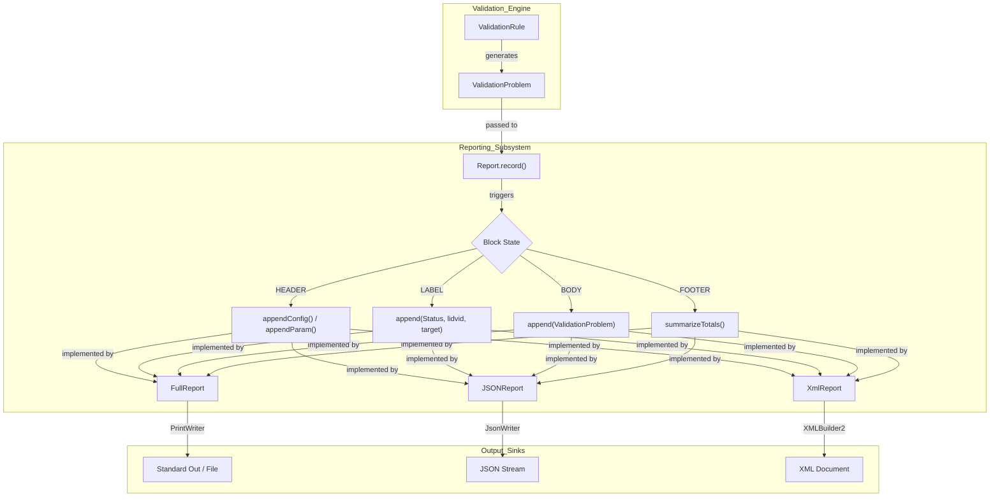
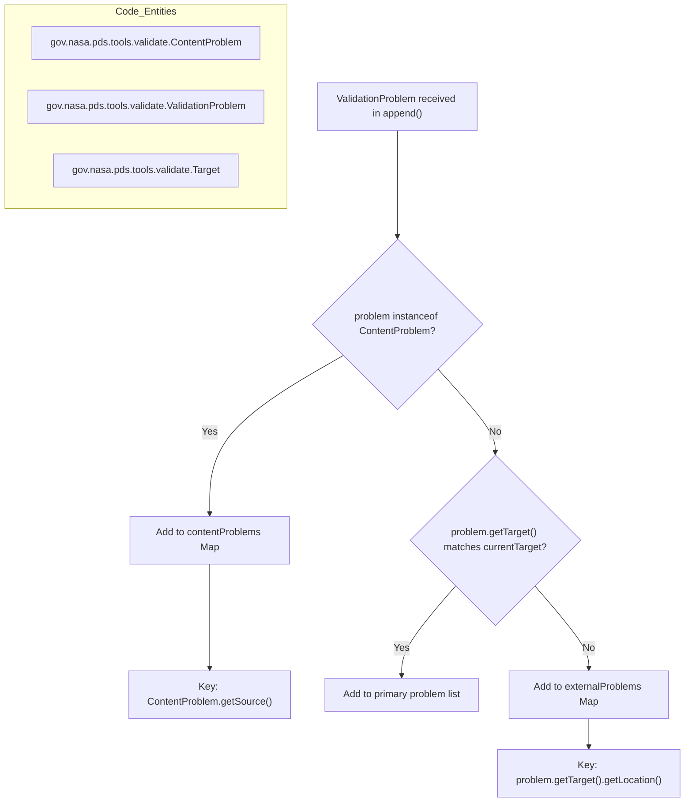

# Page: Report Formats (Full, JSON, XML)

# Report Formats (Full, JSON, XML)

Relevant source files

The following files were used as context for generating this wiki page:

- [src/main/java/gov/nasa/pds/validate/report/FullReport.java](src/main/java/gov/nasa/pds/validate/report/FullReport.java)
- [src/main/java/gov/nasa/pds/validate/report/JSONReport.java](src/main/java/gov/nasa/pds/validate/report/JSONReport.java)
- [src/main/java/gov/nasa/pds/validate/report/Report.java](src/main/java/gov/nasa/pds/validate/report/Report.java)
- [src/main/java/gov/nasa/pds/validate/report/XmlReport.java](src/main/java/gov/nasa/pds/validate/report/XmlReport.java)
- [src/test/java/gov/nasa/pds/validate/report/JSONReportTest.java](src/test/java/gov/nasa/pds/validate/report/JSONReportTest.java)

The Validate Tool provides a reporting framework that supports three distinct output formats: a human-readable plain text format (`FullReport`), a machine-parseable `JSONReport`, and a structured `XmlReport`. These reports aggregate results from various validation rules, including label validation, referential integrity, and data content checks.

## Report Infrastructure and Lifecycle

All report implementations extend the abstract `Report` class [src/main/java/gov/nasa/pds/validate/report/Report.java:31-31](). The reporting process follows a state machine lifecycle defined by the `Block` enum: `HEADER`, `BODY`, `LABEL`, and `FOOTER` [src/main/java/gov/nasa/pds/validate/report/Report.java:38-38]().

### State Machine Lifecycle

The `Report` class manages the high-level orchestration of the report generation through the following sequence:

1.  **`printHeader()`**: Transitions to `Block.HEADER`. Appends tool configuration and parameters [src/main/java/gov/nasa/pds/validate/report/Report.java:140-151]().
2.  **`record(URI, List<ValidationProblem>)`**: The primary entry point for logging results. It manages transitions for the `Block.BODY` and individual `Block.LABEL` entries [src/main/java/gov/nasa/pds/validate/report/Report.java:159-161]().
3.  **`printFooter()`**: Transitions to `Block.FOOTER`. Generates summaries for total products, integrity checks, and a breakdown of message types via `summarizeTotals`, `summarizeProds`, and `summarizeRefs` [src/main/java/gov/nasa/pds/validate/report/Report.java:123-139]().

### Problem Routing and State Isolation

To maintain clear reporting when a single label refers to multiple external files (e.g., data files or fragments), the system performs problem routing. Problems are categorized and stored in specialized maps to isolate errors related to the primary label from those in its dependencies.

*   **Content Problems**: Routed to `contentProblems` maps if the problem is an instance of `ContentProblem` [src/main/java/gov/nasa/pds/validate/report/JSONReport.java:137-144]().
*   **External/Fragment Problems**: Routed to `externalProblems` if the problem target location does not match the current primary target [src/main/java/gov/nasa/pds/validate/report/JSONReport.java:148-156]().
*   **State Reset**: At the start of each new label validation, the `begin(Block.LABEL)` method clears these temporary maps to ensure state isolation between different products [src/main/java/gov/nasa/pds/validate/report/FullReport.java:154-160](). This isolation prevents "cross-contamination" where errors from one product appear in the report for a subsequent product, a behavior verified in regression testing for issue #1408 [src/test/java/gov/nasa/pds/validate/report/JSONReportTest.java:68-122]().

### Report Implementation Overview

| Format | Implementation Class | Technology Used | Primary Use Case |
| :--- | :--- | :--- | :--- |
| **Full** | `FullReport` | `PrintWriter` | Human-readable console output and logs [src/main/java/gov/nasa/pds/validate/report/FullReport.java:53-53](). |
| **JSON** | `JSONReport` | `com.google.gson.stream.JsonWriter` | Integration with web dashboards or automated CI/CD pipelines [src/main/java/gov/nasa/pds/validate/report/JSONReport.java:52-52](). |
| **XML** | `XmlReport` | `com.jamesmurty.utils.XMLBuilder2` | Structured archival of validation results and XML-based post-processing [src/main/java/gov/nasa/pds/validate/report/XmlReport.java:46-46](). |

**Sources:** [src/main/java/gov/nasa/pds/validate/report/Report.java:31-151](), [src/main/java/gov/nasa/pds/validate/report/JSONReport.java:52-60](), [src/main/java/gov/nasa/pds/validate/report/XmlReport.java:46-60](), [src/main/java/gov/nasa/pds/validate/report/FullReport.java:53-61](), [src/test/java/gov/nasa/pds/validate/report/JSONReportTest.java:68-122]().

---

## Technical Implementations

### FullReport (Plain Text)
The `FullReport` is the default output format. It uses a `PrintWriter` to stream formatted text directly to the output. It calculates column padding dynamically for configurations and parameters to ensure a clean tabular appearance [src/main/java/gov/nasa/pds/validate/report/FullReport.java:126-135](). It prints the status and target for each label, followed by specific problem details including line and column numbers [src/main/java/gov/nasa/pds/validate/report/FullReport.java:64-103]().

**Sources:** [src/main/java/gov/nasa/pds/validate/report/FullReport.java:64-135]()

### JSONReport (Gson Streaming)
The `JSONReport` utilizes Gson's `JsonWriter` for memory-efficient streaming. It avoids loading the entire report into memory, which is critical for large bundles. It organizes problems into a hierarchy of `otherProblems`, `contentProblems`, and `externalProblems` [src/main/java/gov/nasa/pds/validate/report/JSONReport.java:54-60](). It specifically handles `TableContentProblem` and `ArrayContentProblem` to include specialized metadata like table IDs, records, and fields [src/main/java/gov/nasa/pds/validate/report/JSONReport.java:170-188]().

**Sources:** [src/main/java/gov/nasa/pds/validate/report/JSONReport.java:101-188]()

### XmlReport (XMLBuilder2)
The `XmlReport` uses the `XMLBuilder2` library to construct a DOM-like structure. It escapes XML special characters in problem messages using `StringEscapeUtils.escapeXml` [src/main/java/gov/nasa/pds/validate/report/XmlReport.java:128-128](). The structure is divided into `configuration`, `parameters`, `label` (containing `dataContents`, `fragments`, and `messages`), and a `summary` section [src/main/java/gov/nasa/pds/validate/report/XmlReport.java:63-157]().

**Sources:** [src/main/java/gov/nasa/pds/validate/report/XmlReport.java:63-157]()

---

## Data Flow and Class Interactions

The following diagram illustrates how the `Report` abstract class interacts with its concrete implementations and how data flows from a `ValidationProblem` to the final output.

### Report Data Flow
The "Validation Engine" generates `ValidationProblem` objects which are passed to the `Report` via the `record()` method.

**Sources:** [src/main/java/gov/nasa/pds/validate/report/Report.java:31-50](), [src/main/java/gov/nasa/pds/validate/report/Report.java:159-161](), [src/main/java/gov/nasa/pds/validate/report/JSONReport.java:72-123]().

---

## Problem Routing Logic

When `append(ValidationProblem problem)` is called, the report implementation must decide where to store the problem based on its type and source. This ensures that errors in a data file are associated with that specific file rather than the metadata label.

### Logic Flow for Problem Routing
This diagram maps the natural language logic of "Where does this error belong?" to the specific code entities and class types.

**Sources:** [src/main/java/gov/nasa/pds/validate/report/JSONReport.java:137-157](), [src/main/java/gov/nasa/pds/validate/report/FullReport.java:104-122](), [src/main/java/gov/nasa/pds/validate/report/XmlReport.java:78-97]().
