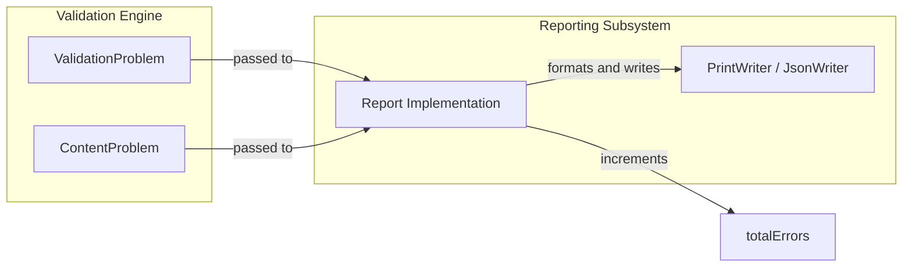

# Page: Reporting

# Reporting

<details>
<summary>Relevant source files</summary>

The following files were used as context for generating this wiki page:

- [src/main/java/gov/nasa/pds/validate/report/FullReport.java](src/main/java/gov/nasa/pds/validate/report/FullReport.java)
- [src/main/java/gov/nasa/pds/validate/report/JSONReport.java](src/main/java/gov/nasa/pds/validate/report/JSONReport.java)
- [src/main/java/gov/nasa/pds/validate/report/Report.java](src/main/java/gov/nasa/pds/validate/report/Report.java)
- [src/main/java/gov/nasa/pds/validate/report/XmlReport.java](src/main/java/gov/nasa/pds/validate/report/XmlReport.java)
- [src/test/java/gov/nasa/pds/validate/report/JSONReportTest.java](src/test/java/gov/nasa/pds/validate/report/JSONReportTest.java)

</details>


The reporting framework in the PDS Validate tool provides a structured mechanism for capturing, aggregating, and outputting validation results. It is designed around a visitor-like pattern that decouples the core validation logic from the specific output format, allowing the tool to generate human-readable text, machine-readable JSON, or structured XML.

## Reporting Architecture

The framework is centered on the `Report` abstract class, which defines the lifecycle and state transitions of a validation report [src/main/java/gov/nasa/pds/validate/report/Report.java:31-31](). A report typically follows a sequence of `HEADER`, `BODY`, and `FOOTER` blocks [src/main/java/gov/nasa/pds/validate/report/Report.java:38-38](). Within the `BODY`, the tool records results for individual targets (labels) using the `record()` method [src/main/java/gov/nasa/pds/validate/report/Report.java:159-165]().

### System Entity Mapping

The following diagram maps the logical reporting components to their respective classes and data structures within the codebase.

**Diagram: Reporting Subsystem Entities**
```mermaid
graph TD
    subgraph "Natural Language Space"
        R["Validation Report"]
        S["Summary Totals"]
        P["Problem Details"]
        F["Output Formats"]
    end

    subgraph "Code Entity Space"
        direction TB
        Report["class Report"]
        ValidationProblem["class ValidationProblem"]
        Status["enum Status"]
        ContentProblem["class ContentProblem"]
        TableContentProblem["class TableContentProblem"]
        ArrayContentProblem["class ArrayContentProblem"]
        
        Report -->|contains| Tuple["class Tuple"]
        Report -->|manages| Status
        Report -->|records| ValidationProblem
        ValidationProblem <|-- ContentProblem
        ContentProblem <|-- TableContentProblem
        ContentProblem <|-- ArrayContentProblem
        
        Report <|-- FullReport["class FullReport (Plain Text)"]
        Report <|-- JSONReport["class JSONReport (GSON)"]
        Report <|-- XmlReport["class XmlReport (XMLBuilder2)"]
    end

    R --- Report
    S --- Report
    P --- ValidationProblem
    F --- FullReport
    F --- JSONReport
    F --- XmlReport
```
Sources: [src/main/java/gov/nasa/pds/validate/report/Report.java:31-59](), [src/main/java/gov/nasa/pds/validate/report/FullReport.java:53-53](), [src/main/java/gov/nasa/pds/validate/report/JSONReport.java:52-52](), [src/main/java/gov/nasa/pds/validate/report/XmlReport.java:46-46](), [src/main/java/gov/nasa/pds/validate/report/JSONReport.java:137-144](), [src/main/java/gov/nasa/pds/validate/report/XmlReport.java:101-120]().

## Core Reporting Lifecycle

The `Report` class manages global counters for errors, warnings, and product statuses (Passed, Failed, Skipped) [src/main/java/gov/nasa/pds/validate/report/Report.java:74-83](). Concrete implementations must handle the state transitions defined by the `Block` enum:

| Block | Purpose | Key Methods Called |
| :--- | :--- | :--- |
| `HEADER` | Initializes the report and logs configuration/parameters. | `printHeader()`, `appendConfig()`, `appendParam()` |
| `BODY` | The main container for validation results. | `startBody()`, `record()` |
| `LABEL` | A sub-section within the body for a specific file/target. | `begin(Block.LABEL)`, `end(Block.LABEL)` |
| `FOOTER` | Finalizes counters and prints the summary. | `printFooter()`, `summarizeTotals()`, `summarizeProds()` |

Sources: [src/main/java/gov/nasa/pds/validate/report/Report.java:38-51](), [src/main/java/gov/nasa/pds/validate/report/Report.java:123-151]().

## Output Formats

The tool supports three primary output formats, each implemented as a subclass of `Report`. These formats handle problem routing differently, especially regarding "external" problems (errors in files referenced by a label) versus "content" problems (data integrity issues).

*   **Full Report**: A human-readable plain text format. It groups messages by file and provides a summary of all problem types at the end [src/main/java/gov/nasa/pds/validate/report/FullReport.java:46-53]().
*   **JSON Report**: Uses GSON `JsonWriter` streaming to produce machine-interoperable output [src/main/java/gov/nasa/pds/validate/report/JSONReport.java:39-60](). It maintains strict state isolation to ensure that errors from one product do not bleed into the results of the next, addressing historical issues with duplicate messages [src/test/java/gov/nasa/pds/validate/report/JSONReportTest.java:68-122]().
*   **XML Report**: Utilizes `XMLBuilder2` to generate a structured XML document. It organizes results into `label`, `dataContents`, and `fragments` elements [src/main/java/gov/nasa/pds/validate/report/XmlReport.java:46-69]().

For detailed implementation specifics, see [Report Formats (Full, JSON, XML)](#5.1).

## Schema Validation and Error Handling

Reporting is closely integrated with the XML validation subsystem. The validation engine identifies issues and encapsulates them in `ValidationProblem` objects [src/main/java/gov/nasa/pds/validate/report/Report.java:159-165](). Specialized subclasses like `TableContentProblem` and `ArrayContentProblem` carry additional metadata such as record numbers, table IDs, or array indices [src/main/java/gov/nasa/pds/validate/report/JSONReport.java:170-188]().

The `Report` class acts as the final destination for these problems, routing them to appropriate sections based on whether they belong to the primary target or an external fragment [src/main/java/gov/nasa/pds/validate/report/FullReport.java:104-122]().

**Diagram: Error Routing from Engine to Report**

Sources: [src/main/java/gov/nasa/pds/validate/report/Report.java:159-165](), [src/main/java/gov/nasa/pds/validate/report/FullReport.java:87-123](), [src/main/java/gov/nasa/pds/validate/report/JSONReport.java:125-157]().

For details on schema resolution and error conversion, see [Schema Validation and ValidatorFactory](#5.2).
