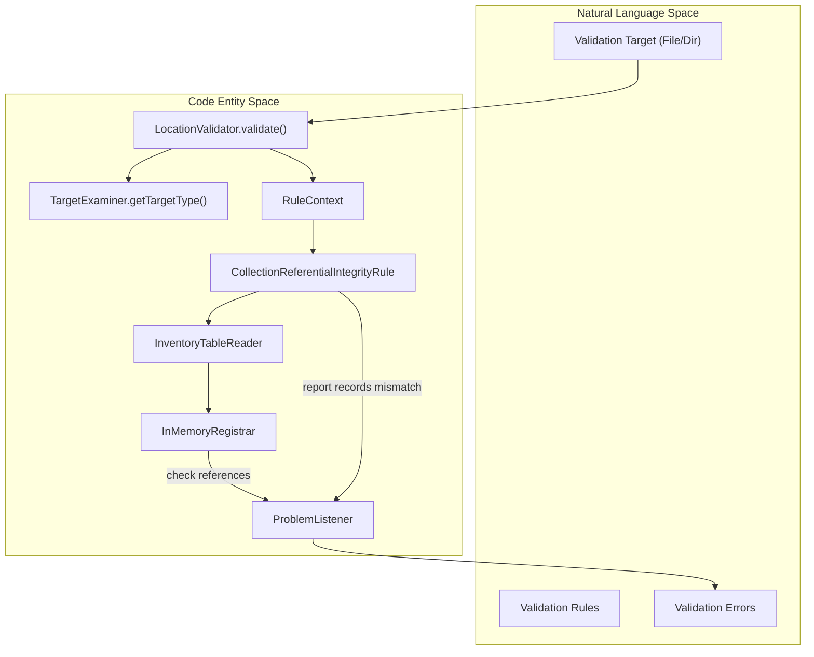
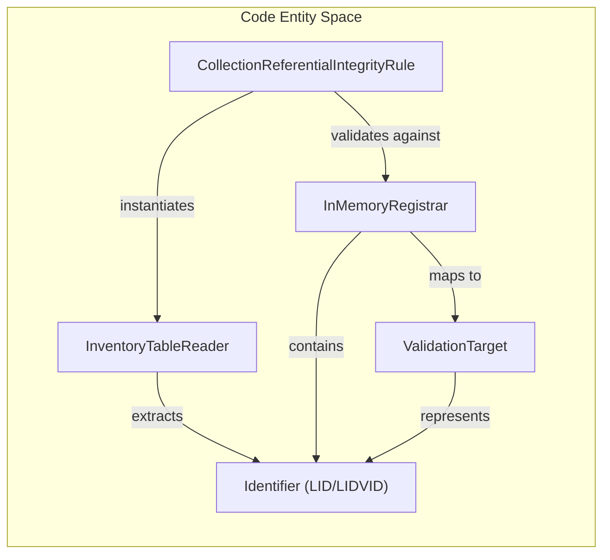

# Page: Rule Engine and Validation Pipeline

# Rule Engine and Validation Pipeline

Relevant source files

The following files were used as context for generating this wiki page:

- [.github/CODEOWNERS](.github/CODEOWNERS)
- [.gitignore](.gitignore)
- [LICENSE.md](LICENSE.md)
- [NOTICE.txt](NOTICE.txt)
- [README.md](README.md)
- [SECURITY.md](SECURITY.md)
- [src/main/java/gov/nasa/pds/tools/validate/AdditionalTarget.java](src/main/java/gov/nasa/pds/tools/validate/AdditionalTarget.java)
- [src/main/java/gov/nasa/pds/tools/validate/InMemoryRegistrar.java](src/main/java/gov/nasa/pds/tools/validate/InMemoryRegistrar.java)
- [src/main/java/gov/nasa/pds/tools/validate/TargetRegistrar.java](src/main/java/gov/nasa/pds/tools/validate/TargetRegistrar.java)
- [src/main/java/gov/nasa/pds/tools/validate/content/table/TableContentProblem.java](src/main/java/gov/nasa/pds/tools/validate/content/table/TableContentProblem.java)
- [src/main/java/gov/nasa/pds/tools/validate/rule/AbstractValidationRule.java](src/main/java/gov/nasa/pds/tools/validate/rule/AbstractValidationRule.java)
- [src/main/java/gov/nasa/pds/tools/validate/rule/pds4/BundleReferentialIntegrityRule.java](src/main/java/gov/nasa/pds/tools/validate/rule/pds4/BundleReferentialIntegrityRule.java)
- [src/main/java/gov/nasa/pds/tools/validate/rule/pds4/CollectionInBundleRule.java](src/main/java/gov/nasa/pds/tools/validate/rule/pds4/CollectionInBundleRule.java)
- [src/main/java/gov/nasa/pds/tools/validate/rule/pds4/CollectionReferentialIntegrityRule.java](src/main/java/gov/nasa/pds/tools/validate/rule/pds4/CollectionReferentialIntegrityRule.java)
- [src/main/java/gov/nasa/pds/tools/validate/rule/pds4/DirectoryValidationRule.java](src/main/java/gov/nasa/pds/tools/validate/rule/pds4/DirectoryValidationRule.java)
- [src/main/java/gov/nasa/pds/tools/validate/rule/pds4/LabelValidationChain.java](src/main/java/gov/nasa/pds/tools/validate/rule/pds4/LabelValidationChain.java)
- [src/main/java/gov/nasa/pds/tools/validate/rule/pds4/RegisterLabelIdentifiers.java](src/main/java/gov/nasa/pds/tools/validate/rule/pds4/RegisterLabelIdentifiers.java)
- [src/main/java/gov/nasa/pds/tools/validate/rule/pds4/SubDirectoryRule.java](src/main/java/gov/nasa/pds/tools/validate/rule/pds4/SubDirectoryRule.java)
- [src/main/java/gov/nasa/pds/tools/validate/rule/pds4/TableFieldDefinitionRule.java](src/main/java/gov/nasa/pds/tools/validate/rule/pds4/TableFieldDefinitionRule.java)
- [src/main/java/gov/nasa/pds/tools/validate/task/ValidationTask.java](src/main/java/gov/nasa/pds/tools/validate/task/ValidationTask.java)
- [src/main/resources/validation-commands.xml](src/main/resources/validation-commands.xml)
- [src/site/site.xml](src/site/site.xml)
- [src/test/resources/github51/valid/bundle_kaguya_derived.xml](src/test/resources/github51/valid/bundle_kaguya_derived.xml)

The Validate tool utilizes a rule-based engine built on the **Chain of Responsibility** pattern to orchestrate the validation of PDS4 products and PDS3 volumes. The pipeline is driven by an external configuration file, `validation-commands.xml`, which defines the sequence of rules (commands) and chains applied to a given validation target.

## Validation Lifecycle and Rule Orchestration

The validation process begins with a target URL (file or directory) and moves through discovery, rule selection, and execution. The `LocationValidator` acts as the primary entry point for this lifecycle, initializing the rule manager and executing the appropriate rule for a given target.

### Pipeline Execution Flow

1.  **Initialization**: `LocationValidator` loads `validation-commands.xml` using an Apache Commons Chain `ConfigParser` [src/main/java/gov/nasa/pds/tools/label/LocationValidator.java:120-138](). It initializes the `ValidationRuleManager` using the parsed catalog [src/main/java/gov/nasa/pds/tools/label/LocationValidator.java:139-141]().
2.  **Target Acquisition**: The tool receives a target URL and uses `TargetExaminer` to determine if the target matches a specific product type, such as a Bundle, Collection, or Document [src/main/java/gov/nasa/pds/tools/label/LocationValidator.java:180-184]().
3.  **Rule Selection**: Based on the target type, the `ValidationRuleManager` retrieves the starting rule from the catalog. If no specific rule is provided, it defaults to `pds4.bundle`, `pds4.collection`, or `pds4.label` based on detection [src/main/java/gov/nasa/pds/tools/label/LocationValidator.java:191-205]().
4.  **Rule Execution**: The selected `ValidationRule` is executed within a `ValidationTask` handled by a `TaskManager` [src/main/java/gov/nasa/pds/tools/label/LocationValidator.java:214-222](). Rules can spawn sub-tasks or recursively call other rules via `getChildContext()` [src/main/java/gov/nasa/pds/tools/validate/rule/AbstractValidationRule.java:101-131]().
5.  **Result Recording**: Throughout execution, rules report findings to a `ProblemListener`. The `AbstractValidationRule` provides `reportError()` methods that wrap results into `ValidationProblem` objects [src/main/java/gov/nasa/pds/tools/validate/rule/AbstractValidationRule.java:181-186]().

### Natural Language to Code Entity Mapping: Pipeline Lifecycle

| Concept | Code Entity | File Path |
| :--- | :--- | :--- |
| **Configuration** | `validation-commands.xml` | [src/main/resources/validation-commands.xml:1-58]() |
| **Engine Orchestrator** | `LocationValidator` | [src/main/java/gov/nasa/pds/tools/label/LocationValidator.java:64-76]() |
| **Type Detection** | `TargetExaminer` | [src/main/java/gov/nasa/pds/tools/validate/TargetExaminer.java:45-46]() |
| **Context Container** | `RuleContext` | [src/main/java/gov/nasa/pds/tools/validate/rule/RuleContext.java:34-35]() |
| **State Registrar** | `InMemoryRegistrar` | [src/main/java/gov/nasa/pds/tools/validate/InMemoryRegistrar.java:27-38]() |

**Sources:** [src/main/java/gov/nasa/pds/tools/label/LocationValidator.java:112-225](), [src/main/java/gov/nasa/pds/tools/validate/rule/AbstractValidationRule.java:181-186](), [src/main/resources/validation-commands.xml:1-58]()

## Rule Engine Components

### AbstractValidationRule
All validation rules extend `AbstractValidationRule`. This base class provides the infrastructure for the chain-of-responsibility pattern, including access to the `RuleContext` and `TargetRegistrar` [src/main/java/gov/nasa/pds/tools/validate/rule/AbstractValidationRule.java:38-50]().

Key features include:
*   **Applicability**: The `isApplicable(String location)` method determines if a rule should run on a specific target (e.g., checking if the target is a directory) [src/main/java/gov/nasa/pds/tools/validate/rule/pds4/CollectionReferentialIntegrityRule.java:64-69]().
*   **Test Discovery**: Methods annotated with `@ValidationTest` are automatically invoked via reflection during the rule's execution phase [src/main/java/gov/nasa/pds/tools/validate/rule/AbstractValidationRule.java:61-78]().
*   **Child Contexts**: Rules can create a `getChildContext(URL child)` to pass state down to nested validation targets [src/main/java/gov/nasa/pds/tools/validate/rule/AbstractValidationRule.java:101-131]().

### RuleContext
The `RuleContext` carries the state of the validation through the chain. It maintains references to the `Crawler`, `ProblemListener`, and validation flags such as `checkData` or `spotCheckData` [src/main/java/gov/nasa/pds/tools/validate/rule/RuleContext.java:34-115]().

### TargetRegistrar and InMemoryRegistrar
The `TargetRegistrar` interface defines how the tool tracks discovered targets and their metadata [src/main/java/gov/nasa/pds/tools/validate/TargetRegistrar.java:31-32](). `InMemoryRegistrar` provides the implementation, maintaining maps for targets, collections, bundles, and identifiers (LIDs/LIDVIDs) [src/main/java/gov/nasa/pds/tools/validate/InMemoryRegistrar.java:31-48]().

**Sources:** [src/main/java/gov/nasa/pds/tools/validate/rule/AbstractValidationRule.java:38-131](), [src/main/java/gov/nasa/pds/tools/validate/InMemoryRegistrar.java:27-60](), [src/main/java/gov/nasa/pds/tools/validate/TargetRegistrar.java:31-192]()

## Implementation Detail: PDS4 Product Validation

The validation of a PDS4 product involves a hierarchy of rules starting from high-level container rules down to specific metadata checks.

### Referential Integrity and Registration
The pipeline maintains a global state of identifiers to ensure cross-product consistency.

1.  **Registration**: Rules like `RegisterLabelIdentifiers` use `XMLExtractor` to find the `logical_identifier` and `version_id` of the product, then register it in the `InMemoryRegistrar` [src/main/java/gov/nasa/pds/tools/validate/rule/pds4/RegisterLabelIdentifiers.java:60-75]().
2.  **Inventory Parsing**: `CollectionReferentialIntegrityRule` uses an `InventoryTableReader` to extract member identifiers from collection inventory files [src/main/java/gov/nasa/pds/tools/validate/rule/pds4/CollectionReferentialIntegrityRule.java:116-123]().
3.  **Integrity Checks**: The tool verifies that every member LID referenced in the inventory has a corresponding definition registered in the `InMemoryRegistrar` [src/main/java/gov/nasa/pds/tools/validate/rule/pds4/CollectionReferentialIntegrityRule.java:127-133]().

### Data Flow Diagram: Pipeline Execution

**Sources:** [src/main/java/gov/nasa/pds/tools/label/LocationValidator.java:171-225](), [src/main/java/gov/nasa/pds/tools/validate/rule/pds4/CollectionReferentialIntegrityRule.java:72-108](), [src/main/java/gov/nasa/pds/tools/validate/rule/pds4/CollectionReferentialIntegrityRule.java:110-155]()

### Entity Association Diagram: Registration and Integrity

**Sources:** [src/main/java/gov/nasa/pds/tools/validate/InMemoryRegistrar.java:124-149](), [src/main/java/gov/nasa/pds/tools/validate/rule/pds4/CollectionReferentialIntegrityRule.java:118-136]()
