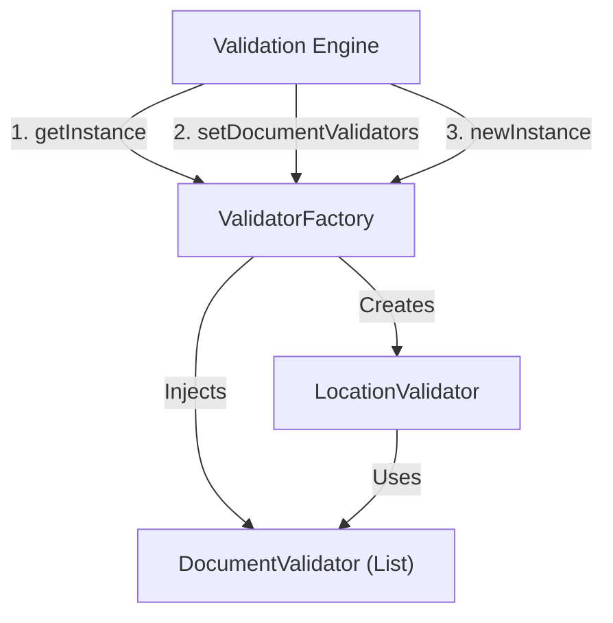
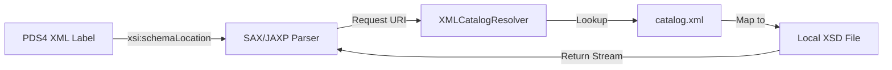

# Page: Schema Validation and ValidatorFactory

# Schema Validation and ValidatorFactory

Relevant source files

The following files were used as context for generating this wiki page:

- [CHANGELOG.md](CHANGELOG.md)
- [pom.xml](pom.xml)
- [src/changes/changes.xml](src/changes/changes.xml)
- [src/main/java/gov/nasa/pds/tools/label/XMLCatalogResolver.java](src/main/java/gov/nasa/pds/tools/label/XMLCatalogResolver.java)
- [src/main/java/gov/nasa/pds/tools/label/validate/DefaultDocumentValidator.java](src/main/java/gov/nasa/pds/tools/label/validate/DefaultDocumentValidator.java)
- [src/main/java/gov/nasa/pds/tools/label/validate/DocumentValidator.java](src/main/java/gov/nasa/pds/tools/label/validate/DocumentValidator.java)
- [src/main/java/gov/nasa/pds/tools/util/LabelParser.java](src/main/java/gov/nasa/pds/tools/util/LabelParser.java)
- [src/main/java/gov/nasa/pds/tools/util/XMLErrorListener.java](src/main/java/gov/nasa/pds/tools/util/XMLErrorListener.java)
- [src/main/java/gov/nasa/pds/tools/util/XMLExtractor.java](src/main/java/gov/nasa/pds/tools/util/XMLExtractor.java)
- [src/main/java/gov/nasa/pds/tools/util/XslURIResolver.java](src/main/java/gov/nasa/pds/tools/util/XslURIResolver.java)
- [src/main/java/gov/nasa/pds/tools/validate/ContentProblem.java](src/main/java/gov/nasa/pds/tools/validate/ContentProblem.java)
- [src/main/java/gov/nasa/pds/tools/validate/rule/pds4/SchemaValidator.java](src/main/java/gov/nasa/pds/tools/validate/rule/pds4/SchemaValidator.java)
- [src/main/java/gov/nasa/pds/validate/ValidateLauncher.java](src/main/java/gov/nasa/pds/validate/ValidateLauncher.java)
- [src/main/java/gov/nasa/pds/validate/Validator.java](src/main/java/gov/nasa/pds/validate/Validator.java)
- [src/main/java/gov/nasa/pds/validate/ValidatorFactory.java](src/main/java/gov/nasa/pds/validate/ValidatorFactory.java)
- [src/main/java/gov/nasa/pds/validate/commandline/options/ConfigKey.java](src/main/java/gov/nasa/pds/validate/commandline/options/ConfigKey.java)
- [src/main/java/gov/nasa/pds/validate/commandline/options/Flag.java](src/main/java/gov/nasa/pds/validate/commandline/options/Flag.java)
- [src/main/java/gov/nasa/pds/validate/commandline/options/FlagOptions.java](src/main/java/gov/nasa/pds/validate/commandline/options/FlagOptions.java)
- [src/main/java/gov/nasa/pds/validate/constants/Constants.java](src/main/java/gov/nasa/pds/validate/constants/Constants.java)
- [src/main/java/gov/nasa/pds/validate/ri/UserInput.java](src/main/java/gov/nasa/pds/validate/ri/UserInput.java)
- [src/main/java/gov/nasa/pds/validate/util/Utility.java](src/main/java/gov/nasa/pds/validate/util/Utility.java)
- [src/main/resources/bin/logging.properties](src/main/resources/bin/logging.properties)
- [src/main/resources/bin/validate-bundle](src/main/resources/bin/validate-bundle)
- [src/test/resources/github87/2t126632959btr0200p3002n0a1.xml](src/test/resources/github87/2t126632959btr0200p3002n0a1.xml)
- [src/test/resources/github87/2t126646972btr0200p3001n0a1.xml](src/test/resources/github87/2t126646972btr0200p3001n0a1.xml)
- [src/test/resources/github87/geom/v1/PDS4_GEOM_1B10_1710.sch](src/test/resources/github87/geom/v1/PDS4_GEOM_1B10_1710.sch)
- [src/test/resources/github87/geom/v1/PDS4_GEOM_1B10_1710.xml](src/test/resources/github87/geom/v1/PDS4_GEOM_1B10_1710.xml)
- [src/test/resources/github87/geom/v1/PDS4_GEOM_1B10_1710.xsd](src/test/resources/github87/geom/v1/PDS4_GEOM_1B10_1710.xsd)
- [src/test/resources/github87/mission/mer/v1/PDS4_MER_1B00_1000.JSON](src/test/resources/github87/mission/mer/v1/PDS4_MER_1B00_1000.JSON)
- [src/test/resources/github87/mission/mer/v1/PDS4_MER_1B00_1000.sch](src/test/resources/github87/mission/mer/v1/PDS4_MER_1B00_1000.sch)

This page details the implementation and integration of the schema validation subsystem within the `validate` tool. It explains how XML Schema Definition (XSD) 1.1 validation is performed via JAXP, the singleton `ValidatorFactory` managing validator instances, the role of `XMLCatalogResolver` for efficient local schema resolution, and how SAX parsing errors are converted to structured `ValidationProblem` objects by `LabelErrorHandler`.

---

## ValidatorFactory

`ValidatorFactory` is a singleton class responsible for creating and caching instances of `LocationValidator`. It ensures that the validation engine uses a consistent validator configuration across different targets.

### Implementation Details

- **Singleton Pattern**: The factory is accessed via `getInstance()`, which uses a synchronized block to ensure a single instance exists [src/main/java/gov/nasa/pds/validate/ValidatorFactory.java:60-65]().
- **Validator Caching**: It maintains a `cachedValidator` of type `LocationValidator`. When `newInstance()` is called, it returns the existing validator or initializes a new one if it hasn't been created yet [src/main/java/gov/nasa/pds/validate/ValidatorFactory.java:78-87]().
- **Extensibility**: The factory allows injecting a list of `DocumentValidator` objects via `setDocumentValidators()`. These are added to the `LocationValidator` during its instantiation [src/main/java/gov/nasa/pds/validate/ValidatorFactory.java:82-85]().
- **Lifecycle Management**: The `flush()` method resets the factory by setting the static instance to `null`, allowing for a fresh reconfiguration of the validation environment [src/main/java/gov/nasa/pds/validate/ValidatorFactory.java:97-99]().

### Validator Initialization Architecture

The following diagram bridges the high-level validation request to the internal code entities managed by the factory.

**Validator Initialization Architecture**

Sources: [src/main/java/gov/nasa/pds/validate/ValidatorFactory.java:47-101]()

---

## SchemaValidator (XSD 1.1 via JAXP)

The `SchemaValidator` class provides the heavy-lifting for XSD validation. It specifically targets XSD 1.1 support, which is required for complex PDS4 label structures.

### Core Features and Configuration

- **JAXP Integration**: It uses the standard `javax.xml.validation.SchemaFactory` initialized with the W3C XML Schema namespace [src/main/java/gov/nasa/pds/tools/validate/rule/pds4/SchemaValidator.java:71]().
- **Security (XXE Prevention)**: To prevent XML External Entity (XXE) attacks, it explicitly disables DTD declarations by setting the `http://apache.org/xml/features/disallow-doctype-decl` feature to `true` [src/main/java/gov/nasa/pds/tools/validate/rule/pds4/SchemaValidator.java:73-76]().
- **Resource Resolution**: It utilizes `XMLCatalogResolver` to handle schema includes and imports, ensuring that the validator can find dependencies locally [src/main/java/gov/nasa/pds/tools/validate/rule/pds4/SchemaValidator.java:77]().
- **External Locations**: The method `setExternalLocations()` allows users to override or provide additional schema locations via the `http://apache.org/xml/properties/schema/external-schemaLocation` property [src/main/java/gov/nasa/pds/tools/validate/rule/pds4/SchemaValidator.java:115-120]().

### Validation Logic

The `validate(StreamSource schema)` method performs the actual validation:
1. It attaches a `LabelErrorHandler` to the `SchemaFactory` to capture SAX errors [src/main/java/gov/nasa/pds/tools/validate/rule/pds4/SchemaValidator.java:92]().
2. It attempts to create a new `Schema` object from the source using `schemaFactory.newSchema(schema)` [src/main/java/gov/nasa/pds/tools/validate/rule/pds4/SchemaValidator.java:97]().
3. If a `SAXException` occurs that is not a `SAXParseException`, it manually creates a `ValidationProblem` with a `FATAL` severity and `SCHEMA_ERROR` type [src/main/java/gov/nasa/pds/tools/validate/rule/pds4/SchemaValidator.java:98-111]().

Sources: [src/main/java/gov/nasa/pds/tools/validate/rule/pds4/SchemaValidator.java:58-133]()

---

## XMLCatalogResolver and Local Resolution

The `XMLCatalogResolver` is an adaptation of the Xerces resolver designed to support OASIS XML Catalog 1.1. It is critical for "offline" validation where schemas are bundled with the tool.

- **Entity Resolution**: It implements `XMLEntityResolver` and `EntityResolver2` to intercept requests for external entities [src/main/java/gov/nasa/pds/tools/label/XMLCatalogResolver.java:64-65]().
- **Caching**: It extends `CachedLSResourceResolver`, allowing it to cache resolved schema components to improve performance during large-scale batch validations [src/main/java/gov/nasa/pds/tools/label/XMLCatalogResolver.java:64]().
- **Catalog Management**: It maintains an internal `CatalogManager` and a list of catalog URIs [src/main/java/gov/nasa/pds/tools/label/XMLCatalogResolver.java:68-74]().

**Data Flow: From XML Label to Local Schema**

Sources: [src/main/java/gov/nasa/pds/tools/label/XMLCatalogResolver.java:41-100](), [src/main/java/gov/nasa/pds/tools/validate/rule/pds4/SchemaValidator.java:77-78]()

---

## LabelErrorHandler and Error Conversion

`LabelErrorHandler` is the bridge between the standard Java SAX error handling and the PDS validation problem model. It is used within `SchemaValidator` to capture issues during schema parsing.

- **Problem Mapping**: It receives SAX events (warning, error, fatalError) and converts them into `ValidationProblem` objects.
- **Problem Container**: It stores these problems in a `ProblemContainer` passed during construction [src/main/java/gov/nasa/pds/tools/validate/rule/pds4/SchemaValidator.java:92]().
- **Location Tracking**: It extracts line and column numbers from `SAXParseException` to provide precise feedback in validation reports.

**Code Entity Mapping: Error Handling**
| SAX/JAXP Entity | Validate Tool Entity | File Reference |
| :--- | :--- | :--- |
| `org.xml.sax.ErrorHandler` | `LabelErrorHandler` | [src/main/java/gov/nasa/pds/tools/validate/rule/pds4/SchemaValidator.java:92]() |
| `org.xml.sax.SAXException` | `ValidationProblem` | [src/main/java/gov/nasa/pds/tools/validate/rule/pds4/SchemaValidator.java:106-109]() |
| `javax.xml.validation.SchemaFactory` | `SchemaValidator` | [src/main/java/gov/nasa/pds/tools/validate/rule/pds4/SchemaValidator.java:63]() |

---

## Utility Integration

The validation process relies on several utility functions for URL and Target handling:
- **URL Normalization**: `Utility.toURL()` converts string paths or file system paths into valid `URL` objects for the validator [src/main/java/gov/nasa/pds/validate/util/Utility.java:74-83]().
- **Target Detection**: `Utility.toTarget()` determines if a URL points to a directory or a specific file, which informs the `Crawler` and subsequent validation tasks [src/main/java/gov/nasa/pds/validate/util/Utility.java:85-100]().
- **XSD/Schematron Extraction**: `XMLExtractor` is used to pull `xsi:schemaLocation` and `xml-model` processing instructions from labels to determine which schemas to load [src/main/java/gov/nasa/pds/tools/util/XMLExtractor.java:45-47]().

Sources: [src/main/java/gov/nasa/pds/validate/util/Utility.java:51-101](), [src/main/java/gov/nasa/pds/tools/util/XMLExtractor.java:38-52]()
