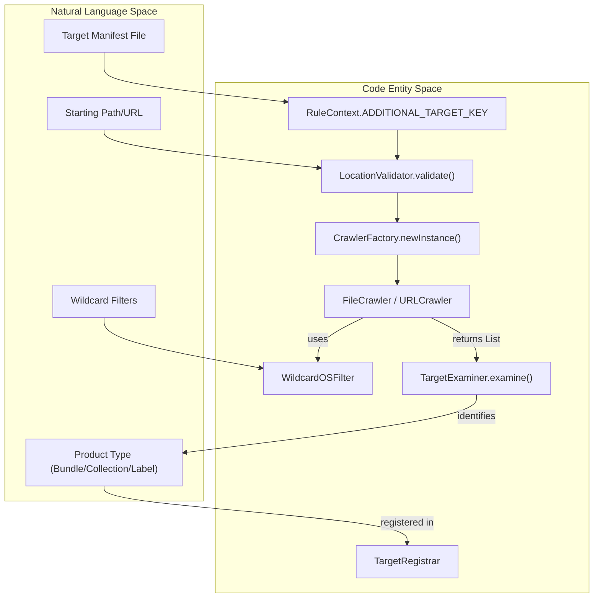
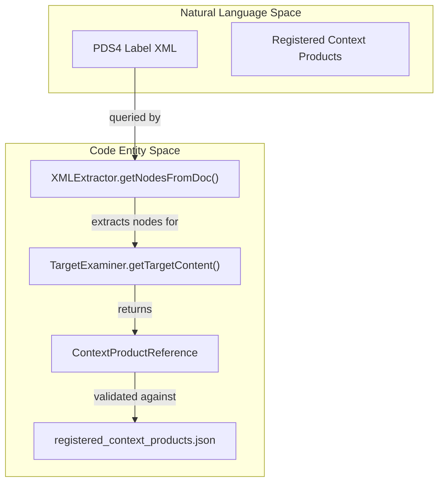

# Page: Target Discovery and Crawling

# Target Discovery and Crawling

Relevant source files

The following files were used as context for generating this wiki page:

- [build/pre-build.sh](build/pre-build.sh)
- [src/main/java/gov/nasa/pds/tools/label/LabelValidator.java](src/main/java/gov/nasa/pds/tools/label/LabelValidator.java)
- [src/main/java/gov/nasa/pds/tools/label/LocationValidator.java](src/main/java/gov/nasa/pds/tools/label/LocationValidator.java)
- [src/main/java/gov/nasa/pds/tools/util/ContextProductReference.java](src/main/java/gov/nasa/pds/tools/util/ContextProductReference.java)
- [src/main/java/gov/nasa/pds/tools/util/FileFinder.java](src/main/java/gov/nasa/pds/tools/util/FileFinder.java)
- [src/main/java/gov/nasa/pds/tools/util/LidVid.java](src/main/java/gov/nasa/pds/tools/util/LidVid.java)
- [src/main/java/gov/nasa/pds/tools/validate/TargetExaminer.java](src/main/java/gov/nasa/pds/tools/validate/TargetExaminer.java)
- [src/main/java/gov/nasa/pds/tools/validate/ValidationResourceManager.java](src/main/java/gov/nasa/pds/tools/validate/ValidationResourceManager.java)
- [src/main/java/gov/nasa/pds/tools/validate/crawler/FileCrawler.java](src/main/java/gov/nasa/pds/tools/validate/crawler/FileCrawler.java)
- [src/main/java/gov/nasa/pds/tools/validate/rule/RuleContext.java](src/main/java/gov/nasa/pds/tools/validate/rule/RuleContext.java)
- [src/main/java/gov/nasa/pds/tools/validate/rule/pds4/FindUnreferencedIdentifiers.java](src/main/java/gov/nasa/pds/tools/validate/rule/pds4/FindUnreferencedIdentifiers.java)
- [src/main/java/gov/nasa/pds/tools/validate/rule/pds4/LabelInFolderRule.java](src/main/java/gov/nasa/pds/tools/validate/rule/pds4/LabelInFolderRule.java)
- [src/main/java/gov/nasa/pds/tools/validate/rule/pds4/LabelValidationRule.java](src/main/java/gov/nasa/pds/tools/validate/rule/pds4/LabelValidationRule.java)
- [src/main/java/gov/nasa/pds/validate/commandline/options/InvalidOptionException.java](src/main/java/gov/nasa/pds/validate/commandline/options/InvalidOptionException.java)
- [src/main/java/gov/nasa/pds/validate/commandline/options/ToolsOption.java](src/main/java/gov/nasa/pds/validate/commandline/options/ToolsOption.java)
- [src/main/java/gov/nasa/pds/validate/crawler/WildcardOSFilter.java](src/main/java/gov/nasa/pds/validate/crawler/WildcardOSFilter.java)
- [src/main/java/gov/nasa/pds/validate/util/Namespace.java](src/main/java/gov/nasa/pds/validate/util/Namespace.java)
- [src/main/java/gov/nasa/pds/validate/util/ToolInfo.java](src/main/java/gov/nasa/pds/validate/util/ToolInfo.java)
- [src/main/resources/util/registered_context_products.json](src/main/resources/util/registered_context_products.json)
- [src/main/resources/validate.properties](src/main/resources/validate.properties)
- [src/test/resources/github28/new_context.json](src/test/resources/github28/new_context.json)
- [src/test/resources/github408/valid/bundle_insight_seis.xml](src/test/resources/github408/valid/bundle_insight_seis.xml)
- [src/test/resources/github408/valid/data/collection_data_lander.xml](src/test/resources/github408/valid/data/collection_data_lander.xml)
- [src/test/resources/github408/valid/data/collection_data_lander_inventory.csv](src/test/resources/github408/valid/data/collection_data_lander_inventory.csv)
- [src/test/resources/github408/valid/data/collection_data_seed.xml](src/test/resources/github408/valid/data/collection_data_seed.xml)
- [src/test/resources/github408/valid/data/collection_data_seed_2.xml](src/test/resources/github408/valid/data/collection_data_seed_2.xml)
- [src/test/resources/github408/valid/data/collection_data_seed_inventory.csv](src/test/resources/github408/valid/data/collection_data_seed_inventory.csv)

The validate tool discovers targets for validation through a recursive crawling mechanism that identifies PDS4 products, bundles, and collections. This process involves filtering files based on naming conventions, detecting product types via XML inspection, managing discovered targets within a central registrar, and supporting target-manifest files for batch processing.

## Discovery Workflow and Entity Mapping

The discovery process bridges the gap between the physical file system (or remote URLs) and the internal validation rule engine.

### Target Discovery Logic Flow
The following diagram illustrates how a starting location is transformed into a set of validated targets.

**Target Discovery Entity Map**

**Sources:** [src/main/java/gov/nasa/pds/tools/validate/TargetExaminer.java:76-89](), [src/main/java/gov/nasa/pds/tools/label/LocationValidator.java:171-186](), [src/main/java/gov/nasa/pds/tools/validate/rule/RuleContext.java:83-84]()

## Crawling Implementation

The tool supports both local file system crawling and remote URL crawling via the `Crawler` interface [src/main/java/gov/nasa/pds/tools/validate/crawler/Crawler.java:1-30]().

### Crawler Types and Factory
The `CrawlerFactory` determines the appropriate implementation based on the protocol of the target URL.
*   **FileCrawler**: Handles `file://` protocols using standard Java IO and `FileUtils` [src/main/java/gov/nasa/pds/tools/validate/crawler/FileCrawler.java:109-117]().
*   **URLCrawler**: Handles `http://` and `https://` protocols, traversing remote directory listings.

### Filtering and Recursion
The `FileCrawler` uses filters to restrict the search based on glob patterns or extensions. It can perform a "regular crawl" for directories or a "special crawl" using specific file extensions defined in the `RuleContext` [src/main/java/gov/nasa/pds/tools/validate/crawler/FileCrawler.java:107-128](), [src/main/java/gov/nasa/pds/tools/validate/crawler/FileCrawler.java:144-161]().

The `LocationValidator` coordinates the crawl. If recursion is enabled, the `LabelInFolderRule` descends into subdirectories using `recursiveCrawl()` until leaf nodes are reached [src/main/java/gov/nasa/pds/tools/validate/rule/pds4/LabelInFolderRule.java:75-99]().

**Sources:** [src/main/java/gov/nasa/pds/tools/validate/crawler/FileCrawler.java:107-161](), [src/main/java/gov/nasa/pds/tools/label/LocationValidator.java:171-186](), [src/main/java/gov/nasa/pds/tools/validate/rule/pds4/LabelInFolderRule.java:75-99]()

## Product Type Detection (TargetExaminer)

Once a file is found, the `TargetExaminer` determines if it is a valid PDS4 product and what specific type it represents. This is critical for selecting the correct validation pipeline (e.g., Bundle vs. Collection).

| Product Type | Detection Logic (Root Tag) | Code Constant |
| :--- | :--- | :--- |
| **Bundle** | `<Product_Bundle>` | `BUNDLE_NODE_TAG` |
| **Collection** | `<Product_Collection>` | `COLLECTION_NODE_TAG` |
| **Document** | `<Product_Document>` | `DOCUMENT_NODE_TAG` |

The `TargetExaminer.doExamine()` method performs a "light" parse of the XML using `LabelParser.parse()` to retrieve the root element without executing full schema validation [src/main/java/gov/nasa/pds/tools/validate/TargetExaminer.java:112-128](). Results are cached in a `softValues()` Guava cache to optimize repeated lookups [src/main/java/gov/nasa/pds/tools/validate/TargetExaminer.java:44-45]().

**Sources:** [src/main/java/gov/nasa/pds/tools/validate/TargetExaminer.java:41-49](), [src/main/java/gov/nasa/pds/tools/validate/TargetExaminer.java:112-128]()

## Version Discovery and LIDVID Pruning

The tool includes logic to handle multiple versions of the same product during discovery, ensuring that only relevant versions are processed.

### Latest Version Discovery
The `LidVid` utility provides functions to prune a list of targets to only include the latest versions.
*   **getLatestVersion**: Takes a map of LIDs to version lists and identifies the largest version using float-based comparison for major versions and integer-based comparison for minor versions [src/main/java/gov/nasa/pds/tools/util/LidVid.java:47-136]().
*   **LIDVID Parsing**: The `ContextProductReference` class models the LID and version string extracted from labels [src/main/java/gov/nasa/pds/tools/util/ContextProductReference.java:23-55]().

**Sources:** [src/main/java/gov/nasa/pds/tools/util/LidVid.java:47-136](), [src/main/java/gov/nasa/pds/tools/util/ContextProductReference.java:23-55]()

## Referential Integrity Discovery

Discovery extends into the content of labels to find referenced members that may need to be validated as part of a bundle or collection.

### Discovery Logic for Members
The following diagram maps the code entities involved in extracting references from aggregate products.

**Member Discovery Entity Map**

### Context Product Discovery
The tool maintains a `registered_context_products.json` file containing a massive registry of known context products (Stars, Instruments, etc.) [src/main/resources/util/registered_context_products.json:1-156](). During discovery, references in labels are compared against this registry to ensure valid LIDVIDs are used [src/main/java/gov/nasa/pds/tools/util/ContextProductReference.java:107-124]().

**Sources:** [src/main/resources/util/registered_context_products.json:1-156](), [src/main/java/gov/nasa/pds/tools/util/ContextProductReference.java:107-124](), [src/main/java/gov/nasa/pds/tools/validate/TargetExaminer.java:152-171]()

## Batch Discovery via RuleContext

The tool supports batch processing of multiple targets through the `RuleContext`. Targets can be added as `ADDITIONAL_TARGET_KEY` entries, which are then processed by the `LocationValidator` [src/main/java/gov/nasa/pds/tools/validate/rule/RuleContext.java:83-84]().

When validating a folder, the `LabelInFolderRule` discovers all files matching the label extension (default `.xml`) and submits them to an `ExecutorService` for parallel validation [src/main/java/gov/nasa/pds/tools/validate/rule/pds4/LabelInFolderRule.java:108-159]().

**Sources:** [src/main/java/gov/nasa/pds/tools/validate/rule/RuleContext.java:83-84](), [src/main/java/gov/nasa/pds/tools/validate/rule/pds4/LabelInFolderRule.java:108-159]()
