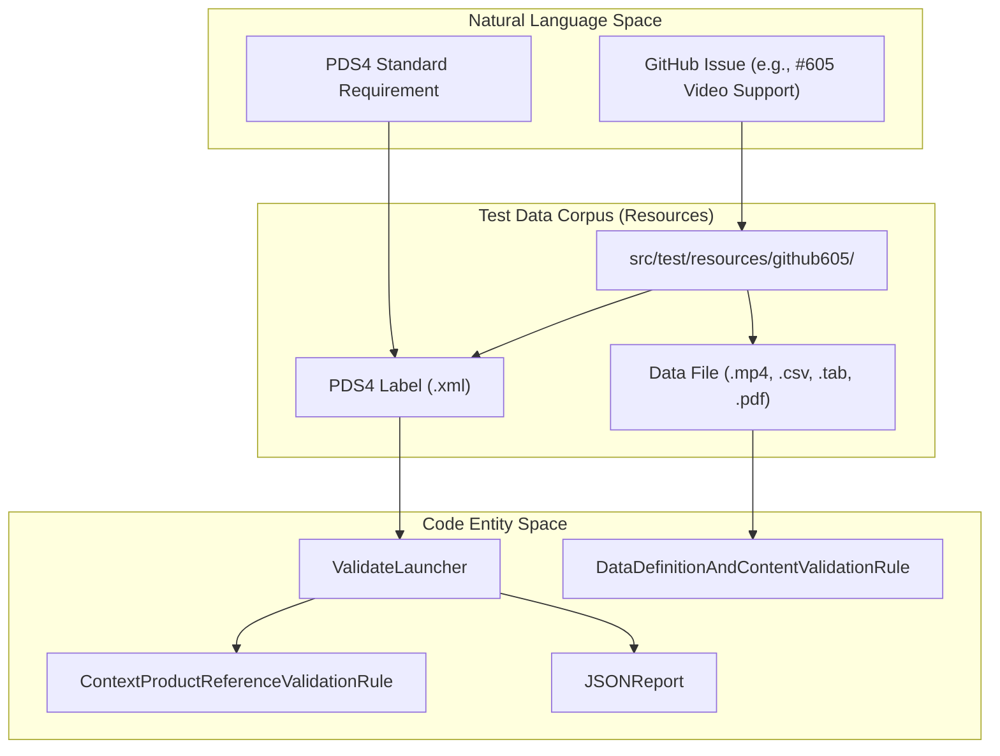
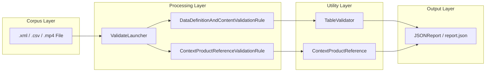

# Page: Test Data Corpus

# Test Data Corpus

Relevant source files

The following files were used as context for generating this wiki page:

- [src/main/java/gov/nasa/pds/tools/validate/rule/pds4/ContextProductReferenceValidationRule.java](src/main/java/gov/nasa/pds/tools/validate/rule/pds4/ContextProductReferenceValidationRule.java)
- [src/test/java/gov/nasa/pds/validate/ValidationIntegrationTests.java](src/test/java/gov/nasa/pds/validate/ValidationIntegrationTests.java)
- [src/test/java/gov/nasa/pds/validate/constants/TestConstants.java](src/test/java/gov/nasa/pds/validate/constants/TestConstants.java)
- [src/test/java/gov/nasa/pds/validate/test/util/Utility.java](src/test/java/gov/nasa/pds/validate/test/util/Utility.java)
- [src/test/resources/PDS-543/ladee_mission_bundle_SIP_4col_manifest_v1.0.tab](src/test/resources/PDS-543/ladee_mission_bundle_SIP_4col_manifest_v1.0.tab)
- [src/test/resources/PDS-543/ladee_mission_bundle_SIP_4col_manifest_v1.0.unexpected.xml](src/test/resources/PDS-543/ladee_mission_bundle_SIP_4col_manifest_v1.0.unexpected.xml)
- [src/test/resources/PDS-543/ladee_mission_bundle_SIP_4col_manifest_v1.0.xml](src/test/resources/PDS-543/ladee_mission_bundle_SIP_4col_manifest_v1.0.xml)
- [src/test/resources/PDS-543/report.expected.json](src/test/resources/PDS-543/report.expected.json)
- [src/test/resources/github1008/example.pdf](src/test/resources/github1008/example.pdf)
- [src/test/resources/github1008/example.xml](src/test/resources/github1008/example.xml)
- [src/test/resources/github11/test_data/science_index.tab](src/test/resources/github11/test_data/science_index.tab)
- [src/test/resources/github11/test_data/science_index.tab.original](src/test/resources/github11/test_data/science_index.tab.original)
- [src/test/resources/github11/test_data/science_index.xml](src/test/resources/github11/test_data/science_index.xml)
- [src/test/resources/github11/test_data/science_index_bad_1.xml](src/test/resources/github11/test_data/science_index_bad_1.xml)
- [src/test/resources/github11/test_data/science_index_bad_2.xml](src/test/resources/github11/test_data/science_index_bad_2.xml)
- [src/test/resources/github11/test_data/science_index_good.xml](src/test/resources/github11/test_data/science_index_good.xml)
- [src/test/resources/github1130/hyb2_ldr_l0_aocsm_range_ts_20151219_v01.csv](src/test/resources/github1130/hyb2_ldr_l0_aocsm_range_ts_20151219_v01.csv)
- [src/test/resources/github1130/hyb2_ldr_l0_aocsm_range_ts_20151219_v01.xml](src/test/resources/github1130/hyb2_ldr_l0_aocsm_range_ts_20151219_v01.xml)
- [src/test/resources/github28/test_add_context_products.xml](src/test/resources/github28/test_add_context_products.xml)
- [src/test/resources/github604/235797141-1d67c6ae-69ef-41ea-834c-cc32eee90470.mp4](src/test/resources/github604/235797141-1d67c6ae-69ef-41ea-834c-cc32eee90470.mp4)
- [src/test/resources/github604/video.xml](src/test/resources/github604/video.xml)
- [src/test/resources/github605/235801716-ea625a5e-b6ee-41c0-8c14-cf0b6fa27fa4.mp4](src/test/resources/github605/235801716-ea625a5e-b6ee-41c0-8c14-cf0b6fa27fa4.mp4)
- [src/test/resources/github605/audio.xml](src/test/resources/github605/audio.xml)
- [src/test/resources/github605/track.wav](src/test/resources/github605/track.wav)
- [src/test/resources/github605/video_and_audio.xml](src/test/resources/github605/video_and_audio.xml)
- [src/test/resources/github631/hyb2_tir_20180629_075501_l1.fit](src/test/resources/github631/hyb2_tir_20180629_075501_l1.fit)
- [src/test/resources/github631/hyb2_tir_20180629_075501_l1.xml](src/test/resources/github631/hyb2_tir_20180629_075501_l1.xml)
- [src/test/resources/github822/bundle.xml](src/test/resources/github822/bundle.xml)
- [src/test/resources/github822/data_raw/PITMS_RAW_AUX.xml](src/test/resources/github822/data_raw/PITMS_RAW_AUX.xml)
- [src/test/resources/github822/data_raw/collection.xml](src/test/resources/github822/data_raw/collection.xml)
- [src/test/resources/github824/1203_12.PDF](src/test/resources/github824/1203_12.PDF)
- [src/test/resources/github824/1203_12.xml](src/test/resources/github824/1203_12.xml)
- [src/test/resources/github849/collection.xml](src/test/resources/github849/collection.xml)

The `validate` tool maintains a comprehensive test data corpus consisting of over 1300 resource files. These resources are primarily organized by GitHub issue numbers, serving as regression tests and edge-case validations for the PDS4 and PDS3 standards. This corpus covers a wide array of data formats, including tabulated data, binary arrays, PDF/A documents, audio/video files, FITS, and legacy PDS3 volumes.

## Corpus Organization and Structure

The test data is located under `src/test/resources/` [src/test/java/gov/nasa/pds/validate/constants/TestConstants.java:7-8]() and is categorized to map directly to functional requirements and reported bugs.

| Category | Description | Key Examples |
| :--- | :--- | :--- |
| **GitHub Issues** | Directories named `githubXXX` containing labels and data that triggered specific bugs or feature requests. | `github605/`, `github28/`, `github11/`, `github1130/`, `github824/` |
| **Data Types** | Specific subdirectories for complex formats like FITS, SPICE kernels, or PDF/A. | `github604/` (MP4), `github824/` (PDF/A), `github631/` (FITS) |
| **Validation States** | Pairs of labels and "expected" reports used to assert tool behavior via `ValidationIntegrationTests`. | `PDS-543/report.expected.json` |

### Natural Language to Code Entity Mapping: Test Data Lifecycle

The following diagram illustrates how natural language test requirements (expressed as GitHub issues) are transformed into code entities and validated against the corpus.

**Test Execution Flow**

Sources: [src/test/resources/github605/video_and_audio.xml:1-119](), [src/test/java/gov/nasa/pds/validate/ValidationIntegrationTests.java:84-130]()

---

## Key Data Categories

### 1. Tabular and Content Validation
The corpus includes numerous examples of `Table_Delimited`, `Table_Character`, and `Table_Binary` products. These are used to test the tool's ability to handle field delimiters, record lengths, and data type ranges.

*   **Example (Issue #1130):** Testing `Table_Delimited` CSV data for Hayabusa2 LIDAR.
    *   Label: `src/test/resources/github1130/hyb2_ldr_l0_aocsm_range_ts_20151219_v01.xml` [src/test/resources/github1130/hyb2_ldr_l0_aocsm_range_ts_20151219_v01.xml:62-130]()
    *   Data: `src/test/resources/github1130/hyb2_ldr_l0_aocsm_range_ts_20151219_v01.csv`
*   **Example (Issue #11):** Testing `Table_Character` field formats and locations.
    *   Label (Good): `src/test/resources/github11/test_data/science_index_good.xml` [src/test/resources/github11/test_data/science_index_good.xml:80-158]()
    *   Label (Bad): `src/test/resources/github11/test_data/science_index_bad_1.xml` [src/test/resources/github11/test_data/science_index_bad_1.xml:71-160]()
*   **Example (PDS-543):** Testing record length mismatches in manifest tables.
    *   Label: `src/test/resources/PDS-543/ladee_mission_bundle_SIP_4col_manifest_v1.0.xml` [src/test/java/gov/nasa/pds/validate/ValidationIntegrationTests.java:93-94]()
    *   Expected Failure: `report.expected.json` captures summary mismatches. [src/test/java/gov/nasa/pds/validate/ValidationIntegrationTests.java:109-110]()

### 2. Multimedia and Document Validation
Validate supports checking the integrity and metadata of audio, video, and PDF files.

*   **Video Validation:** Issues #604 and #605 provide samples of Ingenuity helicopter video.
    *   Label: `src/test/resources/github605/video_and_audio.xml` [src/test/resources/github605/video_and_audio.xml:114-118]()
    *   Reference: `235801716-ea625a5e-b6ee-41c0-8c14-cf0b6fa27fa4.mp4` [src/test/resources/github605/video_and_audio.xml:107-107]()
*   **Audio Validation:** Tests for `Encoded_Audio` using standard `WAV` tracks.
    *   Reference: `src/test/resources/github605/track.wav` [src/test/resources/github605/audio.xml]()
*   **PDF/A Validation:** Issue #824 and #1008 test PDF/A compliance checking.
    *   Label: `src/test/resources/github824/1203_12.xml` [src/test/resources/github824/1203_12.xml:117-129]()
    *   Data: `src/test/resources/github824/1203_12.PDF` [src/test/resources/github824/1203_12.xml:119-119]()

### 3. Context Product Reference Validation
The corpus includes tests for validating `Internal_Reference` entries against the registered context products.

*   **Example (Issue #28):** Testing the `--add-context-products` flag.
    *   Test Logic: `ValidationIntegrationTests.testGithub28()` asserts that an invalid context reference causes an error, which is then resolved by providing a supplemental JSON context file. [src/test/java/gov/nasa/pds/validate/ValidationIntegrationTests.java:133-178]()
    *   Rule: `ContextProductReferenceValidationRule` implements the logic for searching registered products and performing version ID comparisons. [src/main/java/gov/nasa/pds/tools/validate/rule/pds4/ContextProductReferenceValidationRule.java:64-143]()

---

## Data Flow: From Resource to Problem Reporting

The following diagram maps the data flow from the physical file in the `Test Data Corpus` through the internal validation logic.

**Data Flow Architecture**

Sources: [src/test/java/gov/nasa/pds/validate/ValidationIntegrationTests.java:96-100](), [src/main/java/gov/nasa/pds/tools/validate/rule/pds4/ContextProductReferenceValidationRule.java:48-54]()

## Technical Implementation Details

### Integration Testing with the Corpus
The `ValidationIntegrationTests` class serves as the primary driver for the corpus. It uses `ValidateLauncher` to process specific test directories and compares the generated `JSONReport` against an `expected.json` file.

*   **Setup:** The `setUp()` method initializes the output directory and sets the `resources.home` system property to point to the resource directory. [src/test/java/gov/nasa/pds/validate/ValidationIntegrationTests.java:66-72]()
*   **Assertion:** Tests like `testPDS543` use `Gson` to parse and compare the `summary` section of the actual and expected reports. [src/test/java/gov/nasa/pds/validate/ValidationIntegrationTests.java:108-111]()

### Data Content Integrity
The corpus tests the tool's ability to cross-reference metadata between labels and data files. For instance, `Table_Delimited` records are counted and compared against the `records` element in the label.

*   **Example:** `src/test/resources/github1130/hyb2_ldr_l0_aocsm_range_ts_20151219_v01.xml` defines 3758 records for a CSV file. [src/test/resources/github1130/hyb2_ldr_l0_aocsm_range_ts_20151219_v01.xml:66-66]()
*   **Checksums:** The corpus includes MD5 verification tests where the tool validates the `md5_checksum` provided in the label against the calculated hash of the file. [src/test/resources/github824/1203_12.xml:122-122]()

Sources:
- [src/test/java/gov/nasa/pds/validate/ValidationIntegrationTests.java:66-178]()
- [src/main/java/gov/nasa/pds/tools/validate/rule/pds4/ContextProductReferenceValidationRule.java:64-143]()
- [src/test/resources/github1130/hyb2_ldr_l0_aocsm_range_ts_20151219_v01.xml:62-130]()
- [src/test/resources/github605/video_and_audio.xml:105-118]()
- [src/test/resources/github824/1203_12.xml:117-130]()
- [src/test/resources/github11/test_data/science_index_good.xml:73-158]()
- [src/test/java/gov/nasa/pds/validate/constants/TestConstants.java:7-8]()
