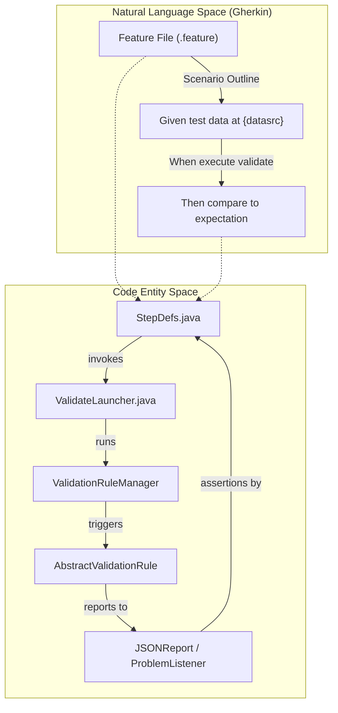
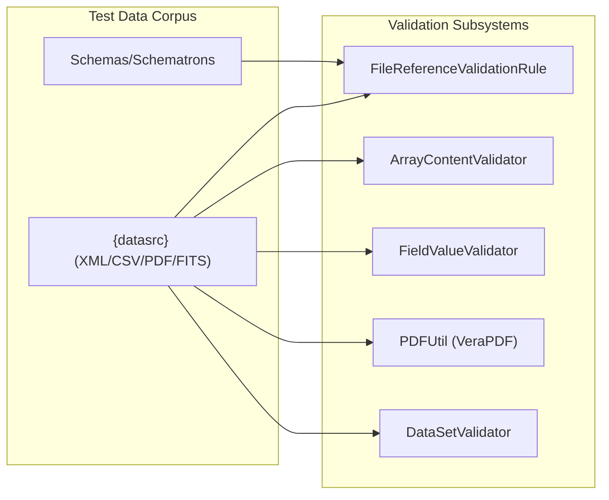

# Page: Testing Infrastructure

# Testing Infrastructure

Relevant source files

The following files were used as context for generating this wiki page:

- [src/main/java/gov/nasa/pds/tools/util/DocumentUtil.java](src/main/java/gov/nasa/pds/tools/util/DocumentUtil.java)
- [src/main/java/gov/nasa/pds/tools/util/PDFUtil.java](src/main/java/gov/nasa/pds/tools/util/PDFUtil.java)
- [src/main/java/gov/nasa/pds/tools/validate/rule/pds4/ContextProductReferenceValidationRule.java](src/main/java/gov/nasa/pds/tools/validate/rule/pds4/ContextProductReferenceValidationRule.java)
- [src/main/java/gov/nasa/pds/web/ui/utils/DataSetValidator.java](src/main/java/gov/nasa/pds/web/ui/utils/DataSetValidator.java)
- [src/test/java/cucumber/CucumberTest.java](src/test/java/cucumber/CucumberTest.java)
- [src/test/java/cucumber/StepDefs.java](src/test/java/cucumber/StepDefs.java)
- [src/test/java/gov/nasa/pds/validate/ValidationIntegrationTests.java](src/test/java/gov/nasa/pds/validate/ValidationIntegrationTests.java)
- [src/test/resources/features/3.6.x.feature](src/test/resources/features/3.6.x.feature)
- [src/test/resources/features/pre.3.6.x.feature](src/test/resources/features/pre.3.6.x.feature)
- [src/test/resources/github1130/hyb2_ldr_l0_aocsm_range_ts_20151219_v01.csv](src/test/resources/github1130/hyb2_ldr_l0_aocsm_range_ts_20151219_v01.csv)
- [src/test/resources/github1130/hyb2_ldr_l0_aocsm_range_ts_20151219_v01.xml](src/test/resources/github1130/hyb2_ldr_l0_aocsm_range_ts_20151219_v01.xml)
- [src/test/resources/github631/hyb2_tir_20180629_075501_l1.fit](src/test/resources/github631/hyb2_tir_20180629_075501_l1.fit)
- [src/test/resources/github631/hyb2_tir_20180629_075501_l1.xml](src/test/resources/github631/hyb2_tir_20180629_075501_l1.xml)
- [src/test/resources/github992/ff_char.xml](src/test/resources/github992/ff_char.xml)
- [src/test/resources/github992/ff_del.xml](src/test/resources/github992/ff_del.xml)
- [src/test/resources/github992/ff_test.csv](src/test/resources/github992/ff_test.csv)

The `validate` tool employs a multi-layered testing strategy designed to ensure the integrity of PDS4 and PDS3 data validation. This infrastructure combines behavior-driven development (BDD) via Cucumber, standard JUnit integration tests, and a massive corpus of real-world and synthetic test data mapped to specific GitHub issues.

## Testing Strategy Overview

The testing architecture is divided into three primary components:

1.  **Cucumber BDD Framework**: High-level functional tests defined in Gherkin `.feature` files. These tests simulate CLI execution and verify that specific input data results in the expected number of errors, warnings, and specific `ProblemType` codes [src/test/resources/features/3.6.x.feature:1-5]().
2.  **JUnit Integration Tests**: Programmatic tests in `ValidationIntegrationTests` that exercise the `ValidateLauncher` and verify complex scenarios like context product injection and JSON report comparison [src/test/java/gov/nasa/pds/validate/ValidationIntegrationTests.java:57-72]().
3.  **Test Resource Corpus**: A library of over 1,300 files representing edge cases, regression tests for bugs, and valid PDS samples [src/test/resources/features/pre.3.6.x.feature:11-48]().

### Test Space Mapping

The following diagram bridges the natural language requirements (Gherkin) to the underlying Java entities that execute the validation logic.

**Figure 1: BDD to Code Execution Mapping**

Sources: [src/test/resources/features/3.6.x.feature:1-5](), [src/test/java/cucumber/StepDefs.java:27-30](), [src/test/java/cucumber/StepDefs.java:122-134]().

## Cucumber BDD Test Framework

The Cucumber framework is the primary driver for regression testing. It allows developers to specify a set of CLI arguments and an "expectation string" that defines the required state of the `JSONReport` summary after execution.

*   **Step Definitions**: `StepDefs.java` handles the mapping of Gherkin steps to code. It resolves placeholders like `{datasrc}` and `{datasink}` to absolute paths [src/test/java/cucumber/StepDefs.java:54-59]().
*   **Execution**: The framework invokes `ValidateLauncher.processMain()` to simulate a real user session [src/test/java/cucumber/StepDefs.java:126-126]().
*   **Verification**: The `compare_to_the` method parses the resulting `report.json` and asserts that the `totalErrors`, `totalWarnings`, and specific `messageTypes` match the expectation [src/test/java/cucumber/StepDefs.java:141-188]().
*   **Test Suite**: The `CucumberTest` class uses the JUnit Platform Suite engine to discover and run feature files [src/test/java/cucumber/CucumberTest.java:1-11]().

For details, see [Cucumber BDD Test Framework](#7.1).

## Test Data Corpus

The `src/test/resources` directory contains a comprehensive collection of data used to verify the tool's logic across different versions of the PDS4 Information Model and various data formats.

| Category | Examples / File Types | Key Validation Rules Involved |
| :--- | :--- | :--- |
| **Table Data** | `.csv`, `.dat`, `.xml` | `TableValidator`, `FieldValueValidator` |
| **Array Data** | FITS, Binary Arrays | `ArrayValidator`, `ArrayContentValidator` |
| **Documentation** | PDF/A-1a, PDF/A-1b | `PDFUtil`, `FileReferenceValidationRule` |
| **Multimedia** | MP4, WAV | `DocumentUtil`, `FileReferenceValidationRule` |
| **Integrity** | Bundles, Collections | `ContextProductReferenceValidationRule` |
| **Legacy PDS3** | Volumes, DataSets | `VolumeValidationRule`, `DataSetValidator` |

**Figure 2: Data Flow from Corpus to Validation Engine**

Sources: [src/test/resources/github1130/hyb2_ldr_l0_aocsm_range_ts_20151219_v01.xml:1-130](), [src/main/java/gov/nasa/pds/tools/util/PDFUtil.java:27-35](), [src/main/java/gov/nasa/pds/tools/validate/rule/pds4/ContextProductReferenceValidationRule.java:64-115](), [src/main/java/gov/nasa/pds/web/ui/utils/DataSetValidator.java:1-20](), [src/test/resources/github631/hyb2_tir_20180629_075501_l1.fit:1-1]().

For details, see [Test Data Corpus](#7.2).

## JUnit Integration Tests

While Cucumber covers CLI-level functional testing, `ValidationIntegrationTests.java` provides programmatic control for testing internal state and specific API behaviors.

*   **Setup/Teardown**: Uses `@BeforeEach` to initialize `ValidateLauncher` and set the `resources.home` system property [src/test/java/gov/nasa/pds/validate/ValidationIntegrationTests.java:66-72]().
*   **Context Testing**: Tests such as `testGithub28` verify the `--add-context-products` flag by manually comparing error counts before and after injecting custom JSON context definitions [src/test/java/gov/nasa/pds/validate/ValidationIntegrationTests.java:133-171]().
*   **Report Comparison**: Directly compares generated `JsonObject` summaries against "expected" JSON files stored in the corpus using `Gson` [src/test/java/gov/nasa/pds/validate/ValidationIntegrationTests.java:98-110]().

Sources: [src/test/java/gov/nasa/pds/validate/ValidationIntegrationTests.java:66-81](), [src/test/java/gov/nasa/pds/validate/ValidationIntegrationTests.java:133-178]().
