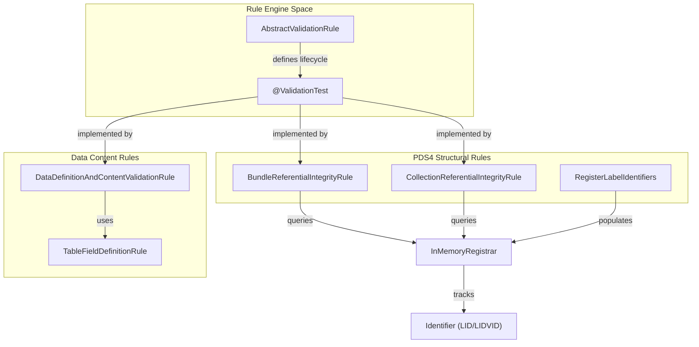
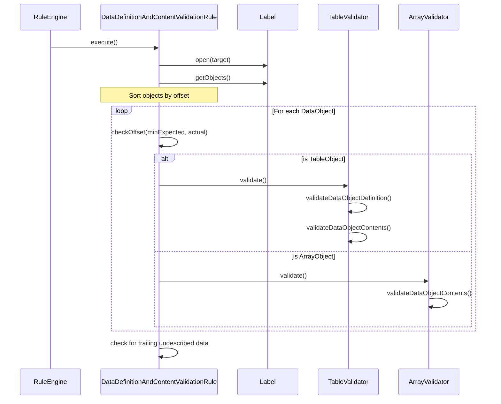

# Page: Validation Rules

# Validation Rules

Relevant source files

The following files were used as context for generating this wiki page:

- [.github/CODEOWNERS](.github/CODEOWNERS)
- [.gitignore](.gitignore)
- [LICENSE.md](LICENSE.md)
- [NOTICE.txt](NOTICE.txt)
- [README.md](README.md)
- [SECURITY.md](SECURITY.md)
- [src/main/java/gov/nasa/pds/tools/util/EncodingMimeMapping.java](src/main/java/gov/nasa/pds/tools/util/EncodingMimeMapping.java)
- [src/main/java/gov/nasa/pds/tools/util/VersionInfo.java](src/main/java/gov/nasa/pds/tools/util/VersionInfo.java)
- [src/main/java/gov/nasa/pds/tools/validate/AdditionalTarget.java](src/main/java/gov/nasa/pds/tools/validate/AdditionalTarget.java)
- [src/main/java/gov/nasa/pds/tools/validate/AggregateManager.java](src/main/java/gov/nasa/pds/tools/validate/AggregateManager.java)
- [src/main/java/gov/nasa/pds/tools/validate/InMemoryRegistrar.java](src/main/java/gov/nasa/pds/tools/validate/InMemoryRegistrar.java)
- [src/main/java/gov/nasa/pds/tools/validate/ProblemType.java](src/main/java/gov/nasa/pds/tools/validate/ProblemType.java)
- [src/main/java/gov/nasa/pds/tools/validate/TargetRegistrar.java](src/main/java/gov/nasa/pds/tools/validate/TargetRegistrar.java)
- [src/main/java/gov/nasa/pds/tools/validate/content/AudioVideo.java](src/main/java/gov/nasa/pds/tools/validate/content/AudioVideo.java)
- [src/main/java/gov/nasa/pds/tools/validate/content/table/TableContentProblem.java](src/main/java/gov/nasa/pds/tools/validate/content/table/TableContentProblem.java)
- [src/main/java/gov/nasa/pds/tools/validate/rule/AbstractValidationRule.java](src/main/java/gov/nasa/pds/tools/validate/rule/AbstractValidationRule.java)
- [src/main/java/gov/nasa/pds/tools/validate/rule/pds4/BundleReferentialIntegrityRule.java](src/main/java/gov/nasa/pds/tools/validate/rule/pds4/BundleReferentialIntegrityRule.java)
- [src/main/java/gov/nasa/pds/tools/validate/rule/pds4/CollectionReferentialIntegrityRule.java](src/main/java/gov/nasa/pds/tools/validate/rule/pds4/CollectionReferentialIntegrityRule.java)
- [src/main/java/gov/nasa/pds/tools/validate/rule/pds4/FileReferenceValidationRule.java](src/main/java/gov/nasa/pds/tools/validate/rule/pds4/FileReferenceValidationRule.java)
- [src/main/java/gov/nasa/pds/tools/validate/rule/pds4/RegisterLabelIdentifiers.java](src/main/java/gov/nasa/pds/tools/validate/rule/pds4/RegisterLabelIdentifiers.java)
- [src/main/java/gov/nasa/pds/tools/validate/rule/pds4/TableFieldDefinitionRule.java](src/main/java/gov/nasa/pds/tools/validate/rule/pds4/TableFieldDefinitionRule.java)
- [src/main/resources/validation-commands.xml](src/main/resources/validation-commands.xml)
- [src/site/site.xml](src/site/site.xml)
- [src/test/java/gov/nasa/pds/validate/EncodingMimeMappingTest.java](src/test/java/gov/nasa/pds/validate/EncodingMimeMappingTest.java)
- [src/test/resources/github51/valid/bundle_kaguya_derived.xml](src/test/resources/github51/valid/bundle_kaguya_derived.xml)
- [src/test/resources/github617/uvis_euv_2005_159_solar_time_series_ingress.xml](src/test/resources/github617/uvis_euv_2005_159_solar_time_series_ingress.xml)

The `validate` tool enforces a multi-layered suite of validation rules for both PDS4 and PDS3 data standards. These rules are implemented as discrete classes extending `AbstractValidationRule` [src/main/java/gov/nasa/pds/tools/validate/rule/AbstractValidationRule.java:38-38](), which are orchestrated by the rule engine using the `validation-commands.xml` configuration [src/main/resources/validation-commands.xml:1-58]().

Validation is categorized into structural integrity (bundles and collections), data content (tables and arrays), referential integrity (LID/LIDVID matching), and file-level compliance (naming and checksums).

### Rule Mapping: Code to Logic
The following diagram illustrates how the primary validation rule classes map to specific PDS validation requirements and how they interact with the core `InMemoryRegistrar`.

**Validation Rule Architecture**

Sources: [src/main/java/gov/nasa/pds/tools/validate/rule/AbstractValidationRule.java:38-63](), [src/main/java/gov/nasa/pds/tools/validate/rule/pds4/BundleReferentialIntegrityRule.java:46-46](), [src/main/java/gov/nasa/pds/tools/validate/InMemoryRegistrar.java:27-38]().

---

### PDS4 Bundle and Collection Rules
Structural validation ensures that PDS4 Bundles and Collections are internally consistent. The `BundleReferentialIntegrityRule` [src/main/java/gov/nasa/pds/tools/validate/rule/pds4/BundleReferentialIntegrityRule.java:46-46]() and `CollectionReferentialIntegrityRule` [src/main/java/gov/nasa/pds/tools/validate/rule/pds4/CollectionReferentialIntegrityRule.java:50-50]() verify that all members listed in the bundle/collection labels actually exist within the provided data set. These rules rely on the `InMemoryRegistrar` [src/main/java/gov/nasa/pds/tools/validate/InMemoryRegistrar.java:27-27]() to track discovered LIDs and LIDVIDs across the entire validation run.

For details, see [PDS4 Bundle and Collection Rules](#3.1).

Sources: [src/main/java/gov/nasa/pds/tools/validate/rule/pds4/BundleReferentialIntegrityRule.java:84-112](), [src/main/java/gov/nasa/pds/tools/validate/rule/pds4/CollectionReferentialIntegrityRule.java:72-93](), [src/main/java/gov/nasa/pds/tools/validate/InMemoryRegistrar.java:27-38]().

### Data Content Validation
This layer moves beyond the label XML and inspects the actual data bytes. The `DataDefinitionAndContentValidationRule` [src/main/resources/validation-commands.xml:19-19]() coordinates the extraction of data objects (Tables and Arrays) from the label. It enforces offset and size constraints and detects "undescribed data" at the end of files.

- **Tables:** Validated by `TableValidator`, checking for field formats and record delimiters. `TableFieldDefinitionRule` [src/main/java/gov/nasa/pds/tools/validate/rule/pds4/TableFieldDefinitionRule.java:25-25]() specifically checks that fields do not overlap and are within record boundaries.
- **Arrays:** Validated by `ArrayValidator`, ensuring data types match the label's `Element_Array` definitions.

For details, see [Data Content Validation](#3.2).

Sources: [src/main/java/gov/nasa/pds/tools/validate/rule/pds4/TableFieldDefinitionRule.java:104-153](), [src/main/resources/validation-commands.xml:19-19](), [src/main/java/gov/nasa/pds/tools/validate/content/table/TableContentProblem.java:28-28]().

### File Reference and Checksum Validation
The tool verifies that every file referenced in a label exists on disk and matches its expected checksum. The `FileReferenceValidationRule` [src/main/java/gov/nasa/pds/tools/validate/rule/pds4/FileReferenceValidationRule.java:67-67]() handles MD5 verification, file-size checks [src/main/java/gov/nasa/pds/tools/validate/rule/pds4/FileReferenceValidationRule.java:41-41](), and extension matching via `EncodingMimeMapping` [src/main/java/gov/nasa/pds/tools/util/EncodingMimeMapping.java:6-55](). It also includes specialized checkers for document formats like PDF/A via `PDFUtil` [src/main/java/gov/nasa/pds/tools/validate/rule/pds4/FileReferenceValidationRule.java:45-45]() and multimedia formats like MP4 or WAV via `AudioVideo` [src/main/java/gov/nasa/pds/tools/validate/content/AudioVideo.java:21-121]().

For details, see [File Reference and Checksum Validation](#3.3).

Sources: [src/main/java/gov/nasa/pds/tools/validate/rule/pds4/FileReferenceValidationRule.java:104-132](), [src/main/java/gov/nasa/pds/tools/validate/content/AudioVideo.java:30-66](), [src/main/java/gov/nasa/pds/tools/util/EncodingMimeMapping.java:30-54]().

### Context Product Reference Validation
The `ContextProductReferenceValidationRule` [src/main/resources/validation-commands.xml:15-15]() ensures that references to "Context Products" (e.g., Missions, Instruments, Spacecraft) use valid LIDs or LIDVIDs registered in the PDS system. It utilizes the `ReferentialIntegrityUtil` [src/main/java/gov/nasa/pds/tools/validate/rule/pds4/BundleReferentialIntegrityRule.java:26-26]() to perform these checks, identifying `CONTEXT_REFERENCE_NOT_FOUND` errors [src/main/java/gov/nasa/pds/tools/validate/ProblemType.java:45-45]().

For details, see [Context Product Reference Validation](#3.4).

Sources: [src/main/java/gov/nasa/pds/tools/validate/rule/pds4/BundleReferentialIntegrityRule.java:128-130](), [src/main/resources/validation-commands.xml:15-15](), [src/main/java/gov/nasa/pds/tools/validate/ProblemType.java:45-45]().

### File and Directory Naming Rules
Naming conventions are enforced via the `FileAndDirectoryNamingRule` [src/main/resources/validation-commands.xml:28-28]() and `SubdirectoryNamingRule` [src/main/resources/validation-commands.xml:41-41](). These rules check that file names and directory paths comply with PDS4 standards, reporting problems such as `FILE_NAME_HAS_INVALID_CHARS` [src/main/java/gov/nasa/pds/tools/validate/ProblemType.java:78-78]() or `DIR_NAME_TOO_LONG` [src/main/java/gov/nasa/pds/tools/validate/ProblemType.java:84-84]().

For details, see [File and Directory Naming Rules](#3.5).

Sources: [src/main/resources/validation-commands.xml:28-42](), [src/main/java/gov/nasa/pds/tools/validate/ProblemType.java:76-94]().

### PDS3 Volume Validation
Legacy PDS3 data is validated using the `VolumeValidationRule` [src/main/resources/validation-commands.xml:49-49](). This rule invokes the legacy validation logic, which checks for the presence of required PDS3 files like `AAREADME.TXT` and `VOLDESC.CAT`.

For details, see [PDS3 Volume Validation](#3.6).

Sources: [src/main/resources/validation-commands.xml:49-49]().

---

### Validation Logic Flow
The following diagram shows the sequence of checks performed when the `DataDefinitionAndContentValidationRule` is executed against a product.

**Data Content Validation Sequence**

Sources: [src/main/resources/validation-commands.xml:11-21](), [src/main/java/gov/nasa/pds/tools/validate/rule/pds4/TableFieldDefinitionRule.java:104-120]().
