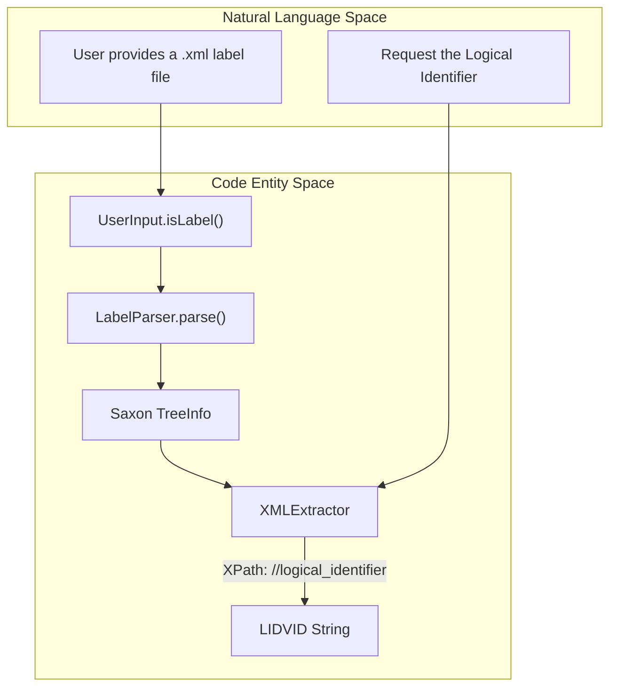
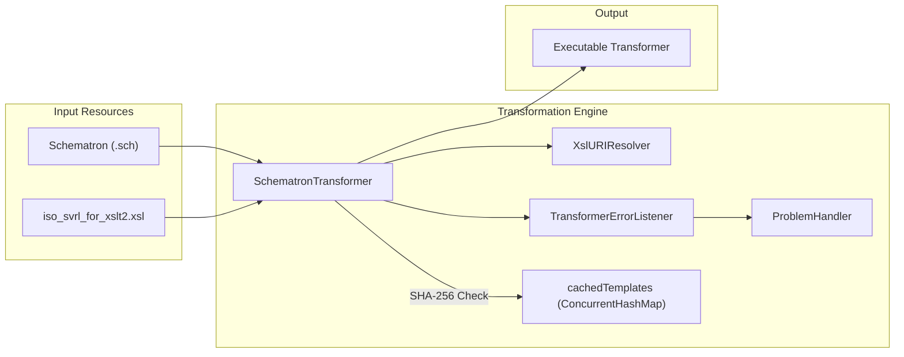

# Page: XML and Label Utilities

# XML and Label Utilities

Relevant source files

The following files were used as context for generating this wiki page:

- [src/main/java/gov/nasa/pds/tools/label/SchematronTransformer.java](src/main/java/gov/nasa/pds/tools/label/SchematronTransformer.java)
- [src/main/java/gov/nasa/pds/tools/label/TransformerErrorListener.java](src/main/java/gov/nasa/pds/tools/label/TransformerErrorListener.java)
- [src/main/java/gov/nasa/pds/tools/label/validate/DefaultDocumentValidator.java](src/main/java/gov/nasa/pds/tools/label/validate/DefaultDocumentValidator.java)
- [src/main/java/gov/nasa/pds/tools/label/validate/DocumentValidator.java](src/main/java/gov/nasa/pds/tools/label/validate/DocumentValidator.java)
- [src/main/java/gov/nasa/pds/tools/util/DOMSourceManager.java](src/main/java/gov/nasa/pds/tools/util/DOMSourceManager.java)
- [src/main/java/gov/nasa/pds/tools/util/FileService.java](src/main/java/gov/nasa/pds/tools/util/FileService.java)
- [src/main/java/gov/nasa/pds/tools/util/FlagsUtil.java](src/main/java/gov/nasa/pds/tools/util/FlagsUtil.java)
- [src/main/java/gov/nasa/pds/tools/util/LabelParser.java](src/main/java/gov/nasa/pds/tools/util/LabelParser.java)
- [src/main/java/gov/nasa/pds/tools/util/XMLErrorListener.java](src/main/java/gov/nasa/pds/tools/util/XMLErrorListener.java)
- [src/main/java/gov/nasa/pds/tools/util/XMLExtractor.java](src/main/java/gov/nasa/pds/tools/util/XMLExtractor.java)
- [src/main/java/gov/nasa/pds/tools/util/XslURIResolver.java](src/main/java/gov/nasa/pds/tools/util/XslURIResolver.java)
- [src/main/java/gov/nasa/pds/tools/validate/ContentProblem.java](src/main/java/gov/nasa/pds/tools/validate/ContentProblem.java)
- [src/main/java/gov/nasa/pds/validate/constants/Constants.java](src/main/java/gov/nasa/pds/validate/constants/Constants.java)
- [src/main/java/gov/nasa/pds/validate/ri/UserInput.java](src/main/java/gov/nasa/pds/validate/ri/UserInput.java)
- [src/test/java/gov/nasa/pds/tools/label/SchematronTransformerTest.java](src/test/java/gov/nasa/pds/tools/label/SchematronTransformerTest.java)
- [src/test/resources/github298/invalid/sentences.csv](src/test/resources/github298/invalid/sentences.csv)
- [src/test/resources/github298/invalid/sentences.xml](src/test/resources/github298/invalid/sentences.xml)
- [src/test/resources/github298/valid/sentences.csv](src/test/resources/github298/valid/sentences.csv)
- [src/test/resources/github298/valid/sentences.xml](src/test/resources/github298/valid/sentences.xml)
- [src/test/resources/github379/mix_cal_hk_fpac_report_20181204.tab](src/test/resources/github379/mix_cal_hk_fpac_report_20181204.tab)
- [src/test/resources/github379/mix_cal_hk_fpac_report_20181204.xml](src/test/resources/github379/mix_cal_hk_fpac_report_20181204.xml)
- [src/test/resources/github380/empty_file.txt](src/test/resources/github380/empty_file.txt)

The `validate` tool relies on a suite of utility classes for parsing, querying, and transforming PDS4 XML labels. These utilities wrap the Saxon XSLT/XPath engine and standard JAXP interfaces to provide specialized functionality for PDS4-specific validation tasks, such as high-performance Schematron transformation and XPath-based metadata extraction.

## XMLExtractor

`XMLExtractor` is a core utility used to perform XPath queries on PDS4 labels. It is built on top of the Saxon `XPathEvaluator` and is designed to handle the default namespaces typically found in PDS4 labels.

### Key Capabilities
*   **Namespace Handling**: Automatically detects the default namespace of a document using `namespace-uri(/*)` and sets it as the default element namespace for XPath queries [src/main/java/gov/nasa/pds/tools/util/XMLExtractor.java:69-71]().
*   **Node Extraction**: Returns results as `TinyNodeImpl` objects, which provide line number information essential for error reporting [src/main/java/gov/nasa/pds/tools/util/XMLExtractor.java:170-173]().
*   **XInclude Support**: Can be configured to support XIncludes based on global utility settings [src/main/java/gov/nasa/pds/tools/util/XMLExtractor.java:68]().
*   **Error Reporting**: Integrates with `XMLErrorListener` to catch and throw exceptions during document tree building [src/main/java/gov/nasa/pds/tools/util/XMLExtractor.java:87-89]().

### Common XPath Constants
The class defines several standard XPaths used throughout the application:
| Constant | XPath Expression | Purpose |
| :--- | :--- | :--- |
| `SCHEMA_LOCATION_XPATH` | `//*/@xsi:schemaLocation` | Finds schema locations in the label [src/main/java/gov/nasa/pds/tools/util/XMLExtractor.java:45](). |
| `XML_MODEL_XPATH` | `/processing-instruction('xml-model')` | Locates Schematron references [src/main/java/gov/nasa/pds/tools/util/XMLExtractor.java:47](). |
| `TARGET_NAMESPACE` | `//*/@targetNamespace` | Extracts the target namespace [src/main/java/gov/nasa/pds/tools/util/XMLExtractor.java:51](). |
| `DEFAULT_NAMESPACE` | `//*/namespace::*[name()='']` | Identifies the default namespace [src/main/java/gov/nasa/pds/tools/util/XMLExtractor.java:49](). |

Sources: [src/main/java/gov/nasa/pds/tools/util/XMLExtractor.java:38-114]()

## SchematronTransformer

`SchematronTransformer` is responsible for converting PDS4 Schematron files (.sch) into executable XSLT transformers. This process follows the ISO Schematron reference implementation using the `iso_svrl_for_xslt2.xsl` stylesheet [src/main/java/gov/nasa/pds/tools/label/SchematronTransformer.java:80-82]().

### Implementation Detail
1.  **Saxon Integration**: Explicitly sets the `TransformerFactory` to `net.sf.saxon.TransformerFactoryImpl` [src/main/java/gov/nasa/pds/tools/label/SchematronTransformer.java:62-63]().
2.  **Caching Strategy**: Implements a thread-safe `ConcurrentHashMap` to store compiled `Templates` [src/main/java/gov/nasa/pds/tools/label/SchematronTransformer.java:53](). Cache keys are generated using a SHA-256 hash of the Schematron source string to avoid redundant compilations during bundle validation [src/main/java/gov/nasa/pds/tools/label/SchematronTransformer.java:128-144]().
3.  **URI Resolution**: Uses `XslURIResolver` to find Schematron includes/imports within the application JAR [src/main/java/gov/nasa/pds/tools/label/SchematronTransformer.java:77]().
4.  **Two-Step Transformation**: It first transforms the Schematron source into an XSLT string using the ISO stylesheet, then compiles that string into a `Templates` object which can generate multiple `Transformer` instances [src/main/java/gov/nasa/pds/tools/label/SchematronTransformer.java:114-123]().

### Error Handling
The transformer uses `TransformerErrorListener` to capture issues during the Schematron-to-XSLT conversion process and route them to a `ProblemHandler` [src/main/java/gov/nasa/pds/tools/label/SchematronTransformer.java:116-118]().

Sources: [src/main/java/gov/nasa/pds/tools/label/SchematronTransformer.java:51-170](), [src/main/java/gov/nasa/pds/tools/label/TransformerErrorListener.java:34-109]()

## LabelParser

`LabelParser` provides a simplified interface for parsing XML sources into Saxon `TreeInfo` objects. It is used when a full document tree is needed for subsequent XPath operations without manual `Configuration` setup. It specifically configures Saxon with line numbering and XInclude awareness [src/main/java/gov/nasa/pds/tools/util/LabelParser.java:45-51]().

### Usage in Registry Integrity
The `UserInput` class utilizes `LabelParser` to extract Logical Identifiers (LIDs) from files provided via the CLI to determine if they are valid PDS4 labels [src/main/java/gov/nasa/pds/validate/ri/UserInput.java:44-49]().

Sources: [src/main/java/gov/nasa/pds/tools/util/LabelParser.java:26-57](), [src/main/java/gov/nasa/pds/validate/ri/UserInput.java:39-58]()

## Supporting XML Utilities

### XMLErrorListener
A dual-purpose class implementing both `javax.xml.transform.ErrorListener` and `org.xml.sax.ErrorHandler`. It converts XML parsing or transformation events into exceptions (either `TransformerException` or `SAXException`), ensuring that the validation process halts or logs appropriately when malformed XML is encountered [src/main/java/gov/nasa/pds/tools/util/XMLErrorListener.java:28-80]().

### XslURIResolver
A custom `URIResolver` that allows the `SchematronTransformer` to locate ISO Schematron stylesheets stored in the `schematron/` directory of the tool's resources [src/main/java/gov/nasa/pds/tools/util/XslURIResolver.java:37-65]().

### DefaultDocumentValidator
This class implements `DocumentValidator` to perform semantic checks on the XML label itself, such as verifying that the `xml-model` processing instruction uses the correct `schematypens` [src/main/java/gov/nasa/pds/tools/label/validate/DefaultDocumentValidator.java:40-93](). It uses `Constants.SCHEMATRON_SCHEMATYPENS_PATTERN` to parse the processing instruction [src/main/java/gov/nasa/pds/validate/constants/Constants.java:38-39]().

### FlagsUtil
A utility for tracking global validation state, such as whether content validation is enabled (`contentValidationFlag`) or the minimum severity level for reporting [src/main/java/gov/nasa/pds/tools/util/FlagsUtil.java:25-145]().

Sources: [src/main/java/gov/nasa/pds/tools/util/XMLErrorListener.java:28-80](), [src/main/java/gov/nasa/pds/tools/util/XslURIResolver.java:37-65](), [src/main/java/gov/nasa/pds/tools/label/validate/DefaultDocumentValidator.java:40-93](), [src/main/java/gov/nasa/pds/tools/util/FlagsUtil.java:25-145](), [src/main/java/gov/nasa/pds/validate/constants/Constants.java:38-39]()

## Data Flow: From Label to Metadata

The following diagram illustrates how the XML utilities interact to extract metadata (like a LIDVID) from a PDS4 label.

**Label Metadata Extraction Flow**

Sources: [src/main/java/gov/nasa/pds/validate/ri/UserInput.java:39-58](), [src/main/java/gov/nasa/pds/tools/util/LabelParser.java:41-52](), [src/main/java/gov/nasa/pds/tools/util/XMLExtractor.java:62-71]()

## Schematron Processing Pipeline

The transformation of a Schematron file into a functional validator involves several utility classes working in concert.

**Schematron Transformation Architecture**

Sources: [src/main/java/gov/nasa/pds/tools/label/SchematronTransformer.java:67-83](), [src/main/java/gov/nasa/pds/tools/label/SchematronTransformer.java:128-144](), [src/main/java/gov/nasa/pds/tools/util/XslURIResolver.java:45-55](), [src/main/java/gov/nasa/pds/tools/label/TransformerErrorListener.java:64-66]()
