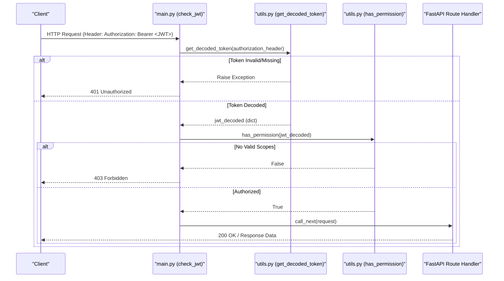
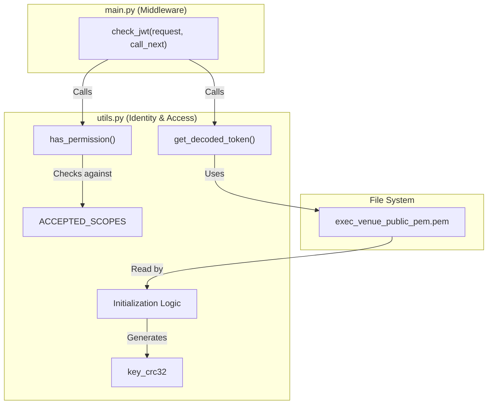

# Page: Authentication and Authorization (JWT)

# Authentication and Authorization (JWT)

Relevant source files

The following files were used as context for generating this wiki page:

- [main.py](main.py)
- [utils.py](utils.py)

The VenueServer employs a JSON Web Token (JWT) based security model to authenticate requests and authorize access to mission-critical commanding and telemetry endpoints. This implementation ensures that only authorized clients with valid cryptographic signatures and specific permission scopes can interact with the AMPCS/WSTS infrastructure.

## Security Model Overview

The system utilizes an asymmetric RS256 (RSA Signature with SHA-256) algorithm for token verification [utils.py:53-54](). The VenueServer acts as a Resource Server that validates tokens issued by an external Identity Provider (IdP) using a local public key.

### Key Components
*   **Algorithm**: RS256 (Asymmetric) [utils.py:54]().
*   **Public Key**: Loaded from `exec_venue_public_pem.pem` [utils.py:8-12]().
*   **Integrity Check**: A CRC32 checksum of the public key is calculated at startup to ensure the integrity of the security configuration [utils.py:22-25]().
*   **Token Format**: Standard HTTP `Authorization: Bearer <token>` header [utils.py:40-41]().

## Implementation Details

### Public Key Initialization
At module load time, `utils.py` attempts to locate and read the RSA public key. To prevent accidental configuration errors or tampering, it generates a hex-encoded CRC32 hash of the key buffer [utils.py:18-25](). This hash is logged during server initialization via `print_key_info()` [utils.py:32-34](), which is called by the main entry point [main.py:92]().

### Token Decoding and Validation
The decoding logic is encapsulated in `get_decoded_token`. It performs the following steps:
1.  Validates the presence of the `Authorization` header [utils.py:37-49]().
2.  Extracts the token from the `Bearer` scheme [utils.py:40-41]().
3.  Decodes the payload using the loaded `exec_venue_public_pem` and enforces the `RS256` algorithm [utils.py:53-54]().

### Authorization Scopes
The system defines a set of `ACCEPTED_SCOPES` that permit access to the API [utils.py:9]():
*   `execute:wsts`
*   `execute:sit`
*   `execute:testbed`
*   `execute:other`

The `has_permission` function implements backward-compatible logic to handle different JWT scope formats [utils.py:58-65](). It can process both simple string lists and complex dictionary objects (introduced in R14.3) where the scope is nested within a `scope` key [utils.py:62]().

**Sources:** [utils.py:8-65](), [main.py:92]()

## Data Flow: Authentication Middleware

The following diagram illustrates the flow of a request through the `check_jwt` middleware before reaching the FastAPI route handlers.

**Diagram: JWT Validation Flow**

**Sources:** [main.py:255-278](), [utils.py:36-65]()

## Code Entity Mapping

The relationship between the security configuration files and the verification logic is mapped below.

**Diagram: Security Entity Mapping**

**Sources:** [utils.py:8-16](), [utils.py:36-65](), [main.py:255-278]()

## Middleware Implementation

The `check_jwt` function is registered as a FastAPI middleware [main.py:255](). It excludes specific paths like `/docs`, `/openapi.json`, and `/health` to allow for monitoring and documentation access without credentials [main.py:257-260]().

| Feature | Implementation |
| :--- | :--- |
| **Header Check** | Extracts `Authorization` header from `request.headers` [main.py:263](). |
| **Error Handling** | Catches `jwt.ExpiredSignatureError` and `jwt.InvalidTokenError` to return appropriate 401 responses [main.py:269-273](). |
| **Scope Enforcement** | Invokes `has_permission` and returns 403 if the required `ACCEPTED_SCOPES` are missing [main.py:274-277](). |

**Sources:** [main.py:255-278](), [utils.py:58-65]()
