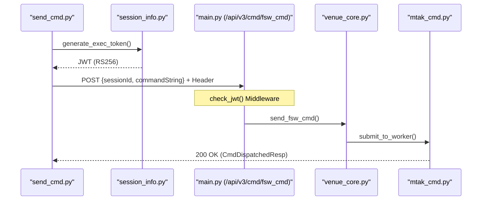
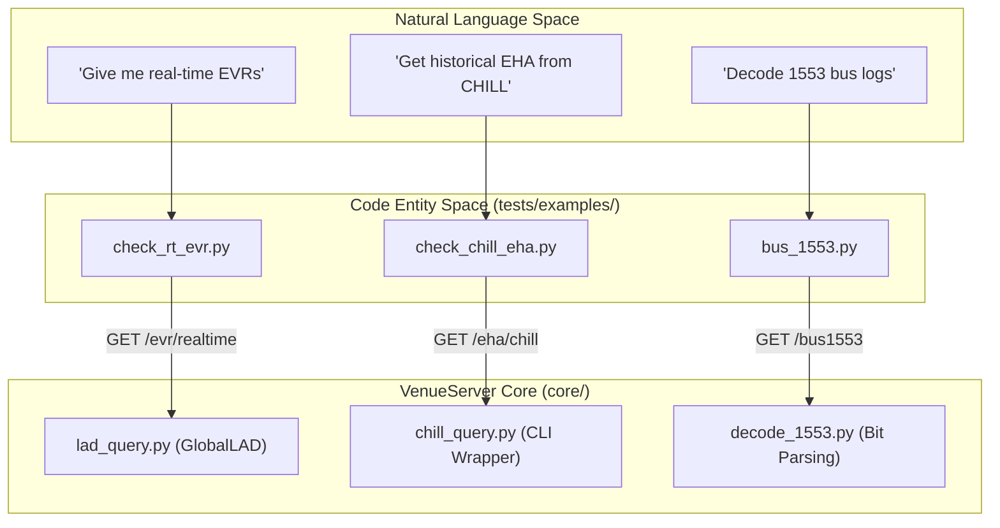

# Page: Client Library and Example Scripts

# Client Library and Example Scripts

Relevant source files

The following files were used as context for generating this wiki page:

- [tests/examples/bus_1553.py](tests/examples/bus_1553.py)
- [tests/examples/check_chill_eha.py](tests/examples/check_chill_eha.py)
- [tests/examples/check_chill_evr.py](tests/examples/check_chill_evr.py)
- [tests/examples/check_dps.py](tests/examples/check_dps.py)
- [tests/examples/check_rt_eha.py](tests/examples/check_rt_eha.py)
- [tests/examples/check_rt_evr.py](tests/examples/check_rt_evr.py)
- [tests/examples/client_example.py](tests/examples/client_example.py)
- [tests/examples/run_cs.py](tests/examples/run_cs.py)
- [tests/examples/send_cmd.py](tests/examples/send_cmd.py)
- [tests/examples/send_file.py](tests/examples/send_file.py)
- [tests/examples/send_sse_cmds.py](tests/examples/send_sse_cmds.py)
- [tests/examples/session_info.py](tests/examples/session_info.py)
- [tests/examples/set_tsr.py](tests/examples/set_tsr.py)
- [tests/examples/start_mtak.py](tests/examples/start_mtak.py)
- [tests/examples/stop_mtak.py](tests/examples/stop_mtak.py)
- [tests/venue_client.py](tests/venue_client.py)

This page documents the client-side infrastructure and example scripts used to interact with the VenueServer. It covers the helper utilities for JWT authentication, mission-specific constant resolution, and a suite of functional examples for commanding, telemetry querying, and custom script execution.

## Venue Client Infrastructure

The `tests/` directory contains the foundational logic for programmatically interacting with the VenueServer API. This infrastructure handles the security handshake and mission-specific environment detection.

### Session Information and Authentication
The file `tests/examples/session_info.py` serves as the central configuration point for all example scripts. It manages JWT generation using a private RSA key to simulate an authorized client.

*   **JWT Generation**: The `generate_exec_token()` function creates an RS256-encoded token. It includes scopes such as `execute:wsts`, `execute:testbed`, and `execute:sit` required by the server's middleware [tests/examples/session_info.py:21-32]().
*   **Private Key Loading**: It loads the private key from `exec_venue_private_pem.pem` located in the project root [tests/examples/session_info.py:12-15]().
*   **Mission Detection**: The script uses `socket.gethostname()` to differentiate between Europa (`eurc`) and Psyche (`psyche`) environments, setting mission-specific constants like `CMD_COUNTER_EHA` and `CMD_COMP_EVR` [tests/examples/session_info.py:42-57]().

### Request Patterns
Clients typically interact with the server using the `requests` library, passing the generated JWT in the `Authorization` header as a Bearer token [tests/examples/session_info.py:34-37]().

| Feature | Implementation |
| :--- | :--- |
| **Base URL** | `http://localhost:19443/api/v3` (via NGINX) [tests/examples/session_info.py:9]() |
| **Auth Header** | `{'Authorization': 'Bearer <token>'}` [tests/examples/session_info.py:35-37]() |
| **Data Format** | JSON for both GET (params) and POST (body) [tests/examples/session_info.py:25-26]() |

**Sources:** [tests/examples/session_info.py:1-58](), [tests/venue_client.py:1-100]()

---

## Example Scripts Reference

The `tests/examples/` directory contains runnable scripts demonstrating specific API capabilities.

### Commanding Examples
These scripts demonstrate how to dispatch different types of commands to the flight software or ground system.

*   **`send_cmd.py`**: A basic example of sending a Flight Software (FSW) command (e.g., `CMD_NO_OP`) using the `/cmd/fsw_cmd` endpoint [tests/examples/send_cmd.py:12-21]().
*   **`send_sse.py`**: Demonstrates Ground System (SSE) commanding. It includes a performance tracking loop that measures execution duration for multiple runs [tests/examples/send_sse_cmds.py:53-65]().
*   **`send_file.py`**: Covers binary file uplinks and SCMF (Spacecraft Command Message File) uploads. It also shows SSE commands used to adjust WSTS uplink rates [tests/examples/send_file.py:14-58]().

### Telemetry and Data Product Examples
These scripts show how to query real-time (GlobalLAD) and historical (CHILL) telemetry.

*   **`check_rt_evr.py` / `check_rt_eha.py`**: Query the `/evr/realtime` and `/eha/realtime` endpoints. Supports wildcard name matching (e.g., `*COMPLE*`) and multi-channel queries [tests/examples/check_rt_evr.py:38-47](), [tests/examples/check_rt_eha.py:38-47]().
*   **`check_chill_evr.py` / `check_chill_eha.py`**: Similar to real-time scripts but target the `/evr/chill` and `/eha/chill` endpoints for historical data, supporting filters like `evrType` (e.g., `FSW_REALTIME`, `SSE`) [tests/examples/check_chill_evr.py:64-74]().
*   **`check_dps.py`**: Demonstrates enabling data products via FSW command and then querying the `/dp` endpoint to verify their `COMPLETE` status [tests/examples/check_dps.py:10-51]().
*   **`bus_1553.py`**: Queries MIL-STD-1553 bus logs. It filters by SCET time range and specific variables (e.g., `REU_A_RSB_CMD_WORD_1`) [tests/examples/bus_1553.py:46-56]().

### Custom Script Lifecycle
The `run_cs.py` script provides a complete walkthrough of the Custom Script execution flow.

1.  **Start**: Posts a script payload including a SHA-256 `scriptHash` and input parameters to `/custom_script/start` [tests/examples/run_cs.py:12-59]().
2.  **Monitor**: Polls `/custom_script/status` using the `scriptRunId` returned by the start call [tests/examples/run_cs.py:68-85]().
3.  **Artifacts**: Downloads the resulting `tar.gz` archive containing logs and output files from `/custom_script/{scriptRunId}/files` [tests/examples/run_cs.py:89-97]().
4.  **Halt**: Demonstrates emergency termination via `/custom_script/halt` [tests/examples/run_cs.py:111-118]().

**Sources:** [tests/examples/send_cmd.py:1-25](), [tests/examples/check_rt_evr.py:1-114](), [tests/examples/run_cs.py:1-128](), [tests/examples/bus_1553.py:1-61]()

---

## Data Flow Diagrams

### Command Dispatch Flow
The following diagram illustrates the relationship between an example script, the VenueServer's REST layer, and the underlying MTAK integration.

**Command Execution Path**

**Sources:** [tests/examples/send_cmd.py:12-21](), [tests/examples/session_info.py:21-37](), [tests/venue_client.py:40-60]()

### Telemetry Query Logic
This diagram maps the natural language query requirements to the specific code entities responsible for data retrieval.

**Telemetry Retrieval Mapping**

**Sources:** [tests/examples/check_rt_evr.py:14-23](), [tests/examples/check_chill_eha.py:14-25](), [tests/examples/bus_1553.py:46-56]()
