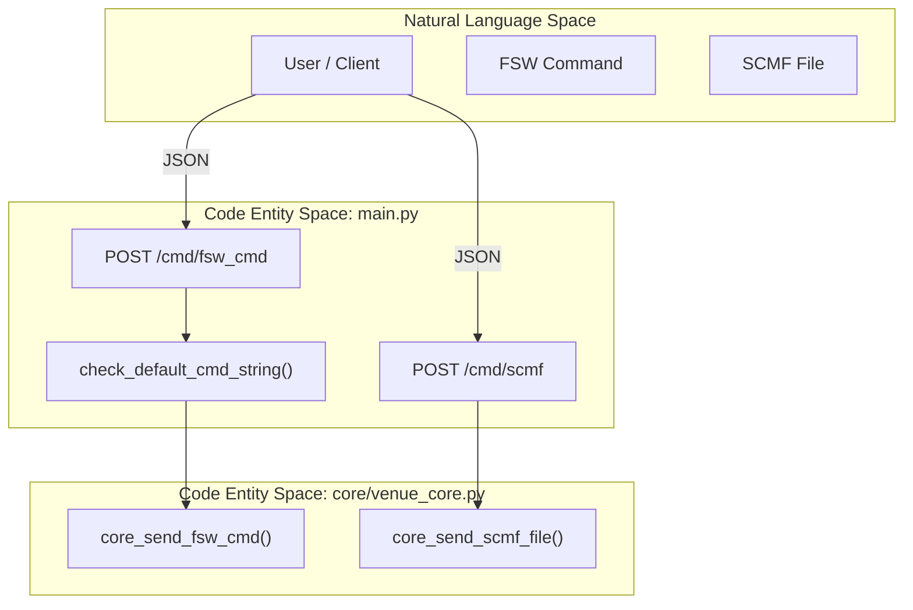
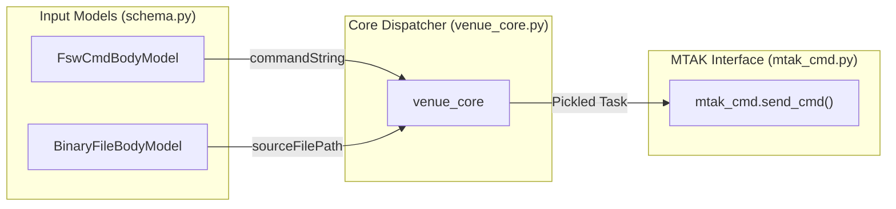

# Page: Commanding Endpoints

# Commanding Endpoints

Relevant source files

The following files were used as context for generating this wiki page:

- [core/schema.py](core/schema.py)
- [main.py](main.py)
- [openapi.yaml](openapi.yaml)

The Commanding Endpoints provide a RESTful interface for dispatching commands and files to a spacecraft or testbed via the Mission Tool and Analysis Kernel (MTAK). These endpoints wrap the underlying MTAK functionality, providing validation, timeout management, and support for redundant flight computer strings (A/B).

## Overview of Command Dispatch

All commanding endpoints follow a similar pattern: they receive a Pydantic-validated request body, determine the target flight computer string, and delegate the execution to `venue_core`. The core logic then interfaces with the `mtak_cmd` module to communicate with the AMPCS MTAK instance.

### Command Response Model
All successful command dispatches return a `CmdDispatchedResp` object:
*   `cmdRequested`: A string mirroring the command stem and arguments received.
*   `dispatchTime`: An ISO-8601 formatted string (e.g., `2017-09-25T03:57:42.676Z`) indicating when the command was sent to the GDS.

**Sources:** [core/schema.py:49-54](), [openapi.yaml:194-207]()

---

## Endpoint Specifications

### 1. FSW Command (`POST /api/v3/cmd/fsw_cmd`)
Dispatches a Flight Software (FSW) command. This is the primary endpoint for standard spacecraft commanding.

*   **Model**: `FswCmdBodyModel` [core/schema.py:39-47]()
*   **Key Features**:
    *   `validate`: A boolean flag (default `True`). If enabled, AMPCS validates the command against the FSW dictionary before radiation [core/schema.py:43-44]().
    *   `commandString`: The full command stem and arguments.
*   **Implementation**: Calls `venue_core.core_send_fsw_cmd` [main.py:183-187]().

### 2. HW Command (`POST /api/v3/cmd/hw_cmd`)
Dispatches Hardware (HW) commands.

*   **Model**: `HwCmdBodyModel` [core/schema.py:56-62]()
*   **Implementation**: Calls `venue_core.core_send_hw_cmd` [main.py:211-214]().

### 3. SSE Command (`POST /api/v3/cmd/sse`)
Dispatches System Support Equipment (SSE) commands.

*   **Model**: `SseCmdBodyModel` [core/schema.py:64-67]()
*   **Implementation**: Calls `venue_core.core_send_sse_cmd` [main.py:237-239]().

### 4. Binary File Upload (`POST /api/v3/cmd/binary_file`)
Uploads a binary file from the GDS host to a target path onboard the spacecraft. The server automatically builds the binary into a Spacecraft Command Message File (SCMF) based on the provided `fileType`.

*   **Model**: `BinaryFileBodyModel` [core/schema.py:69-78]()
*   **Parameters**:
    *   `sourceFilePath`: Full path on the GDS host.
    *   `targetFilePath`: Destination path on the spacecraft (e.g., `/eng1/data.bin`).
    *   `fileType`: Integer ID used to determine the SCMF construction logic.
*   **Implementation**: Calls `venue_core.core_send_binary_file` [main.py:265-271]().

### 5. SCMF Dispatch (`POST /api/v3/cmd/scmf`)
Sends a pre-constructed Spacecraft Command Message File (SCMF) to the spacecraft.

*   **Model**: `ScmfFileBodyModel` [core/schema.py:80-84]()
*   **Parameters**:
    *   `disableChecks`: If `True`, bypasses AMPCS internal validation of the SCMF file format.
*   **Implementation**: Calls `venue_core.core_send_scmf_file` [main.py:293-296]().

**Sources:** [main.py:169-307](), [core/schema.py:39-85]()

---

## String Selection Logic

The `StringSelection` enum manages which side of a redundant flight computer receives the command.

| Value | Description |
| :--- | :--- |
| `A` | Send to Side A only. |
| `B` | Send to Side B only. |
| `AB` | Send to both Side A and Side B. |
| `DEFAULT` | Uses the `defaultCmdString` configured during MTAK startup. |

### Implementation Flow
When a command is received, `main.py` uses `check_default_cmd_string` to resolve the selection. If `DEFAULT` is passed, the value is set to `None`, signaling `venue_core` to use the session's default [main.py:99-104](), [main.py:181-186]().

**Sources:** [core/schema.py:33-37](), [main.py:99-104]()

---

## Data Flow and Code Entities

The following diagrams illustrate the transition from the REST API layer to the internal core logic.

### Command Dispatch Architecture
This diagram maps the FastAPI route handlers to the business logic functions in `venue_core.py`.

**Sources:** [main.py:169-195](), [main.py:283-307](), [main.py:99-104]()

### Data Model Transformation
This diagram shows how request models are processed and passed through the system.

**Sources:** [core/schema.py:39-48](), [core/schema.py:69-79](), [main.py:183-187](), [main.py:265-271]()

---

## Validation and Error Handling

1.  **Request Validation**: FastAPI uses Pydantic models (e.g., `FswCmdBodyModel`) to enforce data types and constraints (e.g., `timeout` must be $\ge 0$) [core/schema.py:47]().
2.  **Timeout Management**: Every command request includes a `timeout` parameter (defaulting to 10 seconds). This timeout is enforced during the dispatch process to prevent hanging the API worker [core/schema.py:47](), [core/schema.py:61]().
3.  **Error Responses**: If a command fails (e.g., MTAK is not running, session ID is invalid, or file not found), the server returns a `400 Bad Request` with an `ErrorResponse` object containing the exception traceback [main.py:190-194](), [core/schema.py:19-20]().

**Sources:** [core/schema.py:1-85](), [main.py:169-307]()
