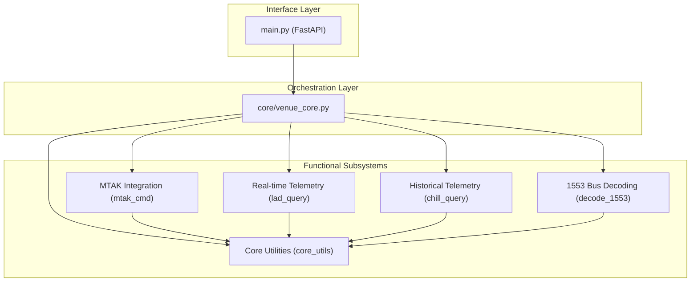
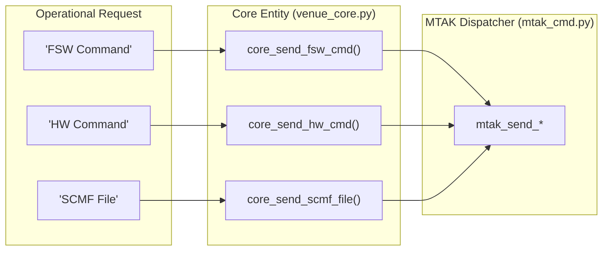
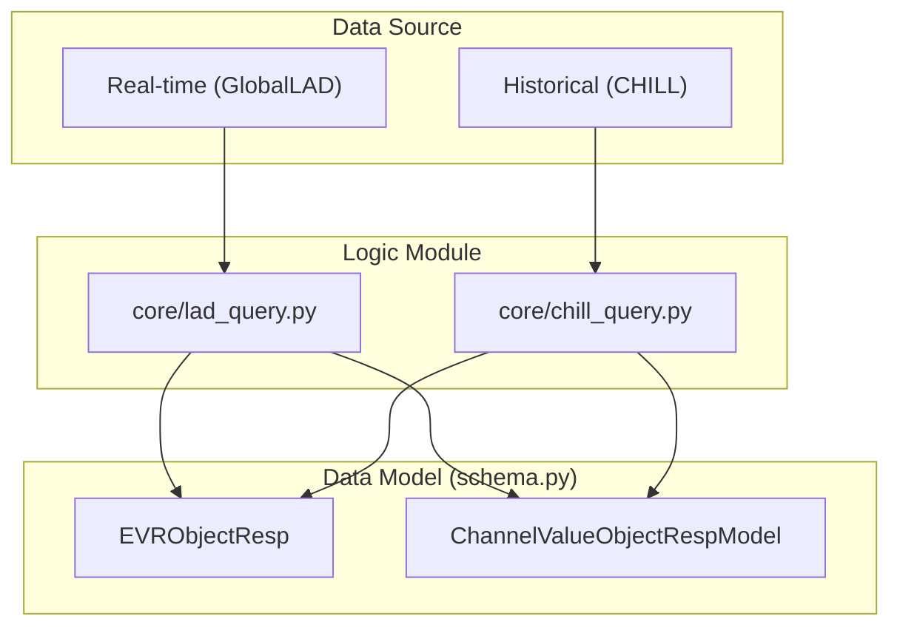

# Page: Core Module Architecture

# Core Module Architecture

Relevant source files

The following files were used as context for generating this wiki page:

- [core/__init__.py](core/__init__.py)
- [core/config.py](core/config.py)
- [core/venue_core.py](core/venue_core.py)

The `core/` Python package serves as the primary business-logic layer of the Ingenium VenueServer. It abstracts the complexities of interfacing with the Advanced Multi-Mission Operations System (AMMOS) and Mission Tool Suite (MTAK) components, providing a unified internal API for the FastAPI `main.py` entry point.

## System Hierarchy and Dependency Graph

The architecture follows a strict hierarchical flow where `venue_core.py` acts as the central dispatcher. It coordinates between specialized sub-modules for commanding, telemetry retrieval, and data decoding.

### Logical Dependency Flow
The diagram below illustrates how high-level requests from `main.py` are routed through the orchestration layer to specific functional modules.

**VenueServer Internal Routing**

**Sources:** [core/venue_core.py:1-38](), [core/mtak_cmd.py:1-20]()

---

## Subsystem Overview

### 1. Orchestration Layer (`venue_core.py`)
`venue_core.py` is the primary entry point for all business logic. It imports and wraps functions from all other sub-modules, providing a simplified interface for the API routes. It handles:
*   **Command Dispatching:** Routing FSW, HW, SSE, and SCMF commands to the MTAK subsystem [core/venue_core.py:73-181]().
*   **Telemetry Routing:** Deciding whether to query `lad_query` for real-time data or `chill_query` for historical data based on the request parameters [core/venue_core.py:205-240]().
*   **Custom Script Execution:** Managing the lifecycle of user-provided Python scripts, including environment setup in `/tmp/cs` and result archiving [core/venue_core.py:39-41]().

For details, see [venue_core: Orchestration Layer](#3.1).

### 2. MTAK Integration
The MTAK (Mission Tool Suite) integration is responsible for sending commands to the Flight Software (FSW) and Hardware (HW). It uses a three-layer approach to ensure stability:
*   **`worker_process.py`**: Provides process isolation using `ProcessPoolExecutor` to prevent MTAK's native libraries from interfering with the main server's logging and signal handling [core/worker_process.py:1-50]().
*   **`mtak_cmd.py`**: Manages the high-level "submit-and-wait" logic and cleanup hooks [core/mtak_cmd.py:40-60]().
*   **`mtak_funcs.py`**: Contains the actual wrappers for `mtak.wrapper` that run inside the isolated worker process [core/mtak_funcs.py:10-30]().

For details, see [MTAK Integration (mtak_cmd, mtak_funcs, worker_process)](#3.2).

### 3. Telemetry Querying
The system supports two distinct telemetry paths:
*   **Real-time (`lad_query.py`)**: Connects to the `GlobalLAD` (Latest Appearance Data) service to retrieve the most recent Event Records (EVRs) and Channel Values (EHA) [core/lad_query.py:5-25]().
*   **Historical (`chill_query.py`)**: Wraps CHILL CLI tools (e.g., `chill_get_evrs`, `chill_get_chanvals`) to extract data from the mission archives [core/chill_query.py:10-45]().

For details, see [Telemetry Querying (lad_query and chill_query)](#3.3).

### 4. MIL-STD-1553 Bus Log Decoding
The `decode_1553.py` module parses raw bus logs into human-readable engineering units. It utilizes an XML dictionary to define signal bit-offsets, lengths, and conversion polynomials [core/decode_1553.py:15-60](). It supports both standard signals and multi-line "extended" signals [core/decode_1553.py:200-250]().

For details, see [MIL-STD-1553 Bus Log Decoding](#3.4).

### 5. Shared Utilities and Models
A set of common utilities and data structures are shared across all modules:
*   **`core_utils.py`**: Contains time parsing logic (ISO to DOY), path conversion for dynamic log discovery, and subprocess wrappers [core/core_utils.py:1-100]().
*   **`schema.py`**: Defines Pydantic models used for request validation and response serialization [core/schema.py:1-50]().
*   **`config.py`**: Stores global constants like `SHORT_TIMEOUT` and `SCLKSCET_LOOKBACK` [core/config.py:1-3]().

For details, see [Core Utilities and Data Models (core_utils, schema, config)](#3.5).

---

## Mapping Natural Language to Code Entities

The following diagrams bridge the gap between operational concepts and the specific Python entities that implement them.

### Command Dispatch Mapping
This diagram shows how different command types are handled by specific functions in `venue_core.py` and subsequently dispatched.

**Command Flow Mapping**

**Sources:** [core/venue_core.py:73-181](), [core/mtak_cmd.py:20-100]()

### Telemetry Retrieval Mapping
This diagram maps the source of data (Real-time vs. Historical) to the underlying code modules and their respective data models.

**Telemetry Path Mapping**

**Sources:** [core/lad_query.py:1-50](), [core/chill_query.py:1-50](), [core/schema.py:1-100]()
