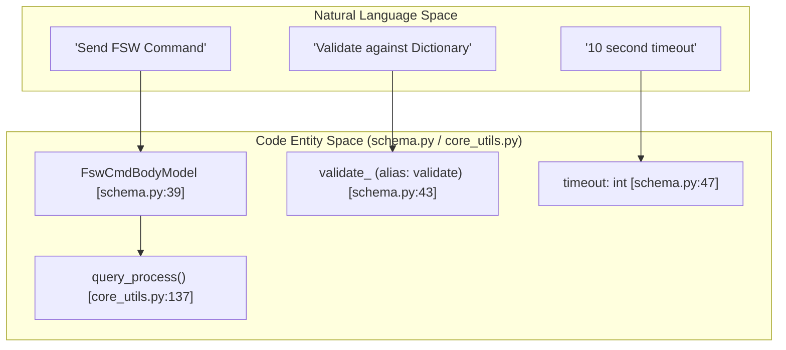
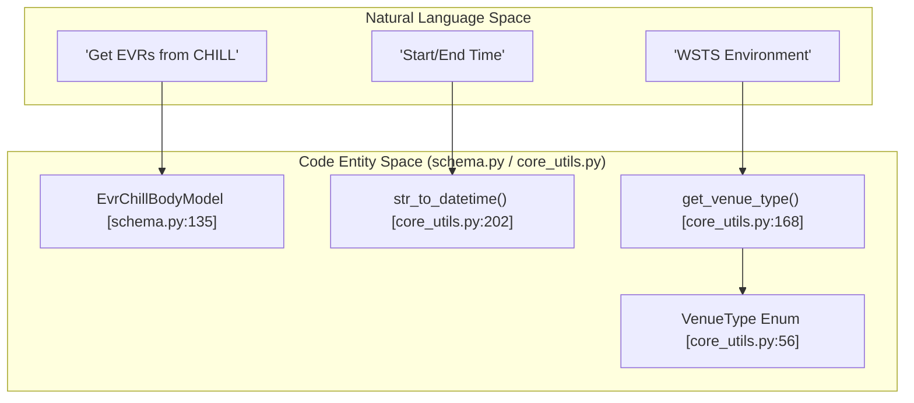

# Page: Core Utilities and Data Models (core_utils, schema, config)

# Core Utilities and Data Models (core_utils, schema, config)

Relevant source files

The following files were used as context for generating this wiki page:

- [core/config.py](core/config.py)
- [core/core_utils.py](core/core_utils.py)
- [core/schema.py](core/schema.py)

This page details the shared infrastructure of the VenueServer, including the global configuration constants, the Pydantic schemas used for API validation, and the core utility functions that handle time parsing, subprocess management, and environment discovery.

## Global Configuration (config.py)

The `core/config.py` file defines system-wide constants that govern timeout behaviors and telemetry lookback windows.

| Constant | Value | Description |
| :--- | :--- | :--- |
| `SHORT_TIMEOUT` | 10 | Default timeout in seconds for quick operations like command dispatch. |
| `SCLKSCET_LOOKBACK` | 30 | The window in seconds used when correlating SCLK and SCET time formats. |
| `REVERSE_SCMF_TIMEOUT` | 60 | Timeout for reverse SCMF operations. |

**Sources:** [core/config.py:1-3]()

---

## Data Models and Schemas (schema.py)

The VenueServer uses **Pydantic** models to define the structure of every request and response. These models ensure type safety, provide automatic documentation for the FastAPI endpoints, and handle the mapping between JSON field names (e.g., `validate`) and Python-safe identifiers (e.g., `validate_`).

### Command and Session Enums
The system uses several enumerations to constrain inputs for commanding and session management:
*   **`DefaultCmdString`**: Defines sides of the flight computer (`A`, `B`, `AB`) used during MTAK startup [core/schema.py:5-8]().
*   **`StringSelection`**: Extends command targeting to include `DEFAULT` [core/schema.py:33-37]().
*   **`TimeType`**: Supports `ERT`, `SCET`, and `SCLK` for telemetry queries [core/schema.py:125-129]().

### Key Request Models
| Model | Usage | Key Fields |
| :--- | :--- | :--- |
| `MtakStartBodyModel` | `POST /mtak/start` | `sessionIds`, `timeout`, `defaultCmdString` |
| `FswCmdBodyModel` | `POST /cmd/fsw_cmd` | `sessionId`, `commandString`, `validate`, `stringSelection` |
| `ScmfFileBodyModel` | `POST /cmd/scmf` | `sessionId`, `filePath`, `disableChecks` |
| `EvrChillBodyModel` | Telemetry Queries | `evrType`, `timeType`, `startTime`, `endTime` |

**Sources:** [core/schema.py:22-28](), [core/schema.py:39-48](), [core/schema.py:80-84](), [core/schema.py:135-150]()

---

## Core Utilities (core_utils.py)

The `core/core_utils.py` module provides the functional "glue" for the server, ranging from time conversions to low-level process management.

### Time Handling and Validation
The server must handle multiple time formats, primarily **ISO-8601** and **DOY (Day of Year)**.
*   **`str_to_datetime`**: Attempts to parse a string as ISO first, then falls back to DOY format [core/core_utils.py:202-212]().
*   **`normalize_with_microsecs`**: Ensures time strings have consistent 6-digit microsecond precision, truncating nanoseconds if necessary [core/core_utils.py:124-135]().
*   **`update_timeout`**: A utility for iterative processes to calculate remaining time relative to a start timestamp [core/core_utils.py:113-122]().

### Subprocess Wrapper (`query_process`)
The `query_process` function is the standard interface for executing CLI tools like `chill_get_evrs`. It handles:
1.  Logging the command and start time [core/core_utils.py:140-141]().
2.  Executing via `subprocess.check_output` with a specified timeout [core/core_utils.py:142]().
3.  Abridging large responses (over 1024 chars) in logs to prevent `rsyslogd` buffer overflows [core/core_utils.py:148-152]().

### Environment and Venue Discovery
The utility layer abstracts the mission-specific environment variables:
*   **`get_venue_type()`**: Reads `INGENIUM_VENUE_TYPE` and returns a `VenueType` enum (`WSTS`, `TESTBED`, or `ATLO`) [core/core_utils.py:168-179]().
*   **`get_testbed_name()`**: Retrieves `INGENIUM_TESTBED_NAME` for hardware-specific routing [core/core_utils.py:181-190]().

### Error Handling Utilities
*   **`ErrorCapturing`**: A context manager that redirects `stderr` to a `StringIO` buffer, allowing the capture of library-level errors into a list [core/core_utils.py:77-89]().
*   **`get_last_error_from_logs`**: Uses the `tail` command to extract the most recent "ERROR" or "FATAL" line from MTAK log files [core/core_utils.py:90-110]().

**Sources:** [core/core_utils.py:1-245]()

---

## Data Flow: Natural Language to Code Entities

The following diagrams illustrate how high-level concepts (like a "Command Request") are translated into specific Pydantic models and utility functions within the codebase.

### Command Dispatch Flow
This diagram maps the path of a Commanding request from the API layer through the schema validation to the utility execution.

**Sources:** [core/schema.py:39-48](), [core/core_utils.py:137-155]()

### Telemetry Query Logic
This diagram bridges the concept of "Historical Data" to the specific models and time-parsing utilities used to retrieve it.

**Sources:** [core/schema.py:135-150](), [core/core_utils.py:202-212](), [core/core_utils.py:168-179](), [core/core_utils.py:56-60]()
