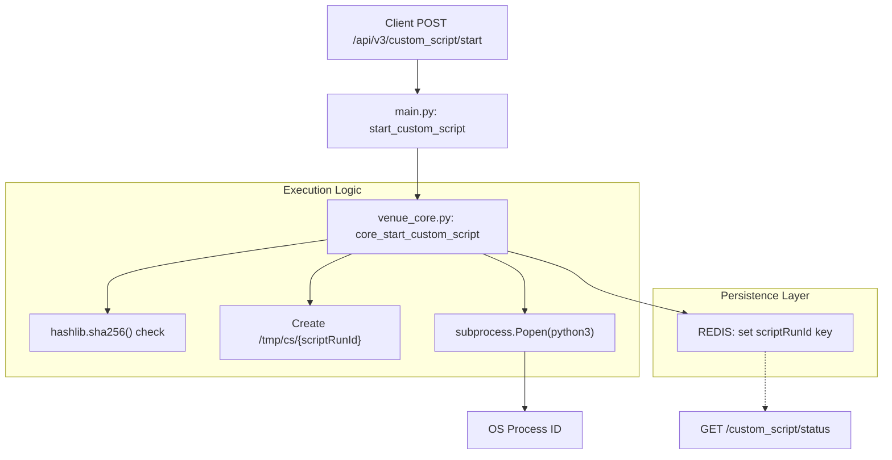
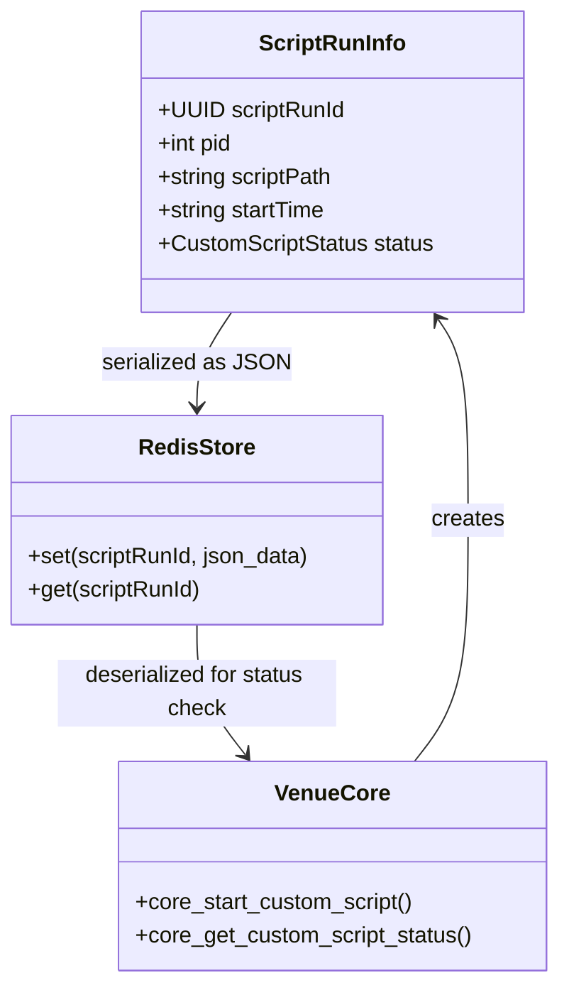

# Page: Custom Script Execution Endpoints

# Custom Script Execution Endpoints

Relevant source files

The following files were used as context for generating this wiki page:

- [core/schema.py](core/schema.py)
- [core/venue_core.py](core/venue_core.py)
- [main.py](main.py)
- [openapi.yaml](openapi.yaml)

The Custom Script Execution API allows users to execute arbitrary Python scripts on the VenueServer host within a managed environment. This system provides lifecycle management (start, status, halt), integrity verification via SHA-256 hashing, and artifact retrieval through a dedicated workspace.

## System Overview

Scripts are executed as independent subprocesses. Each execution is assigned a unique `scriptRunId` (UUID) and a dedicated workspace in `/tmp/cs/{scriptRunId}`. The state of each script (PID, status, start time) is persisted in a **REDIS** database to allow for asynchronous status polling across different API worker processes.

### Custom Script States
The execution lifecycle follows the `CustomScriptStatus` enumeration:
*   `IN_PROGRESS`: The script is currently running.
*   `SUCCESS`: The script exited with return code 0.
*   `FAILED`: The script exited with a non-zero return code.
*   `HALTED`: The script was manually terminated by a user request.

Sources: `core/schema.py:279-284`(), `core/venue_core.py:1020-1035`()

## Data Flow and Code Entity Mapping

The following diagram illustrates the transition from a REST request to the underlying Python execution logic and state persistence.

### Script Execution Flow
"Natural Language Space" to "Code Entity Space" mapping for script startup.

Sources: `main.py:347-375`(), `core/venue_core.py:1048-1110`()

## API Endpoints

### 1. Start Script Execution
**Endpoint:** `POST /api/v3/custom_script/start`

Starts a script located in the `CUSTOM_SCRIPT_BASE_DIR`. 

*   **Integrity Check**: The request must include a `scriptHash`. The server calculates the SHA-256 hash of the file at `scriptPath` and compares it to the provided hash. If they do not match, a `400 Bad Request` is returned.
*   **Workspace**: A directory is created at `/tmp/cs/{scriptRunId}`. The script's `stdout` and `stderr` are redirected to `output.log` within this directory.

**Implementation Detail**:
The script is executed using `subprocess.Popen`. The server does not wait for completion; it stores the `scriptRunId`, `pid`, and `startTime` in REDIS and returns immediately.

Sources: `core/venue_core.py:1048-1110`(), `main.py:347-375`()

### 2. Check Script Status
**Endpoint:** `GET /api/v3/custom_script/status`

Retrieves the current state of a script execution.

*   **Process Monitoring**: The server uses `psutil.pid_exists(pid)` to check if the process is still active.
*   **Completion Detection**: If the process has finished, the server checks the exit code. A return code of 0 results in `SUCCESS`, otherwise `FAILED`.
*   **Log Tail**: The last 10 lines of the script's `output.log` are returned in the `terminalOutput` field.

Sources: `core/venue_core.py:1124-1180`(), `main.py:387-404`()

### 3. Halt Script Execution
**Endpoint:** `POST /api/v3/custom_script/halt`

Terminates a running script.

*   **Logic**: The server retrieves the PID from REDIS and sends `signal.SIGTERM`. If the process persists, it follows up with `signal.SIGKILL`.
*   **Cleanup**: The state in REDIS is updated to `HALTED`.

Sources: `core/venue_core.py:1182-1211`(), `main.py:406-422`()

### 4. Retrieve Script Artifacts
**Endpoint:** `GET /api/v3/custom_script/{scriptRunId}/files`

Downloads all files generated by the script in its `/tmp/cs/{scriptRunId}` workspace.

*   **Archiving**: The server uses the `tarfile` module to create a `tar.gz` archive of the entire workspace directory.
*   **Response**: Returns a `FileResponse` containing the compressed archive.

Sources: `core/venue_core.py:1213-1229`(), `main.py:424-436`()

## State Management Architecture

The system relies on REDIS to maintain state across the asynchronous execution lifecycle.

### REDIS State Mapping
Mapping of code variables to REDIS persistence.

Sources: `core/schema.py:286-292`(), `core/venue_core.py:1096-1101`(), `core/venue_core.py:1130-1135`()

## Configuration and Environment
The following variables control the script execution environment:

| Variable | Description | Default / Example |
| :--- | :--- | :--- |
| `CUSTOM_SCRIPT_BASE_DIR` | Root directory where authorized scripts reside. | `/proj/europa/scripts` |
| `CUSTOM_SCRIPT_LOG_PATH_BASE` | Base directory for execution workspaces. | `/tmp/cs` |

Sources: `core/venue_core.py:39-41`(), `main.py:40`()
