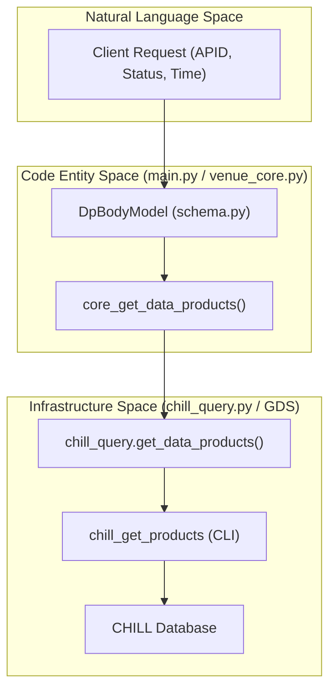
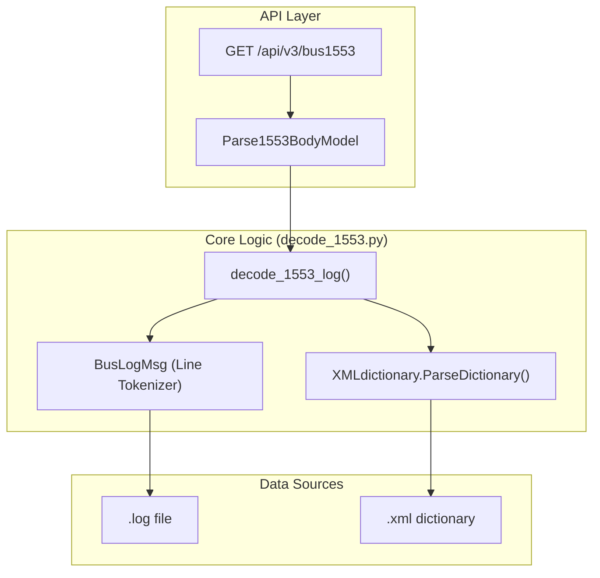

# Page: Data Products and 1553 Bus Endpoints

# Data Products and 1553 Bus Endpoints

Relevant source files

The following files were used as context for generating this wiki page:

- [core/decode_1553.py](core/decode_1553.py)
- [core/schema.py](core/schema.py)
- [main.py](main.py)
- [openapi.yaml](openapi.yaml)

This page documents the REST API endpoints for querying mission data products and parsing MIL-STD-1553 bus logs. These endpoints provide specialized data retrieval capabilities beyond standard telemetry, interfacing with the CHILL database for data products and utilizing custom bit-level decoding for 1553 bus traffic.

## Data Products (DP) Queries

The `GET /api/v3/dp` endpoint allows users to query for data products stored in the CHILL database. Queries can be filtered by Application Process Identifier (APID), status, and time range.

### Implementation and Data Flow

When a request is made to `/api/v3/dp`, `main.py` calls `venue_core.core_get_data_products` [main.py:274-285](). This function orchestrates the query by invoking `chill_query.get_data_products` [core/venue_core.py:355-364]().

The `chill_query` module constructs a command-line call to `chill_get_products`, a GDS utility [core/chill_query.py:101-140](). The output of this command is parsed from CSV format and mapped into the `DataProductObjectRespModel` [core/schema.py:171-190]().

### Code Entity Mapping: Data Products

The following diagram shows the relationship between the API request model and the internal execution logic.

Title: Data Product Query Flow

Sources: [main.py:274-285](), [core/venue_core.py:355-364](), [core/chill_query.py:101-140](), [core/schema.py:161-170]()

### Data Models
*   **DpBodyModel**: Defines query parameters including `sessionId`, `apid`, `status` (e.g., COMPLETE, PARTIAL), `timeType` (ERT, SCET, SCLK), and time bounds [core/schema.py:161-170]().
*   **DataProductObjectRespModel**: Represents a single data product record, containing fields like `fileName`, `fileSize`, `apid`, `vcid`, and `dssId` [core/schema.py:171-190]().

---

## MIL-STD-1553 Bus Log Parsing

The `GET /api/v3/bus1553` endpoint provides a service for decoding raw MIL-STD-1553 bus log files into human-readable engineering values based on an XML signal dictionary.

### Log Decoding Process

1.  **Request Handling**: `main.py` receives a `Parse1553BodyModel` and passes it to `venue_core.core_parse_1553_bus_log` [main.py:302-311]().
2.  **File Discovery**: The `PathConverter` utility is used to resolve the physical path of the log file based on environment variables like `BUS_1553_LOGFILE_PATH` [core/decode_1553.py:4-5](), [core/venue_core.py:375-378]().
3.  **Dictionary Loading**: The `XMLdictionary` class parses the XML definition file (specified by `LOGFILE_1553_DICTIONARY_FILE_PATH`) to extract signal maps, word offsets, and polynomial coefficients [core/decode_1553.py:23-40]().
4.  **Tokenization**: The log file is read line-by-line. Each line is converted into a `BusLogMsg` object, which extracts the Remote Terminal (RT), Subaddress (SA), and raw data words [core/decode_1553.py:131-172]().
5.  **Bit-level Extraction**: Using the `bitstring` library, specific bits are extracted from the 1553 words according to the dictionary's `data_word_map` [core/decode_1553.py:9-10](), [core/decode_1553.py:90-99]().
6.  **Conversion**: Raw bits are converted to engineering units using linear/polynomial expansion or enumeration lookups [core/decode_1553.py:101-112]().

### Code Entity Mapping: 1553 Decoding

Title: 1553 Bus Log Parsing Logic

Sources: [main.py:302-311](), [core/decode_1553.py:23-41](), [core/decode_1553.py:131-142](), [core/venue_core.py:371-395]()

### Key Classes and Functions

| Entity | Description |
| :--- | :--- |
| `XMLdictionary` | Parses XML signal definitions into Python dictionaries indexed by signal name [core/decode_1553.py:23](). |
| `BusLogMsg` | Parses a single line of a 1553 text log into attributes (RT, SA, SCLK, Words) [core/decode_1553.py:131](). |
| `decode_1553_log` | The main entry point in `decode_1553.py` that iterates through the log and applies signal definitions [core/decode_1553.py:328](). |
| `BitArray` | External library used to perform bit-slicing on the 16-bit 1553 words [core/decode_1553.py:9](). |

### Time Handling (IRIG and SCET)
The 1553 parser supports two time formats:
*   **Standard**: ISO-like format (`%Y%m%dT%H%M%S`) [core/decode_1553.py:157]().
*   **IRIG**: Uses Day-of-Year (DOY). Because IRIG logs often omit the year, the `assumed_year` parameter (from `IRIG_SOURCE` environment config) is used to construct a valid `datetime` object [core/decode_1553.py:146-154]().

### Extended Signals
The parser handles "Extended Signals" which span multiple 1553 messages or require state-tracking across lines. The `XMLdictionary` class specifically looks for an `extended_signals` block in the XML [core/decode_1553.py:35-38]().

Sources: [core/decode_1553.py:1-172](), [core/venue_core.py:371-395](), [main.py:302-311](), [core/schema.py:192-208]()
