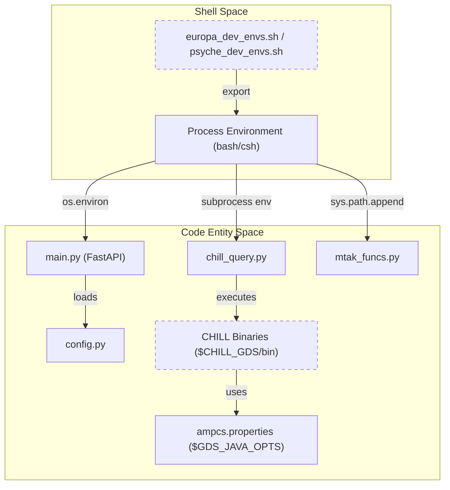
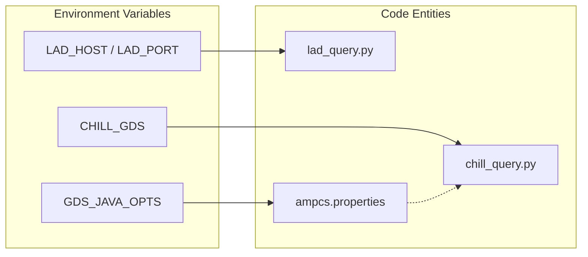

# Page: Environment Configuration

# Environment Configuration

Relevant source files

The following files were used as context for generating this wiki page:

- [config/europa_dev_envs.sh](config/europa_dev_envs.sh)
- [config/gds_config/ampcs.properties](config/gds_config/ampcs.properties)
- [config/psyche_dev_envs.sh](config/psyche_dev_envs.sh)

The Ingenium VenueServer employs an environment-variable-driven configuration model to maintain flexibility across different mission deployments (e.g., Europa Clipper, Psyche) and development environments. This model allows the same codebase to interface with mission-specific Ground Data System (GDS) binaries, telemetry databases, and filesystem structures by sourcing a shell script before the server process starts.

## Mission-Specific Environment Files

Configuration is primarily managed through mission-specific shell scripts located in the `config/` directory. These files export the necessary variables for the Python runtime, MTAK integration, and AMPCS toolsuite.

### Europa Configuration (`europa_dev_envs.sh`)
This file configures the environment for the Europa mission. It points to the `eurc` AMPCS instance and disables 1553 bus logging features which are not utilized by this mission.
[config/europa_dev_envs.sh:1-21]()

### Psyche Configuration (`psyche_dev_envs.sh`)
This file configures the environment for the Psyche mission. Notably, it defines complex path patterns for 1553 bus logs and points to the `psyche` AMPCS instance.
[config/psyche_dev_envs.sh:1-21]()

---

## Key Configuration Variables

The following table details the critical environment variables consumed by the VenueServer:

| Variable | Description | Example Value |
| :--- | :--- | :--- |
| `ING_VENUE_DIR` | Root directory of the VenueServer installation. Used to locate config files. | `/home/user/venueserver2` |
| `ING_MTAK_DIR` | Path to the MTAK Python wrapper library. | `/home/user/mtak/r8.x/python` |
| `ING_LOG_DIR` | Directory where rotating log files are stored. | `/home/user/venueserver2/logs` |
| `CHILL_GDS` | Root path to the mission's AMPCS installation. | `/ammos/ampcs/mpcs/eurc/current` |
| `GDS_JAVA_OPTS` | Java system properties for AMPCS tools. Crucial for overriding CSV output formats. | `-DGdsUserConfigDir=...` |
| `LAD_HOST` | Hostname for the GlobalLAD telemetry service. Defaults to local hostname if unset. | `europa-gds-host` |
| `LAD_PORT` | Port for the GlobalLAD service. | `8887` |
| `BUS_1553_LOGFILE_PATH` | Shell-style pattern for locating 1553 bus logs (Psyche only). | `/var/ammos/archive/...` |
| `IRIG_SOURCE` | Boolean flag indicating if time tags use IRIG source (affects year parsing). | `false` |

**Sources:** [config/europa_dev_envs.sh:3-21](), [config/psyche_dev_envs.sh:3-20]()

---

## Data Flow: From Environment to Server Startup

The environment variables are consumed at various stages of the application lifecycle. At startup, the shell environment must be populated so that the Python `os.environ` mapping contains the required keys.

### AMPCS Property Overrides
The variable `GDS_JAVA_OPTS` points AMPCS tools to `config/gds_config/ampcs.properties`. This file is critical because it defines the `csvQuery` format for `EvrQuery`, `ChanvalQuery`, and `ProductQuery`. The VenueServer's `venue_core.py` expects CHILL CLI outputs to match these specific column orderings for CSV parsing.

**Sources:** [config/gds_config/ampcs.properties:1-8](), [config/europa_dev_envs.sh:21-21]()

### Environment Initialization Diagram
This diagram illustrates how the shell environment bridges the gap between the filesystem configuration and the `main.py` execution.

**Configuration Loading Logic**

**Sources:** [config/europa_dev_envs.sh:19-21](), [config/gds_config/ampcs.properties:1-8]()

---

## Implementation Details

### Path Resolution and `PathConverter`
For variables like `BUS_1553_LOGFILE_PATH`, the system supports dynamic tokens such `$YYYY`, `$DOY`, and `$GDS_HOSTNAME`. These are resolved at runtime by the `PathConverter` utility class within the core logic to find the actual log files on the filesystem.

**Sources:** [config/psyche_dev_envs.sh:14-14]()

### MTAK Library Integration
The `ING_MTAK_DIR` variable is used to dynamically include the MTAK Python wrappers into the application's `sys.path`. This allows the `WorkerProcess` to import `mtak.wrapper` without requiring a global installation of the MTAK libraries.

**Sources:** [config/europa_dev_envs.sh:4-4]()

### Telemetry Query Configuration
The following diagram maps the environment variables to the specific code entities responsible for telemetry retrieval.

**Telemetry Config Mapping**

**Sources:** [config/europa_dev_envs.sh:10-12](), [config/europa_dev_envs.sh:19-21](), [config/gds_config/ampcs.properties:1-8]()
