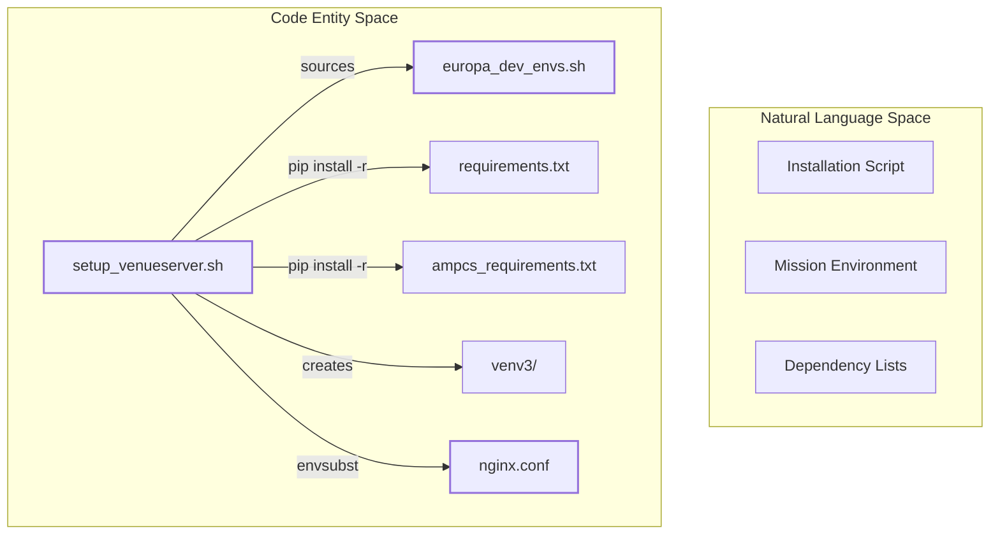
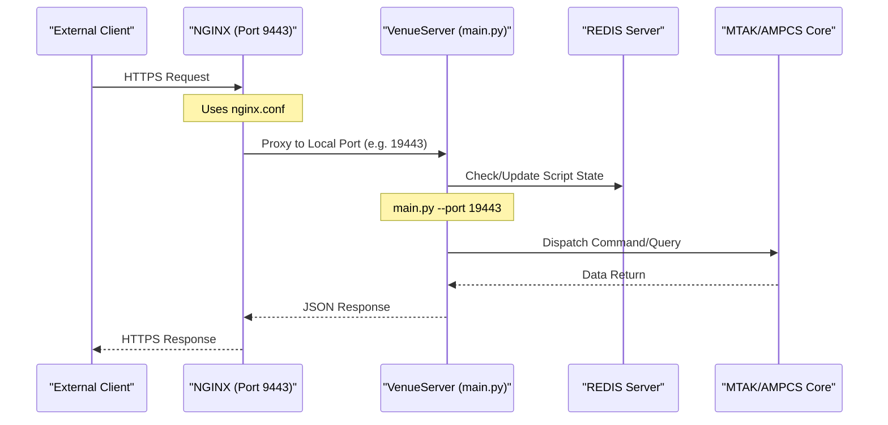

# Page: Getting Started: Installation and Deployment

# Getting Started: Installation and Deployment

<details>
<summary>Relevant source files</summary>

The following files were used as context for generating this wiki page:

- [requirements.txt](requirements.txt)
- [setup_venueserver.sh](setup_venueserver.sh)
- [start_nginx.sh](start_nginx.sh)
- [start_redis.sh](start_redis.sh)
- [start_venueserver.sh](start_venueserver.sh)

</details>


This page provides a technical guide for the installation, configuration, and deployment of the Ingenium VenueServer. The deployment architecture relies on a stack consisting of **NGINX** (reverse proxy), **FastAPI** (application server), and **REDIS** (state persistence).

## Installation Overview

The installation process is automated via `setup_venueserver.sh`. This script handles the creation of a Python 3 virtual environment, installation of mission-specific and application dependencies, and generation of the NGINX configuration.

### Prerequisites
- **Python 3** and `virtualenv` package.
- **NGINX** installed on the host system.
- **REDIS** (`redis-server`) installed on the host system.
- **Environment File**: A mission-specific shell script (e.g., `europa_dev_envs.sh`) defining critical paths like `ING_MTAK_DIR` and `ING_VENUE_DIR`.

### Execution Flow: setup_venueserver.sh
The setup script performs the following operations:
1.  **Environment Validation**: Sources the provided `-f ENV_FILE` and verifies that `ING_MTAK_DIR` is defined [setup_venueserver.sh:44-57]().
2.  **Virtual Environment**: Creates a `venv3` directory if it does not exist [setup_venueserver.sh:59-65]().
3.  **Dependency Management**: 
    - Installs AMPCS-specific requirements from `$ING_MTAK_DIR/ampcs_requirements.txt` [setup_venueserver.sh:85-86]().
    - Installs VenueServer core requirements from `requirements.txt` [setup_venueserver.sh:87-88]().
    - Explicitly overrides `click` to version `>=7.0.0` to satisfy FastAPI requirements [setup_venueserver.sh:89-90]().
4.  **NGINX Configuration**: Uses `envsubst` to populate `nginx.conf.template` with environment variables, generating a localized `nginx.conf` [setup_venueserver.sh:94-99]().

### Setup Logic and Entity Mapping
The following diagram illustrates how the setup script bridges the local environment to the operational configuration.

**Diagram: Setup Entity Mapping**

**Sources:** [setup_venueserver.sh:1-102](), [requirements.txt:1-11]()

---

## Deployment and Service Orchestration

Running the VenueServer requires starting three distinct components. While they are started via separate scripts, they operate as a unified system.

### 1. Persistence Layer (REDIS)
REDIS is used for tracking the state of custom script executions and persistent data. It is started as a background process.
- **Script**: `start_redis.sh`
- **Action**: Executes `/usr/bin/redis-server &` [start_redis.sh:1-3]().

### 2. Reverse Proxy (NGINX)
NGINX handles SSL/TLS termination and routes requests to the appropriate FastAPI instances based on the generated `nginx.conf`.
- **Script**: `start_nginx.sh`
- **Commands**: Supports `start`, `stop`, and `reload` [start_nginx.sh:33-52]().
- **Implementation**: It dynamically locates the `error_log` and `nginx.pid` paths by parsing the generated configuration file to ensure clean signal handling [start_nginx.sh:27-31]().

### 3. Application Server (FastAPI/Uvicorn)
The `start_venueserver.sh` script launches the FastAPI application. Multiple instances can be run on different ports (e.g., 19443, 19444) to support multiple mission venues.
- **Environment Setup**: Sets `LC_ALL` and `LANG` to `en_US.UTF-8` to prevent Uvicorn startup errors [start_venueserver.sh:7-8]().
- **PYTHONPATH**: It prepends the `venv3` site-packages and `ING_MTAK_DIR` to `PYTHONPATH` to ensure the correct versions of libraries (like `click`) are loaded over system defaults [start_venueserver.sh:80]().
- **Execution**: Launches `main.py` using the Python interpreter within the virtual environment [start_venueserver.sh:89]().

---

## Data Flow and Process Architecture

The deployment architecture follows a layered approach where NGINX acts as the gateway to one or more VenueServer instances.

**Diagram: Deployment Architecture and Data Flow**


### Component Summary Table

| Component | Start Script | Key Configuration/Dependencies | Role |
| :--- | :--- | :--- | :--- |
| **REDIS** | `start_redis.sh` | `/usr/bin/redis-server` | Custom script state persistence |
| **NGINX** | `start_nginx.sh` | `nginx.conf`, `nginx.conf.template` | SSL Termination & Port Mapping |
| **VenueServer** | `start_venueserver.sh` | `main.py`, `venv3`, `ENV_FILE` | REST API & Business Logic |

**Sources:** [start_redis.sh:1-3](), [start_nginx.sh:1-54](), [start_venueserver.sh:1-90](), [setup_venueserver.sh:94-99]()

---

## Step-by-Step Execution Guide

To deploy a new instance from a clean shell:

1.  **Clone the Repository** and navigate to the root directory.
2.  **Run Setup**: 
    ```bash
    ./setup_venueserver.sh -f config/europa_dev_envs.sh
    ```
    *This creates `venv3` and generates `nginx.conf` [setup_venueserver.sh:64, 98]().*
3.  **Start Persistence**:
    ```bash
    ./start_redis.sh
    ```
4.  **Start Proxy**:
    ```bash
    ./start_nginx.sh start
    ```
5.  **Start Venue Instance(s)**:
    ```bash
    ./start_venueserver.sh -p 19443 -f config/europa_dev_envs.sh
    ```
    *Repeat with different ports for additional venues if required by your `nginx.conf` mapping.*

**Sources:** [setup_venueserver.sh:7-15](), [start_venueserver.sh:11-21](), [start_nginx.sh:5-12]()
