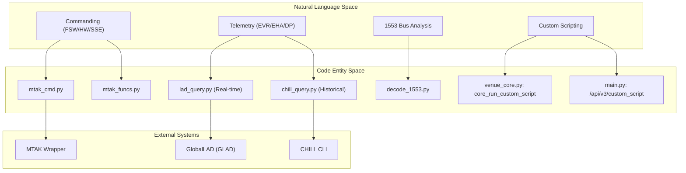
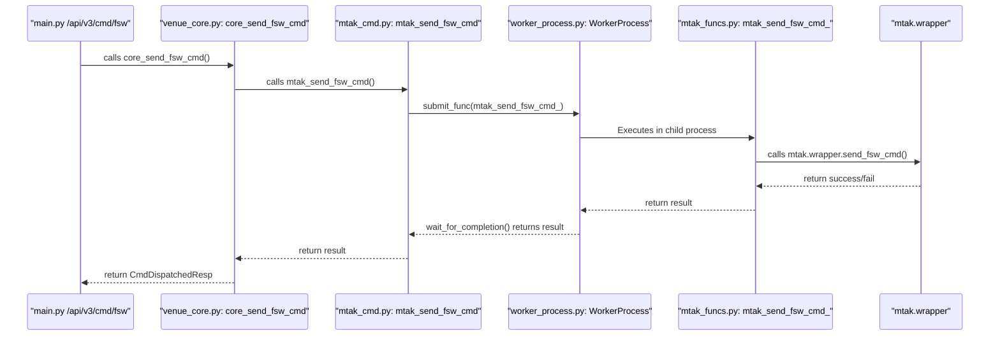

# Page: Glossary

# Glossary

Relevant source files

The following files were used as context for generating this wiki page:

- [README.md](README.md)
- [config/gds_config/ampcs.properties](config/gds_config/ampcs.properties)
- [core/chill_query.py](core/chill_query.py)
- [core/core_utils.py](core/core_utils.py)
- [core/decode_1553.py](core/decode_1553.py)
- [core/lad_query.py](core/lad_query.py)
- [core/mtak_cmd.py](core/mtak_cmd.py)
- [core/schema.py](core/schema.py)
- [core/venue_core.py](core/venue_core.py)
- [utils.py](utils.py)

This page provides definitions for codebase-specific terms, acronyms, and domain concepts used within the Ingenium VenueServer. Each entry includes technical details and pointers to the relevant code entities.

## System Architecture and Domain Space

The following diagram maps high-level domain concepts to their specific implementation entities within the `venue-agent-ampcs` codebase.

**Diagram: Domain Concept to Code Entity Mapping**

Sources: [core/mtak_cmd.py:22-25](), [core/lad_query.py:27-29](), [core/chill_query.py:7-9](), [core/decode_1553.py:131-142](), [core/venue_core.py:41-44]()

---

## Definitions

### A
*   **AMMOS**: Advanced Multi-Mission Operations System. The broader ecosystem within which this server operates.
*   **AMPCS**: AMMOS Mission Operations Center (MOC) Processing and Control System. The ground data system that VenueServer interfaces with for commanding and telemetry [config/gds_config/ampcs.properties:1-3]().
*   **APID**: Application Process Identifier. Used to filter Data Products [core/chill_query.py:112-114]().
*   **ATLO**: Assembly, Test, and Launch Operations. A specific `VenueType` [core/core_utils.py:59-59]().

### B
*   **Bus 1553**: MIL-STD-1553 serial data bus. The VenueServer parses logs from this bus to decode spacecraft component communication [core/decode_1553.py:131-142]().

### C
*   **CHILL**: The command-line interface for querying historical telemetry from AMPCS. VenueServer wraps these calls in `chill_query.py` [core/chill_query.py:10-12]().
*   **Custom Script**: User-provided Python scripts executed in a sandboxed `/tmp/cs` directory with lifecycle managed via REDIS [core/venue_core.py:39-41]().

### D
*   **DN/EU**: Data Number (raw) and Engineering Unit (converted). Telemetry values returned in EHA queries [config/gds_config/ampcs.properties:5-5]().
*   **DOY**: Day of Year (e.g., 2023-150). A common time format used in ground systems [core/core_utils.py:234-245]().
*   **DP**: Data Product. Files generated by the spacecraft or ground system [core/chill_query.py:112-114]().
*   **DSSID**: Deep Space Station Identifier. Part of the metadata for telemetry [config/gds_config/ampcs.properties:3-3]().

### E
*   **EHA**: Engineering Health Analysis. Refers to channelized telemetry (telemetry points/sensors) [core/chill_query.py:66-68]().
*   **ERT**: Earth Received Time. The time a packet was received on the ground [core/schema.py:126-126]().
*   **EVR**: Event Record. Log messages or "events" generated by Flight Software (FSW) or System Support Equipment (SSE) [core/core_utils.py:31-34]().

### F
*   **FSW**: Flight Software. The software running on the spacecraft [core/core_utils.py:21-21]().

### G
*   **GlobalLAD (GLAD)**: A service used for real-time telemetry access. VenueServer uses the `lad` Python client to query it [core/lad_query.py:6-7]().

### H
*   **HW Command**: Hardware Command. Commands sent directly to hardware components rather than FSW [core/mtak_cmd.py:104-111]().

### I
*   **IRIG**: Inter-Range Instrumentation Group time codes. Used in 1553 bus logs, often requiring an `assumed_year` because the format may lack year information [core/decode_1553.py:146-154]().

### M
*   **MTAK**: Mission Test and Analysis Kernel. The integration layer used for commanding. VenueServer manages MTAK via a `WorkerProcess` to isolate Java/Python bridge issues [core/mtak_cmd.py:13-20]().

### P
*   **PathConverter**: A utility used to resolve dynamic file paths (e.g., paths containing `$YYYY` or `$DOY`) for 1553 logs [core/decode_1553.py:4-4]().

### R
*   **RT/SA/TR**: Remote Terminal, Sub-Address, and Transmit/Receive bit. Standard 1553 bus addressing components used during decoding [core/decode_1553.py:115-118]().

### S
*   **SCET**: Spacecraft Event Time. The time an event occurred on the spacecraft [core/schema.py:127-127]().
*   **SCLK**: Spacecraft Clock. The raw counter on the spacecraft [core/schema.py:128-128]().
*   **SCMF**: Spacecraft Command Message File. A file format used to bundle commands for uplink [core/mtak_cmd.py:200-205]().
*   **scriptRunId**: A unique UUID generated for every custom script execution to track status in REDIS [core/venue_core.py:21-21]().
*   **SSE**: System Support Equipment. Ground hardware that simulates or supports spacecraft interfaces [core/core_utils.py:34-34]().
*   **StringSelection**: Selection of which flight computer string (A, B, or both AB) to target with a command [core/schema.py:33-37]().

### V
*   **VCID**: Virtual Channel Identifier. Used in telemetry packet routing [config/gds_config/ampcs.properties:3-3]().
*   **VenueType**: Classification of the environment (WSTS, TESTBED, or ATLO) [core/core_utils.py:56-60]().

### W
*   **WorkerProcess**: A wrapper around `multiprocessing.Process` used to execute MTAK functions in a separate process to prevent logging interference and allow clean shutdowns [core/mtak_cmd.py:2-13]().
*   **WSTS**: Workstation Support Test Set. A software-only spacecraft simulator [core/core_utils.py:57-57]().

---

## Data Flow: Command Dispatch

The following diagram illustrates how a command request moves from the REST API through the internal worker processes to the MTAK wrapper.

**Diagram: Command Dispatch Data Flow**

Sources: [core/venue_core.py:73-92](), [core/mtak_cmd.py:72-101](), [core/mtak_cmd.py:13-13](), [core/schema.py:49-55]()