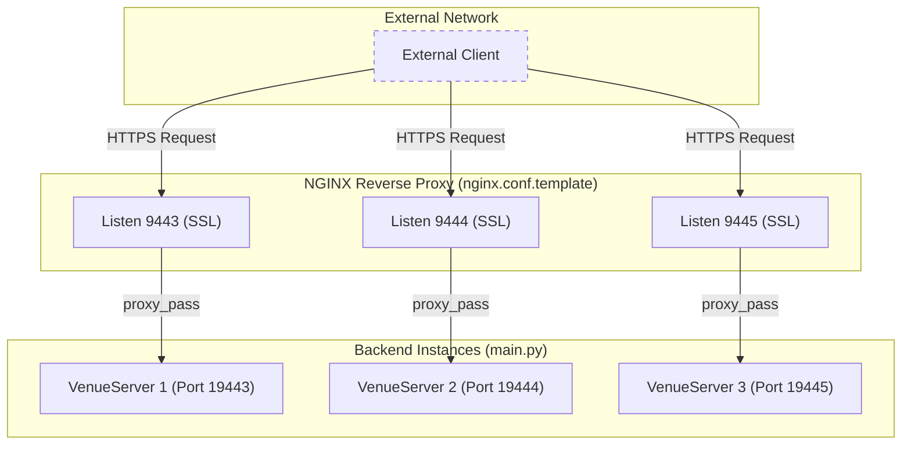
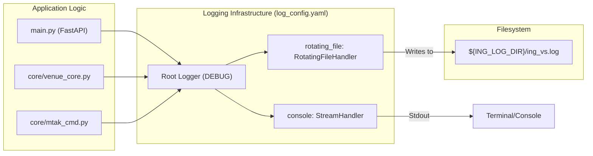

# Page: Infrastructure: NGINX, REDIS, and Logging

# Infrastructure: NGINX, REDIS, and Logging

Relevant source files

The following files were used as context for generating this wiki page:

- [log_config.yaml](log_config.yaml)
- [nginx.conf.template](nginx.conf.template)
- [start_redis.sh](start_redis.sh)

This page details the foundational infrastructure components of the Ingenium VenueServer, including the reverse-proxy configuration, the state persistence layer for custom scripts, and the centralized logging architecture.

## NGINX Reverse Proxy

The VenueServer utilizes NGINX as a reverse proxy to handle SSL/TLS termination and to route external traffic to specific backend FastAPI instances. The configuration is generated from a template to support environment-specific variables like hostnames and directory paths.

### Port Mapping and Routing
The NGINX configuration maps external HTTPS ports (9443–9445) to internal application ports (19443–19445). This allows multiple VenueServer instances (e.g., for different mission strings or environments) to coexist on a single host while sharing the same SSL certificates.

| External Port (SSL) | Internal Port (FastAPI) | Log Files |
| :--- | :--- | :--- |
| `9443` | `19443` | `nginx_access_9443.log`, `nginx_error_9443.log` |
| `9444` | `19444` | `nginx_access_9444.log`, `nginx_error_9444.log` |
| `9445` | `19445` | `nginx_access_9445.log`, `nginx_error_9445.log` |

### SSL/TLS Configuration
Security is enforced at the NGINX layer using the following parameters:
*   **Protocols**: Restricted to `TLSv1.2` [nginx.conf.template:46]().
*   **Certificates**: Loaded from `${ING_VENUE_DIR}/config/.secret/.server.crt` and the corresponding key [nginx.conf.template:44-45]().
*   **HSTS**: The `Strict-Transport-Security` header is applied to all responses to ensure subsequent connections use HTTPS [nginx.conf.template:39]().
*   **Ciphers**: High-strength ECDHE-based ciphers are explicitly configured [nginx.conf.template:47]().

### Proxy Behavior
NGINX is configured with a `proxy_read_timeout` of 300 seconds [nginx.conf.template:31]() to accommodate long-running telemetry queries or command dispatches. Buffering is disabled (`proxy_buffering off`) to support real-time streaming of data where applicable [nginx.conf.template:32]().

**Diagram: Request Flow through NGINX**

Sources: [nginx.conf.template:1-128]()

---

## REDIS State Persistence

The system uses a REDIS instance primarily for managing the state of **Custom Script Execution**. When a user starts a custom script via the `/api/v3/custom_script/start` endpoint, the script's metadata, current status, and workspace information are persisted in REDIS.

### Role in Custom Scripts
*   **State Tracking**: Maintains the `CustomScriptStatus` (e.g., `RUNNING`, `COMPLETED`, `FAILED`).
*   **Script Registry**: Stores the `scriptRunId` and associated `scriptHash` to ensure integrity.
*   **Process Isolation**: Because FastAPI may run in multiple workers, REDIS provides a shared memory space to track script execution across the entire VenueServer instance.

The REDIS server is managed via a simple startup script that invokes the standard binary [start_redis.sh:1-3]().

Sources: [start_redis.sh:1-3](), [main.py:220-250]() (referenced for context)

---

## Logging Configuration

The VenueServer implements a robust logging strategy using Python's `logging` module, configured via `log_config.yaml`. It utilizes the `pyaml-env` package to allow dynamic environment variable injection into the YAML configuration.

### Log Targets
The system defines two primary handlers [log_config.yaml:7-18]():
1.  **Console Handler**: Outputs logs to `sys.stdout` for container or terminal monitoring.
2.  **Rotating File Handler**: Writes to a file defined by the `${ING_LOG_DIR}` environment variable.

### Configuration Details
*   **File Location**: Logs are written to `${ING_LOG_DIR}/ing_vs.log` [log_config.yaml:20]().
*   **Rotation Policy**: Files rotate when they reach 50MB (`maxBytes: 50000000`), and the system retains the last 20 log files (`backupCount: 20`) [log_config.yaml:17-18]().
*   **Format**: Logs use a standardized timestamped format: `[%(asctime)s.%(msecs)03dZ] %(name)s %(levelname)s %(message)s` [log_config.yaml:6]().
*   **Uvicorn Integration**: The `uvicorn.error` and `uvicorn.access` loggers are explicitly configured to capture web server events and propagate them to the root logger [log_config.yaml:27-32]().

**Diagram: Logging Data Flow**

Sources: [log_config.yaml:1-32]()
