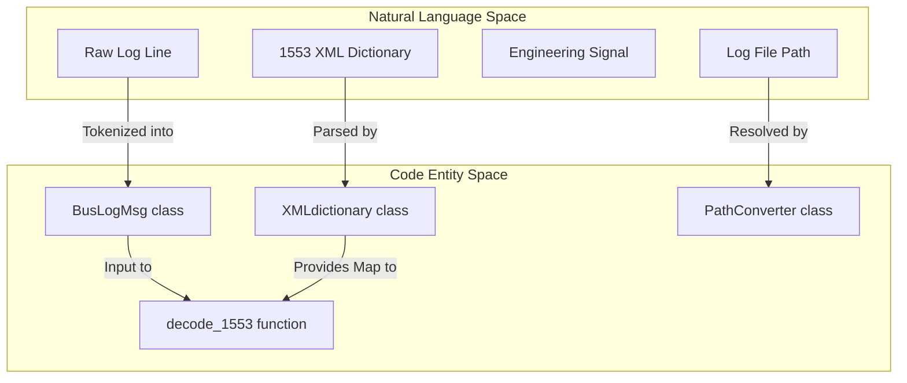
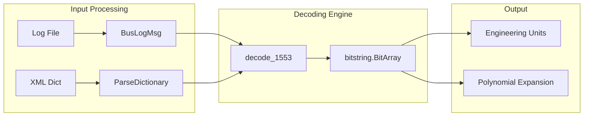

# Page: MIL-STD-1553 Bus Log Decoding

# MIL-STD-1553 Bus Log Decoding

Relevant source files

The following files were used as context for generating this wiki page:

- [core/core_utils.py](core/core_utils.py)
- [core/decode_1553.py](core/decode_1553.py)

The MIL-STD-1553 Bus Log Decoding subsystem provides the capability to parse, filter, and decode raw 1553 bus traffic logs into engineering-unit signals. It utilizes an XML-based dictionary to define signal mappings, bit-level extractions, and polynomial conversions. The system supports both standard signals and multi-line extended signals, handling various time formats including IRIG.

## System Architecture and Data Flow

The decoding process is initiated by `core/decode_1553.py`, which coordinates between log file discovery, dictionary parsing, and bit-level manipulation.

### High-Level Decoding Flow
1.  **Discovery**: `PathConverter` locates the appropriate log files based on environment configuration.
2.  **Dictionary Loading**: `XMLdictionary` parses the XML definition file to create a lookup map for signals.
3.  **Tokenization**: `BusLogMsg` converts raw text lines from the log into structured Python objects.
4.  **Decoding**: The `decode_1553` function applies bitmasking and scaling to extract final values.

### Code Entity Mapping
The following diagram maps natural language concepts to the specific classes and functions in the codebase.

"Natural Language to Code Entity Space"

Sources: [core/decode_1553.py:23-131](), [core/decode_1553.py:131-180](), [core/core_utils.py:2460-2490]()

## XML Dictionary Parsing

The `XMLdictionary` class [core/decode_1553.py:23-40]() is responsible for loading the signal definitions. It categorizes signals into two primary groups:
*   **Standard Signals**: Found under the `<mil1553_signals>` tag [core/decode_1553.py:31]().
*   **Extended Signals**: Found under the `<extended_signals>` tag [core/decode_1553.py:35-38](), used for data spanning multiple bus messages.

### Signal Definition Components
The `ParseDictionary` method [core/decode_1553.py:41-128]() extracts several metadata components for each signal:
*   **Data Maps**: Defines the word index, start bit, and number of bits [core/decode_1553.py:91-99]().
*   **Enums**: Maps numeric values to symbolic strings [core/decode_1553.py:74-81]().
*   **Polynomial Expansion**: Stores indices and coefficients for converting raw values to engineering units [core/decode_1553.py:101-112]().
*   **RTI Filtering**: Limits signals to specific Remote Terminal Interfaces (RTIs) [core/decode_1553.py:83-88]().

Sources: [core/decode_1553.py:23-128]()

## Log Message Tokenization

The `BusLogMsg` class [core/decode_1553.py:131-180]() transforms a single line from a 1553 log file into a structured object.

### Tokenization Logic
The raw line is split by spaces [core/decode_1553.py:144]() and mapped to the following attributes:
| Attribute | Source Index | Description |
| :--- | :--- | :--- |
| `rti` | 1 | Remote Terminal Interface ID |
| `sclk` | 2 | Spacecraft Clock (converted to float) |
| `bus` | 3 | Bus identifier (e.g., BUS=A) |
| `rt` | 6 | Remote Terminal address |
| `sa` | 7 | Sub-address |
| `transmit_receive` | 8 | T/R bit (T=1, R=0) |
| `word_count` | 9 | Number of data words |

### IRIG Time Handling
If `irig_time` is enabled, the system requires an `assumed_year` [core/decode_1553.py:146-154](). The timestamp is constructed by prepending the year to the IRIG string (Format: `%Y:%j:%H:%M:%S.%f`). Standard logs use the `%Y%m%dT%H%M%S` format [core/decode_1553.py:157]().

Sources: [core/decode_1553.py:131-172]()

## Bit-Level Decoding Implementation

The core decoding logic uses the `bitstring.BitArray` library to handle non-byte-aligned data.

### Data Types and Conversions
The system supports several bit-level interpretations [core/decode_1553.py:430-480]():
1.  **UINT/INT**: Unsigned or signed integers via `BitArray.uint` or `BitArray.int`.
2.  **FLOAT**: 32-bit or 64-bit floating point numbers.
3.  **HEX/BIN**: Raw hexadecimal or binary string representations.
4.  **Polynomial**: The raw integer is passed through a polynomial expansion where $Value = \sum (coeff \times Raw^{index})$ [core/decode_1553.py:488-492]().

### Multi-Line Extended Signals
Extended signals are handled via a state machine logic. Since these signals span multiple messages, the decoder identifies the start of a sequence based on the `remote_terminal`, `sub_address`, and `transmit_receive` parameters defined in the XML [core/decode_1553.py:49-60](). It accumulates data words across consecutive log entries until the required `word_count` is met before performing the bit-extraction.

"1553 Decoding Data Flow"

Sources: [core/decode_1553.py:415-500](), [core/decode_1553.py:488-492]()

## Log Discovery and Filtering

Log files are discovered using the `PathConverter` utility [core/core_utils.py:2460](), which resolves dynamic paths defined in environment variables like `BUS_1553_LOGFILE_PATH`.

### Filtering Criteria
The decoder filters log entries based on:
*   **Time Range**: Entries must fall between `query_start_time` and `query_end_time` [core/decode_1553.py:137-138]().
*   **Address Matching**: The `RT`, `SA`, and `T/R` of the `BusLogMsg` must match the signal's definition in the `XMLdictionary` [core/decode_1553.py:115-117]().
*   **RTI Validation**: If the signal definition specifies a list of valid RTIs, the message's RTI must be present in that list [core/decode_1553.py:83-88]().

Sources: [core/decode_1553.py:131-142](), [core/core_utils.py:2460-2490]()
