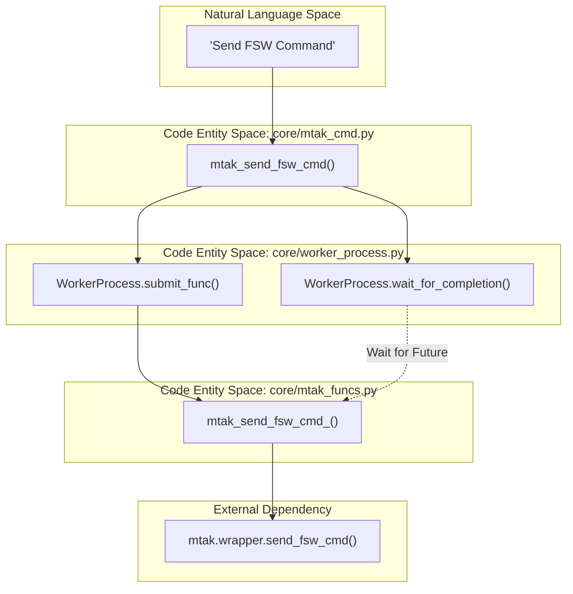
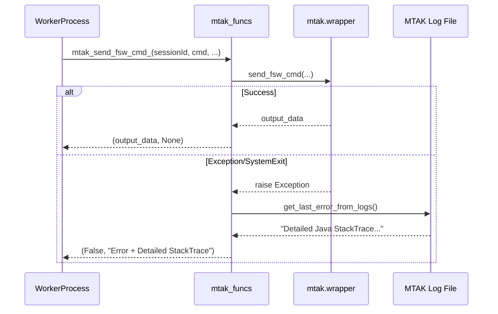

# Page: MTAK Integration (mtak_cmd, mtak_funcs, worker_process)

# MTAK Integration (mtak_cmd, mtak_funcs, worker_process)

Relevant source files

The following files were used as context for generating this wiki page:

- [core/mtak_cmd.py](core/mtak_cmd.py)
- [core/mtak_funcs.py](core/mtak_funcs.py)
- [core/worker_process.py](core/worker_process.py)

The MTAK (Mission Tool Agile Kit) integration provides the VenueServer with the ability to dispatch commands and files to spacecraft and ground systems via the AMMOS MTAK library. Because MTAK is a Java-based library wrapped in Python that can interfere with signal handling and logging, the VenueServer implements a robust three-layer isolation architecture using a dedicated worker process.

## Architecture Overview

The integration is divided into three distinct layers to ensure that the main FastAPI process remains responsive and that MTAK's internal state (and potential crashes) do not impact the rest of the system.

1.  **Orchestration Layer (`mtak_cmd`)**: High-level API used by `venue_core`. It manages the lifecycle of the worker and translates application-level requests into worker tasks.
2.  **Isolation Layer (`worker_process`)**: A `ProcessPoolExecutor` wrapper that runs MTAK in a separate OS process. This allows for hard `SIGKILL` cleanup and prevents MTAK from hijacking the main process's signal handlers.
3.  **Execution Layer (`mtak_funcs`)**: Pickling-safe wrapper functions that directly call `mtak.wrapper` methods. This layer also handles error extraction by reading MTAK log files when exceptions occur.

### Natural Language to Code Entity Mapping: Command Flow

The following diagram illustrates how a natural language request to "Send a FSW Command" traverses the system entities.

Title: FSW Command Dispatch Data Flow

**Sources:** [core/mtak_cmd.py:72-101](), [core/worker_process.py:118-129](), [core/mtak_funcs.py:76-93]()

---

## 1. WorkerProcess (Isolation Layer)

The `WorkerProcess` class [core/worker_process.py:23-162]() provides process-level isolation for MTAK. It uses a `ProcessPoolExecutor` with `max_workers=1` [core/worker_process.py:35]() to ensure all MTAK operations happen in a stable, serial environment.

### Key Features
*   **Signal Handling**: The `init_worker_proc` function [core/worker_process.py:13-21]() resets `SIGTERM` and `SIGINT` to default behaviors and sets `set_wakeup_fd(-1)` to prevent the worker from interfering with FastAPI's event loop.
*   **Hard Cleanup**: The `shutdown()` method [core/worker_process.py:56-101]() uses `psutil` to find all child processes (including MTAK's `MtakDownlinkServerApp` Java process) and terminates them using `os.kill(pid, signal.SIGKILL)`.
*   **Automatic Restart**: The `reset()` method [core/worker_process.py:103-116]() performs a full shutdown and re-initializes the process pool, ensuring a clean state for subsequent commands.

**Sources:** [core/worker_process.py:13-116]()

---

## 2. mtak_cmd (Orchestration Layer)

The `mtak_cmd.py` module serves as the primary interface for the rest of the application. It instantiates a global `mtak_worker` [core/mtak_cmd.py:13]() and registers an `atexit` hook to ensure MTAK is cleaned up when the server stops [core/mtak_cmd.py:20]().

### Dispatch Patterns
Every command follows a "Submit-and-Wait" pattern:
1.  **Submit**: Calls `mtak_worker.submit_func()` with the target function from `mtak_funcs`.
2.  **Wait**: Calls `mtak_worker.wait_for_completion(timeout_sec)` [core/mtak_cmd.py:91]().
3.  **Error Check**: If a message is returned in the result tuple, an exception is raised [core/mtak_cmd.py:95-96]().

### Supported Operations
| Function | Purpose | Target Function in `mtak_funcs` |
| :--- | :--- | :--- |
| `mtak_startup_timeout` | Initializes MTAK session | `mtak_startup_timeout_` |
| `mtak_send_fsw_cmd` | Dispatches FSW commands | `mtak_send_fsw_cmd_` |
| `mtak_send_hw_cmd` | Dispatches Hardware commands | `mtak_send_hw_cmd_` |
| `mtak_send_sse_cmd` | Dispatches SSE (Sequence) commands | `mtak_send_sse_cmd_` |
| `mtak_send_fsw_file` | Binary file uplink | `mtak_send_fsw_file_` |
| `mtak_send_scmf_file` | SCMF (Spacecraft Cmd Msg File) uplink | `mtak_send_fsw_scmf_` |

**Sources:** [core/mtak_cmd.py:41-218]()

---

## 3. mtak_funcs (Execution Layer)

`mtak_funcs.py` contains the logic that actually interacts with `mtak.wrapper`. These functions are designed to be "pickling-safe" for transfer across process boundaries.

### Error Resolution via Log Tail-Reading
MTAK often reports generic errors via Python exceptions while the detailed root cause is written to its internal log file. To solve this, `mtak_funcs` includes a tail-reading mechanism:
1.  `get_last_lines()`: Uses `FileReadBackwards` to efficiently read the end of the MTAK log [core/mtak_funcs.py:12-30]().
2.  `get_last_error_from_logs()`: Searches the last 50 lines for "ERROR" or "FATAL" strings [core/mtak_funcs.py:32-39]().
3.  `get_mtak_error()`: Appends the log-extracted error to the Python exception message before returning it to the worker [core/mtak_funcs.py:41-47]().

### Execution Trace
Title: Internal MTAK Execution and Error Capture

**Sources:** [core/mtak_funcs.py:32-47](), [core/mtak_funcs.py:76-93]()

---

## 4. Lifecycle Management

The MTAK integration manages the lifecycle of the underlying Java processes through two main mechanisms:

1.  **MTAK Startup**: The `mtak_startup_timeout` function [core/mtak_cmd.py:41-62]() configures the MTAK wrapper with session keys and default string IDs. Crucially, it disables telemetry reception (EHA, EVRs, Products) [core/mtak_funcs.py:57-61]() to minimize overhead, as VenueServer uses `lad_query` and `chill_query` for telemetry instead.
2.  **MTAK Shutdown**: The `mtak_shutdown` function [core/mtak_cmd.py:64-70]() triggers `mtak_worker.reset()`. This does not rely on the worker being idle; it forcibly kills the process and its children to ensure a clean exit even if MTAK is hung.

**Sources:** [core/mtak_cmd.py:64-70](), [core/mtak_funcs.py:49-74]()
