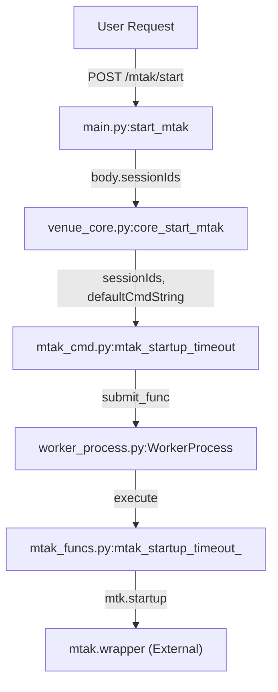
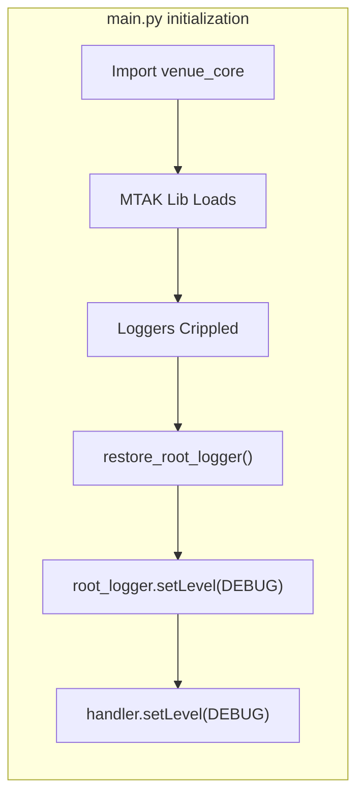

# Page: MTAK Session Management Endpoints

# MTAK Session Management Endpoints

Relevant source files

The following files were used as context for generating this wiki page:

- [core/mtak_cmd.py](core/mtak_cmd.py)
- [core/schema.py](core/schema.py)
- [main.py](main.py)

This page documents the REST API endpoints used to manage MTAK (Mission Tool Suite for Analysis and Commanding) sessions within the VenueServer. These endpoints allow users to initialize the MTAK commanding backend for specific AMPCS sessions and cleanly shut them down.

## Overview

The VenueServer interacts with MTAK via a wrapper that requires an explicit startup phase to bind to AMPCS sessions. Because MTAK's underlying Java-based components can interfere with Python's standard logging and may persist as orphan processes, the VenueServer implements specific isolation and restoration mechanisms.

### MTAK Session Lifecycle
1.  **Startup**: Client sends a list of `sessionIds`. The server initializes a `WorkerProcess` to isolate MTAK and calls the startup wrapper.
2.  **Commanding**: Once started, other `/api/v3/cmd/*` endpoints can be used (documented in Section 2.2).
3.  **Shutdown**: Client sends a shutdown request. The server terminates the `WorkerProcess`, which ensures all child MTAK processes (like `MtakDownlinkServerApp`) are killed.

---

## REST API Endpoints

### 1. Start MTAK Session
**Endpoint:** `POST /api/v3/mtak/start`

Starts MTAK on the venue GDS host for the specified AMPCS session IDs.

#### Request Model: `MtakStartBodyModel`
| Field | Type | Description |
| :--- | :--- | :--- |
| `sessionIds` | `List[int]` | AMPCS session IDs to start MTAK on. |
| `timeout` | `int` | Timeout in seconds (Minimum: 25s). Default: 30. |
| `defaultCmdString` | `DefaultCmdString` | Sides of flight computer (`A`, `B`, `AB`). Default: `AB`. |

[core/schema.py:22-27]()

#### Response Model: `MtakStartResponse`
| Field | Type | Description |
| :--- | :--- | :--- |
| `sessionIds` | `List[int]` | The session IDs successfully initialized. |
| `startTime` | `str` | ISO UTC timestamp of when MTAK started. |

[core/schema.py:29-31]()

#### Implementation Detail
The request is received by `main.py:start_mtak` [main.py:130-146](), which delegates to `venue_core.core_start_mtak` [main.py:136-138](). The core logic uses `mtak_worker.submit_func` to execute the startup in a separate process to prevent MTAK from hijacking the main process's environment [core/mtak_cmd.py:53-54]().

**Sources:** [main.py:120-146](), [core/mtak_cmd.py:41-62](), [core/schema.py:22-31]()

---

### 2. Shutdown MTAK Session
**Endpoint:** `POST /api/v3/mtak/shutdown`

Shuts down the MTAK session and cleans up associated worker processes.

#### Response
*   **Success**: `204 No Content`
*   **Error**: `400 Bad Request` with `ErrorResponse` model.

#### Implementation Detail
The shutdown process calls `mtak_worker.reset()` [core/mtak_cmd.py:70](). This is a critical step because MTAK processes often hang if not explicitly terminated. Additionally, an `atexit` hook is registered in `mtak_cmd.py` to ensure that if the VenueServer crashes or exits, the MTAK worker is automatically shut down to prevent orphan `MtakDownlinkServerApp` processes [core/mtak_cmd.py:20]().

**Sources:** [main.py:148-166](), [core/mtak_cmd.py:64-71](), [core/mtak_cmd.py:15-20]()

---

## Technical Architecture and Workarounds

### MTAK Isolation via WorkerProcess
MTAK integration is handled through a three-layer isolation strategy to maintain system stability.

| Layer | Entity | Role |
| :--- | :--- | :--- |
| **API** | `main.py` | Handles FastAPI routing and schema validation. |
| **Orchestration** | `mtak_cmd.py` | Manages the `mtak_worker` instance (a `WorkerProcess`). |
| **Execution** | `mtak_funcs.py` | Contains the actual calls to `mtak.wrapper`. |

#### Data Flow: MTAK Startup
"Natural Language Space" to "Code Entity Space" mapping for the startup sequence.

**Sources:** [main.py:130-140](), [core/mtak_cmd.py:41-62](), [core/mtak_cmd.py:13-13]()

### Logging Interference Workaround: `restore_root_logger`
A known issue with the MTAK library is that it "cripples" the Python root logger upon import, often setting levels or handlers that suppress VenueServer logs.

The VenueServer implements a workaround in `main.py`:
1.  It imports `venue_core` (which triggers MTAK initialization) as early as possible [main.py:27]().
2.  Immediately follows with `restore_root_logger()` [main.py:28]().
3.  The function manually resets the root logger and all its handlers to `DEBUG` level to ensure visibility [main.py:5-10]().

**Sources:** [main.py:5-11](), [main.py:26-28]()

### Timeout Semantics
MTAK startup is inherently slow due to Java JVM initialization and session binding.
*   **Minimum Timeout**: Enforced at 25 seconds via Pydantic validation [core/schema.py:24-25]().
*   **Default Timeout**: 30 seconds [core/schema.py:24]().
*   **Enforcement**: The `mtak_worker.wait_for_completion(timeout_sec)` call blocks until MTAK reports success or the timer expires [core/mtak_cmd.py:54]().

**Sources:** [core/schema.py:22-28](), [core/mtak_cmd.py:54-55]()
