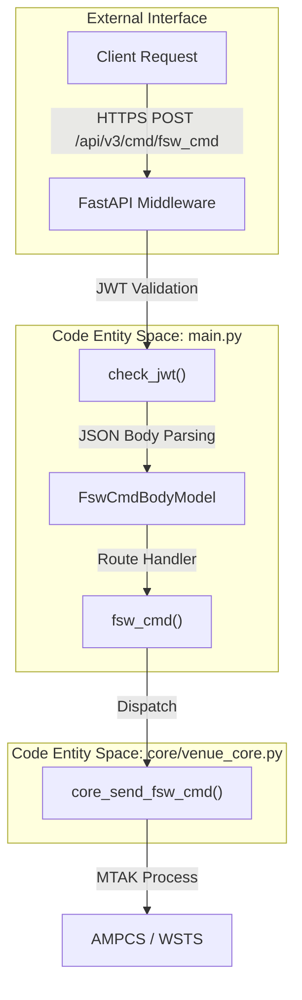
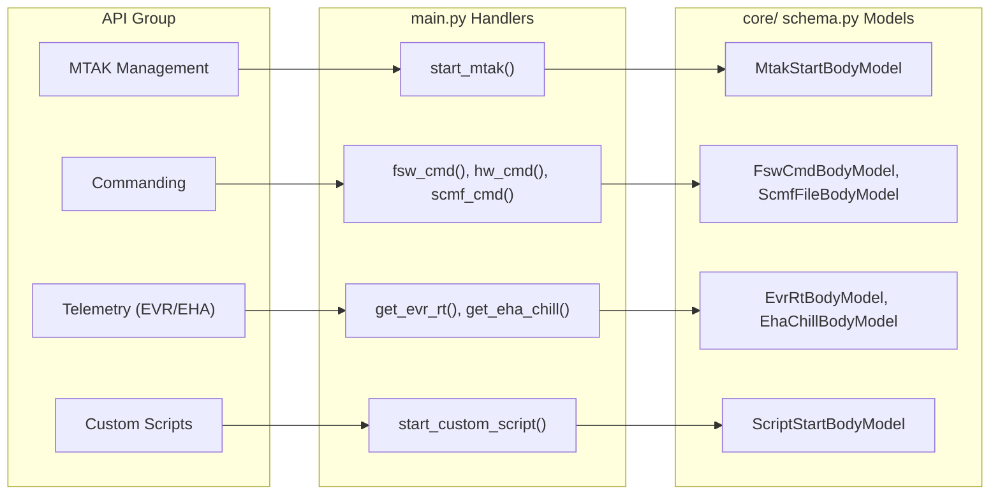

# Page: REST API Reference

# REST API Reference

Relevant source files

The following files were used as context for generating this wiki page:

- [core/schema.py](core/schema.py)
- [main.py](main.py)
- [openapi.yaml](openapi.yaml)

The Ingenium VenueServer exposes a versioned REST API under the `/api/v3` prefix. This API serves as the primary interface for mission operators and automated scripts to interact with the AMMOS/AMPCS Ground Data System (GDS). It facilitates spacecraft commanding, telemetry retrieval, data product management, and custom script execution.

### API Architecture and Versioning

The API is built using the **FastAPI** framework [main.py:73-73](). All functional routes are grouped under an `APIRouter` with the prefix `/api/v3` [main.py:96-96](). The server enforces structured request and response formats using Pydantic models defined in `core/schema.py` [core/schema.py:1-200]().

#### Natural Language to Code Entity Mapping: API Request Flow

The following diagram illustrates how a natural language request (e.g., "Send a command") traverses the system's code entities.

Sources: [main.py:169-179](), [main.py:96-96](), [core/schema.py:39-48](), [core/venue_core.py:124-124]()

### Middleware and Conventions

The API implements several global behaviors to ensure security, observability, and reliability:

*   **JWT Authentication**: All sensitive endpoints are protected by a JWT-based middleware that validates RS256 signatures against a public key (`exec_venue_public_pem.pem`) and checks for specific scopes like `execute:wsts` or `execute:sit`. For details, see [Authentication and Authorization (JWT)](#2.6).
*   **Request Logging**: Every incoming request is logged with its method, path, and a unique `X-Process-Time` header to track performance [main.py:610-638]().
*   **Error Handling**: Errors are returned as a standard `ErrorResponse` object [core/schema.py:19-21]() with a 400-level status code. The response includes a descriptive message and, in debug modes, a stack trace [main.py:141-145]().
*   **MTAK Logging Workaround**: Due to MTAK's tendency to hijack the Python root logger, the server includes a `restore_root_logger()` function [main.py:5-11]() to ensure VenueServer logs continue to flow to the configured handlers after MTAK initialization [main.py:28-28]().

### Functional API Groups

The API is organized into several functional groups, each handled by specific route definitions in `main.py` and business logic in `core/venue_core.py`.

#### Natural Language to Code Entity Mapping: Functional Subsystems

Sources: [main.py:120-130](), [main.py:169-179](), [main.py:288-300](), [core/schema.py:22-28](), [core/schema.py:39-48](), [core/schema.py:86-96]()

#### [MTAK Session Management Endpoints](#2.1)
Manages the lifecycle of the Mission Tool Suite (MTAK) worker processes. These endpoints allow users to start MTAK for specific AMPCS sessions and define default command strings (A, B, or AB).
For details, see [MTAK Session Management Endpoints](#2.1).

#### [Commanding Endpoints](#2.2)
Provides routes for dispatching Flight Software (FSW) commands, Hardware (HW) commands, System Support Equipment (SSE) commands, and SCMF files. Supports validation flags and string selection (A/B sides).
For details, see [Commanding Endpoints](#2.2).

#### [Telemetry Query Endpoints (EVR and EHA)](#2.3)
Facilitates querying Event Records (EVR) and Engineering Health Analysis (EHA) data. Supports real-time queries via GlobalLAD and historical queries via CHILL, with filtering by time (ERT/SCET/SCLK) and alarm status.
For details, see [Telemetry Query Endpoints (EVR and EHA)](#2.3).

#### [Data Products and 1553 Bus Endpoints](#2.4)
Handles queries for Data Products (DP) by APID and status. Also includes a specialized parser for MIL-STD-1553 bus logs, converting raw hex data into human-readable signals using XML dictionaries.
For details, see [Data Products and 1553 Bus Endpoints](#2.4).

#### [Custom Script Execution Endpoints](#2.5)
Allows users to upload and execute Python scripts in a managed environment. Features include SHA-256 integrity checks, REDIS-backed state tracking, and artifact retrieval (logs/files) via tar.gz.
For details, see [Custom Script Execution Endpoints](#2.5).

#### [Authentication and Authorization (JWT)](#2.6)
Details the security implementation using JWT middleware, scope-based permissions, and the integration with mission-specific public keys.
For details, see [Authentication and Authorization (JWT)](#2.6).

**Sources:**
*   `main.py`: [5-11](), [28-28](), [73-73](), [96-96](), [120-145](), [169-195](), [610-638]()
*   `core/schema.py`: [1-21](), [22-48](), [86-96]()
*   `core/venue_core.py`: [124-124]()
