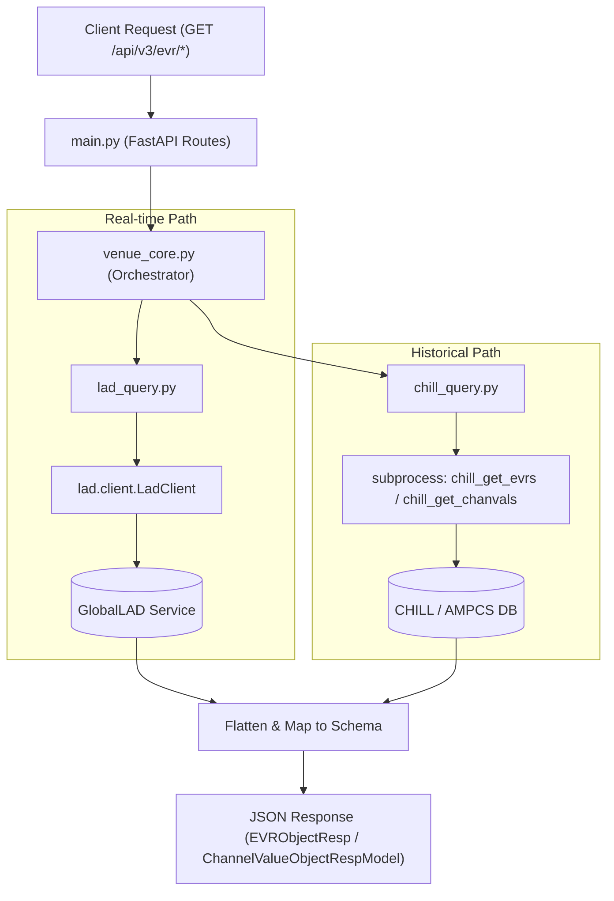
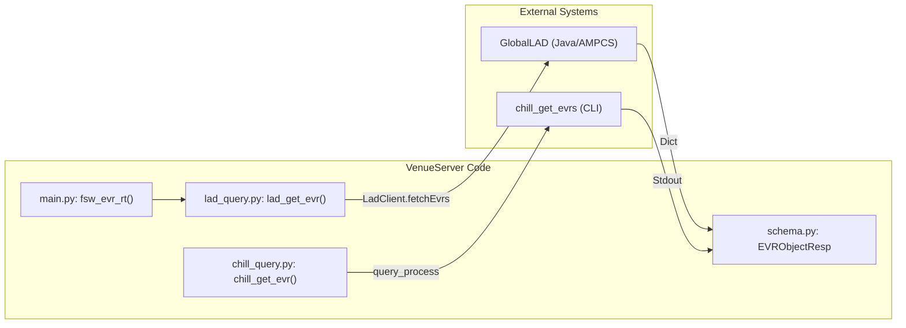

# Page: Telemetry Query Endpoints (EVR and EHA)

# Telemetry Query Endpoints (EVR and EHA)

Relevant source files

The following files were used as context for generating this wiki page:

- [core/chill_query.py](core/chill_query.py)
- [core/lad_query.py](core/lad_query.py)
- [core/schema.py](core/schema.py)
- [main.py](main.py)
- [openapi.yaml](openapi.yaml)

The VenueServer provides a RESTful interface for querying Event Records (EVRs) and Engineering Health Analysis (EHA) telemetry. It supports two distinct data paths: **Real-time** queries via the GlobalLAD client and **Historical** queries via the CHILL (Command History and Information Log List) command-line interface.

## Overview of Query Paths

The system differentiates between real-time and historical data based on the endpoint called and the underlying core logic:

1.  **Real-time (GlobalLAD):** Queries the `lad_query` module, which connects to a `LadClient` to fetch data currently in the telemetry stream. These endpoints are optimized for low-latency retrieval of recent data.
2.  **Historical (CHILL):** Queries the `chill_query` module, which wraps AMPCS CLI tools like `chill_get_evrs` and `chill_get_chanvals`. These are used for deep-history searches and support complex filtering.

### Data Flow Diagram

The following diagram illustrates how a request from `main.py` is routed through `venue_core.py` to either the `lad_query` or `chill_query` modules.

**Telemetry Routing Logic**

Sources: [main.py:330-345](), [core/venue_core.py:284-300](), [core/lad_query.py:99-105](), [core/chill_query.py:50-63]()

---

## EVR Query Endpoints

EVR endpoints allow users to retrieve event messages generated by Flight Software (FSW) or Ground Systems (SSE).

### Real-time EVR (GlobalLAD)
*   **Single Query:** `GET /api/v3/evr/rt`
*   **Multi Query:** `GET /api/v3/evr/rt/multi`

These endpoints use `lad_query.lad_get_evr` and `lad_query.lad_get_evr_multi`. The system enforces `realtimeOnly()` on the query object to ensure only the live stream is accessed [core/lad_query.py:93]().

### Historical EVR (CHILL)
*   **Single Query:** `GET /api/v3/evr/chill`
*   **Multi Query:** `GET /api/v3/evr/chill/multi`

These wrap the `chill_get_evrs` CLI tool. They support `evrType` filtering (FSW_REALTIME, FSW_RECORDED, SSE) and `timeType` (ERT, SCET, SCLK) [core/chill_query.py:50-60]().

### EVR Response Model: `EVRObjectResp`
All EVR queries return a list of `EVRObjectResp` objects.

| Field | Description |
| :--- | :--- |
| `evrName` | The mnemonic name of the event |
| `eventId` | Numeric ID of the event |
| `evrLevel` | Severity level (e.g., ACTIVITY, WARNING) |
| `ert` / `scet` / `sclk` | Timestamps in Earth Received, Spacecraft Event, and Spacecraft Clock formats |
| `message` | The formatted text of the event |

Sources: [core/schema.py:306-328](), [main.py:330-410]()

---

## EHA Query Endpoints (Telemetry Channels)

EHA endpoints retrieve telemetry channel values (Engineering Health Analysis).

### Real-time EHA (GlobalLAD)
*   **Single Query:** `GET /api/v3/eha/rt`
*   **Multi Query:** `GET /api/v3/eha/rt/multi`

Implemented via `lad_query.lad_get_eha`. It uses `client.ChanValQuery()` to fetch data from the GlobalLAD host [core/lad_query.py:202-222]().

### Historical EHA (CHILL)
*   **Single Query:** `GET /api/v3/eha/chill`
*   **Multi Query:** `GET /api/v3/eha/chill/multi`

These wrap `chill_get_chanvals`. A key feature is the `inAlarmFilter`, allowing users to filter for `RED_ALARM`, `YELLOW_ALARM`, or `ANY_ALARM` [core/chill_query.py:102]().

### EHA Response Model: `ChannelValueObjectRespModel`
Returns data representing a specific point-in-time sample of a telemetry channel.

| Field | Description |
| :--- | :--- |
| `channelId` | Numeric or string ID of the channel |
| `dn` | Raw "Data Number" value |
| `eu` | Calibrated "Engineering Unit" value |
| `dnAlarmState` | Alarm status for the raw value |
| `euAlarmState` | Alarm status for the calibrated value |

Sources: [core/schema.py:246-273](), [main.py:464-550]()

---

## Implementation Details

### Time Type Filtering
The API supports three primary time types via the `TimeType` enum [core/schema.py:125-128]():
1.  **ERT (Earth Received Time):** The default for most queries.
2.  **SCET (Spacecraft Event Time):** UTC time at the spacecraft.
3.  **SCLK (Spacecraft Clock):** Raw ticks from the spacecraft clock.

In `lad_query.py`, these are mapped to GlobalLAD methods:
*   `evrq.useErt()` [core/lad_query.py:74]()
*   `evrq.useScet()` [core/lad_query.py:76]()
*   `evrq.useSclk()` [core/lad_query.py:78]()

### Mapping and Post-Processing
Since GlobalLAD and CHILL return data in different formats (JSON dicts vs. CSV-like strings), `venue_core.py` performs normalization:
*   **Flattening:** `lad_query` uses `gdsclient.flattenDict` to simplify nested GlobalLAD responses [core/lad_query.py:102]().
*   **CSV Parsing:** For CHILL queries, `venue_core.py` parses the standard output of the CLI tools into Pydantic models [core/venue_core.py:313-320]().

### System Entity Mapping

**Code Entities to External Services**

Sources: [core/lad_query.py:99-102](), [core/chill_query.py:63](), [core/venue_core.py:304-320]()

### Key Configuration Constants
*   `_LAD_TIMEOUT_SEC`: Default timeout for GlobalLAD queries (60s) [core/lad_query.py:35]().
*   `SHORT_TIMEOUT`: Used for quick CHILL checks [core/config.py:10]().
*   `MAX_RESULTS`: EVR queries are capped at 1000 results to match typical GLAD configurations [core/lad_query.py:62]().

Sources: [core/lad_query.py:31-35](), [core/config.py:5-15]()
