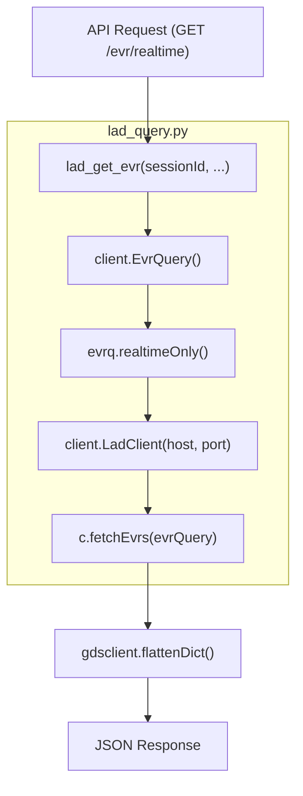
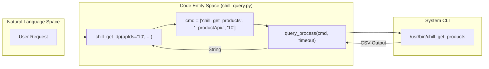

# Page: Telemetry Querying (lad_query and chill_query)

# Telemetry Querying (lad_query and chill_query)

Relevant source files

The following files were used as context for generating this wiki page:

- [config/gds_config/ampcs.properties](config/gds_config/ampcs.properties)
- [core/chill_query.py](core/chill_query.py)
- [core/lad_query.py](core/lad_query.py)

The Ingenium VenueServer provides two distinct paths for retrieving telemetry (EVRs, Channel Values, and Data Products) from the AMMOS/AMPCS ecosystem. These paths are optimized for different data sources: **GlobalLAD** for real-time telemetry and **CHILL** for historical or recorded data.

## 1. Real-time Telemetry: lad_query

The `lad_query` module interfaces with the **GlobalLAD** (Local Archive Database) service. It is used exclusively for "real-time only" queries, typically fetching data that has arrived within a recent window of the current session.

### Implementation and Data Flow
The module uses the `lad.client` and `lad.gdsclient` libraries to construct and execute queries. 

1.  **Query Construction**: Functions like `lad_get_evr` [core/lad_query.py:41-54]() and `lad_get_eha` [core/lad_query.py:190-200]() instantiate `EvrQuery` or `ChanValQuery` objects.
2.  **Configuration**: Connection parameters are derived from environment variables `LAD_HOST`, `LAD_PORT`, and `LAD_HTTPS` [core/lad_query.py:31-34]().
3.  **Filtering**: The client applies filters such as `sessionId`, `evrName`, `eventId`, and `timeType` (ERT, SCET, or SCLK) [core/lad_query.py:64-78]().
4.  **Real-time Constraint**: Every query explicitly calls `.realtimeOnly()` [core/lad_query.py:93](), ensuring the database only returns data currently in the real-time buffers.
5.  **Post-processing**: Results are passed through `gdsclient.flattenDict()` [core/lad_query.py:102]() to convert complex nested LAD structures into flat dictionaries suitable for REST API responses.

### SCLK/SCET Correlation
For queries involving Spacecraft Clock (SCLK) or Spacecraft Event Time (SCET), the module uses `get_sclkscet_times` [core/lad_query.py:246-248]() to perform correlation. This is particularly important for `lad_get_eha_multi` when a query range is defined in spacecraft time rather than Earth Receipt Time (ERT).

### Diagram: Real-time Query Logic (Natural Language to Code)

"Fetch real-time EVRs for Session 123"

Sources: [core/lad_query.py:41-105](), [core/lad_query.py:31-34]()

---

## 2. Historical Telemetry: chill_query

The `chill_query` module acts as a wrapper for the **CHILL** (Command/History Interface Lower Layer) command-line utilities. This path is used for querying historical data, recorded telemetry, and data products.

### Command Builder Pattern
Instead of a native Python client, `chill_query` implements a builder pattern to construct shell commands. It leverages `query_process` [core/chill_query.py:4]() to execute these commands as subprocesses and capture their output.

| Function | CLI Command Wrapped | Purpose |
| :--- | :--- | :--- |
| `chill_get_evr` | `chill_get_evrs` | Retrieves historical Event Reports [core/chill_query.py:13-63]() |
| `chill_get_eha` | `chill_get_chanvals` | Retrieves historical Channel Values [core/chill_query.py:66-109]() |
| `chill_get_dp` | `chill_get_products` | Retrieves Data Product metadata [core/chill_query.py:112-154]() |

### Output Formatting
The output format for these commands is strictly controlled via a GDS configuration file: `config/gds_config/ampcs.properties`. This ensures that the CSV output from CHILL matches the field order expected by the VenueServer's CSV parsers [config/gds_config/ampcs.properties:1-8]().

### Error and Timeout Management
*   **Error Detection**: The module defines `chill_error_statuses = ['FATAL', 'ERROR', 'CRITICAL']` [core/chill_query.py:11]() to identify failures in the CLI output.
*   **Timeouts**: Queries use `SHORT_TIMEOUT` or `REVERSE_SCMF_TIMEOUT` [core/chill_query.py:5]() to prevent hanging subprocesses if the CHILL database is unresponsive.

### Diagram: Historical Query Execution (Natural Language to Code)

"Find all products for APID 10 in the last hour"

Sources: [core/chill_query.py:112-154](), [core/chill_query.py:4-5](), [config/gds_config/ampcs.properties:7]()

---

## 3. Key Functions Comparison

| Feature | `lad_query` | `chill_query` |
| :--- | :--- | :--- |
| **Data Source** | GlobalLAD (Memory/Real-time) | CHILL (Disk/Database) |
| **Mechanism** | Python Client (`lad.client`) | Subprocess CLI (`chill_get_*`) |
| **Default Timeout** | 60 seconds [core/lad_query.py:35]() | `SHORT_TIMEOUT` [core/chill_query.py:5]() |
| **Result Format** | Flattened Dictionary [core/lad_query.py:102]() | CSV String [core/chill_query.py:63]() |
| **Post-Processing** | `gdsclient.flattenDict` | CSV Parsing in `venue_core` |

### SCLKSCET Lookback Logic
When performing SCLK to SCET conversions for telemetry queries, the system uses a lookback window defined in `SCLKSCET_LOOKBACK` (typically 1 hour) to find the most recent correlation coefficients in the database [core/lad_query.py:246-248]().

Sources: [core/lad_query.py:1-250](), [core/chill_query.py:1-156](), [config/gds_config/ampcs.properties:1-8]()
