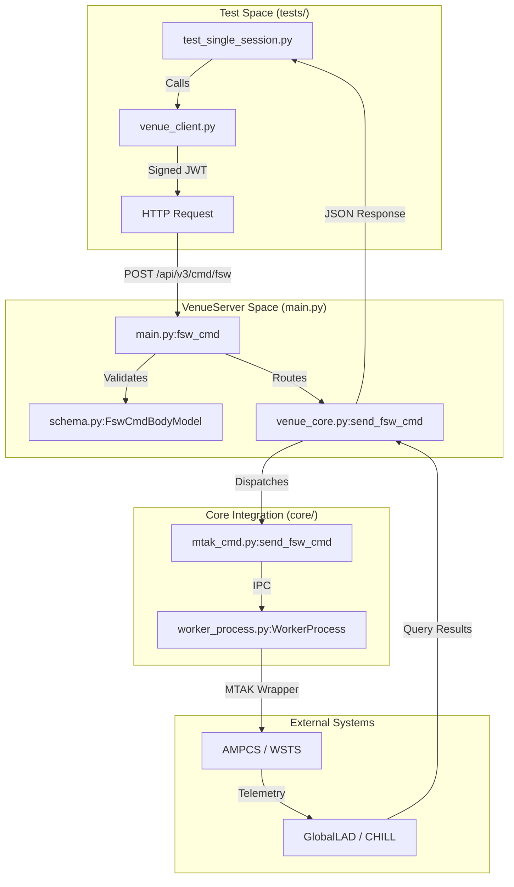
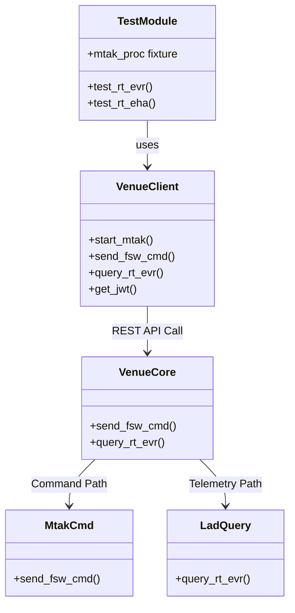

# Page: Test Infrastructure and Integration Tests

# Test Infrastructure and Integration Tests

<details>
<summary>Relevant source files</summary>

The following files were used as context for generating this wiki page:

- [tests/README.md](tests/README.md)
- [tests/env.csh](tests/env.csh)
- [tests/requirements.txt](tests/requirements.txt)
- [tests/test_mtak.py](tests/test_mtak.py)
- [tests/test_mtak_multi.py](tests/test_mtak_multi.py)
- [tests/test_single_session.py](tests/test_single_session.py)

</details>


The VenueServer integration test suite is designed to validate the end-to-end flow from the REST API through the core orchestration layer down to the AMPCS/MTAK interfaces. Because the system relies heavily on live ground data system components, the tests are primarily integration-level rather than isolated unit tests.

## Test Environment Setup

The test infrastructure resides in the `tests/` directory and requires a dedicated Python virtual environment and specific environment variables to interface with active AMPCS sessions.

### Python Virtual Environment (ve3)
Tests require specific dependencies separate from the main server, including `pytest` and `requests` for HTTP interaction, and `PyJWT` for generating authentication tokens [tests/requirements.txt:1-4]().

**One-time setup:**
```bash
cd tests
virtualenv -p python3 ve3
source ve3/bin/activate.csh
pip install -r requirements.txt
deactivate
```
[tests/README.md:9-16]()

### Session Configuration (env.csh)
The tests depend on live WSTS (Workstation Support Test Set) sessions. Users must start two WSTS sessions manually and record their AMPCS Session IDs in `tests/env.csh` [tests/README.md:25-30](). These IDs are then used by the `venue_client` to target specific telemetry and command streams.

**Example `env.csh`:**
```csh
setenv TEST_AMPCS_SESSION_ID_A 12
setenv TEST_AMPCS_SESSION_ID_B 13
```
[tests/env.csh:1-2]()

### Sources:
- [tests/README.md:1-52]()
- [tests/requirements.txt:1-4]()
- [tests/env.csh:1-3]()

---

## Test Execution Patterns

Tests are invoked via `pytest`. The suite supports global execution or targeted testing of specific modules and functions.

| Invocation Pattern | Description |
|:---|:---|
| `pytest` | Runs all tests in the `tests/` directory. |
| `pytest -s` | Runs tests while disabling stdout capture (useful for seeing EVR/EHA printouts). |
| `pytest test_mtak.py` | Runs only the MTAK lifecycle tests. |
| `pytest test_mtak.py::test_start_shutdown` | Runs a specific test case within a module. |

[tests/README.md:35-52]()

### Sources:
- [tests/README.md:35-52]()

---

## Core Test Modules

The suite is divided into three primary modules, each targeting different operational scenarios.

### 1. MTAK Lifecycle (`test_mtak.py`)
Focuses on the basic connectivity and state management of the MTAK process via the VenueServer.
- **`test_start_shutdown`**: Verifies that `POST /api/v3/mtak/start` successfully initializes a session and `POST /api/v3/mtak/shutdown` cleans it up [tests/test_mtak.py:4-17]().
- **Error Handling**: Validates that the server returns `400 Bad Request` when provided with invalid session IDs or excessively short timeouts [tests/test_mtak.py:19-29]().

### 2. Multi-Session Operations (`test_mtak_multi.py`)
Validates the server's ability to multiplex commands and telemetry across multiple concurrent AMPCS sessions.
- **Parallel Dispatch**: Sends commands to Session A and Session B sequentially, then polls for real-time EVRs from both to ensure no cross-talk or session interference [tests/test_mtak_multi.py:10-56]().

### 3. Comprehensive Integration (`test_single_session.py`)
This is the most complex module, utilizing `pytest.fixture` to manage MTAK state and mission-specific telemetry setups.
- **`mtak_proc` fixture**: Automatically starts MTAK before tests and shuts it down after the module completes [tests/test_single_session.py:7-16]().
- **`tsr` fixture**: Handles mission-specific initialization. For **Europa**, it sends `DDM_SET_EHA_PROD_RATE` commands [tests/test_single_session.py:18-27](). For **Psyche**, it increases uplink rates via SSE commands and uploads a TSR (Telemetry Selection Record) binary file to the spacecraft [tests/test_single_session.py:37-57]().
- **Functional Tests**: Includes `test_rt_evr` (real-time events), `test_chill_evr` (historical events via CHILL), and `test_rt_eha` (real-time engineering health analysis) [tests/test_single_session.py:113-177]().

### Sources:
- [tests/test_mtak.py:1-29]()
- [tests/test_mtak_multi.py:1-61]()
- [tests/test_single_session.py:1-183]()

---

## Mission-Specific Logic and Data Flow

The test suite dynamically adjusts its behavior based on the target mission (Europa vs. Psyche). This is primarily determined by the `vc.hostname` within `venue_client.py`.

### Mission Input Differences
| Feature | Europa (eurc) | Psyche (psyche) |
|:---|:---|:---|
| **Commanding** | Uses FSW No-Op commands for heartbeats. | Uses SSE (Simulation Support Equipment) commands to set uplink rates. |
| **Telemetry Setup** | Sends FSW commands to update production rates. | Performs a binary file uplink (`send_file`) of a `.bin` selection criteria file. |
| **Verification** | Checks for standard command completion EVRs. | Waits specifically for `UPL_MGR_EVR_FILE_CREATED` and `EHA_SVC_EVR_SELCRIT_FILE_APPLIED`. |

[tests/test_single_session.py:19-112]()

### Integration Data Flow Diagram

The following diagram illustrates how a test case (e.g., `test_rt_evr`) interacts with the codebase entities to verify system behavior.

**Test Execution Data Flow**


### Sources:
- [tests/test_single_session.py:18-112]()
- [tests/test_single_session.py:113-137]()
- [tests/venue_client.py:1-20]() (implied by usage in test files)

---

## Entity Mapping: Natural Language to Code

This table maps conceptual test actions to the specific code entities responsible for them.

| Conceptual Action | Code Entity (File:Symbol) |
|:---|:---|
| Start MTAK Session | `main.py`: `mtak_start` [api/v3/mtak/start] |
| Send FSW Command | `core/mtak_cmd.py`: `send_fsw_cmd` |
| Query Real-time EVR | `core/lad_query.py`: `EvrQuery` |
| Query Historical Telemetry | `core/chill_query.py`: `chill_get_chanvals` |
| Generate Auth Token | `tests/venue_client.py`: `get_jwt` |
| Mission Detection | `tests/venue_client.py`: `hostname` |

**Code Entity Relationship Diagram**


### Sources:
- [tests/test_single_session.py:1-183]()
- [tests/test_mtak.py:1-29]()
- [tests/test_mtak_multi.py:1-61]()
