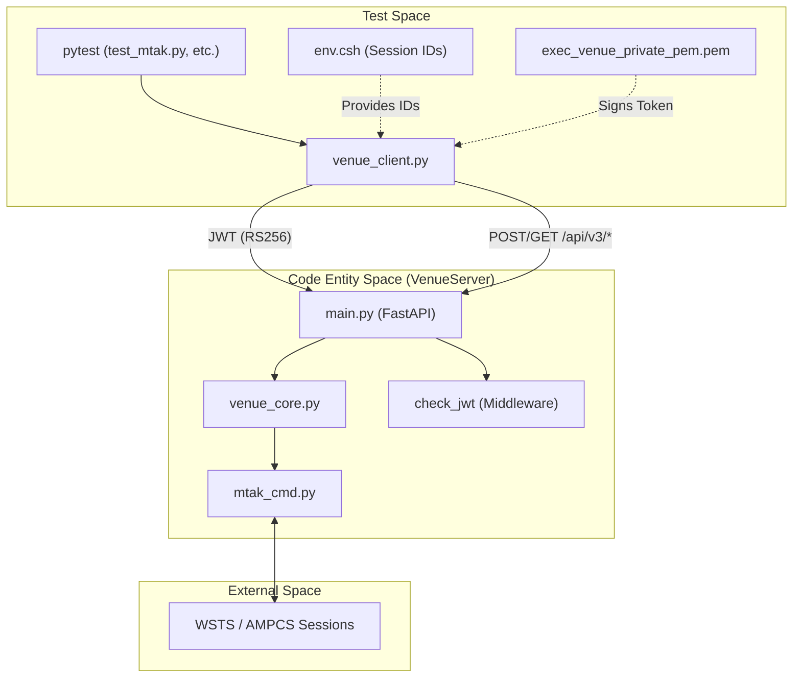
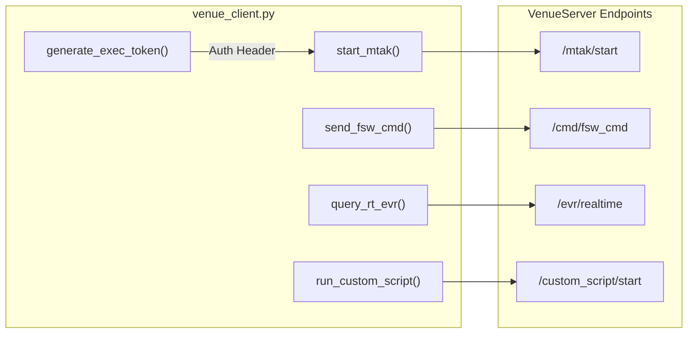

# Page: Testing

# Testing

Relevant source files

The following files were used as context for generating this wiki page:

- [tests/README.md](tests/README.md)
- [tests/env.csh](tests/env.csh)
- [tests/venue_client.py](tests/venue_client.py)

The VenueServer test suite is designed to validate the integration between the FastAPI service, the MTAK command dispatcher, and the underlying AMMOS/AMPCS ecosystem. Because the VenueServer acts as a bridge to live mission operations systems, the test suite primarily consists of integration tests that require active ground system sessions.

### Testing Overview

The testing environment is centered around `pytest` and a custom helper library, `venue_client.py`, which simulates a client interacting with the REST API. Tests are mission-aware and adjust their inputs based on the environment (e.g., Europa vs. Psyche) [tests/venue_client.py:45-61]().

| Component | Description |
| :--- | :--- |
| **Test Runner** | `pytest` is used to execute the test modules [tests/README.md:3](). |
| **Helper Library** | `venue_client.py` provides high-level Python wrappers for all API endpoints [tests/venue_client.py:64-228](). |
| **Session Config** | `env.csh` defines the active AMPCS session IDs required for testing [tests/env.csh:1-2](). |
| **Examples** | A collection of standalone scripts demonstrating specific API features like commanding or telemetry queries. |

### System Integration Flow

The following diagram illustrates how the test suite interacts with the VenueServer and the external AMPCS/WSTS dependencies.

**Test Suite to System Mapping**

Sources: [tests/venue_client.py:8-14](), [tests/venue_client.py:25-40](), [tests/README.md:25-33]()

### Test Infrastructure and Integration Tests

The test suite requires a specific Python virtual environment (`ve3`) and the manual initialization of WSTS (Workstation Support Tool Suite) sessions [tests/README.md:9-16](). Integration tests verify the end-to-end lifecycle of MTAK sessions, including starting the bridge, dispatching commands, and shutting down.

Key test modules include:
*   `test_mtak.py`: Focuses on session lifecycle and command dispatch.
*   `test_mtak_multi.py`: Validates handling of multiple concurrent sessions.
*   `test_single_session.py`: Tests operations within a single isolated session.

For details on environment setup and running specific tests, see [Test Infrastructure and Integration Tests](#4.1).

Sources: [tests/README.md:1-52]()

### Client Library and Example Scripts

The `venue_client.py` script serves as the primary interface for testing. It handles the complexities of:
*   **Authentication**: Automatically generates RS256 JWTs using `exec_venue_private_pem.pem` [tests/venue_client.py:25-42]().
*   **Mission Switching**: Detects hostnames (e.g., `eurc` for Europa, `psyche` for Psyche) to set appropriate command strings and APIDs [tests/venue_client.py:45-61]().
*   **API Mapping**: Maps Python function calls to REST endpoints like `/api/v3/mtak/start` [tests/venue_client.py:64-70]() or `/api/v3/cmd/fsw_cmd` [tests/venue_client.py:77-89]().

**Client Library Functionality**

Sources: [tests/venue_client.py:25-42](), [tests/venue_client.py:64-116](), [tests/venue_client.py:213-218]()

For a full list of supported functions and example scripts for commanding, telemetry, and file transfers, see [Client Library and Example Scripts](#4.2).
