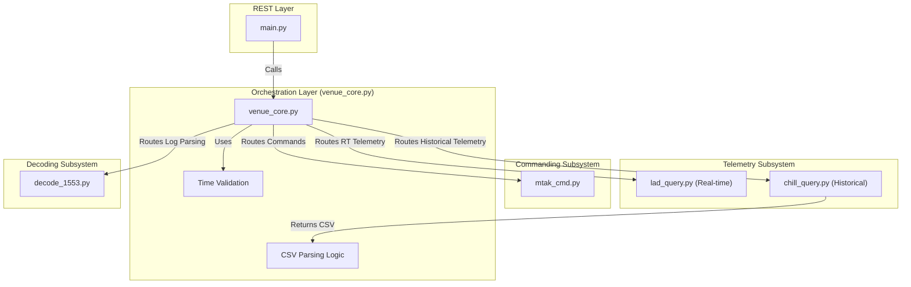
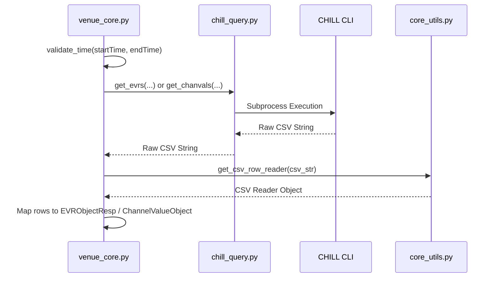

# Page: venue_core: Orchestration Layer

# 3.1 venue_core: Orchestration Layer

Relevant source files

The following files were used as context for generating this wiki page:

- [core/config.py](core/config.py)
- [core/core_utils.py](core/core_utils.py)
- [core/venue_core.py](core/venue_core.py)

The `venue_core.py` module serves as the central orchestration logic for the Ingenium VenueServer. It acts as the bridge between the FastAPI REST layer (`main.py`) and the specialized subsystems for commanding, telemetry retrieval, and data decoding. It is responsible for routing requests, validating time formats, and managing the lifecycle of custom scripts.

## System Orchestration Flow

The following diagram illustrates how `venue_core.py` coordinates between different system entities and external tools.

**Orchestration Routing Diagram**

**Sources:** [core/venue_core.py:1-45](), [core/venue_core.py:46-180]()

---

## Commanding Orchestration

`venue_core` provides a unified interface for all commanding types. It wraps the low-level `mtak_cmd` functions, injecting dispatch timestamps and handling basic session validation.

| Function | Destination | Description |
| :--- | :--- | :--- |
| `core_start_mtak` | `mtak_startup_timeout` | Initializes uplink/downlink proxies for specific session IDs. |
| `core_send_fsw_cmd` | `mtak_send_fsw_cmd` | Dispatches Flight Software commands. |
| `core_send_hw_cmd` | `mtak_send_hw_cmd` | Dispatches Hardware commands (e.g., power cycles). |
| `core_send_sse_cmd` | `mtak_send_sse_cmd` | Dispatches commands to the Simulation Support Equipment. |
| `core_send_fsw_file` | `mtak_send_fsw_file` | Handles binary file transfers to the vehicle. |
| `core_send_scmf_file`| `mtak_send_scmf_file`| Dispatches Spacecraft Command Message Files. |

**Sources:** [core/venue_core.py:46-181]()

---

## Telemetry Routing and Time Logic

The orchestration layer determines whether to use `lad_query` (for real-time data from GlobalLAD) or `chill_query` (for historical data from the CHILL database) based on the request parameters.

### Time Validation and Normalization
Before querying, `venue_core` utilizes `core_utils.py` to ensure time strings are valid.
- **Time Formats:** Supports ISO-8601 and DOY (Day of Year) formats `[core/core_utils.py:202-245]()`.
- **Microsecond Normalization:** The `normalize_with_microsecs` function ensures consistent precision for query filters `[core/core_utils.py:124-136]()`.
- **Validation:** `validate_time` is called to prevent malformed queries from reaching the GDS backends `[core/venue_core.py:30-33]()`.

### CHILL CSV Parsing
Historical queries via `chill_query` return raw CSV data. `venue_core` orchestrates the conversion of this raw output into structured JSON objects using `get_csv_row_reader` `[core/core_utils.py:157-160]()`.

**Data Flow: CHILL Query to Response**

**Sources:** [core/venue_core.py:205-300](), [core/core_utils.py:137-160]()

---

## MIL-STD-1553 Decoding Logic

For 1553 bus analysis, `venue_core` orchestrates the interaction with `decode_1553.py`.

1.  **Log Discovery:** It uses `get_most_recent_1553_logfiles` to find the relevant log files based on `BUS_1553_LOGFILE_PATH` `[core/venue_core.py:37-42]()`.
2.  **Assumed Year Logic:** Since IRIG-B time sources often omit the year, `venue_core` invokes `get_assumed_year` to provide temporal context for the bitstream decoding `[core/venue_core.py:38]()`.
3.  **Decoding:** It calls `decode_1553_log_files` passing the dictionary path (from `LOGFILE_1553_DICTIONARY_FILE_PATH`) and the identified log files `[core/venue_core.py:37-43]()`.

**Sources:** [core/venue_core.py:37-45](), [core/decode_1553.py:1-50]()

---

## Custom Script Execution

`venue_core` manages the lifecycle of custom scripts (e.g., Python scripts uploaded by users to interact with the GDS).

- **Workspace Management:** Scripts are executed within a base directory defined by `CUSTOM_SCRIPT_LOG_PATH_BASE` (default `/tmp/cs`) `[core/venue_core.py:39]()`.
- **Integrity:** It calculates a `hashlib.sha256` hash of script contents to ensure execution integrity `[core/venue_core.py:18]()`.
- **State Persistence:** Uses `redis` to track `scriptRunId` and the status of background processes `[core/venue_core.py:15-21]()`.
- **Artifact Handling:** Orchestrates the creation of `.tar.gz` archives using `tarfile` for users to download script outputs `[core/venue_core.py:22]()`.

**Sources:** [core/venue_core.py:15-41]()
