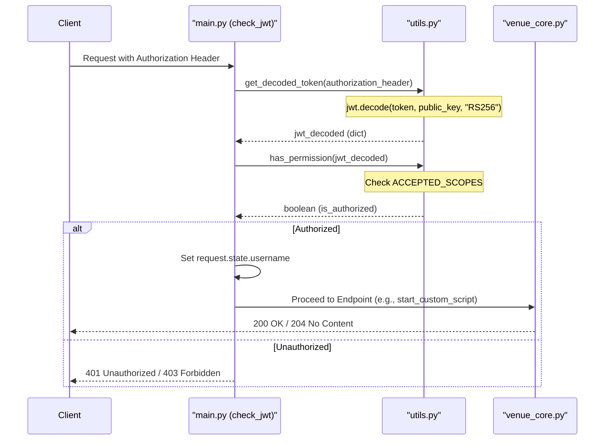
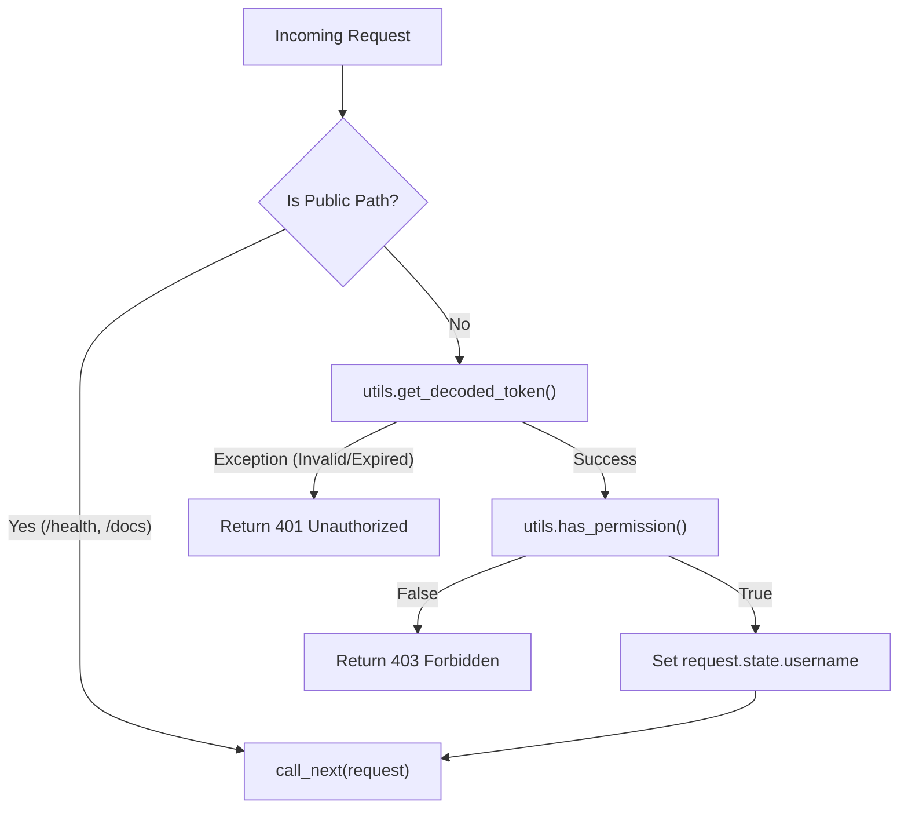

# Page: Authentication and Authorization

# Authentication and Authorization

Relevant source files

The following files were used as context for generating this wiki page:

- [main.py](main.py)
- [tests/conftest.py](tests/conftest.py)
- [utils.py](utils.py)

This page documents the security model implemented in the Venue Agent. The system employs a JSON Web Token (JWT) based authentication and authorization mechanism to secure access to script execution and management endpoints. It uses the **RS256** (RSA Signature with SHA-256) asymmetric algorithm for token validation, ensuring that only requests signed by a trusted identity provider can interact with the VenueServer.

## JWT Security Model

The Venue Agent acts as a Resource Server that validates Bearer tokens provided in the HTTP `Authorization` header.

### Algorithm and Public Key
The system uses the **RS256** algorithm, which requires a public/private key pair [utils.py:53-54](). 
*   **Public Key**: The VenueServer loads the public key from a local file named `exec_venue_public_pem.pem` [utils.py:8-12]().
*   **Integrity Check**: Upon startup, the server calculates a CRC32 checksum of the loaded public key to assist in debugging and environment verification [utils.py:22-25]().
*   **Key Loading**: The key is read during module initialization in `utils.py` and stored in the `exec_venue_public_pem` variable [utils.py:18-29]().

### Token Format
Tokens must be passed in the standard Bearer format:
`Authorization: Bearer <JWT_TOKEN>`

The `get_decoded_token` function in `utils.py` is responsible for parsing this header and extracting the token [utils.py:36-41](). If the header is missing or improperly formatted, an exception is raised [utils.py:43-49]().

### Authentication Flow (Code Entity Space)

The following diagram illustrates the interaction between the FastAPI middleware and the utility functions during a request lifecycle.

**Diagram: Authentication and Authorization Flow**

**Sources:** [main.py:167-203](), [utils.py:36-65]()

## Authorization and Scopes

Once a token is successfully decoded and its signature verified, the system performs scope-based authorization via the `has_permission` function [utils.py:58-66]().

### ACCEPTED_SCOPES
The Venue Agent defines a set of allowed scopes required to interact with protected endpoints [utils.py:9]():
*   `execute:wsts`
*   `execute:sit`
*   `execute:testbed`
*   `execute:other`

### Scope Evolution (R14.3)
Starting with version R14.3, the system supports an evolved scope structure. The `scopes` claim in the JWT can contain either strings or dictionaries. If it is a dictionary, the system specifically looks for a `scope` key and ignores other metadata like `venue_group_id` for the purpose of the permission check [utils.py:61-63]().

### Implementation Logic
| Entity | Role | Source |
| :--- | :--- | :--- |
| `ACCEPTED_SCOPES` | Constant list of valid permissions. | [utils.py:9]() |
| `has_permission()` | Iterates through JWT `scopes` claim to find a match in `ACCEPTED_SCOPES`. | [utils.py:58-65]() |
| `request.state.username` | Stores the `username` claim from the JWT for use in downstream logic. | [main.py:190](), [main.py:80-82]() |

**Sources:** [utils.py:9-66](), [main.py:185-195]()

## Middleware Flow (check_jwt)

The `check_jwt` middleware in `main.py` intercepts all incoming HTTP requests to enforce security policies, with specific exceptions for public endpoints.

### Middleware Logic
1.  **Exemptions**: Requests to `/docs`, `/openapi.json`, `/openapi.yaml`, and any path ending in `/health` bypass JWT validation [main.py:171-183]().
2.  **Token Decoding**: Calls `utils.get_decoded_token`. If decoding fails (expired token, invalid signature), it returns a `401 Unauthorized` response [main.py:187-194]().
3.  **Permission Check**: Calls `utils.has_permission`. If the token lacks the required scopes, it returns a `403 Forbidden` response [main.py:196-200]().
4.  **State Injection**: On success, the `username` from the JWT is attached to `request.state.username` [main.py:190](). This is later used to tag script execution metadata [main.py:80-82]().

### Error Responses
The API returns structured error responses using the `ErrorResponse` model [main.py:43-44]().
*   **401 Unauthorized**: Returned when the token is missing, malformed, or has an invalid signature [main.py:194]().
*   **403 Forbidden**: Returned when the token is valid but does not contain the necessary `ACCEPTED_SCOPES` [main.py:200]().

**Diagram: Middleware Logic and Exception Handling**

**Sources:** [main.py:167-203](), [utils.py:36-65]()

## Testing Infrastructure

The test suite in `tests/conftest.py` provides fixtures for simulating various authentication scenarios.

*   **RSA Key Generation**: The testing environment generates a temporary RSA key pair and writes the public key to the path expected by the server [tests/conftest.py:65-75]().
*   **JWT Fixtures**:
    *   `jwt_token`: Generates a valid token with `execute:testbed` scope [tests/conftest.py:64-90]().
    *   `expired_jwt_token`: Generates a token with an expiration time in the past [tests/conftest.py:122-148]().
    *   `no_scope_jwt_token`: Generates a validly signed token but with an empty scopes list [tests/conftest.py:93-119]().
*   **auth_client**: A `TestClient` fixture that automatically includes the `Authorization: Bearer <token>` header in all requests [tests/conftest.py:150-159]().

**Sources:** [tests/conftest.py:64-159]()
