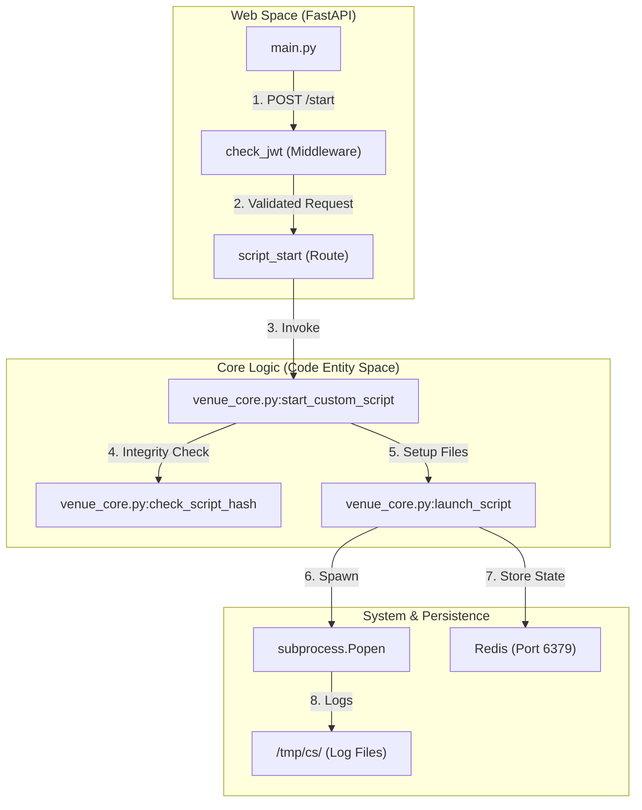
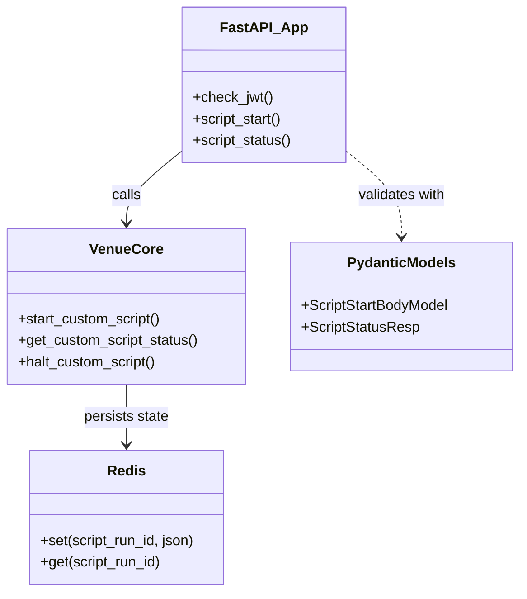

# Page: Core Application Layer

# Core Application Layer

Relevant source files

The following files were used as context for generating this wiki page:

- [core/schema.py](core/schema.py)
- [core/venue_core.py](core/venue_core.py)
- [main.py](main.py)
- [openapi.yaml](openapi.yaml)

The **Core Application Layer** represents the heart of the Ingenium Venue Agent. It is responsible for exposing the REST API, validating incoming script execution requests, managing the lifecycle of background processes, and persisting state across service restarts. This layer bridges the gap between external HTTP requests and the low-level system execution of Python scripts.

## Architecture Overview

The application is built using the FastAPI framework, which handles the web routing and middleware. Below this, the `venue_core` module coordinates with a Redis instance for state management and a dedicated worker process manager for executing scripts in isolated subprocesses.

### Application Flow Diagram
This diagram illustrates how a script execution request moves from the `main.py` entry point through the core logic into the system process space.

**Sources:** [main.py:67-78](), [core/venue_core.py:125-171](), [core/venue_core.py:206-224]()

## Component Breakdown

The layer is divided into several specialized modules, each handling a distinct part of the application lifecycle:

### [FastAPI Web Layer (main.py)](#2.1)
The entry point of the application. It defines the `FastAPI` app instance, configures the `APIRouter` with a `/api/v3` prefix, and implements global middleware for JWT authentication and request logging.
*   **Key Responsibilities:** Route handling, Request/Response serialization, and Exception mapping.
*   **Source:** [main.py:52-164]()

### [Custom Script Execution Engine (venue_core.py)](#2.2)
The orchestration engine for script execution. It manages the filesystem workspace in `/tmp/cs`, performs SHA256 validation on scripts before execution, and interacts with Redis to track active PIDs and metadata.
*   **Key Responsibilities:** Subprocess spawning via `subprocess.Popen`, status polling, and script halting (SIGTERM).
*   **Source:** [core/venue_core.py:206-254]()

### [Data Models and Schema (schema.py)](#2.3)
Defines the "Source of Truth" for data structures using Pydantic. These models enforce strict validation (e.g., preventing path traversal in script paths) and generate the OpenAPI documentation.
*   **Key Entities:** `ScriptStartBodyModel`, `ScriptStatusResp`, `CustomScriptStatus`.
*   **Source:** [core/schema.py:1-78]()

### [Utilities and Authentication (utils.py, core_utils.py)](#2.4)
A collection of helper functions for security and environment management. `utils.py` handles the decoding of RS256 JWTs using a public key, while `core_utils.py` provides robust environment variable fetching.
*   **Key Functions:** `get_decoded_token`, `has_permission`, `get_env`.
*   **Sources:** [utils.py:1-122](), [core/core_utils.py:1-21]()

### [Worker Process Manager (worker_process.py)](#2.5)
A low-level manager that handles the execution of tasks in a separate process pool. It ensures that the main FastAPI event loop remains unblocked during heavy operations and provides hooks for process cleanup.
*   **Key Class:** `WorkerProcess`.

## System Entity Mapping

The following diagram maps high-level system concepts to their specific implementations in the codebase.

| System Concept | Code Entity | File Path |
| :--- | :--- | :--- |
| **Integrity Verifier** | `check_script_hash` | [core/venue_core.py:187]() |
| **State Store** | `redis.StrictRedis` | [core/venue_core.py:158]() |
| **Log Tailer** | `tailer.tail` | [core/venue_core.py:178]() |
| **Auth Middleware** | `check_jwt` | [main.py:168]() |
| **Path Validator** | `script_path_must_be_relative` | [core/schema.py:27]() |

**Sources:** [main.py:163-168](), [core/venue_core.py:206-254](), [core/schema.py:18-74]()
