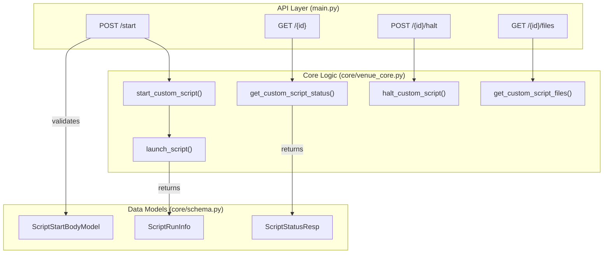

# Page: Custom Script API Endpoints

# Custom Script API Endpoints

Relevant source files

The following files were used as context for generating this wiki page:

- [core/schema.py](core/schema.py)
- [core/venue_core.py](core/venue_core.py)
- [main.py](main.py)
- [openapi.yaml](openapi.yaml)
- [tests/test_custom_script.py](tests/test_custom_script.py)

The Custom Script API provides a set of endpoints for managing the lifecycle of external scripts within the Ingenium Venue Agent. This includes starting scripts with integrity validation, polling for real-time status and logs, terminating active processes, and retrieving execution artifacts.

## Overview of Script Execution Flow

The Venue Agent executes scripts as independent subprocesses. It manages their state using a local Redis instance and stores execution artifacts (logs, inputs, outputs) in a dedicated temporary directory structure.

### Code Entity Mapping

The following diagram maps the logical API operations to the internal functions in `core/venue_core.py` and the data models in `core/schema.py`.

**Custom Script Execution Mapping**

**Sources:** [main.py:67-159](), [core/venue_core.py:125-248](), [core/schema.py:18-74]()

---

## 1. Start Script (`POST /api/v3/custom_script/start`)

This endpoint initiates the execution of a script located within the `CUSTOM_SCRIPT_BASE_DIR`.

### Request Validation
The `ScriptStartBodyModel` enforces strict security constraints on the `scriptPath`:
*   **Relative Paths Only:** Absolute paths are rejected to prevent execution of arbitrary system binaries [core/schema.py:27-30]().
*   **No Traversal:** Paths containing `..` or `~` are rejected to prevent directory traversal attacks [core/schema.py:31-34]().
*   **Integrity Check:** The server calculates the SHA256 hash of the file at `scriptPath` and compares it against the provided `scriptHash`. If they do not match, execution is aborted [core/venue_core.py:187-203]().

### Execution Lifecycle
1.  **Environment Setup:** Creates a unique directory in `/tmp/cs/` using a UUID and timestamp [core/venue_core.py:55-77]().
2.  **Input Serialization:** Writes the `inputs` dictionary to `input.json` in the temp directory [core/venue_core.py:102-109]().
3.  **Process Spawning:** Launches the script using `subprocess.Popen`. The script is called with two arguments: the path to `input.json` and the path to `output.json` [core/venue_core.py:154-155]().
4.  **State Persistence:** Stores process metadata (PID, file paths) in Redis using the `scriptRunId` as the key [core/venue_core.py:158-169]().

**Sources:** [core/venue_core.py:206-248](), [core/schema.py:18-35]()

---

## 2. Get Status (`GET /api/v3/custom_script/{script_run_id}`)

Retrieves the current state of a script execution, including processed outputs and the latest log entries.

### Data Aggregation
The endpoint performs the following steps to build the `ScriptStatusResp`:
*   **Process Monitoring:** Checks if the PID stored in Redis is still active using `psutil.pid_exists` [core/venue_core.py:260-262]().
*   **Log Tailing:** Uses the `tailer` library to retrieve the last 25 lines of the script's stdout/stderr log file [core/venue_core.py:174-184]().
*   **Output Polling:** Reads `output.json`. Because the script may be writing to this file simultaneously, the server employs a retry mechanism with exponential backoff (`_load_json_with_retry`) to handle `JSONDecodeError` [core/venue_core.py:26-44]().

### Response Schema (`ScriptStatusResp`)
| Field | Type | Description |
| :--- | :--- | :--- |
| `custom_script_status` | Enum | `PENDING`, `PASS`, `FAIL`, or `ERROR` [core/schema.py:43-47]() |
| `logfile_lines` | List[str] | The last 25 lines of logs [core/schema.py:74]() |
| `custom_script_outputs` | Object | Parsed data from the script's `output.json` [core/schema.py:61-65]() |
| `logfile_url` | String | URL to download the full artifact bundle [core/schema.py:68]() |

**Sources:** [main.py:95-115](), [core/venue_core.py:250-290]()

---

## 3. Halt Script (`POST /api/v3/custom_script/{script_run_id}/halt`)

Terminates a running script process.

### Implementation
The server retrieves the PID from Redis and attempts to terminate the process group:
1.  **SIGTERM:** It first sends `signal.SIGTERM` to the process group (using the negative PID via `os.killpg`) to allow for graceful cleanup [core/venue_core.py:304-306]().
2.  **Zombie Cleanup:** After signaling, it calls `process.wait()` (if the process object is available) or relies on system reaping to prevent zombie processes.
3.  **Response:** Returns a `204 No Content` on success [main.py:130]().

**Sources:** [main.py:117-137](), [core/venue_core.py:293-311]()

---

## 4. Download Files (`GET /api/v3/custom_script/{script_run_id}/files`)

Provides a compressed archive of all files associated with a specific script run.

### Artifact Bundling
The server identifies the temporary directory associated with the `script_run_id` and creates a `tar.gz` archive containing:
*   `input.json`: The original inputs sent to the script.
*   `output.json`: The final (or current) outputs written by the script.
*   `script.log`: The full combined stdout/stderr log.

The resulting file is named `{script_run_id}.tar.gz` and served as an `application/gzip` stream [main.py:153]().

**Sources:** [main.py:139-160](), [core/venue_core.py:80-99](), [core/venue_core.py:314-328]()

---

## Error Handling

All endpoints return an `ErrorResponse` model in the event of a failure (HTTP 400).

| Status Code | Reason |
| :--- | :--- |
| **400** | Hash mismatch, invalid path, script not found, or internal execution error [main.py:91](). |
| **401** | Missing or invalid JWT token [main.py:193](). |
| **403** | Token lacks required scopes (e.g., `execute:other`) [utils.py:132-135](). |

**Sources:** [core/schema.py:15-16](), [main.py:88-92]()
