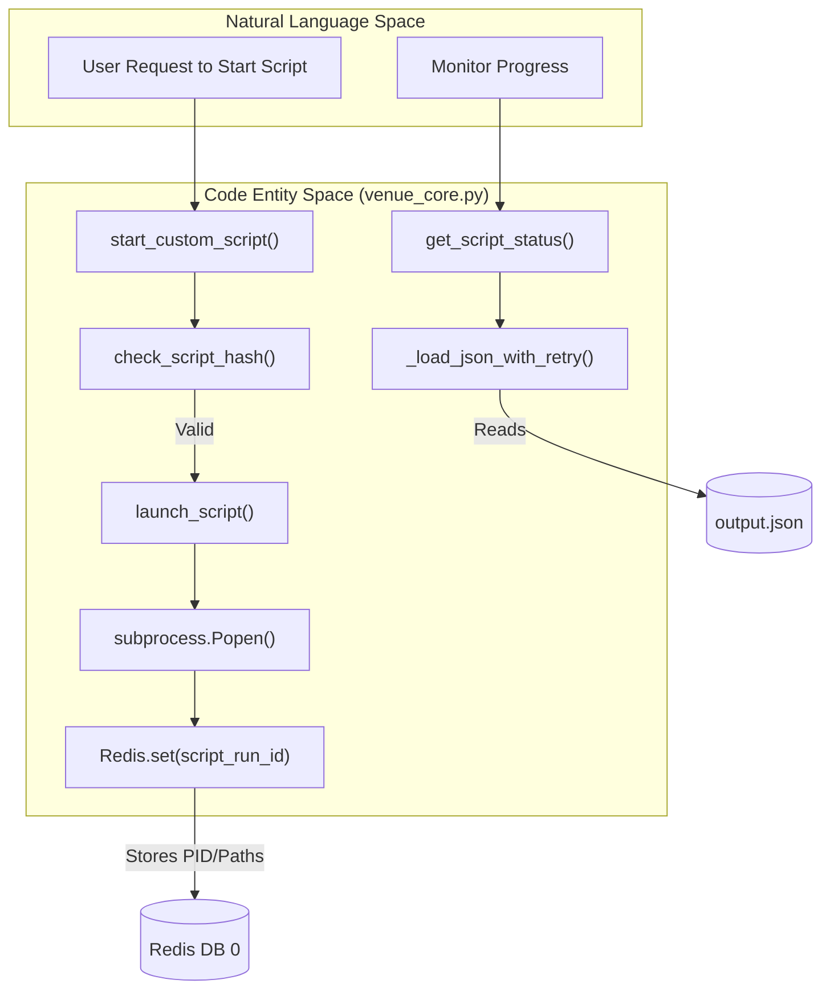
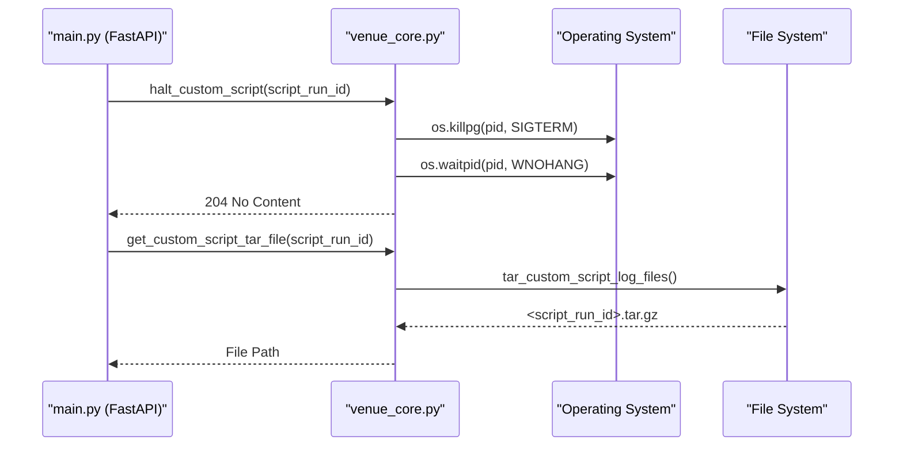

# Page: Custom Script Execution Engine (venue_core.py)

# Custom Script Execution Engine (venue_core.py)

Relevant source files

The following files were used as context for generating this wiki page:

- [core/schema.py](core/schema.py)
- [core/venue_core.py](core/venue_core.py)
- [core/worker_process.py](core/worker_process.py)
- [openapi.yaml](openapi.yaml)

The Custom Script Execution Engine is the core component of the Ingenium Venue Agent responsible for the asynchronous execution and lifecycle management of user-provided scripts. It provides a secure, isolated environment for scripts to run, monitors their progress via file-based state and Redis, and manages the collection of execution artifacts.

## Script Execution Lifecycle

The execution of a custom script follows a strict pipeline managed by `venue_core.py`. This process ensures that scripts are validated for integrity before execution and that their outputs are captured systematically.

### 1. Validation and Environment Setup
Before a process is spawned, the engine performs the following:
*   **Path Validation**: Ensures the script path is relative and does not contain traversal sequences like `..` or `~` [core/schema.py:27-35]().
*   **Integrity Check**: Calculates the SHA256 hash of the script file and compares it against the `scriptHash` provided in the request [core/venue_core.py:187-203]().
*   **Workspace Creation**: Generates a unique `script_run_id` (UUID) and creates a timestamped subdirectory under `/tmp/cs/` [core/venue_core.py:55-77]().
*   **File Initialization**: Creates `input.json` (containing user inputs) and an empty `output.json` template in the workspace [core/venue_core.py:102-115]().

### 2. Process Spawning
The script is executed as a subprocess using `subprocess.Popen` [core/venue_core.py:154-155]().
*   **Process Grouping**: Uses `preexec_fn=os.setsid` to create a new process group, allowing for reliable termination of the script and all its children [core/venue_core.py:155]().
*   **I/O Redirection**: Both `stdout` and `stderr` are redirected to a `script.log` file in the workspace [core/venue_core.py:148-155]().
*   **Unbuffered Output**: Sets the `PYTHONUNBUFFERED` environment variable to ensure logs are written to disk in real-time for polling [core/venue_core.py:150-152]().

### 3. State Persistence
Once the process starts, its metadata is persisted in Redis to allow the FastAPI workers to track the script across different request contexts [core/venue_core.py:158-169]().

**Script Execution Data Flow**

Sources: [core/venue_core.py:125-171](), [core/venue_core.py:187-203](), [core/venue_core.py:206-224](), [core/venue_core.py:252-290]()

---

## State Management and Monitoring

The engine does not rely on the process remaining in memory; instead, it uses a hybrid of Redis and file-system polling to determine status.

### Redis State Schema
The engine stores a JSON-serialized dictionary in Redis using the `script_run_id` as the key [core/venue_core.py:160-169]():

| Field | Description |
| :--- | :--- |
| `process_id` | The OS PID of the spawned script. |
| `output_path` | Absolute path to the `output.json` file. |
| `logfile_path` | Absolute path to the `script.log` file. |
| `logfile_url` | The API endpoint for artifact retrieval. |
| `custom_script_temp_dir` | The directory containing all execution files. |

### Status Polling (`get_script_status`)
When a client polls the status endpoint, `get_script_status` performs the following [core/venue_core.py:252-322]():
1.  **Metadata Retrieval**: Fetches the script metadata from Redis.
2.  **Liveness Check**: Uses `psutil.pid_exists(pid)` to check if the process is still running [core/venue_core.py:269]().
3.  **Log Tailing**: Uses the `tailer` library to extract the last 25 lines of `script.log` [core/venue_core.py:174-184]().
4.  **JSON Output Retrieval**: Reads `output.json`. Because the script might be writing to this file simultaneously, the engine uses `_load_json_with_retry` with exponential backoff to avoid `JSONDecodeError` [core/venue_core.py:26-44]().

---

## Process Control and Cleanup

### Halting Scripts
The `halt_custom_script` function provides a mechanism to stop runaway or no-longer-needed scripts [core/venue_core.py:325-364]().
*   **Graceful Termination**: It first sends `signal.SIGTERM` to the entire process group (using `-pid`) [core/venue_core.py:348]().
*   **Zombie Handling**: After sending the signal, it uses `os.waitpid` with `os.WNOHANG` to clean up the process entry from the OS table, preventing zombie processes [core/venue_core.py:350]().

### Artifact Retrieval (Tarball Generation)
Execution artifacts (input, output, and logs) are bundled into a compressed archive for download [core/venue_core.py:80-99]().
*   **Function**: `tar_custom_script_log_files`
*   **Logic**: It iterates through the script's temporary directory and adds all files to a `.tar.gz` archive.
*   **Naming**: The archive is stored in the base `/tmp/cs/` directory named as `<script_run_id>.tar.gz` [core/venue_core.py:89]().

**Process and Artifact Management**

Sources: [core/venue_core.py:80-99](), [core/venue_core.py:325-364](), [core/venue_core.py:367-380]()

---

## Technical Implementation Details

### SHA256 Integrity Checking
The function `check_script_hash` implements a chunked read approach (64KB blocks) to calculate hashes efficiently even for large script files, preventing high memory consumption during validation [core/venue_core.py:192-198]().

### File Permissions
To ensure the VenueServer can manage files created by scripts that might run under different contexts, `create_temp_dir_and_logfiles` explicitly sets the base directory permissions to `0777` (`stat.S_IRWXO | stat.S_IRWXG | stat.S_IRWXU`) [core/venue_core.py:61]().

### Worker Process Isolation
While `venue_core.py` handles the logic of spawning, it is often invoked via the `WorkerProcess` class in `worker_process.py`. This class uses a `ProcessPoolExecutor` with a single worker to ensure that script management tasks do not block the main FastAPI event loop [core/worker_process.py:23-38]().

Sources: [core/venue_core.py:61](), [core/venue_core.py:192-198](), [core/worker_process.py:35-38]()
