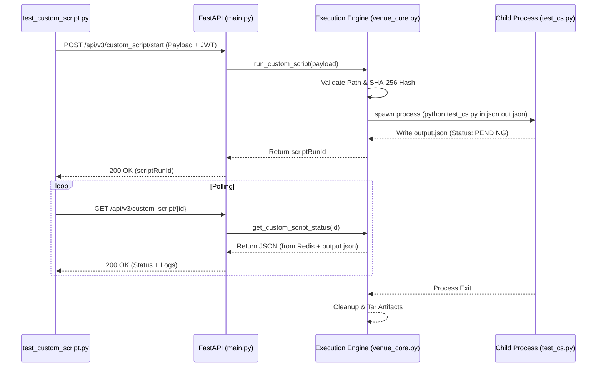
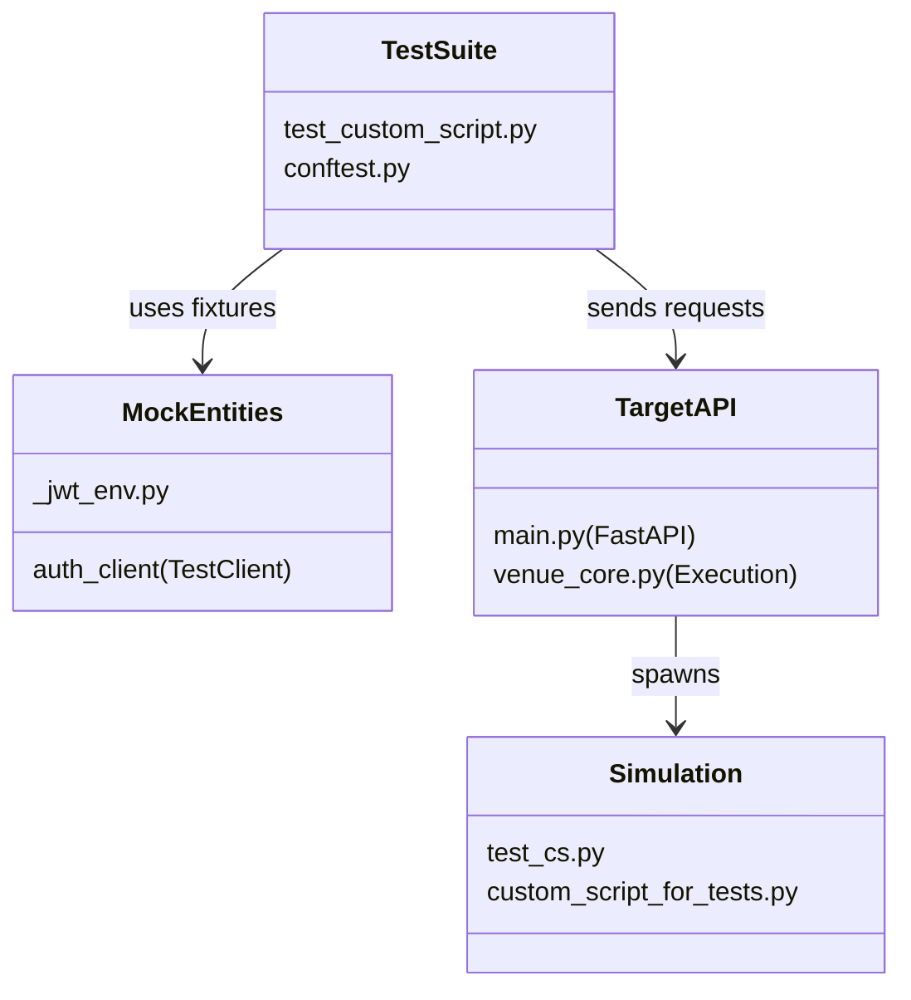

# Page: Custom Script Test Suite

# Custom Script Test Suite

Relevant source files

The following files were used as context for generating this wiki page:

- [tests/custom_script_for_tests/custom_script_for_tests.py](tests/custom_script_for_tests/custom_script_for_tests.py)
- [tests/custom_script_for_tests/input.json](tests/custom_script_for_tests/input.json)
- [tests/custom_script_for_tests/output.json](tests/custom_script_for_tests/output.json)
- [tests/custom_script_for_tests/test_cs.py](tests/custom_script_for_tests/test_cs.py)
- [tests/test_custom_script.py](tests/test_custom_script.py)

The Custom Script Test Suite is a comprehensive collection of automated tests designed to validate the lifecycle, security, and performance of the Ingenium Venue Agent's custom script execution engine. It ensures that the REST API correctly manages script processes, enforces path security, validates integrity via SHA-256 hashes, and handles high-load scenarios.

## 1. Test Architecture and Simulation
The suite relies on `test_custom_script.py` as the primary test runner and `test_cs.py` (or `custom_script_for_tests.py`) as the target simulation script.

### 1.1 Simulation Script (`test_cs.py`)
The simulation script mimics real-world Ingenium scripts by adhering to a specific JSON input/output contract.
*   **Input Handling**: It accepts two command-line arguments: an absolute path to an `input.json` and an absolute path for the `output.json` [tests/custom_script_for_tests/test_cs.py:31-40]().
*   **Execution Control**: It can simulate delays via a `duration` parameter [tests/custom_script_for_tests/test_cs.py:110-117](), trigger intentional failures using `IngeniumStepError` [tests/custom_script_for_tests/test_cs.py:28-29](), or perform "heavy writes" to stress the filesystem and status polling [tests/custom_script_for_tests/test_cs.py:120-130]().
*   **State Persistence**: It periodically updates the `output.json` file to signal its current status (`PENDING`, `PASS`, `FAIL`) and arbitrary output data [tests/custom_script_for_tests/test_cs.py:80-92]().

### 1.2 Data Flow: Test to Script Execution
The following diagram illustrates how the test suite interacts with the FastAPI application and the underlying script process.

**Custom Script Execution Flow**

Sources: [tests/test_custom_script.py:24-49](), [tests/custom_script_for_tests/test_cs.py:57-92]()

---

## 2. Functional Test Scenarios
The test suite covers the nominal lifecycle and various edge cases of the `/api/v3/custom_script/` endpoints.

### 2.1 Lifecycle Tests
*   **Start Success**: Validates that a script starts correctly when provided with a valid relative path and matching SHA-256 hash [tests/test_custom_script.py:24-49]().
*   **Status Polling**: Checks that the agent correctly reports progress and captures standard output/error during execution.
*   **Halt**: Verifies that the agent can terminate a running script process (SIGTERM) and update the status to `HALTED`.
*   **File Download**: Ensures that after a script completes, the agent bundles the workspace (including logs and JSON files) into a `.tar.gz` for retrieval.

### 2.2 Security and Validation Tests
A significant portion of the suite is dedicated to preventing unauthorized access or malicious execution.

| Test Case | Description | Expected Result |
| :--- | :--- | :--- |
| **Path Traversal** | Attempts to use `..` in the `scriptPath` to access files outside the base directory [tests/test_custom_script.py:89-123](). | `400 Bad Request` |
| **Absolute Paths** | Attempts to execute a script using an absolute path [tests/test_custom_script.py:52-85](). | `400 Bad Request` |
| **Hash Mismatch** | Provides an incorrect SHA-256 hash for the script file [tests/test_custom_script.py:190-217](). | `400 Bad Request` |
| **Expired Token** | Uses a JWT that has passed its expiration time. | `401 Unauthorized` |
| **Missing Scope** | Uses a valid JWT but lacks the required `execute` scope. | `403 Forbidden` |

Sources: [tests/test_custom_script.py:52-160](), [tests/test_custom_script.py:190-217]()

---

## 3. Performance and Stress Testing
The suite includes a "Heavy Writes" test designed to validate system stability under I/O pressure.

### 3.1 Heavy-Writes Stress Test
This test invokes `test_cs.py` with the `heavy_writes` flag set to `true` [tests/custom_script_for_tests/input.json:9](). 
*   **Behavior**: The script enters a tight loop, writing large amounts of data to `output.json` approximately every 0.1 seconds [tests/custom_script_for_tests/test_cs.py:120-130]().
*   **Validation**: The test suite polls the status endpoint concurrently to ensure the Venue Agent remains responsive and that Redis state updates do not bottleneck the system.

---

## 4. Test Infrastructure Components

### 4.1 Utility Functions
The suite uses a local helper `_sha256` to generate hashes for the test payloads, ensuring the integrity check in `venue_core.py` is accurately exercised [tests/test_custom_script.py:17-21]().

### 4.2 Code Entity Mapping
This diagram maps the logical test components to the specific files and classes in the codebase.

**Test Component Mapping**

Sources: [tests/test_custom_script.py:12-14](), [tests/custom_script_for_tests/test_cs.py:1-25]()

### 4.3 Environment Setup
Tests are executed within a controlled environment where:
1.  `CUSTOM_SCRIPT_BASE_DIR` is mocked to point to the `tests/custom_script_for_tests` directory.
2.  RSA keys are generated on-the-fly to sign test JWTs.
3.  Isolated log files are created per test run to prevent cross-test contamination.

Sources: [tests/test_custom_script.py:28-29](), [tests/test_custom_script.py:195-196]()
