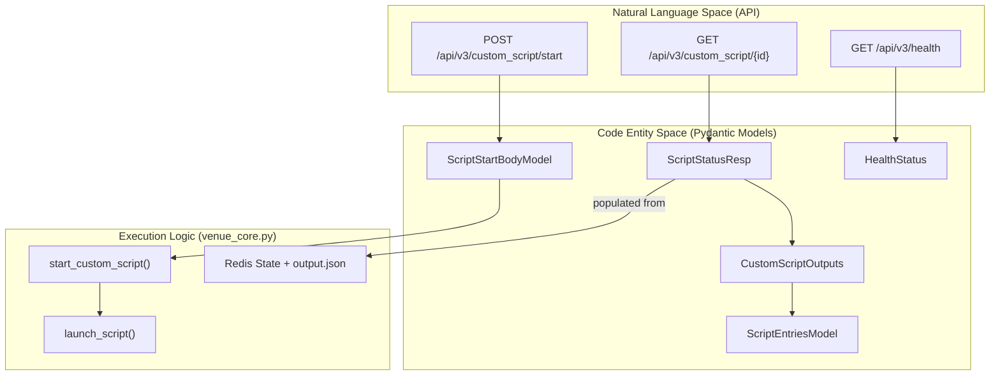
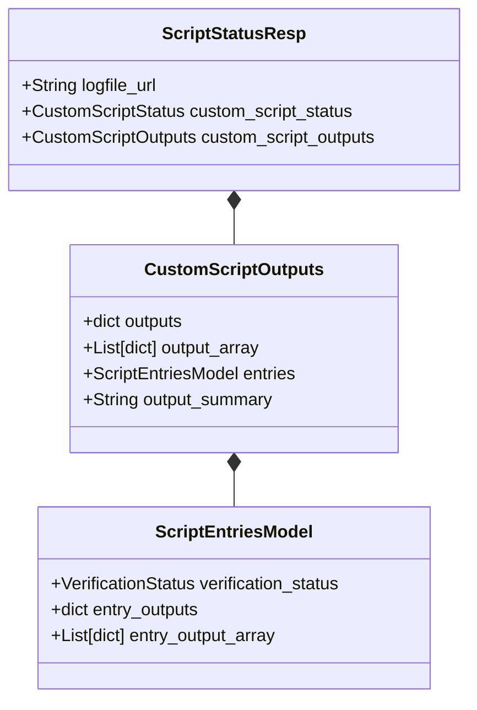

# Page: Data Models and Schema (schema.py)

# Data Models and Schema (schema.py)

Relevant source files

The following files were used as context for generating this wiki page:

- [core/__init__.py](core/__init__.py)
- [core/schema.py](core/schema.py)
- [core/venue_core.py](core/venue_core.py)
- [openapi.yaml](openapi.yaml)

This page documents the Pydantic models and enumerations defined in `core/schema.py`. These models provide the structural foundation for the VenueServer's REST API, ensuring strict data validation, type safety, and consistent communication between the Natural Language Space (API requests) and the Code Entity Space (execution logic).

## Overview of Schema Architecture

The VenueServer uses Pydantic for data validation and settings management. All models in `core/schema.py` are used by `main.py` to validate incoming request bodies and structure outgoing JSON responses.

### Data Flow and Model Mapping

The following diagram illustrates how external requests are mapped to internal Pydantic models and subsequently processed by the execution engine.

**Diagram: Request to Model Mapping**

**Sources:** [core/schema.py:1-78](), [core/venue_core.py:125-171](), [openapi.yaml:41-118]()

---

## Enumerations

The system uses specific enumerations to track the lifecycle of scripts and the health of the service.

### HealthStatusEnum
Defines the possible states for the VenueServer health check.
*   `OK`: Service is fully operational.
*   `ERROR`: Service has encountered a critical failure.
*   `UNKNOWN`: Service state cannot be determined.

### CustomScriptStatus & VerificationStatus
These two enums share the same set of values and track the execution and validation state of custom scripts.
*   `PENDING`: Script is currently running or initialized.
*   `ERROR`: Script execution failed due to a system or runtime error.
*   `PASS`: Script completed successfully and met verification criteria.
*   `FAIL`: Script completed but failed internal logic checks.

**Sources:** [core/schema.py:6-9](), [core/schema.py:43-53]()

---

## Script Execution Models

### ScriptStartBodyModel
This model validates the payload for starting a new script. It includes critical security validations for the script path to prevent directory traversal attacks.

| Field | Type | Description |
| :--- | :--- | :--- |
| `scriptName` | `str` | Name of the custom script. |
| `scriptPath` | `str` | Relative path from `CUSTOM_SCRIPT_BASE_DIR`. |
| `scriptHash` | `str` | SHA256 hash for integrity verification. |
| `inputs` | `dict` | Input parameters passed to the script. |
| `outputs` | `dict` | Expected output structure. |

**Path Validation Logic:**
The `script_path_must_be_relative` validator ensures:
1.  The path is not absolute [core/schema.py:29-30]().
2.  The path does not contain `..` (parent directory references) [core/schema.py:31-32]().
3.  The path does not contain `~` (home directory references) [core/schema.py:33-34]().

### ScriptRunInfo
Returned immediately after a successful `POST /start` request.
*   `scriptRunId`: A UUID string used to track the script in Redis and poll for status [core/schema.py:37-38]().

**Sources:** [core/schema.py:18-38]()

---

## Status and Output Models

### ScriptStatusResp
The primary response model for polling script progress. It aggregates data from the filesystem (logs), the execution process, and the script's `output.json`.

| Field | Type | Source / Description |
| :--- | :--- | :--- |
| `logfile_url` | `str` | Endpoint to download the `.tar.gz` artifact. |
| `logfile_path` | `str` | Absolute path on the host for debugging. |
| `custom_script_status` | `CustomScriptStatus` | Current state (PENDING, PASS, etc.). |
| `custom_script_outputs` | `CustomScriptOutputs` | Structured results from `output.json`. |
| `logfile_lines` | `List[str]` | The last 25 lines of `script.log`. |

### CustomScriptOutputs and ScriptEntriesModel
These models define the structure of the `output.json` file that custom scripts are expected to update during execution.

**Diagram: Output Data Structure**

**Sources:** [core/schema.py:55-75](), [core/venue_core.py:174-184]()

---

## Utility and Health Models

### HealthStatus
Used by the `/api/v3/health` endpoint to report service availability.
*   `status`: A `HealthStatusEnum` value.
*   `message`: A descriptive string (e.g., "VenueServer is running").

### ErrorResponse
A standardized container for error messages returned during 400, 401, 403, or 500 responses.
*   `message`: String containing the error details.

**Sources:** [core/schema.py:11-16](), [openapi.yaml:212-243]()
