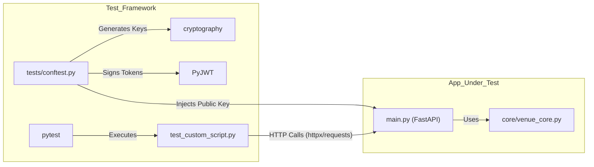

# Page: Dependencies and Technology Stack

# Dependencies and Technology Stack

<details>
<summary>Relevant source files</summary>

The following files were used as context for generating this wiki page:

- [requirements.txt](requirements.txt)
- [tests/requirements.txt](tests/requirements.txt)

</details>


This page documents the Python and system-level dependencies utilized by the Ingenium Venue Agent (`VenueServer`). The stack is selected to provide a high-performance, asynchronous REST API capable of managing long-running system processes, secure token-based authentication, and persistent state management.

## Python Dependency Stack

The project utilizes a specific set of libraries to handle web serving, security, process monitoring, and configuration. These are defined in the primary `requirements.txt` file.

| Dependency | Version | Purpose in VenueServer |
| :--- | :--- | :--- |
| `fastapi` | `0.118.0` | Core web framework for REST API endpoints and dependency injection. |
| `uvicorn` | `0.37.0` | ASGI server implementation used to run the FastAPI application. |
| `redis` | `6.4.0` | Interface for the Redis key-value store used for script state persistence. |
| `psutil` | `7.1.0` | Cross-platform library for process management and system monitoring. |
| `pyjwt` | `2.10.1` | Implementation of JSON Web Tokens for secure API authentication. |
| `cryptography` | `46.0.1` | Low-level cryptographic primitives for RSA key handling and signature verification. |
| `tailer` | `0.4.1` | Provides "tail -f" functionality for reading script logs in real-time. |
| `pyaml-env` | `1.2.2` | YAML parser with environment variable substitution for logging configuration. |
| `click` | `8.3.0` | Command-line interface creation for the `main.py` entry point. |

Sources: [requirements.txt:1-9]()

### Web and Application Server
The application is built on **FastAPI**, leveraging Python's `asyncio` for non-blocking I/O. This is critical for the `VenueServer` as it must handle polling requests for script status while simultaneously managing subprocess execution. **Uvicorn** serves as the ASGI worker, configured in `main.py` to handle the server lifecycle and port binding.

### State and Process Management
*   **Redis**: Used as the backing store for `ScriptRunInfo` objects. When a script is started via `venue_core.py`, its metadata, status, and process ID are serialized and stored in Redis to ensure state survives application restarts.
*   **psutil**: Employed within `worker_process.py` and `venue_core.py` to monitor the health of spawned child processes. It allows the system to check if a `pid` is still active, retrieve CPU/memory usage, and send signals like `SIGTERM` or `SIGKILL` during "halt" operations.
*   **tailer**: Specifically used in the `GET /api/v3/custom_script/{script_run_id}` endpoint to stream the last N lines of the script's standard output/error logs to the client.

### Security and Authentication
*   **PyJWT & Cryptography**: These libraries work together to implement RS256 JWT validation. The `VenueServer` loads an RSA public key (`exec_venue_public_pem.pem`) to verify tokens issued by the Ingenium identity provider. `PyJWT` handles the decoding and claim validation (e.g., `exp`, `iss`), while `cryptography` provides the backend for RSA signature verification.

### Configuration and CLI
*   **pyaml-env**: Used to load `log_config.yaml`. It allows the logging paths (like `ING_LOG_DIR`) to be dynamically injected into the logging configuration from the shell environment.
*   **click**: Powers the command-line interface in `main.py`, allowing operators to specify the `--port` and other startup parameters.

---

## Technology Stack Data Flow

The following diagram illustrates how these dependencies interact to process a request and manage a script execution lifecycle.

### Component Interaction Diagram
"Code Entity Space" mapping to "Dependency Space".

```mermaid
graph TD
    subgraph "External_Clients"
        [Client_App]
    end

    subgraph "Web_Layer_FastAPI_Uvicorn"
        A["main.py (FastAPI App)"] -- "Uses" --> B["uvicorn (ASGI Server)"]
        A -- "Validates JWT" --> C["PyJWT / Cryptography"]
        A -- "Parses CLI" --> D["click"]
    end

    subgraph "Core_Logic_Execution"
        E["venue_core.py (Execution Engine)"] -- "Monitors PIDs" --> F["psutil"]
        E -- "Reads Logs" --> G["tailer"]
        E -- "Persists State" --> H["redis-py"]
    end

    subgraph "Infrastructure"
        I[("Redis DB")]
        J["Subprocess (Shell Script/Python)"]
    end

    [Client_App] -- "HTTP Request" --> B
    B --> A
    A --> E
    E --> J
    E -- "SET/GET script_status" --> H
    H --> I
    F -- "Query Process State" --> J
    G -- "Tail .log files" --> J
```

Sources: [main.py:1-50](), [core/venue_core.py:1-40](), [core/worker_process.py:1-20]()

---

## Test Dependencies

The testing environment uses a slightly different set of dependencies to facilitate mocking, HTTP simulation, and test runners.

| Dependency | Version | Purpose |
| :--- | :--- | :--- |
| `pytest` | `>=7.0` | Main test runner and fixture framework. |
| `requests` | `>=2.29` | Synchronous HTTP client for integration testing. |
| `httpx` | (Latest) | Asynchronous HTTP client for testing FastAPI endpoints. |
| `pytest-timeout` | (Latest) | Ensures tests do not hang indefinitely during subprocess execution. |
| `PyJWT` | `1.7.0` | Used in `tests/_jwt_env.py` to sign mock tokens for test cases. |
| `cryptography` | `2.4.2` | Used to generate RSA key pairs for the test JWT environment. |

Sources: [tests/requirements.txt:1-6]()

### Test Environment Data Flow
This diagram shows how `pytest` and its dependencies bridge the gap between the test code and the `VenueServer` entities.



Sources: [tests/conftest.py:1-30](), [tests/_jwt_env.py:1-20](), [tests/test_custom_script.py:1-50]()

## Version Constraints and Rationale

1.  **Python 3.12**: The codebase is optimized for Python 3.12, particularly for improved `asyncio` performance and type hinting support.
2.  **FastAPI 0.118.0**: Selected for compatibility with Pydantic v2, which is used for high-speed data validation in `core/schema.py`.
3.  **Redis 6.4.0**: The `redis-py` client version is chosen to support advanced features like async connections and robust connection pooling used in the `VenueServer`'s persistent state management.
4.  **Cryptography 46.0.1**: A recent version is required to ensure support for modern OpenSSL backends and secure RSA padding schemes used during JWT verification.

Sources: [requirements.txt:1-9](), [core/schema.py:1-10]()
