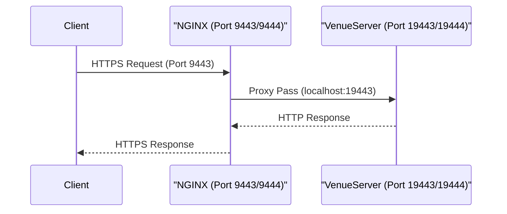

# Page: Deployment and Operations

# Deployment and Operations

<details>
<summary>Relevant source files</summary>

The following files were used as context for generating this wiki page:

- [README.md](README.md)
- [config/venueserver_dev_envs.sh](config/venueserver_dev_envs.sh)
- [setup_venueserver.sh](setup_venueserver.sh)
- [start_venueserver.sh](start_venueserver.sh)

</details>


This page provides a high-level overview of the deployment lifecycle, configuration management, and operational procedures for the **VenueServer**. The system is designed to run as a multi-instance FastAPI application behind an NGINX reverse proxy, utilizing Redis for state persistence.

### Deployment Overview

The deployment process transitions the codebase from a repository clone to a functional multi-instance environment. It relies on shell scripts to automate virtual environment creation, dependency management, and web server configuration.

#### System Component Relationship
The following diagram illustrates how the deployment scripts and configuration files map to the running system components.

**Deployment to Runtime Mapping**
```mermaid
graph TD
    subgraph "Filesystem (Code Entity Space)"
        [setup_venueserver.sh] --> |"generates"| [nginx.conf]
        [setup_venueserver.sh] --> |"creates"| [venv3]
        [venueserver_envs.sh] --> |"configures"| [start_venueserver.sh]
        [log_config.yaml] --> |"configures"| [main.py]
    end

    subgraph "Runtime (System Space)"
        [nginx.conf] -.-> |"loaded by"| NGINX["NGINX Proxy (Ports 9443-9445)"]
        [start_venueserver.sh] -.-> |"launches"| VS["VenueServer Instance (Uvicorn)"]
        VS --> |"writes to"| LOGS["ING_LOG_DIR/ing_vs.log"]
        NGINX --> |"proxies to"| VS
    end
```
**Sources:** [setup_venueserver.sh:74-80](), [start_venueserver.sh:89](), [README.md:106-114]()

---

### 4.1 Environment Setup
The initial setup is handled by `setup_venueserver.sh`. This script is responsible for preparing the host environment to run the Python application and the NGINX proxy.

*   **Python Environment:** Creates a `venv3` virtual environment using Python 3.12 and installs dependencies from `requirements.txt`.
*   **NGINX Configuration:** Uses `envsubst` to transform `nginx.conf.template` into a site-specific `nginx.conf`, injecting environment variables like `$ING_VENUE_DIR`.
*   **Workspaces:** Creates necessary temporary directories for NGINX in the user's home directory.

For details, see [Environment Setup (setup_venueserver.sh)](#4.1).

**Sources:** [setup_venueserver.sh:52-58](), [setup_venueserver.sh:75-83]()

---

### 4.2 Server Startup and Configuration
The `start_venueserver.sh` script manages the execution of the FastAPI application. It ensures that the runtime environment is correctly configured before launching the Uvicorn server.

| Variable | Purpose |
| :--- | :--- |
| `ING_VENUE_DIR` | Root directory of the VenueServer source code. |
| `ING_LOG_DIR` | Destination for application logs. |
| `CUSTOM_SCRIPT_BASE_DIR` | Root directory where executable custom scripts reside. |
| `ING_MTAK_DIR` | Path added to `PYTHONPATH` for MTAK integration. |

The server is started by pointing to a specific port (e.g., `19443`) and an environment file that sources the variables above.

For details, see [Server Startup and Configuration (start_venueserver.sh)](#4.2).

**Sources:** [start_venueserver.sh:12-20](), [start_venueserver.sh:80-89](), [config/venueserver_dev_envs.sh:1-8]()

---

### 4.3 NGINX Reverse Proxy
In production and multi-instance development, NGINX acts as the entry point, providing SSL/TLS termination and port mapping.

**Traffic Flow Architecture**


NGINX is configured to serve up to three instances of VenueServer, mapping external ports `9443-9445` to internal ports `19443-19445`.

For details, see [NGINX Reverse Proxy](#4.3).

**Sources:** [README.md:45-51](), [README.md:145-163]()

---

### 4.4 Logging Configuration
The VenueServer employs a structured logging approach defined in `log_config.yaml`. It captures both application-level events and web server access logs.

*   **Rotation:** Logs are automatically rotated when they reach 50MB, keeping up to 20 backups.
*   **Middleware:** The `log_request` middleware in `main.py` captures unique `request_id` values, execution timing, and request bodies for debugging.
*   **Environment Awareness:** Uses `pyaml-env` to allow log paths to be set via the `ING_LOG_DIR` environment variable.

For details, see [Logging Configuration](#4.4).

**Sources:** [README.md:97-103](), [start_venueserver.sh:7-8]()
