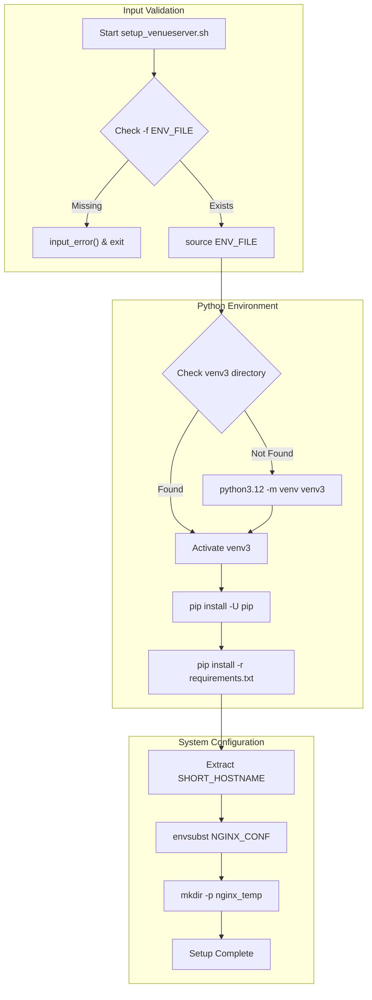
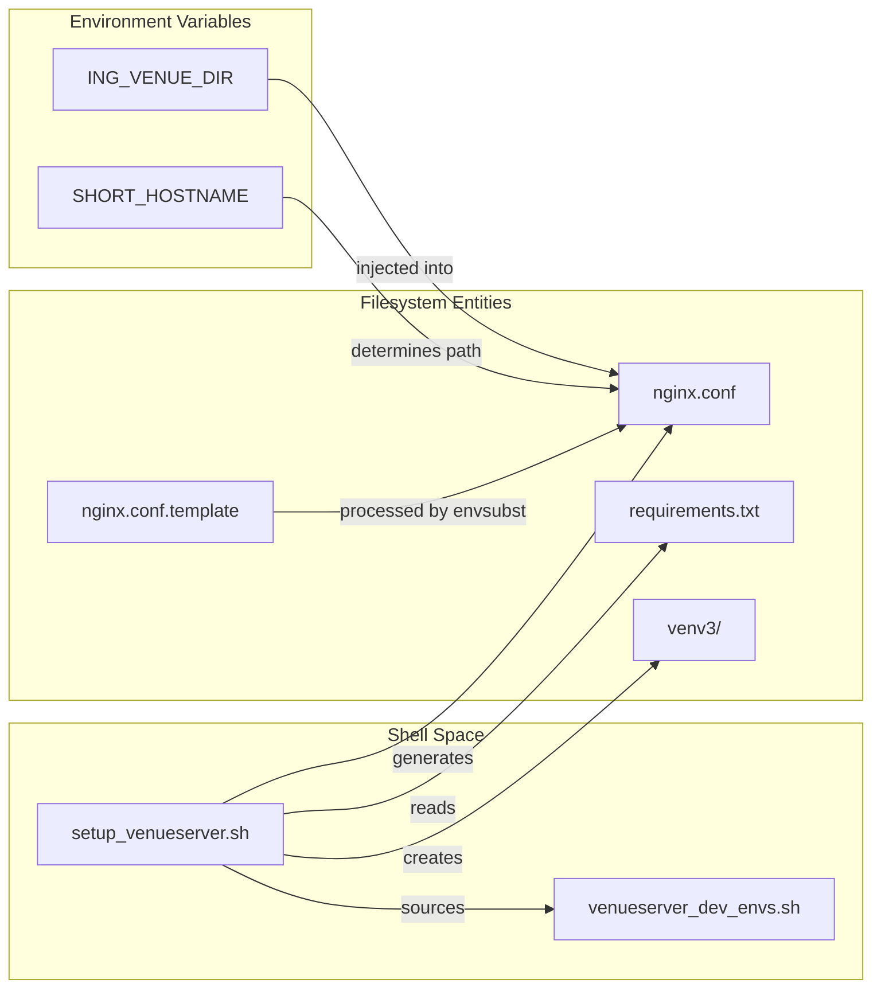

# Page: Environment Setup (setup_venueserver.sh)

# Environment Setup (setup_venueserver.sh)

Relevant source files

The following files were used as context for generating this wiki page:

- [config/venueserver_dev_envs.sh](config/venueserver_dev_envs.sh)
- [setup_venueserver.sh](setup_venueserver.sh)
- [start_venueserver.sh](start_venueserver.sh)

The `setup_venueserver.sh` script is the primary entry point for preparing the Venue Agent environment. It automates the creation of a Python 3.12 virtual environment, dependency installation via `pip`, NGINX configuration generation, and the creation of necessary system directories.

### Script Execution Flow

The script requires an environment configuration file passed via the `-f` flag [setup_venueserver.sh:8-11](). This file defines critical paths used during the setup and subsequent runtime of the server.

#### Logic Flow: setup_venueserver.sh
The following diagram illustrates the sequential operations performed by the setup script.

**Setup Lifecycle Diagram**

**Sources:** [setup_venueserver.sh:1-83]()

---

### Environment Configuration

The script relies on a shell script (e.g., `config/venueserver_dev_envs.sh`) to populate the environment before execution. These variables are used both for Python pathing and for template substitution in configuration files.

| Variable | Description | Source |
| :--- | :--- | :--- |
| `ING_VENUE_DIR` | Root directory of the venue-agent repository. | [config/venueserver_dev_envs.sh:3]() |
| `ING_LOG_DIR` | Directory where application logs are stored. | [config/venueserver_dev_envs.sh:4]() |
| `CUSTOM_SCRIPT_BASE_DIR` | Base path where user-uploaded scripts are executed. | [config/venueserver_dev_envs.sh:7]() |

**Sources:** [config/venueserver_dev_envs.sh:1-8](), [setup_venueserver.sh:44-50]()

---

### Python Virtual Environment (venv3)

The script enforces the use of Python 3.12 to ensure compatibility with the FastAPI and Pydantic requirements of the Venue Agent [setup_venueserver.sh:57]().

1.  **Creation**: If the `venv3` directory does not exist in the script's root, it is created using `python3.12 -m venv` [setup_venueserver.sh:52-58]().
2.  **Activation**: The script activates the environment located at `$SCRIPT_DIR/venv3/bin/activate` [setup_venueserver.sh:68]().
3.  **Dependency Management**: It performs an upgrade of `pip` followed by a recursive installation of all packages defined in `requirements.txt` [setup_venueserver.sh:69-71]().

**Sources:** [setup_venueserver.sh:4-58](), [setup_venueserver.sh:60-72]()

---

### NGINX Configuration Generation

The Venue Agent uses NGINX as a reverse proxy for SSL termination. The setup script generates a concrete `nginx.conf` from a template to ensure environment-specific paths are correctly mapped.

#### Configuration Templating
The script uses `envsubst` to perform variable substitution on `nginx.conf.template`. To prevent accidental corruption of NGINX-specific syntax (like `$proxy_add_x_forwarded_for`), only a specific subset of variables is exported and substituted:
*   `$HOME`
*   `$HOSTNAME`
*   `$SHORT_HOSTNAME`
*   `$ING_VENUE_DIR`

**Sources:** [setup_venueserver.sh:74-80]()

#### Workspace Directory Creation
The script ensures the existence of an Ingenium-specific workspace for NGINX temporary files:
*   **Path**: `${HOME}/ingenium/${SHORT_HOSTNAME}/nginx_temp`
*   **Command**: `mkdir -p` is used to ensure the directory structure exists without erroring if it is already present [setup_venueserver.sh:82-83]().

---

### Code Entity Mapping

The following diagram bridges the setup script's shell-level operations to the file entities and variables they manipulate within the codebase.

**Setup Entity Mapping**

**Sources:** [setup_venueserver.sh:1-83](), [config/venueserver_dev_envs.sh:1-8]()
